# Беспроводные устройства Paradox с „FLEXi“ SP3 (RTX3)

  

## Замена программного обеспечения охранной панели

Прошивка охранной панели должна быть заменена на прошивку, которая обеспечит работу беспроводных датчиков фирмы Paradox. Файл прошивки можете скачать, как зарегистрированный пользователь, со странички [www.trikdis.com](http://www.trikdis.com).

#### Таблица совместимости модификации охранной панели и версии прошивки

| Модификация охранной панели | Версия прошивки совместимая с охранной панелью |
|:--:|:--:|
|  | SP3_1xx1_0112.fw |
|  | SP3_3xx1_0112.fw |
| 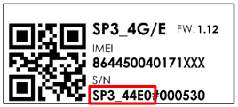 | SP3_4xx1_0112.fw |
| 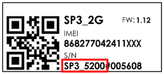 | SP3_5xx1_0112.fw |

Для замены прошивки выполните следующие шаги:

1.  Запустите программу ***TrikdisConfig**.*

2.  Подключите „FLEXi” SP3 к компьютеру с помощью кабеля USB Mini-B.

3.  В программе TrikdisConfig откройте окно **„Обновление программы“.**

4.  Нажмите кнопку **„Открыть файл“** и выберите нужный файл для установки.

5.  Нажмите кнопку **Обновить [F12]**.

6.  Подождите, пока произойдет обновление прошивки.

7.  Нажмите кнопку **„Отсоединить“** и отсоедините кабель USB.

К охранной панели подсоедините провода питания. Подключите модуль *RTX3* к охранной панели.

Установите SIM карту, которая активирована в мобильной сети, в держатель. Включите питание охранной панели. Подождите несколько минут. С TrikdisConfig удаленно подключитесь к охранной панели „FLEXi” SP3. В строке состояния TrikdisConfig отображается информация о версии установленной прошивки (1). В окне **„Модули“/„Клавиатуры“** в таблице указан модуль RTX3 (2), который подключен к охранной панели.

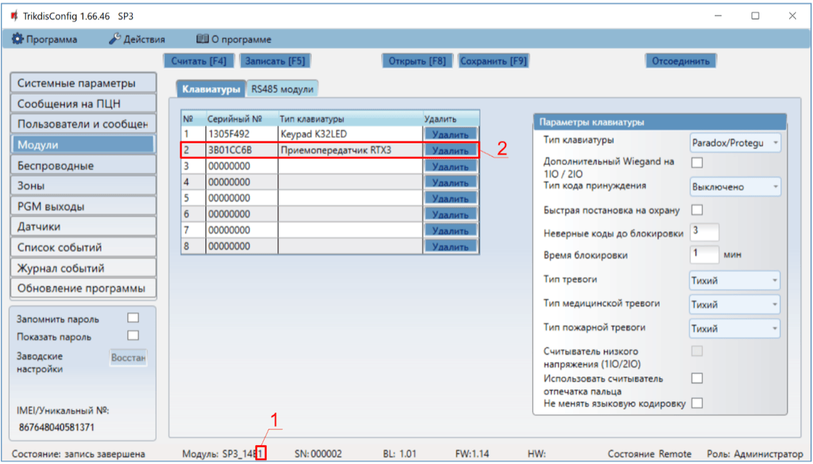

После подключения модуля RTX3 охранная панель „FLEXi“ SP3 может работать в беспроводными датчиками фирмы Paradox (магнитные контакты, датчики движения, датчик разбития стекла (G550), дымовой пожарный извещатель (SD360), пульт дистанционного управления (REM2, REM25), сирены (SR230, SR250), клавиатуры (К37), модуль расширения (2 WPGM), повторитель (RPT1)).

## Регистрация беспроводных датчиков

1.  Убедитесь, что „FLEXi“ SP3 зарегистрировал приемник беспроводных датчиков RTX3.

2.  Включите питание охранной панели. Вставьте батарейки в беспроводной датчик и дождитесь пока перестанут мигать LED индикаторы.

3.  С TrikdisConfig удаленно подключитесь к охранной панели „FLEXi” SP3.

4.  В TrikdisConfig в окне **„Беспроводные“** нажмите кнопку **„Привязка датчиков“.**

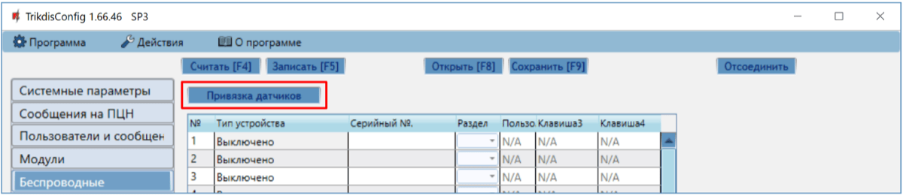

5.  Выберите тип устройства: **„Датчик“**.

6.  Нажмите кнопку „**Начать“**.

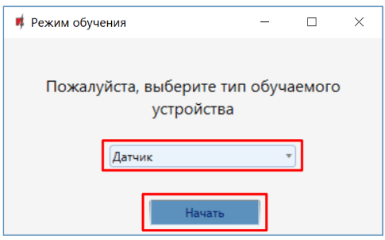

7.  Нажмите в датчике кнопку Тампера.

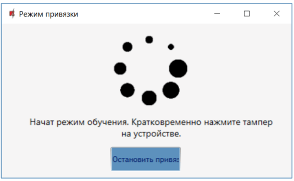

8.  Подождите несколько секунд. Охранная панель обнаружит датчик.

9.  Номер **„UID“** должен соответствовать серийному номеру датчика, указанному на наклейке на плате датчика.

10. Датчику необходимо присвоить **„Номер зоны“** и **„Назначение зоны“**.

11. Нажмите **„Сохранить“**.

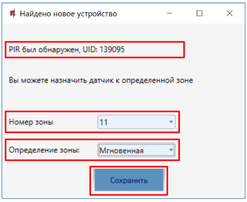

12. Беспроводный датчик добавлен в список беспроводных устройств.

13. Номер **„UID“** должен совпадать с серийным номером датчика, который указан на наклейке на плате датчика.

14. Нажмите **„Остановить привязку“**, чтобы завершить регистрацию беспроводных датчиков.

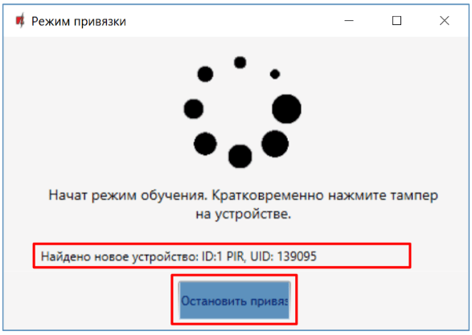

15. Нажмите **„Да“**, чтобы датчик был записан в охранную панель „FLEXi“ SP3.

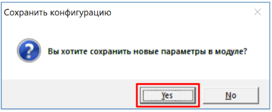

16. В списке **„Беспроводных“** устройств будет добавлен новый беспроводный датчик.

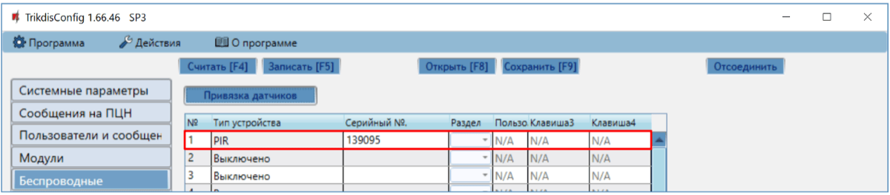

17. В таблице **„Зон“** необходимо беспроводному датчику назначить **„Раздел“**, написать зоне **„Название“**, определить зоне **„Назначение“**.

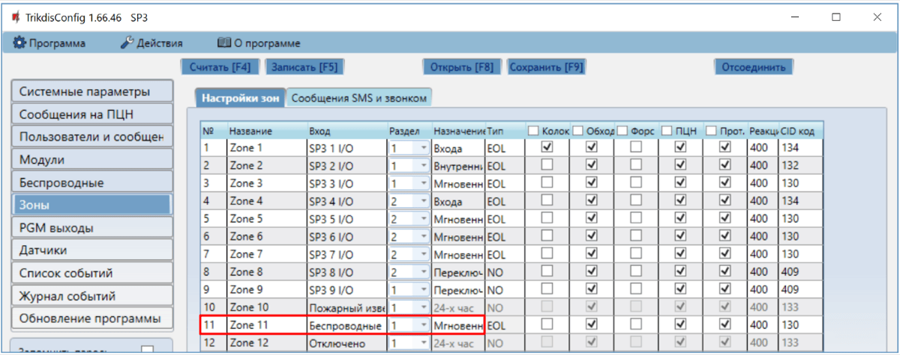

18. После внесения изменений нажмите **Записать [F5]**.

19. Беспроводный датчик полностью зарегистрирован.

!!! note
    Удаление беспроводных датчиков из памяти **„*FLEXi" SP3***:

    1.  Подсоедините кабель USB Mini-B к „FLEXi" SP3.

    2.  Запустите программу TrikdisConfig и нажмите кнопку
        **Считать [F4]**.

    3.  В окне **„Беспроводные"** в поле **„Тип устройства"**, где записаны
        зарегистрированные датчики**,** укажите **„Выключено"**. Нажмите
        кнопку **Записать [F5].** Беспроводный датчик удален из памяти
        **„*FLEXi" SP3.***
## Регистрация беспроводного пульта дистанционного управления (брелок)

1.  Убедитесь, что **„*FLEXi“ SP3 зарегистрировал приемник беспроводных датчиков RTX3***.

2.  Включите питание охранной панели.

3.  С TrikdisConfig удаленно подключитесь к охранной панели „FLEXi” SP3.

4.  В TrikdisConfig в окне **„Беспроводные“** нажмите кнопку **„Привязка датчиков“.**
5.  Выберите тип устройства: **„Брелоки“**.

6.  Нажмите кнопку **„Начать“**.

7.  Нажмите и удерживайте любую кнопку на пульте дистанционного управления, чтобы загорелся светодиодный индикатор на пульте дистанционного управления. Отпустите кнопку.

8.  Подождите несколько секунд. Охранная панель обнаружит брелок.

9.  Номер **„UID“** должен соответствовать серийному номеру пульта дистанционного управления, который указан на наклейке на корпусе пульта.

10. В поле **„Раздел“** укажите раздел охранной системы, которой будет управлять (Ставить на охрану/Снимать с охраны) пульт.

11. В поле **„Пользователь“** укажите номер пользователя, которому будет назначен пульт дистанционного управления.

12. Нажмите **„Сохранить“.**

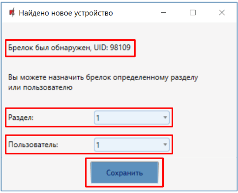

13. Новый пульт добавлен в список беспроводных устройств.

14. Нажмите **„Остановить привязку“**, чтобы завершить регистрацию беспроводных пультов дистанционного управления.

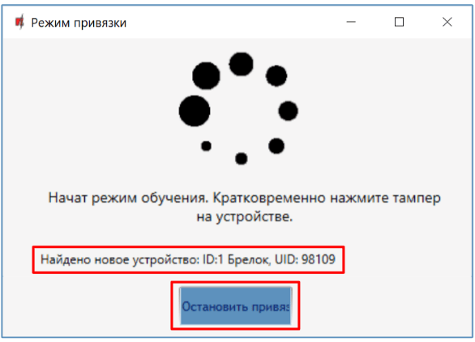

15. Нажмите **„Да“**, чтобы пульт был записан в охранную панель „FLEXi“ SP3.

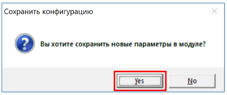

16. Беспроводный брелок внесен в список **„Беспроводных“** устройств.
17. Кнопкам брелока 3 и 4 можете присвоить дополнительные функции управления (Снято с охраны; Поставлено на охрану; Тихая паника; Паника; Управление PGM выходом).

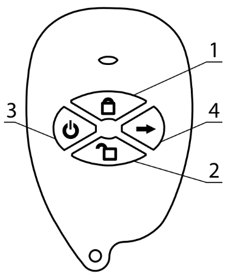

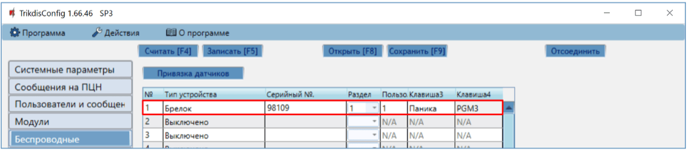

18. После внесения изменений нажмите **Записать [F5]**.

19. Беспроводный брелок полностью зарегистрирован.

!!! note
    Удаление беспроводных брелоков из памяти „FLEXi" SP3:

    1.  Подсоедините кабель USB Mini-B к „FLEXi" SP3.

    2.  Запустите программу TrikdisConfig и нажмите кнопку
        **Считать [F4]**.

    3.  В окне **„Беспроводные"** в поле **„Тип устройства"**, где записаны
        зарегистрированные брелоки**,** укажите **„Выключено"**. Нажмите
        кнопку **Записать [F5].** Беспроводный пульт дистанционного
        управления удален из памяти „FLEXi" SP3.
## Регистрация беспроводной сирены

1.  Убедитесь, что „FLEXi“ SP3 зарегистрировал приемник беспроводных датчиков RTX3.

2.  Включите питание охранной панели. Вставьте батарейки в беспроводную сирену.

3.  С TrikdisConfig удаленно подключитесь к охранной панели „FLEXi” SP3.

4.  В TrikdisConfig в окне **„Беспроводные“** нажмите кнопку **„Привязка датчиков“.**
5.  Выберите тип устройства: **„Сирена“**.

6.  Нажмите кнопку **„Начать“**.

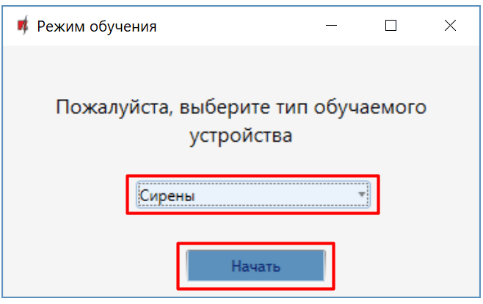

7.  Нажмите и удерживайте кнопку **„LEARN“** на плате сирены в течение 3 секунд. Начнет мигать светодиод на плате сирены. Отпустите кнопку.

8.  Подождите несколько секунд. Охранная панель обнаружит сирену.

9.  Номер **„UID“** должен соответствовать серийному номеру сирены, который указан на наклейке на плате сирены.

10. В поле **„Раздел“** укажите раздел охранной системы, активация которого будет включать сирену.

11. Нажмите **„Сохранить“.**

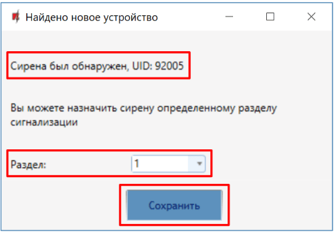

12. Новая сирена добавлена в список беспроводных устройств.

13. Нажмите **„Остановить привязку“**, чтобы завершить регистрацию беспроводных сирен.

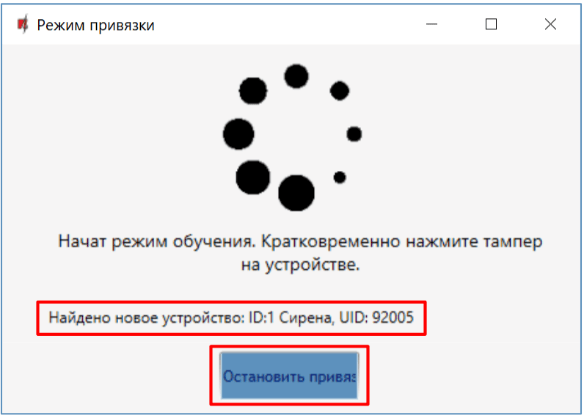

14. Нажмите **„Да“**, чтобы сирена была записана в охранную панель „FLEXi“ SP3.

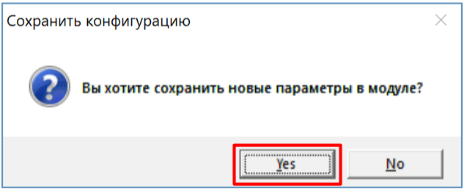

15. Беспроводная сирена внесена в список **„Беспроводных“** устройств.

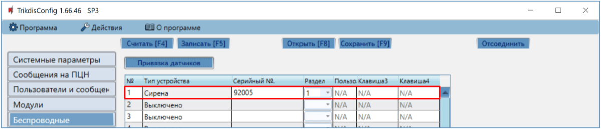

16. После внесения изменений нажмите **Записать [F5]**.

17. Беспроводная сирена полностью зарегистрирована.

!!! note
    Удаление беспроводной сирены из памяти „FLEXi" SP3:

    1.  Подсоедините кабель USB Mini-B к „FLEXi" SP3.

    2.  Запустите программу TrikdisConfig и нажмите кнопку
        **Считать [F4]**.

    3.  В окне **„Беспроводные"** в поле **„Тип устройства"**, где записана
        зарегистрированная сирена**,** укажите **„Выключено"**. Нажмите
        кнопку **Записать [F5].** Беспроводная сирена удалена из памяти
        „FLEXi" SP3.
## Регистрация беспроводной клавиатуры

1.  Убедитесь, что „FLEXi“ SP3 зарегистрировал приемник беспроводных датчиков RTX3.

2.  Включите питание охранной панели. Вставьте батарейки в клавиатуру.

3.  С TrikdisConfig удаленно подключитесь к охранной панели „FLEXi” SP3.

4.  В TrikdisConfig в окне **„Беспроводные“** нажмите кнопку **„Привязка датчиков“.**
5.  Выберите тип устройства: **„Клавиатуры“**.

6.  Нажмите кнопку **„Начать“**.

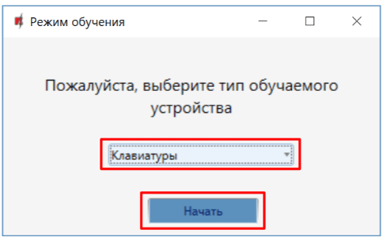

7.  Одновременно нажмите и удерживайте кнопки **[**  **]** и **[BYP]** на клавиатуре в течение 3 секунд. Клавиатура издаст несколько звуковых сигналов. Отпустите кнопки.

8.  Подождите несколько секунд. Охранная панель обнаружит клавиатуру.

9.  Номер **„UID“** должен соответствовать серийному номеру клавиатуры, который указан на наклейке на корпусе клавиатуры.

10. В поле **„Раздел“** укажите раздел охранной системы, которой будет управлять клавиатура.

11. Нажмите **„Сохранить“.**

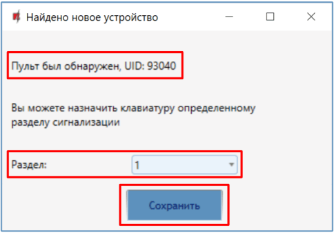

12. Беспроводная клавиатура добавлена в список беспроводных устройств.

13. Нажмите **„Остановить привязку“**, чтобы завершить регистрацию беспроводных клавиатур.

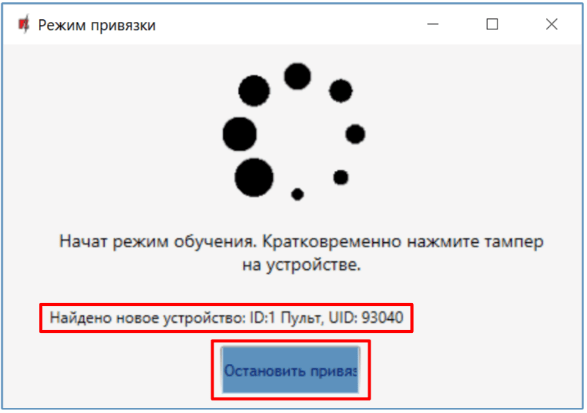

14. Нажмите **„Да“**, чтобы беспроводная клавиатура была записана в охранную панель „FLEXi“ SP3.

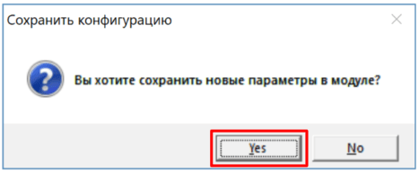

15. Беспроводная клавиатура внесена в список **„Беспроводных“** устройств.

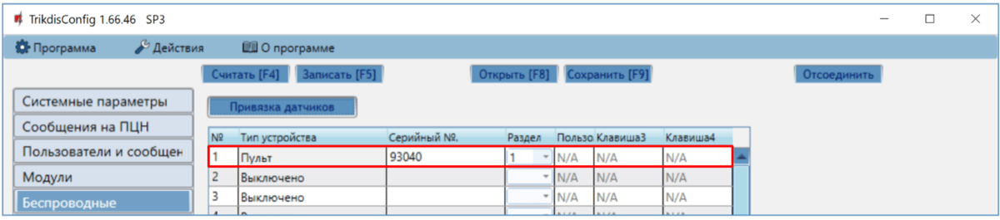

16. После внесения изменений нажмите **Записать [F5]**.

17. Беспроводная клавиатура полностью зарегистрирована.

!!! note
    Удаление беспроводной клавиатуры из памяти „FLEXi" SP3:

    1.  Подсоедините кабель USB Mini-B к „FLEXi" SP3.

    2.  Запустите программу TrikdisConfig и нажмите кнопку
        **Считать [F4]**.

    3.  В окне **„Беспроводные"** в поле **„Тип устройства"**, где записана
        зарегистрированная клавиатура**,** укажите **„Выключено"**. Нажмите
        кнопку **Записать [F5].** Беспроводная клавиатура удалена из
        памяти „FLEXi" SP3.
## Регистрация беспроводного модуля 2WPGM программируемого выхода с двухсторонней связью

1.  Убедитесь, что „FLEXi“ SP3 зарегистрировал приемник беспроводных датчиков RTX3.

2.  Включите питание охранной панели. Включите питание модулю **2WPGM**.

3.  С TrikdisConfig удаленно подключитесь к охранной панели „FLEXi” SP3.

4.  В TrikdisConfig в окне **„Беспроводные“** нажмите кнопку **„Привязка датчиков“.**
5.  Выберите тип устройства: **„PGM устройство“**.

6.  Нажмите кнопку **„Начать“.**

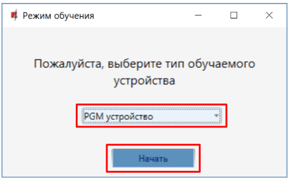

7.  Снимите перемычку JP2 на модуле **2WPGM** и через несколько секунд поставьте ее на место.

8.  Подождите несколько секунд. Охранная панель обнаружит модуль.

9.  Номер **„UID“** должен соответствовать серийному номеру модуля, который указан на наклейке на плате модуля.

10. В поле **„Выберите выход“** укажите номер PGM выхода, который хотите назначить модулю.

11. Нажмите **„Сохранить“.**

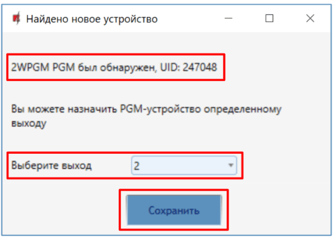

12. Беспроводный модуль **2WPGM** добавлен в список беспроводных устройств.

13. Нажмите **„Остановить привязку“**, чтобы завершить регистрацию беспроводных модулей.

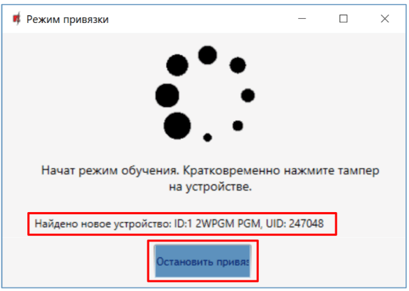

14. Нажмите **„Да“**, чтобы беспроводный модуль **2WPGM** был записан в охранную панель „FLEXi“ SP3.

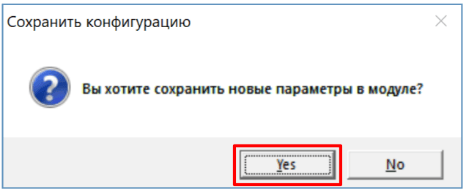

15. Беспроводный модуль **2WPGM** внесен в список **„Беспроводных“** устройств.

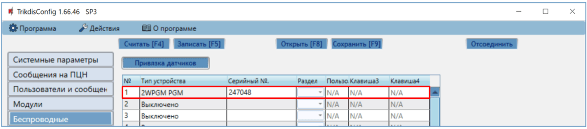

16. PGM выходу можно изменить наименование.

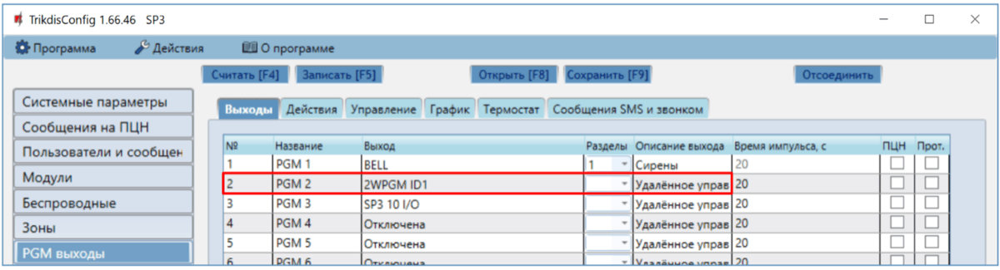

17. После внесения изменений нажмите **Записать [F5]**.

18. Беспроводный модуль **2WPGM** полностью зарегистрирован.

!!! note
    Удаление беспроводного модуля **2WPGM** из памяти „FLEXi" SP3:

    1.  Подсоедините кабель USB Mini-B к „FLEXi" SP3.

    2.  Запустите программу TrikdisConfig и нажмите кнопку
        **Считать [F4]**.

    3.  В окне **„Беспроводные"** в поле **„Тип устройства"**, где записан
        модуль**,** укажите **„Выключено"**. Нажмите кнопку
        **Записать [F5].** Беспроводный модуль **2WPGM** удален из памяти
        „FLEXi" SP3.
## Регистрация беспроводного повторителя RPT1

1.  Убедитесь, что „FLEXi“ SP3 зарегистрировал приемник беспроводных датчиков RTX3.

2.  Включите питание охранной панели. Включите питание модулю RPT1.

3.  С TrikdisConfig удаленно подключитесь к охранной панели „FLEXi” SP3.

4.  В TrikdisConfig в окне **„Беспроводные“** нажмите кнопку **„Привязка датчиков“.**
5.  Выберите тип устройства: **„Повторители“**.

6.  Нажмите кнопку **„Начать“.**

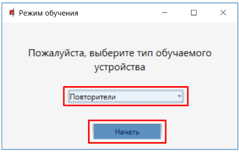

7.  Нажмите кнопку **„LEARN“** на повторителе ***RPT1*.**

8.  Подождите несколько секунд. Охранная панель обнаружит повторитель RPT1.

9.  Номер **„UID“** должен соответствовать серийному номеру повторителя, который указан на наклейке на плате повторителя.

10. Нажмите **„Остановить привязку“**, чтобы завершить регистрацию беспроводных повторителей.

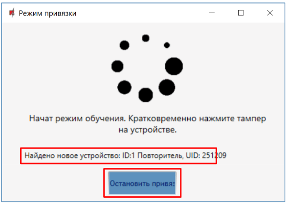

11. Нажмите **„Да“**, чтобы беспроводный повторитель RPT1 был записан в охранную панель „FLEXi“ SP3.

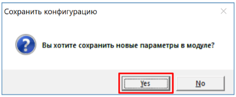

12. Беспроводный повторитель RPT1 внесен в список **„Беспроводных“** устройств.

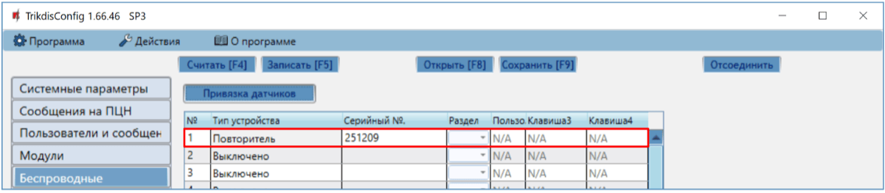

13. После внесения изменений нажмите **Записать [F5]**.

14. Беспроводный повторитель RPT1 полностью зарегистрирован.

!!! note
    Удаление беспроводного повторителя RPT1 из памяти
    „FLEXi" SP3:

    1.  Подсоедините кабель USB Mini-B к „FLEXi" SP3.

    2.  Запустите программу TrikdisConfig и нажмите кнопку
        **Считать [F4]**.

    3.  В окне **„Беспроводные"** в поле **„Тип устройства"**, где записан
        модуль**,** укажите **„Выключено"**. Нажмите кнопку
        **Записать [F5].** Беспроводный повторитель RPT1 удален из
        памяти „FLEXi" SP3.
