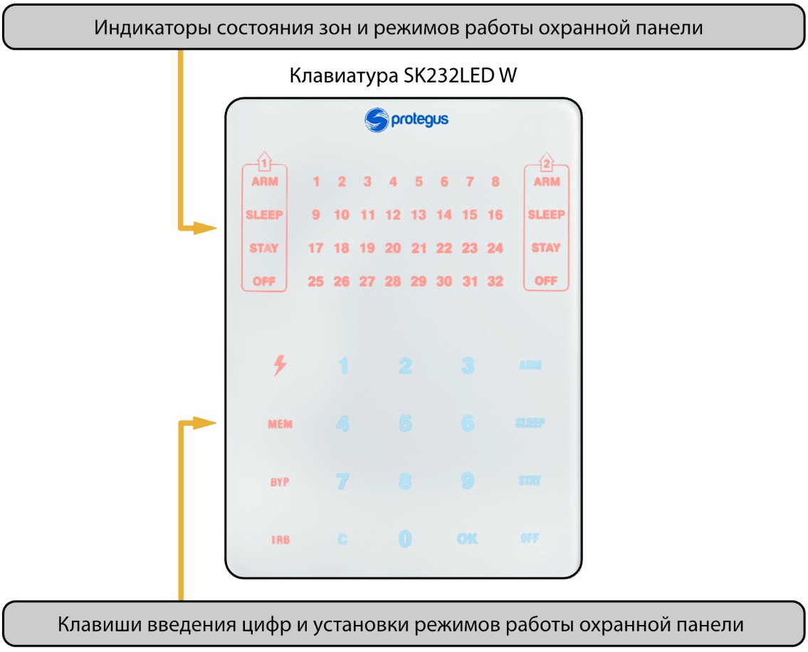
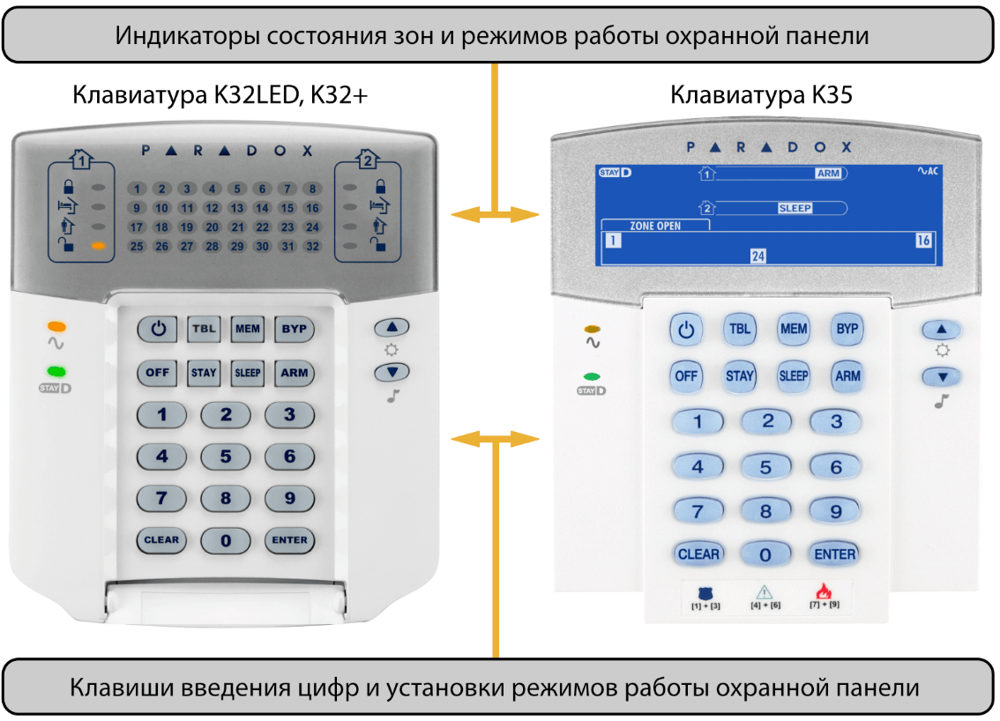

# Руководство пользователя охранной панели „FLEXi“ SP3 с клавиатурами Protegus и Paradox

## Описание

Охранная панель „FLEXi“ SP3 это система охранно-пожарной сигнализации, которая осуществляет обработку и управление сигналами поступающих от датчиков. Охранная панель имеет встроенные WiFi и 2G/4G модемы, которые могут передать тревожные сообщения на ПЦН (пульт централизованного наблюдения) и на мобильные телефоны пользователей.

Подробную информацию о работе охранной сигнализации, ее конфигурации и управлении предоставит представитель компании, который установил охранную систему.

## Основные технические параметры

### **Параметр**

### Количество зон

### Количество разделов

### Предупреждение о тревоге

### Передача тревожных сообщений

### Требования безопасности

### Коды пользователей

### Класс устойчивости к внешним воздействия

### Условия эксплуатации

### Основной источник питания

### Резервный источник питания

### **Описание**

10 зон, (20 зон, применяя ATZ), с расширителями до 32 зон.

### До 8

Звуковое, внутренней и наружной сиренами. Световой вспышкой. Передача сообщений на ПЦН и/или пользователям.

На два приемника ПЦН через GPRS или WiFi и SMS сообщениями. / Восьми пользователям на мобильные телефоны SMS сообщениями и звонком и в приложение Protegus.

Соответствует требованиям безопасности стандарта EN 60950.

До 40 кодов пользователей. До 40 контактных ключей iButton или RFID карточек.

Соответствует требованиям стандарта EN 50131 для II класса воздействия окружающей среды.

Температура от -10°C до +50°C, относительная влажность до 80 % при +20°C без конденсации.

Сеть переменного тока напряжением 230 В 50 Гц (через понижающий трансформатор). Потребляемая мощность до 40 Вт.

Аккумулятор 12 В 7 Ач. Ток потребления до 0,5 А.

## Питание оборудования

Охранная панель питается от сети переменного тока через трансформатор. При исчезновении напряжения в сети переменного тока, охранная панель автоматически запитывается от аккумулятора. При появлении переменного напряжения в сети, аккумулятор заряжается и находится в режиме ожидания. Время работы от аккумулятора ограничено и зависит от величины тока, используемого охранной системой. Питание дополнительных устройств охранной системы производится от клемм охранной панели AUX+ и AUX-, на которых напряжение 12 В.

## Общий принцип работы охранной системы

В состав охранно-пожарной сигнализации входит: охранная панель (плата для обработки поступающих сигналов от датчиков охраны), которая установлена в ящике с понижающим трансформатором и аккумулятором; датчики, которые подключены к охранной панели; звуковые и световые сигнализаторы; клавиатуры управления.

Система охраны включена. При срабатывании любого охранного датчика включаются звуковые и световые сигнализаторы. На приемник ПЦН и пользователям передаются сигналы тревоги.

Система охраны выключена. Охранная система реагирует только на активацию тех датчиков, которые настроены на непрерывную работу.

### Передача тревожных сообщений

Тревожные сообщения могут быть переданы на ПЦН (пульт централизованного наблюдения) и/или пользователям. Сообщения установленными каналами связи сперва передаются на ПЦН, затем в Protegus, SMS сообщениями и/или звонком пользователю.

### Режимы работы сигнализации

### **Режим работы**

#### **Описание**

### OFF (DISARM)

Это такой режим охраны, когда под охраной находится только часть зон. Система охраны будет реагировать только на события в зонах: **Пожарная**, **24-х час**, **Тихий 24-х час**.

### ARM

Это такой режим охраны, когда под охраной находятся все зоны. Система охраны будет реагировать на все события.

### STAY

Это такой режим охраны, когда под охраной находится только часть зон, но активация зон **Внутренний Stay** и **Мгновенный Stay** разрешена. При включенном режиме охраны STAY, при нарушении зоны **Входа**, система охраны сработает только после окончания времени задержки входа.

### SLEEP

Это такой режим охраны, когда под охраной находится только часть зон, но активация зон **Внутренний Stay** и **Мгновенный Stay** разрешена. При включенном режиме охраны SLEEP, при нарушении зоны **Входа**, система охраны сработает мгновенно.

### Управление охранной системой

Системой охраны можно управлять следующими устройствами:

- Клавиатура *Trikdis* Protegus SK232LED W;

- Клавиатуры *Paradox* K32+, K32LED, K636, K10LED V/H, K35, ТМ50, ТМ70;

- Клавиатуры *Crow* CR-16, CR-LCD;

- *iButton* контактными ключами;

- *RFID* карточками;

- Кодовыми или другими электрическими выключателями, изменяя состояние зоны Переключатель (Keyswitch);

- Телефоном, позвонив или отправив SMS сообщение;

- Приложением Protegus;

- Командой с ПЦН.

### Управление доступом

Для управления охранной системой пользователь применяет коды. Пользователям можно назначить коды с различным уровнем доступа. Применяются четырехзначные коды доступа, которые используют цифры от 0 до 9.

Коды управления охранной системой:

- **Код администратора** – шестизначный код (заводской код – 123456). Код администратора только один, его нельзя удалить. Код администратора можно только изменить. С кодом администратора можно добавить или удалить коды пользователей. С кодом администратора нельзя включить/выключить систему охраны.

- **Код пользователя** – четырехзначный код, который позволяет включить/выключить систему охранной сигнализации и временно отключить зоны охранной сигнализации. Рекомендуется каждому пользователю предоставить индивидуальный код. Охранная панель может иметь до 40 кодов пользователей.

- **SMS код** – шестизначный код (заводской код – 123456), который позволят управлять системой охраны SMS сообщениями.

### Функции охранной системы

### **Наименование**

#### **Описание**

### Обход / (Bypass)

Возможность временно (на одно включение охранной системы) отключить зону. Эта функция применяется для отключения неисправной зоны при включении системы охраны, когда нет возможности оперативно устранить неисправность зоны.

### Крик / (Bell Squawk)

С помощью короткого сигнала сирены охранная панель может предупредить о включении / выключении охранной системы.

### Колокольчик / (Chime)

Зоне назначена функция Колокольчик. При выключенной охранной системе, при активации зоны кратковременно активируется зуммер клавиатуры и/или PGM выход, которому установлен режим **Зуммер**.

Авт. постановка (Re-ARM)

Защита от непреднамеренного выключения системы охраны. Если система охраны была выключена телефонным звонком или приложением Protegus и за время входа не была активирована входная зона, то охранная панель автоматически включится в прежний режим охраны.

### Дополнительные функции

| **Наименование** | **Описание** |
|:---|:---|
| Измерение температуры | К охранной панели „FLEXI“ SP3 могут быть подключены датчики температуры DS18B20, DS18S20 (до 8 шт.) или один датчик температуры и влажности АМ2301. Каждому датчику температуры устанавливают пределы колебаний температуры. Если температура поднимется выше установленных пределов, то будет передано сообщение пользователям. |
| Удаленное управление устройствами | К выходам (OUT) охранной панели „FLEXI“ SP3 можно подключить дополнительное электротехническое оборудование и управлять им удаленно. |

## Управление сигнализацией

### Управление сигнализацией с помощью клавиатуры SK232LED W

Клавиатура Trikdis SK232LED W обеспечивает отображение 32 зон и 2 разделов охранной сигнализации.

Клавиши для настройки режимов работы и ввода цифр

### **Клавиш**

#### **Описание**

Постоянно светящаяся клавиша указывает на питание от сети переменного тока. Мигание клавиши указывает на неисправность аккумулятора. Не светится клавиша – отключен источник питания или система работает от аккумулятора. Клавиша используется для редактирования кодов пользователей и для перезапуска пожарных датчиков.

### MEM

Постоянно светящаяся клавиша указывает на наличие новой информации о срабатывании зон охранной панели в памяти охранной системы. Мигание клавиши указывает на активный МЕМ режим просмотра сработавших зон. Нажав на клавишу МЕМ, на клавиатуре начнут мигать номера зон, которые сработали при включенной системе охраны и вызвали тревогу.

### BYP

Постоянно светящаяся клавиша указывает на наличие отключенных зон. Мигание клавиши указывает на активный режим Bypass. Нажав на клавишу можно активировать режим временного отключения зон.

### TRB

Постоянно светящаяся клавиша указывает на имеющуюся неисправность охранной системы. Мигание клавиши указывает на активный TBL режим. Нажав на клавишу TBL, можно увидеть индикацию неисправности.

1, 2 ...9, 0

Клавиши для ввода числовых значений.

### C

Клавиша используется для выхода из режимов и для удаления информации.

### OK

Клавиша используется для подтверждения сделанного выбора.

### ARM

Клавиша для включения полного (ARM) режима охраны.

### SLEEP

Клавиша для включения частичного (SLEEP) режима охраны.

### STAY

Клавиша для включения частичного (STAY) режима охраны.

### OFF

Клавиша для выключения режима охраны.
> [!NOTE]
>     1. Нажмите на клавишу **C**, чтобы выйти из режима программирования
или удалить неправильно введенное значение.

2. Система охраны не включится, если хоть одна зона активирована (когда
зонам не присвоена функция **FORCE**).
### Управление сигнализацией с помощью клавиатуры Paradox

Клавиатура Paradox K10LED V/H обеспечивает отображение 10 зон и 2 разделов охранной сигнализации.

Клавиатура Paradox K636 обеспечивает отображение 10 зон и 1 раздела охранной сигнализации.

Клавиатура Paradox K32LED, K32+, K35 обеспечивает отображение 32 зон и 2 разделов охранной сигнализации.

Клавиши для настройки режимов работы и ввода цифр

### **Клавиша**

#### **Описание**

Клавиша используется для перезапуска пожарных датчиков.

### MEM

Постоянно светящаяся клавиша указывает на наличие новой информации о срабатывании зон охранной панели в памяти охранной системы. Мигание клавиши указывает на активный МЕМ режим просмотра сработавших зон. Нажав на клавишу МЕМ, на клавиатуре начнут мигать номера зон, которые сработали при включенной системе охраны и вызвали тревогу.

### BYP

Постоянно светящаяся клавиша указывает на наличие отключенных зон. Мигание клавиши указывает на активный режим Bypass. Нажав на клавишу можно активировать режим временного отключения зон.

### TBL

Постоянно светящаяся клавиша указывает на имеющуюся неисправность охранной системы. Мигание клавиши указывает на активный TBL режим. Нажав на клавишу TBL, можно увидеть индикацию неисправности.

### – 9

Клавиши для ввода числовых значений.

### CLEAR

Клавиша используется для выхода из режимов и для удаления информации.

### ENTER

Клавиша используется для подтверждения сделанного выбора.

### ARM

Клавиша для включения полного (ARM) режима охраны.

### SLEEP

Клавиша для включения частичного (SLEEP) режима охраны.

### STAY

Клавиша для включения частичного (STAY) режима охраны.

### OFF

Клавиша для выключения режима охраны.

Постоянно светящийся индикатор указывает на питание от сети переменного тока. Мигание индикатора указывает на неисправность аккумулятора. Не светится индикатор – отключен источник питания или система работает от аккумулятора.
> [!NOTE]
>     1. Нажмите на клавишу **CLEAR**, чтобы выйти из режима
программирования или удалить неправильно введенное значение.

2. Система охраны не включится, если хоть одна зона активирована (когда
зонам не присвоена функция **FORCE**).
### Быстрое включение/выключение охранной системы

Включение/выключение охранной системы осуществляется кодом. Система охраны должна иметь **STAY** зоны.

Режим охраны **ARM**, **STAY** и **SLEEP** переключается в **OFF**/**DISARM** режим, а **OFF**/**DISARM** режим переключается в **ARM** или **STAY** режим охраны. Изменение режима охраны:

1. Введите **Код пользователя**.

1. Если система охраны имеет только один раздел, то пропустите п.2. Если система имеет несколько разделов, то на клавиатуре начнут светиться номера разделов, режимы которых пользователь сможет изменить.

2. Введите номера выбранных разделов.

3. Разделы, которые были в **ARM**, **STAY**, **SLEEP** режиме, переключатся в **OFF**/**DISARM** режим.

1. Индикатор **OFF** светится, когда охранная система выключена.

2. Если включена функция **Крик** (**Bell Squawk**), то при выключении системы охраны сирена два раза сработает.

4. Разделам, которые были в **OFF**/**DISARM** режиме, начнется отсчет времени **Exit delay.** Если во время отсчета времени будет активирована зона **Входа**, то включится **ARM** режим. Если во время отсчета времени не будет активирована зона **Входа**, то включится **STAY** режим. .

1. Начнет светиться соответствующий индикатор **ARM** или **STAY**.

2. Если включена функция **Крик** (**Bell Squawk**), то при включении системы охраны сирена один раз сработает.

### Включение сигнализации, режим ARM

Система охраны имеет несколько разделов. Включение **ARM** режима охраны:

1. Нажмите на клавиатуре клавишу **ARM**.

2. Введите **Код пользователя**.

3. Введите номера разделов на клавиатуре, которыми хотите управлять.

4. Подтвердите выбор нажатием клавиши **OK** (или **ENTER**).

5. Покиньте помещение и закройте двери во время отсчета времени задержки (**Exit delay**).

1. Во время отсчета задержки времени индикатор **ARM** будет мигать, а после включения сигнализации **ARM** индикатор будет светиться.

2. Если включена функция **Крик** (**Bell Squawk**), то при включении системы охраны сирена один раз сработает.

### Включение сигнализации, режим STAY

Система охраны имеет несколько разделов. Включение **STAY** режима охраны:

1. Нажмите на клавиатуре клавишу **STAY**.

2. Введите **Код пользователя**.

3. Введите номера разделов на клавиатуре, которыми хотите управлять.

4. Подтвердите выбор нажатием клавиши **OK** (или **ENTER**).

5. После включения сигнализации **STAY** индикатор будет светиться.

1. Если включена функция **Крик** (**Bell Squawk**), то при включении системы охраны сирена один раз сработает.

> [!NOTE]
>     По крайней мере, одна зона должна иметь функцию **Внутренний Stay** или
**Мгновенный Stay.** Иначе **STAY** режим недоступен.
### Включение сигнализации, режим SLEEP

Система охраны имеет несколько разделов. Включение **SLEEP** режима охраны:

1. Нажмите на клавиатуре клавишу **SLEEP**.

2. Введите **Код пользователя**.

3. Введите номера разделов на клавиатуре, которыми хотите управлять.

4. Подтвердите выбор нажатием клавиши **OK** (или **ENTER**).

5. После включения сигнализации **SLEEP** индикатор будет светиться.

1. Если включена функция **Крик** (**Bell Squawk**), то при включении системы охраны сирена один раз сработает.

### Выключение сигнализации, режим OFF

Помещения находятся под охраной в **ARM** или **STAY** режиме. Войдя в помещение через зону **Входа**, начнется отчет времени (**Entry Delay**), в течении которого необходимо выключить систему охраны.

Выключение режима охраны:

1. Нажмите на клавиатуре клавишу **OFF**.

2. Введите **Код пользователя**.

1. Если система охраны имеет только один раздел, то пропустите п.3 и 4.

3. Введите номера выбранных разделов.

4. Подтвердите выбор нажатием клавиши **OK** (или **ENTER**).

1. При выключенной сигнализации светит индикатор **OFF**.

2. Если включена функция **Крик** (**Bell Squawk**), то при выключении системы охраны сирена два раза сработает.

#### Выключение сигнализации после срабатывания

Выключение охранной системы:

1. Введите **Код пользователя**.

1. Если система охраны имеет только один раздел, то пропустите п.2 и 3.

2. Введите номера выбранных разделов.

3. Подтвердите выбор нажатием клавиши **OK** (или **ENTER**).

1. При выключенной сигнализации светит индикатор **OFF**.

2. Если включена функция **Крик** (**Bell Squawk**), то при выключении системы охраны сирена два раза сработает.

3. Начнет светиться индикатор **MEM** и мигать индикаторы сработавших зон. Чтобы выключить мигание сработавших зон, нажмите **MEM**, за тем **C** (или **CLEAR**).

## Временное отключение зон (функция Bypass)

Включить функцию **Обхода** (**Bypass**):

1. Нажмите на клавиатуре клавишу **BYP**.

2. Введите **Код пользователя**.

1. Начнет мигать индикатор **BYP**.

3. Введите двузначные номера зон, которые хотите временно отключить.

4. Подтвердите выбор нажатием клавиши **OK** (или **ENTER**).

5. Начнет светиться индикатор **BYP**.

Чтобы отключить функцию **Обхода** (**Bypass**), повторите те же шаги, что и для временного отключения зон.

### Просмотр и очистка памяти после срабатывания сигнализации

При срабатывании охранной системы, загорается клавиша **MEM**. Определение причины срабатывания сигнализации:

1. Нажмите на клавиатуре клавишу **MEM**.

2. Светящиеся цифры покажут зоны, которые вызвали тревогу.

3. Нажмите клавишу **C** (или **CLEAR**), чтобы выйти из режима **MEM**.

1. Если клавиатурой не будут выполняться никакие действия, то после минуты режим **MEM** отключится автоматически, но информация о сработавших зонах останется в памяти и будет гореть индикатор **MEM**.

4. Память будет очищена, когда система охраны будет включена и клавиша **MEM** перестанет светиться.

### Перезапуск пожарных (дымовых) извещателей

Перезапуск пожарного датчика работать заново, после его срабатывания:

1. Нажмите и удерживайте 3 сек. клавишу  (или ) клавиатуры.

1. Сработает PGM выход, которому установлен режим работы **Сброс пожарного датчика** и к которому подключен пожарный датчик.

2. Пожарные извещатели, которые подключены к зоне охранной панели, будут запущены работать заново.

### Клавиши вызова помощи

С помощью клавиатуры можно отправить сообщение службе охраны о непосредственной опасности или необходимой помощи. Эта функция доступна, если вы пользуетесь услугами охранной фирмы и есть связь с ПЦН.

Нажмите и удерживайте клавиши в течение 3 секунд:

> [!NOTE]
> 1  3, отправить сообщение PANIC об угрожающей вам опасности.], отправить сообщение PANIC об угрожающей вам опасности.

> [!NOTE]
> 4  6, отправить сообщение MEDICAL о необходимости медицинской помощи.], отправить сообщение MEDICAL о необходимости медицинской помощи.

### 7  9, отправить сообщение FIRE о пожаре.], отправить сообщение FIRE о пожаре.

### 1, отправить сообщение PANIC об угрожающей вам опасности.], отправить сообщение PANIC об угрожающей вам опасности.

> [!NOTE]
> 4, отправить сообщение MEDICAL о необходимости медицинской помощи.], отправить сообщение MEDICAL о необходимости медицинской помощи.

### 7, отправить сообщение FIRE о пожаре.], отправить сообщение FIRE о пожаре.
### Обзор неисправностей сигнализации

При возникновении неисправности на клавиатуре загорается индикатор клавиши **TBL**. Для просмотра неисправностей охранной системы:

1. Нажмите на клавиатуре клавишу **TRB**.

2. На клавиатуре загорятся индикаторы неисправностей.

3. Если необходимо детализировать группу неисправностей, то нажмите на соответствующую клавишу.

4. Нажмите клавишу **C** (или **CLEAR**), чтобы выйти из режима **TBL**.

**Значения неисправностей**

### **Группа неисправностей**

1: Система

2 неисправность аккумулятора.

3 не установлено время.

4 превышено значение допустимого тока выхода AUX.

5 превышено значение допустимого тока сирены (выход BELL).

6 отсутствует сирена.

7 Неисправность шлейфа пожарных извещателей.

2: Связь

2 неисправность параллельного канала связи (по всем типам связи).

3 неисправность Protegus канала связи (то всем типам связи).

4 нет SIM карты.

5 неправильный PIN код SIM карты.

6 не удается подключиться к сети мобильной связи.

7 не удается подключиться к WiFi сети.

8 проблемы связи модуля Е485 (см. световую индикацию модуля).

3: Тампер зоны

4: Шина RS485

5: Неисправность беспроводного датчика

6: Разряжен аккумулятор беспроводного датчика

7: Антимаскинг

### **Значение выбранной группы**

1 нет питания из сети переменного тока.

1 неисправность основного канала связи (по всем типам связи).

Номера зон, у которых поврежден тампер.

Номера модулей, подключенных к шине RS485, которые имеют неисправности.

Беспроводный датчик не работает (истекло время проверки). Номер зоны указывает на номер датчика в таблице беспроводных датчиков.

Разряжен аккумулятор беспроводного датчика. Номер зоны указывает на номер датчика в таблице беспроводных датчиков.

Номера зон, у которых поврежден антимаскинг.

### Программирование кодов пользователей

#### Изменение кода администратора

Изменение кода администратора выполняется в программе TrikdisConfig в разделе **Системные параметры / Подсоединение / Коды доступа**.

#### Программирование новых кодов пользователей (User)

1. Нажмите на клавиатуре клавишу  (или ).

2. Введите шестизначный **Код администратора**.

1. Начнет мигать клавиша  (или ).

3. Введите двузначный номер пользователя.

4. Введите четырехзначный **Код пользователя**.

5. Повторно введите четырехзначный **Код пользователя**.

6. Введите номера разделов, которыми будет управлять пользователь.

7. Подтвердите выбор нажатием клавиши **OK** (или **ENTER**).

8. Нажмите клавишу **C** (или **CLEAR**), чтобы выйти из режима программирования.

#### Изменение кодов пользователей (User)

1. Нажмите на клавиатуре клавишу  (или ).

2. Введите шестизначный **Код администратора**.

1. Начнет мигать клавиш  (или ).

3. Введите двузначный номер пользователя, который хотите изменить.

4. Введите четырехзначный **Код пользователя**.

5. Повторно введите четырехзначный **Код пользователя**.

6. Введите номера разделов, которыми будет управлять пользователь.

7. Подтвердите выбор нажатием клавиши **OK** (или **ENTER**).

8. Нажмите клавишу **C** (или **CLEAR**), чтобы выйти из режима программирования.

#### Просмотр разделов

Просмотр статуса разделов охранной системы.

| **Клавиатуры Paradox K32+, K32LED, K636, K10LED, K35** | **Клавиатура Protegus SK232LED** |
|----|----|
| Вместе нажмите и удерживайте клавиши 1 и 2 в течение 3 сек., клавиатура должна подать звуковой сигнал. | Нажмите и удерживайте клавишу 2 в течение 3 сек., клавиатура должна подать звуковой сигнал. |

LED индикаторы от 1 до 8 покажут состояние разделов охранной системы: Индикатор горит – включен **ARM** режим охраны; Индикатор мигает – включен **Stay** режим охраны; Индикатор не горит – включен **DISARM** режим охраны.

## Операции с кодами пользователей на клавиатуре Paradox

#### Удаление кодов пользователей (User)

Удаление существующих кодов пользователей:

1. Нажмите на клавиатуре клавишу  (или ).

2. Введите шестизначный **Код администратора**.

1. Начнет мигать клавиша  (или ).

3. Введите двузначный номер пользователя, который хотите удалить.

4. Нажмите на клавиатуре клавишу **SLEEP**.

5. Нажмите клавишу **C** (или **CLEAR**), чтобы выйти из режима программирования.

#### Код принуждения (Duress)

Если вы вынуждены включить/выключить систему охраны под принуждением, то вводя код пользователя с включенной функцией принуждения система включит/ выключит охранную сигнализацию и немедленно передаст предупреждение (Duress код) на ПЦН. Код принуждения должен быть включен установщиком охранной системы. Код принуждения может быть двух типов: „**Ноль вместо первой цифры“** или „**Выше последняя цифра на 1**“.

## Управление контактными ключами iButton

> [!NOTE]
>     Система охраны не включится, если хоть одна зона будет активной.
С контактным ключем iButton можно установить **ARM** / **STAY** / **OFF** режим охраны. Режим охраны **SLEEP** недоступен.

Приложите ключ iButton к считывателю. Режим работы охранной системы изменится на противоположный. Если была включена система охраны, то она выключится. Если система охраны была выключена, то она включится и начнется отсчет времени выхода (**Exit Delay**). Если в течении установленного времени не будет активирована зона **Входа**, то включится **Stay** режим охранной сигнализации, при условии, что зонам есть установлены **Внутренний Stay** или **Мгновенный Stay** режимы работы.

С помощью программы TrikdisConfig или считывателя контактных ключей можно добавить новые или удалить существующие контактные iButton ключи.

Регистрация контактных ключей считывателем CZ Dallas:

1. Если список **Код iButton или RFID** пуст. Приложите контактный ключ к считывателю на несколько секунд и он будет зарегистрирован и записан в первую строчку списка и ему назначается функция **Основного ключа.**

2. Включение режима регистрации контактных ключей. К считывателю приложите и удерживайте в течение 10 секунд **Основной ключ**.

3. Приложите новый контактный ключ к считывателю на несколько секунд. Повторите эту процедуру для других ключей.

4. Окончив регистрацию контактных ключей, приложите **Основной ключ** к считывателю и режим регистрации будет отключен.

5. Удаление всех контактных ключей (и **Основного ключа**) из памяти „FLEXI“ SP3. К считывателю приложите и удерживайте **Основной ключ** не менее 20 секунд.

## Управление RFID карточкой (брелком)

> [!NOTE]
>     Система охраны не включится, если хоть одна зона будет активной.
С RFID карточкой можно установить **ARM** / **STAY** / **OFF** режим охраны.

К охранной панели должен быть подключен Wiegand (24/36) RFID считыватель с клавиатурой. Регистрация RFID карточек (брелков) производится в программе TrikdisConfig, вводя их ID номера в список **Код iButton или RFID**.

Приложите RFID карточку к считывателю Wiegand или введите **Код пользователя** на клавиатуре считывателя Wiegand и нажмите **\#**. Статус охранной панели изменится на противоположный. Если система охраны была включена, то она выключится. Если система охраны была выключена, то она включится и начнется отсчет времени выхода (**Exit Delay**). Если в течении установленного времени не будет активирована зона **Входа**, то включится **Stay** режим охранной сигнализации, при условии, что зонам есть установлены **Внутренний Stay** или **Мгновенный Stay** режимы работы.

## Управление звонком

> [!NOTE]
>     Если хоть одна зона будет активной, система охраны не включится (если
функция **ФОРС** (англ. FORCE) не установлена зонам). / При управлении
охранной системы звонком возможен только **ARM** или **STAY** режимы
охраны. / Перед звонком рекомендуется проверить текущий режим охранной
системы. Отправьте SMS сообщение (**ASKI 123456**) с запросом статусов
разделов охранной системы. Так же проверьте текущее состояние зон
охранной панели, отправив следующее SMS сообщение: **ASKI 123456**.
При программировании охранной панели вводятся телефонные номера пользователей и указывается, чем может управлять телефонный номер: включить/выключить систему охраны или управлять электротехническим оборудованием, подключенным к PGM выходу охранной панели.

Позвоните на номер SIM карты охранной панели. Если номер телефона, с которого звоните, указан в списке пользователей, то охранная панель поднимет „трубку“ и вам необходимо ввести команду управления (см. таблицу списка команд управления).

Список команд управления, набираемых на клавиатуре телефона

| Клавиш клавиатуры | Функция | Описание |
|-------------------|---------|----------|
| 1[№ раздела][#] | Включение охраны выбранного раздела охранной панели | Например: (включить охрану 1 раздела охранной системы): 11# |
| 2[№ раздела][#] | Выключение охраны выбранного раздела охранной панели | Например: (выключить охрану 1 раздела охранной системы): 21# |
| 3[№ выхода][#][№ состояния] | Управление выбранным выходом (OUT) | Управление определенным выходом (OUT). Состояние: 0 – выключить выход; 1 – включить выход; 2 – выключить выход на продолжительность импульса; 3 – включить вход на продолжительность импульса; (продолжительность импульса задается в программе TrikdisConfig, в таблице Выходы). Например: (включить выход номер 1): 31#1 Например: (включить выход номер 2 на продолжительность импульса): 32#3 |

Если активирована **RE-ARM** функция в охранной панели, то после телефонной команды выключить систему охраны, если система охраны была выключена телефонным звонком или приложением Protegus и за время входа не была активирована входная зона, охранная панель автоматически включится в прежний режим охраны.

## Управление SMS сообщениями

Охранную панель „FLEXi” SP3 можно удаленно конфигурировать и управлять SMS сообщениями. Только с программой TrikdisConfig можно полностью конфигурировать охранную панель.

Структура SMS сообщения: Команда `[пробел]` Пароль `[пробел]` Данные

Заводской SMS пароль **123456**. В целях безопасности, рекомендуется изменить его и не забывать его!

### Список SMS команд

| **Команда** | **Данные** | **Описание** |
|----|----|----|
| *INFO* |  | Запрос информации об охранной панели. Ответ будет включать: имя объекта; состояние раздела; номер IMEI; уровень сигнала GSM; версию программного обеспечения и серийный номер. Например: INFO 123456 |
| *RESET* |  | Запуск охранной панели работать заново. Например: RESET 123456 |
| *OUTPUTx* | *ON* | Включить выход, где „x“ – номер выхода. Например: OUTPUT1 123456 ON |
|  | *OFF* | Выключить выход, где „x“ – номер выхода. / Например: OUTPUT1 123456 OFF |
|  | *PULSE=ttt* | Включить выход „x“ на продолжительность импульса. „ttt“ – продолжительность импульса (вводится 3-значное число), сек.. / Например: OUTPUT1 123456 PULSE=002 |
| *PSW* | *Новый пароль* | Смена пароля. Например: PSW 123456 654123 |
| *TIME* | *YYYY/MM/DD,12:00:00* | Установка даты и времени. Например: TIME 123456 2020/06/03,12:23:00 |
| *TXTA* | *Наименование объекта* | Ввод названия объекта. Например: TXTA 123456 Дом |
| *RDR* | *PhoneNR#SMStext* | Переадресация SMS сообщений на указанный номер телефона. Номер телефона должен содержать знак „+“ и код страны. / Например: RDR 123456 +37061234567#текст переадресации |
| *ASKI* |  | SMS сообщение запроса о состоянии входов (IN). Например: ASKI 123456 |
| *ASKO* |  | SMS сообщение запроса о состоянии выходов (OUT). / Например: ASKO 123456 |
| *ASKA* |  | SMS сообщение запроса о состоянии разделов охранной панели. / Например: ASKA 123456 |
| *ASKT* |  | SMS сообщение запроса о значении температур датчиков температуры. / Например: ASKT 123456 |
| *DISARM* | *SYS:x* | Выключить систему охраной сигнализации, где „x“ – номер раздела (1-8) охранной системы. Например: DISARM 123456 SYS:1 |
| *ARM* | *SYS:x* | Включить систему охраной сигнализации, где „x“ – номер раздела (1-8) охранной системы. Например: ARM 123456 SYS:1 |
| *STAY* | *SYS:x* | Включить систему охраной сигнализации в режим STAY, где „x“ – номер раздела (1-8) охранной системы. Например: STAY 123456 SYS:1 |
| *SLEEP* | *SYS:x* | Включить систему охраной сигнализации в режим SLEEP, где „x“ – номер раздела (1-8) охранной системы. Например: SLEEP 123456 SYS:1 |
| *FRS* |  | Запустить заново работать пожарный извещатель после срабатывания, если выходу (OUT) установлена функция „Сброс пожарного датчика“. / Например: FRS 123456 |
| *SETN* | *PhoneX=PhoneNR#Name#email* | Добавить номер телефона, имя пользователя и назначить его пользователю „x“. Где „x“ – порядковый номер пользователя в списке. Номер телефона должен содержать знак „+“ и код страны. Номер телефона должен быть отделен от имени символом „#“. / Например: SETN 123456 PHONE5=+37061234567#Петр#petr@mail.ru |
|  | *PhoneX=DEL* | Удаление телефонного номера и имени пользователя из списка. „X“ – порядковый номер пользователя в списке. / Например: SETN 123456 PHONE5=DEL |
| *UUSD* | *\*Uusd code#* | Отправление UUSD кода оператору. Например: ***UUSD 123456 \*245#*** |
| *CONNECT* | *Protegus=ON* | Подключиться к Protegus сервису. / Например: CONNECT 123456 PROTEGUS=ON |
|  | *Protegus=OFF* | Отключиться от Protegus сервиса. / Например: CONNECT 123456 PROTEGUS=OFF |
|  | *Code=123456* | Код подключения к Protegus сервису. / Например: CONNECT 123456 CODE=123456 |
|  | *IP=0.0.0.0:8000* | Указывается адрес TCP/IP и Port сервера основного канала. / Например: CONNECT 123456 IP=0.0.0.0:8000 |
|  | *IP=0* | Отключение основного канала. Например: CONNECT 123456 IP=0 |
|  | *ENC=123456* | Ключ шифрования TRK. Например: CONNECT 123456 ENC=123456 |
|  | *APN=Internet* | Имя APN. Например: CONNECT 123456 APN=INTERNET |
|  | *USER=user* | Пользователь APN. Например: CONNECT 123456 USER=User |
|  | *PSW=password* | Пароль APN. Например: CONNECT 123456 PSW=Password |

## Управление PGM выходами

С клавиатуры можно управлять PGM выходами. В программе TrikdisConfig (**PGM выходы/Управление**) необходимо функциональным клавишам назначить PGM выходы и тип срабатывания (Уровень или Импульс). Нажатие (или нажатие и удерживание) соответствующих кнопок на клавиатуре активирует назначенный выход PGM.

| Функциональная клавиша | Функциональные клавиши клавиатуры TM50, TM70 / (нажать) | Примечание Paradox / (нажать и удерживать 3 сек.) |
|------------------------|------------------------------------------------------------|------------------------------------------------------|
| Функциональная клавиша 1 | Utility key 1 | 1+2 |
| Функциональная клавиша 2 | Utility key 2 | 4+5 |
| Функциональная клавиша 3 | Utility key 3 | 7+8 |
| Функциональная клавиша 4 | Utility key 4 | 2+3 |
| Функциональная клавиша 5 | Utility key 5 | 5+6 |
| Функциональная клавиша 6 | Utility key 6 | 8+9 |
