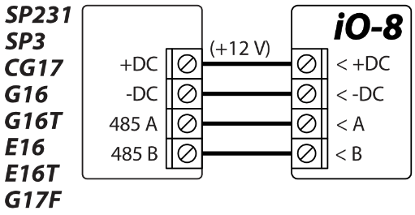
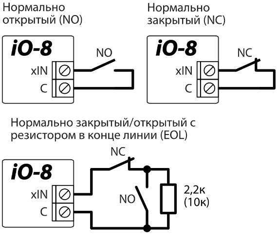
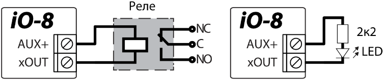
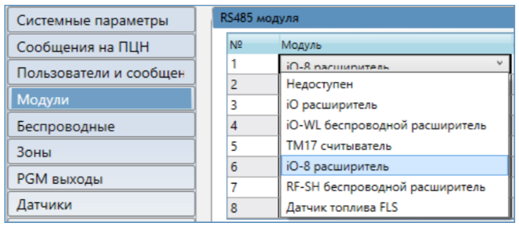
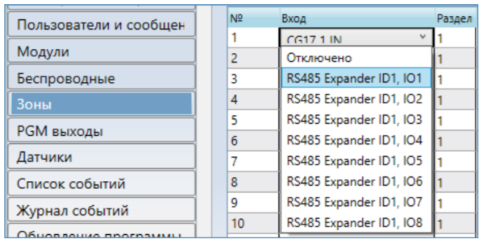

# iO-8 Расширитель входов и выходов

  

Краткая инструкция по установке

С расширителем iO-8 вы можете увеличить количество входов и выходов в совместимых устройствах **Trikdis**.

iO-8 имеет 8 клемм вход/выход, которые могут быть установлены в режиме входа, либо в режиме выхода.

Посетите страницу iO-8 на trikdis.com для получения информации о технических характеристиках устройства и обновленного списка совместимых устройств **Trikdis**.

**Выполните следующие шаги для настройки iO-8:**

1.  Соедините iO-8 с совместимым устройством **Trikdis**, как показано:

2.  Подсоедините входы, как показано:

Схемы подключения и номинал резистора устанавливает основной модуль (SP3, GT+, GT, GATOR, G16, G16T, CG17, E16, E16T, G17F), к которому подключен модуль расширения iO-8.

3.  Подсоедините выходы, как показано:

4.  Подключите USB-кабель к основному устройству **Trikdis** и откройте приложение **TrikdisConfig**. Нажмите **Считать [F4]**.

5.  Перейдите в окно **Модули** и щелкните свободную строку в области **RS485 модули**. Из списка выберите **iO-8 расширитель**, как показано:

6.  Введите серийный номер iO-8 в поле справа (ввести только цифры). Этот номер находится на наклейке iO-8.

7.  В окнах меню **Зоны** и **PGM выходы** теперь будут отображаться входы и выходы iO-8, которые вы можете включить:

    

Настройки могут отличаться в зависимости от основного устройства **Trikdis**. Настройте параметры **Зон** и **PGM выходов** в соответствии с инструкциями основного устройства.

8.  Сделайте необходимые настройки и нажмите **Записать [F5]** и отсоедините USB-кабель.

9.  Активируйте входы и включите выходы для проверки устройства.
