# iO-LORA Беспроводной расширитель

  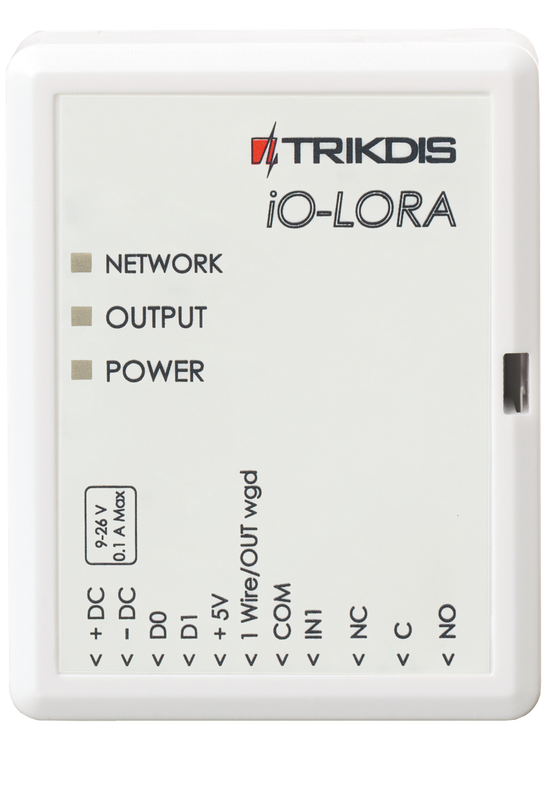

## Требование безопасности

Только квалифицированный персонал может устанавливать и обслуживать модуль охранной сигнализации.

Внимательно прочитайте это руководство перед установкой, чтобы избежать ошибок, которые могут привести к неисправности изделия или даже к его повреждению.

Отключите напряжение питания перед подключением модуля.

Изменения, модификации или ремонт контроллера, произведенные не производителем, аннулируют гарантию производителя.

> Соблюдайте нормы местного законодательства и не утилизируйте изделие или его компоненты вместе с другими бытовыми отходами.

## Описание 

Беспроводные расширители iO-LORA с трансивером RF-LORA увеличивают количество входов и выходов охранной панели "FLEXi" SP3, используя двустороннюю RF связь.

К расширителю iO-LORA можно подключить датчик температур (1 шт.) и считыватели контактных („iButton“) ключей. PGM выходом (реле) расширителя можно дистанционно управлять (вкл/выкл) различными электрическими устройствами. iO-LORA имеет один цифровой вход.

**Функциональность**

Связь:

- Дальность беспроводной связи в прямой видимости до 5000 м.

- К охранной панели "*FLEXi*" *SP3* можно подсоединить до 8 шт. беспроводных расширителей *iO-LORA*.

- Изделия c версии HW iO-LO_x30x_7_230418 поставляются со стандартной антенной, подходящей для большинства случаев. <u>В случаях, когда необходимо обеспечить качественную связь на максимально возможном расстоянии, следует использовать антенну (AX-ANT-KIT – 433 MГц, AX-ANT01S_SF – 868 MГц) с более высоким усилением радиосигнала</u>.

Входы и выходы:

- Шина "1-Wire" предназначена для подключения датчикa температуры (1 шт.) и считывателей контактных („iButton“) ключей.
- 1 вход, тип входа: NC, NO.

- 1 выход (реле).

Подключение:
- Беспроводный расширитель iO-LORA подключается к охранной панели "FLEXi" SP3 через трансивер RF-LORA.

### Технические характеристики 

| Параметр | Описание |
|----|----|
| Частота передачи | 4F модификация: 433,3 - 434,7 MГц /​ 8F модификация: 867-869 MГц |
| Тип модуляции | LORA |
| Напряжение питания | 9-26 В постоянного тока |
| Потребляемый ток | до 50 мA (в режиме ожидания) /​ до 100 мA (кратковременный в режиме отправления сообщений) |
| Шифрование сообщений | Есть |
| Дальность действия на открытой местности | До 5000 м |
| Вход | 1, тип входа: NC, NO |
| Выход | 1, релейный, 250 В переменного тока, 4 A |
| Датчик температуры | 1 шт., Maxim®/​Dallas® DS18S20, DS18B20 |
| Условия эксплуатации | Температура от –20 °C до +50 °C, относительная влажность до 80 %, при +20 °C |
| Размеры | 62 x 77 x 25 мм |
| Вес | 80 гр. |

### Элементы расширителя 

### Назначение внешних клемм 

| Клемма | Описание |
|----|----|
| +DC | Клемма подключения питания (9-26 В, положительная клемма постоянного напряжения) |
| -DC | Клемма подключения питания (9-26 В, отрицательная клемма постоянного напряжения) |
| D0 | Не используется |
| D1 | Не используется |
| +5V | Клемма питания для устройств "**1-Wire**" |
| 1Wire /​ OUT wgd | "**1-Wire**" шина данных („**OUT wgd**“ – не используется) |
| COM | Общая клемма |
| IN1 | 1 вход, тип: NO, NC (заводская настройка NO) |
| NC | Контакт реле, NC |
| C | Контакт реле, C |
| NO | Контакт реле, NO |

### Световая индикация функционирования 

| Индикатор | Состояние | Описание |
|-----------|-----------|----------|
| NETWORK | Выключен | Нет RF сигнала |
| NETWORK | Мигает зеленый | Уровень RF сигнала от 0 до 10. Достаточно 4 |
| OUTPUT/KEY | Зеленый | Активирован релейный выход |
| OUTPUT/KEY | Желтый | Активирован контактный ключ Dallas |
| POWER | Выключен | Нет напряжения питания |
| POWER | Мигает зеленый | Нормальный уровень напряжения питания |
| POWER | Мигает желтый | Низкий уровень напряжения питания (≤11.5 В) |

## Схемы соединений 

### Крепление 

1.  Снимите верхнюю крышку.

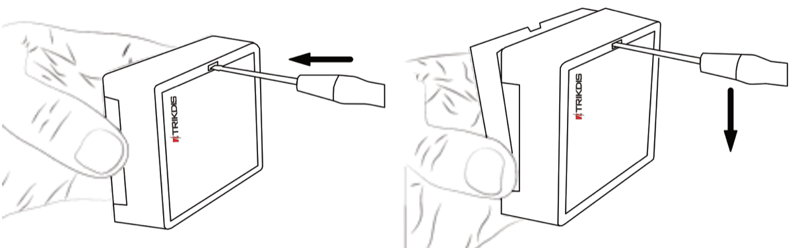

2.  Удалите плату.

3.  Прикрепите корпус шурупами.

4.  Обратно установите плату.

5.  Закройте верхнюю крышку.

### Подключение питания 

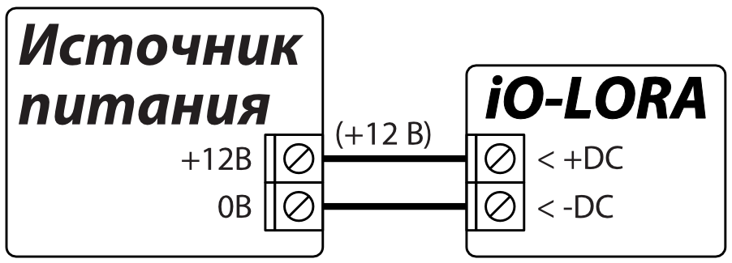

### Схема подключения входа 

iO-LORA имеет один вход. Тип входа можно установить: NC, NO.

  <figure style="margin: 0;">
    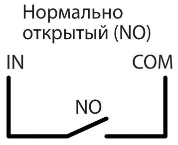
  </figure>
  <figure style="margin: 0;">
    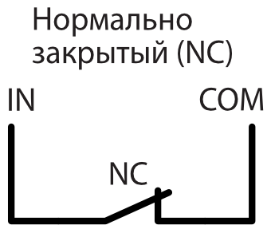
  </figure>

### Схема подключения датчика температуры 

Датчики температуры подсоединяются по приведенной схеме. К расширителю *iO-LORA* можно подключить один температурный датчик Maxim®/Dallas® DS18S20, DS18B20. Для подключения датчика температуры рекомендуется применять кабель с витой парой (UTP4x2x0.5 или STP4x2x0.5). / Клемма „+5 V“ предназначена для питания, устройств подключенных к шине "1-Wire", напряжением постоянного тока. Допустимый ток 0,2 А. Выход защищен от перегрузки.

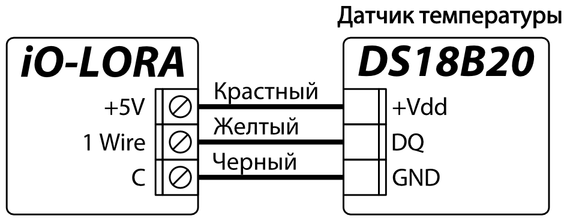

При превышении допустимого тока питание отключается автоматически. Охранная панель "FLEXi" SP3 автоматически распознает и регистрирует подключенный датчик температуры.

### Схема подключения CZ-Dallas считывателя контактных ключей 

**CZ-Dallas** считыватель контактных (iButton) ключей подключается к шине "**1-Wire**"**.** Длина проводов шины "**1-Wire**" до 30 м.

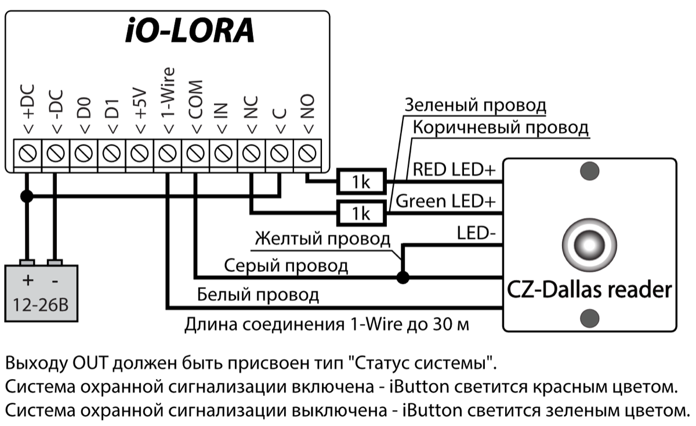

### Схема подключения модулей iO-LORA 

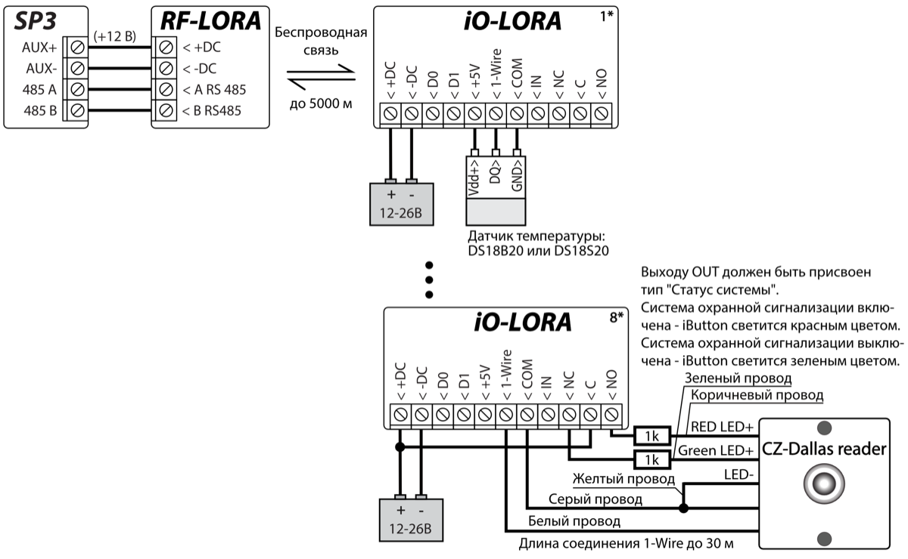

!!! note
    К охранной панели "FLEXi" SP3 должен быть подключен
    трансивер RF-LORA и может быть подключено до 8 шт. беспроводных
    расширителей iO-LORA. / Для подключения датчика температуры
    рекомендуется применять кабель с витой парой (UTP4x2x0.5 или
    STP4x2x0.5). / **CZ-Dallas** считыватели контактных (iButton) ключей и
    датчик температуры подключаются к "**1- Wire**" шине**.**
## Охранная панель „FLEXI“ SP3

1.  К охранной панели "FLEXi" SP3 должен быть подсоединен трансивер RF-LORA.

2.  Включите напряжение питания охранной панели "FLEXi" SP3.

3.  Включите напряжение питания беспроводному расширителю iO-LORA.

4.  Запустите программу ***TrikdisConfig**.*

5.  Подключите "FLEXi" SP3 к компьютеру с помощью кабеля USB Mini-B или подсоединитесь удаленно.

6.  Нажмите кнопку **Считать [F4]**, чтобы скачать установленные параметры "FLEXi" SP3. Если необходимо введите код администратора или инсталлятора.

7.  В списке "**Модули**" выберите "**Расширитель iO-LORA**".

8.  В поле "**Серийный №**" впишите серийный номер модуля.

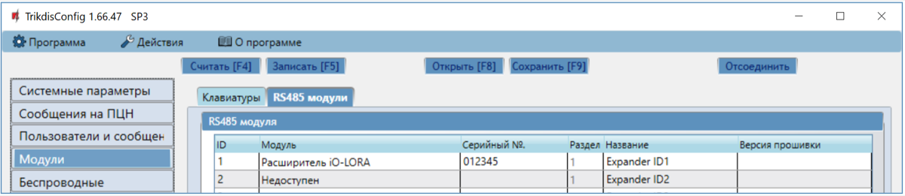

9.  В закладке "**Зоны**" сделайте настройки входа расширителя.

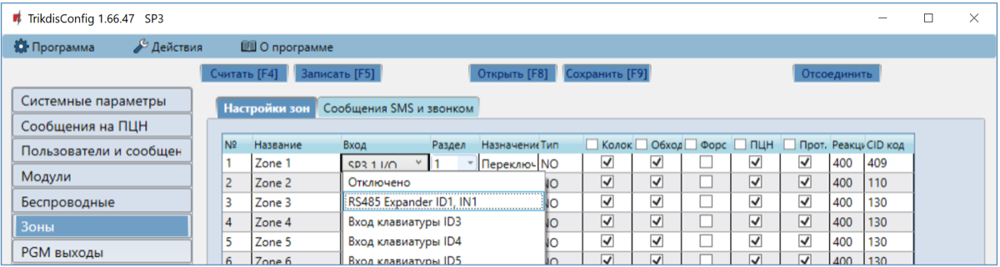

10. В закладке "**PGM выходы**" сделайте настройки PGM выходу расширителя.

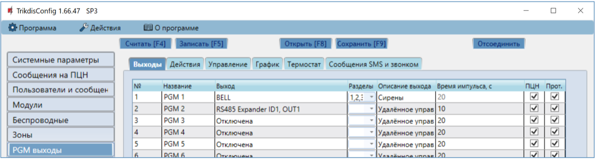

11. В списке "**Датчики**" будут включены датчики температуры, если к iO-LORA расширителю подсоединен датчик температуры.

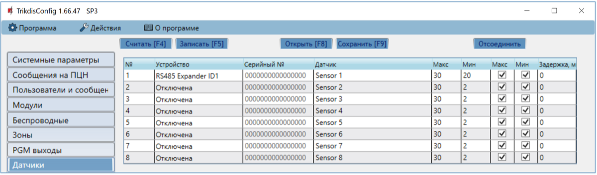

12. Окончив конфигурацию, нажмите кнопку **Записать [F5].**

13. Подождите, пока произойдет обновление.

14. Нажмите кнопку "**Отсоединить**" и отключите USB кабель.
