# iO8-LoRa Беспроводной расширитель

  

## Требование безопасности

Только квалифицированный персонал может устанавливать и обслуживать модуль охранной сигнализации.

Внимательно прочитайте это руководство перед установкой, чтобы избежать ошибок, которые могут привести к неисправности изделия или даже к его повреждению.

Отключите напряжение питания перед подключением модуля.

Изменения, модификации или ремонт контроллера, произведенные не производителем, аннулируют гарантию производителя.

Соблюдайте нормы местного законодательства и не утилизируйте изделие или его компоненты вместе с другими бытовыми отходами.

## Описание 

Беспроводные расширители iO-8-LORA с трансивером RF-LORA увеличивают количество входов и выходов охранной панели "FLEXi" SP3, используя двустороннюю RF связь.

Совместим с охранной панелью [SP3](../../control-panels/sp3/index.md) и контроллером доступа [GATOR Cellular](../../gate-controllers/gator/index.md).

Беспроводный расширитель iO-8-LORA имеет 8 I/O клемм, каждая из которых может быть установлена как вход (IN) или как выход (OUT).

**Функциональность**

Связь:

- Дальность беспроводной связи в прямой видимости до 5000 м.

- К охранной панели "*FLEXi*" *SP3* можно подсоединить до 8 шт. беспроводных расширителей *iO-8-LORA*.

- Изделия с версии HW iO8_x5xx_7_230419 поставляются со стандартной антенной, подходящей для большинства случаев. <u>В случаях, когда необходимо обеспечить качественную связь на максимально возможном расстоянии, следует использовать антенну (AX-ANT-KIT – 433 MГц, AX-ANT01S_SF – 868 MГц) с более высоким усилением радиосигнала.</u>

Входы и выходы:
- 8 I/O клемм, каждая из которых может быть установлена как вход (IN) или как выход (OUT). Типы входов (IN): ATZ, EOL, NC, NO. В цепях ATZ и EOL могут использоваться резисторы разных номиналов.

**Подключение:**

- Беспроводный расширитель iO-8-LORA подключается к охранной панели "FLEXi" SP3 через трансивер RF-LORA.

### Технические характеристики 

| Параметр | Описание |
|----|----|
| Частота передачи | 4F модификация: 433,3 - 434,7 MГц /​ 8F модификация: 867 - 869 MГц |
| Тип модуляции | LORA |
| Напряжение питания | 10-26 В постоянного тока |
| Потребляемый ток | до 50 мA (в режиме ожидания) /​ до 120 мA (кратковременный в режиме отправления сообщений) |
| Шифрование сообщений | Есть |
| Дальность действия на открытой местности | До 5000 м |
| Клеммы двойного назначения [I/​O] | 8, при конфигурации устанавливается функция IN или OUT. Вход (IN), тип: NC, NO, EOL, EOL_T, 3EOL, ATZ, ATZ_T. Выход (OUT), тип: открытый коллектор, коммутирует до 0,1 А |
| Условия эксплуатации | Температура от –20 °C до +50 °C, относительная влажность до 80 %, при +20 °C |
| Размеры | 65 x 90 x 12 мм |
| Вес | 80 г |

### Элементы расширителя 

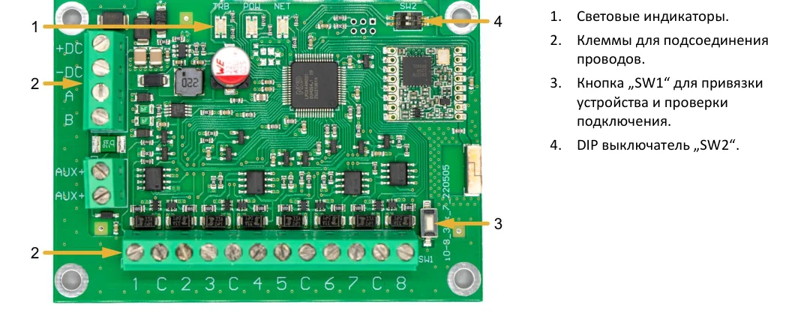

!!! note "Настройки DIP-выключателя „SW2“"
    Для изделий версии HW iO8_x5xx_7_230419:

    1. Радиочастота (`OFF` - RF1; `ON` - RF2). Предназначено для изменения радиоканала, если текущий канал сильно загружен.
    2. Тип модуляции (`OFF` - быстрый; `ON` - медленный). Положение `ON` позволяет увеличить дальность связи примерно в 2 раза (в зависимости от условий окружающей среды). Если качественная связь обеспечивается в положении `OFF`, рекомендуется использовать его. В положении `ON` снижается производительность системы.

    **ПРИМЕЧАНИЕ:** В модулях iO8-LORA и RF-LORA положения выключателей `SW` должны совпадать! В противном случае радиосвязь работать не будет!

### Назначение внешних клемм 

| Клемма | Описание |
|----|----|
| +DC | Клемма подключения питания (10-26 В, положительная клемма постоянного напряжения) |
| -DC | Клемма подключения питания (10-26 В, отрицательная клемма постоянного напряжения) |
| A | Клемма А интерфейса *RS485* |
| B | Клемма В интерфейса *RS485* |
| 1- 8 | Клеммы вход/​выход |
| C | Общая клемма (отрицательная) |

### Световая индикация функционирования 

| Индикатор | Состояние | Описание |
|-----------|-----------|----------|
| NETWORK / (Сеть) | Выключен | Нет RF сигнала |
| NETWORK / (Сеть) | Мигает зеленый | Уровень RF сигнала от 0 до 10. Достаточно 3 |
| POWER / (Питание) | Выключен | Нет напряжения питания |
| POWER / (Питание) | Мигает зеленый | Нормальный уровень напряжения питания |
| POWER / (Питание) | Мигает желтый | Низкий уровень напряжения питания (≤11.5 В) |

## Схемы соединений 

### Подключение питания 

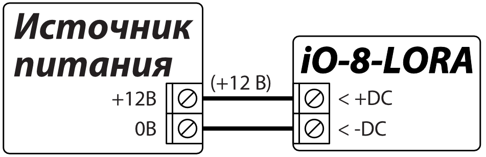

### Схемы подключения входов 

Плата беспроводного расширителя iO-8-LORA имеет 8 клемм IO1-IO8 (зоны) для подсоединения датчиков. Любую IO клемму можно установить, как вход и установить атрибуты: тип входа (NO, NC, EOL, EOL_T, 3EOL, ATZ, ATZ_T); чувствительность и кратковременные события в цепи; функции входа (зоны) („Delay“, „Instant“, „Instant Stay“, „Interior“, „Interior Stay“, „Fire“, „Keyswitch“, „24_hour“, „Silent“, „Silent 24h“).

  <figure style="margin: 0;">
    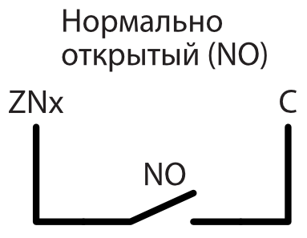
  </figure>
  <figure style="margin: 0;">
    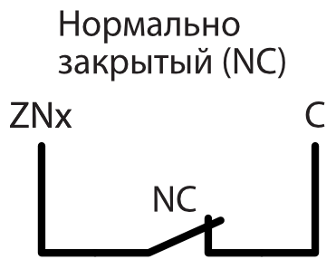
  </figure>
  <figure style="margin: 0;">
    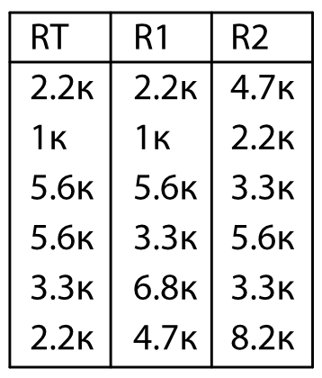
  </figure>

  <figure style="margin: 0;">
    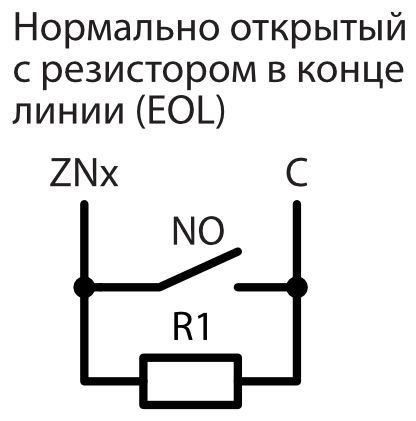
  </figure>
  <figure style="margin: 0;">
    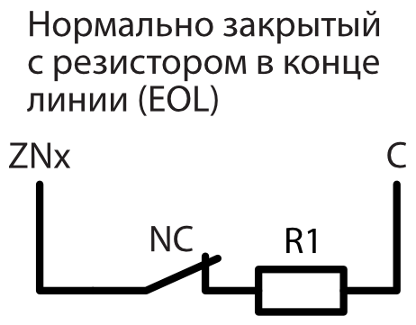
  </figure>
  <figure style="margin: 0;">
    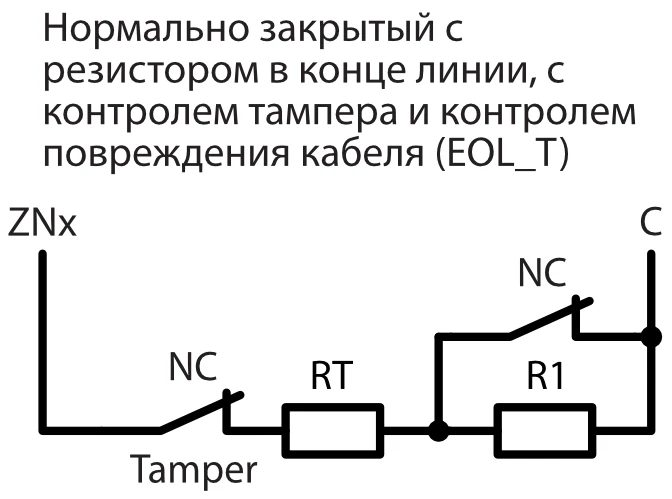
  </figure>

  <figure style="margin: 0;">
    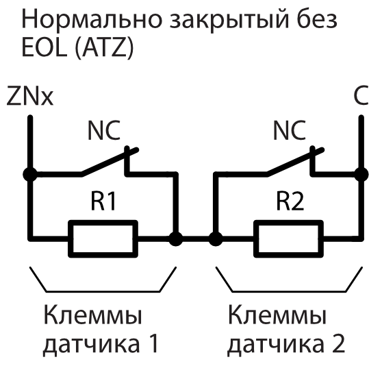
  </figure>
  <figure style="margin: 0;">
    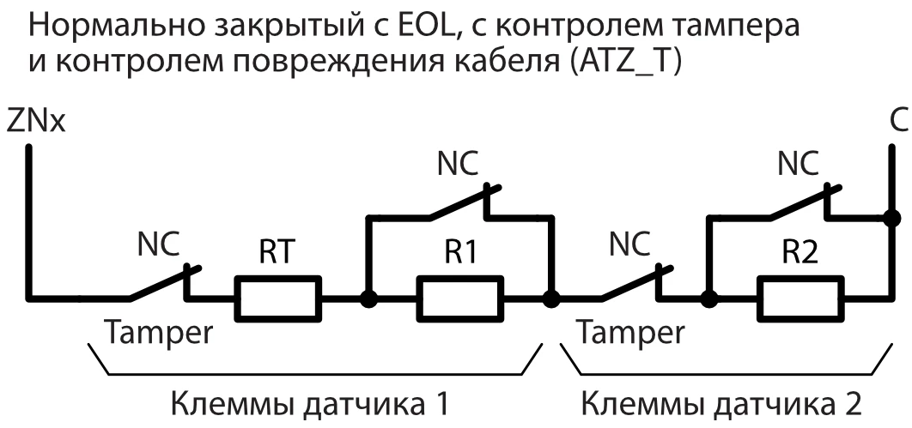
  </figure>

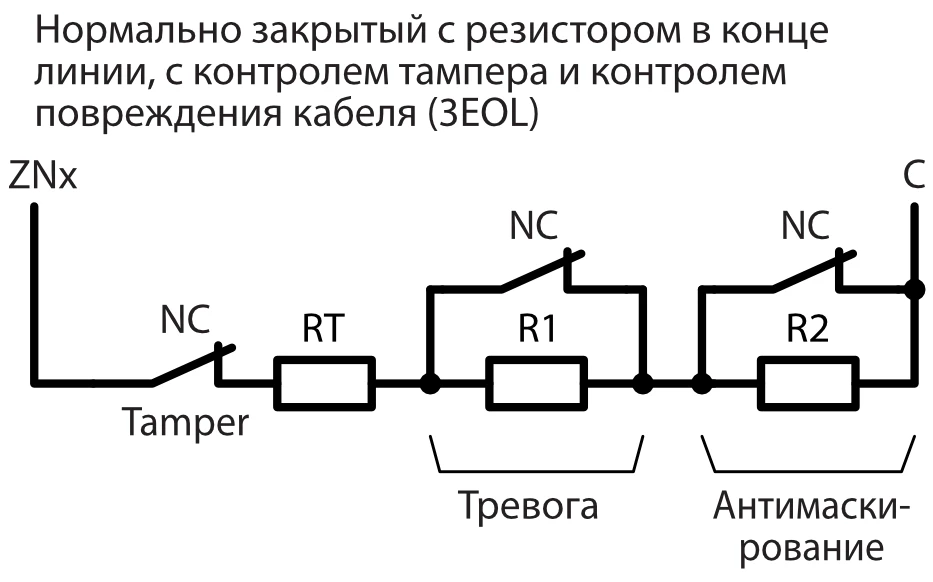

### Схема подключения реле 

Различные электрические устройства могут управляться (вкл/выкл) удаленно с помощью контактов реле. Универсальная IO (вход/выход) клемма беспроводного расширителя *iO-8-LORA* должна быть установлена в режим работы „Выход“ (OUT) и назначен тип "Удаленное управление".

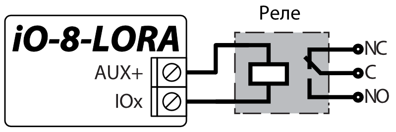

### Схема подключения расширителя iO-8-LORA к охранной панели "FLEXi" SP3 

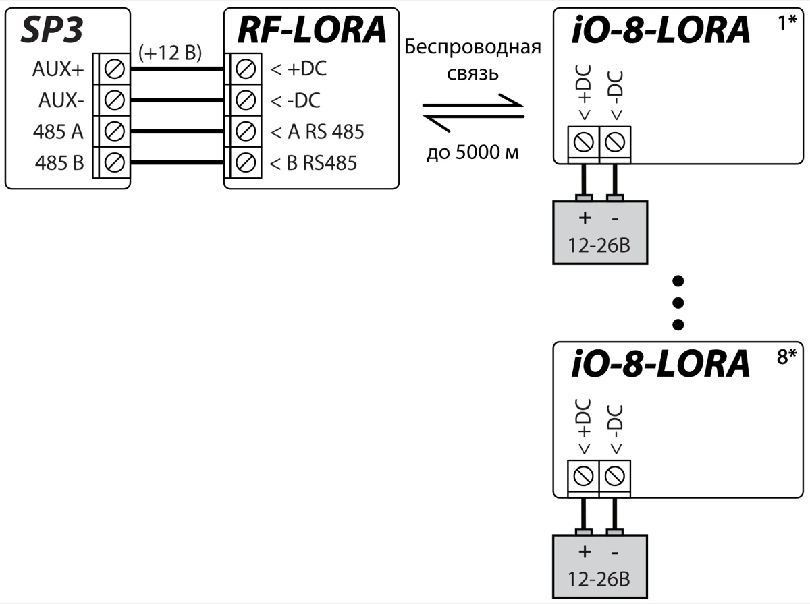

!!! note
    К охранной панели "FLEXi" SP3 должен быть подключен
    трансивер RF-LORA и может быть подключено до 8 шт. беспроводных
    расширителей iO-8-LORA.

## Охранная панель „FLEXI” SP3

1.  К охранной панели "FLEXi" SP3 должен быть подсоединен трансивер RF-LORA.

2.  Включите напряжение питания охранной панели "FLEXi" SP3.

3.  Включите напряжение питания беспроводному расширителю iO-8-LORA.

4.  Запустите программу ***TrikdisConfig**.*

5.  Подключите "FLEXi" SP3 к компьютеру с помощью кабеля USB Mini-B или подсоединитесь удаленно.

6.  Нажмите кнопку **Считать [F4]**, чтобы скачать установленные параметры "FLEXi" SP3. Если необходимо введите код администратора или инсталлятора.

7.  В списке "**Модули**" выберите "**Расширитель iO-8-LORA**".

8.  В поле "**Серийный №**" впишите серийный номер модуля.

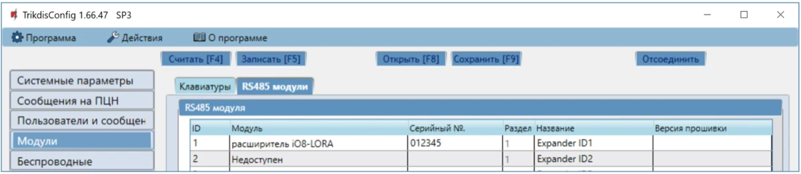

9.  В закладке "**Зоны**" сделайте настройки входам расширителя.

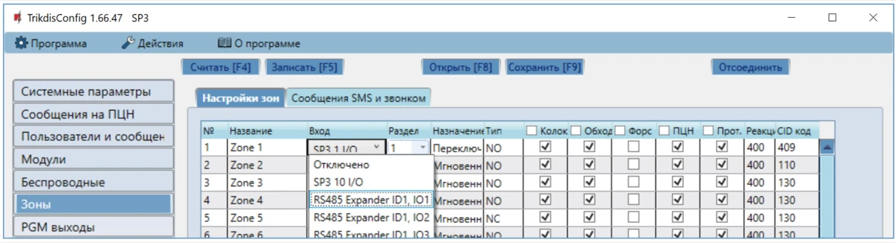

10. В закладке "**PGM выходы**" сделайте настройки PGM выходам расширителя.

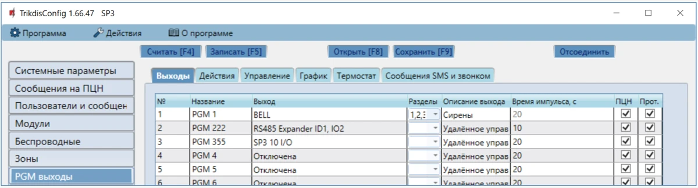

11. Окончив конфигурацию, нажмите кнопку **Записать [F5].**

12. Подождите, пока произойдет обновление.

13. Нажмите кнопку "**Отсоединить**" и отключите USB кабель.
