# PB-LoRa Беспроводная кнопка тревоги

  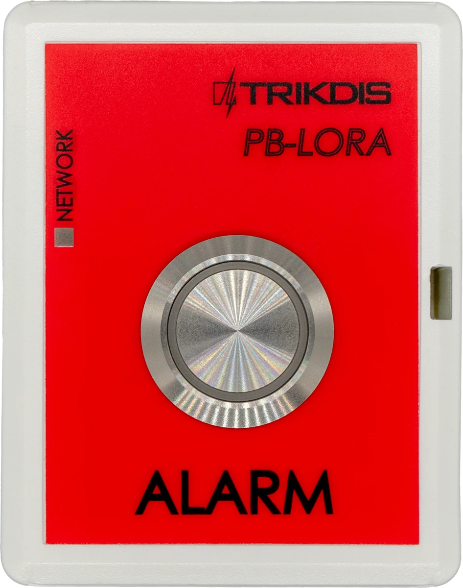

## Требование безопасности

Только квалифицированный персонал может устанавливать и обслуживать модуль охранной сигнализации.

Внимательно прочитайте это руководство перед установкой, чтобы избежать ошибок, которые могут привести к неисправности изделия или даже к его повреждению.

Отключите напряжение питания перед подключением модуля.

Изменения, модификации или ремонт контроллера, произведенные не производителем, аннулируют гарантию производителя.

Соблюдайте нормы местного законодательства и не утилизируйте изделие или его компоненты вместе с другими бытовыми отходами.

## Описание 

Изделие PB-LORA предназначено для беспроводной передачи сообщения экстренного вызова. Вызов помощи инициируется нажатием кнопки. В качестве устройства приема сообщений используется модуль RF-LORA, который подсоединяется к охранной панели "FLEXi" SP3.

Совместим с охранной панелью [SP3](../../control-panels/sp3/index.md).

К охранной панели можно привязать 8 кнопок тревоги PB-LORA, если охранная панель имеет прошивку версии 1.17 или выше (например: SP3_xxxx_0117.fw). Если охранная панель имеет 2 версию прошивки 1.16 или выше (например, SP3_xxx2_0116.fw), то этой охранной панели можно привязать 250 кнопок тревоги PB-LORA.

**Функциональность**

Связь:

- Дальность беспроводной связи в прямой видимости до 5000 м.

Подключение:

- Беспроводная кнопка тревоги PB-LORA подключается к охранной панели "*FLEXi*" *SP3* через трансивер RF-LORA.
### Технические характеристики 

| Параметр | Описание |
|----|----|
| Частота передачи | 433,3-434,7 MГц |
| Тип модуляции | LORA |
| Напряжение питания | 3 В, батарейка CR123A |
| Срок службы батарейки | Не менее 3 лет |
| Потребляемый ток | До 0,008 мA (в режиме ожидания) /​ До 50 мA (кратковременный в режиме отправления сообщений) |
| Шифрование сообщений | Да |
| Дальность действия на открытой местности | До 5000 м |
| Условия эксплуатации | Температура от –10 °C до +50 °C, относительная влажность до 80 %, при +20 °C |
| Размеры | 62 x 77 x 25 мм |
| Вес | 80 гр |

### Элементы кнопки тревоги 

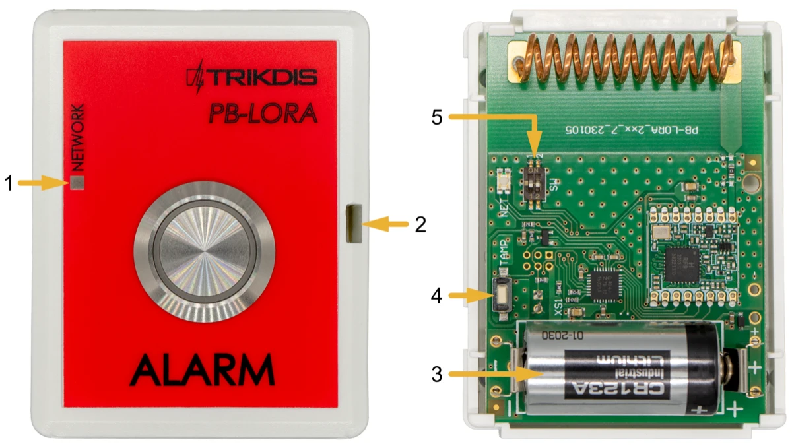

1. Световой индикатор.
2. Щель для снятия крышки.
3. Батарейка 3 В (CR123A).
4. Кнопка „TAMP“ для привязки устройства и проверки подключения.
5. DIP выключатель „SW“.

!!! note "Настройки DIP-выключателя „SW“"
    1. Радиочастота ("OFF" - RF1; "ON" - RF2). Предназначен для смены радиоканала, если текущий канал сильно загружен.
    2. Тип модуляции (“OFF” – быстрая; “ON” – медленная). Положение “ON” позволяет увеличить дальность связи примерно в 2 раза (в зависимости от условий окружающей среды). Но если качественное соединение обеспечивается с помощью положения “OFF”, то рекомендуется его и использовать. В положении “ON” расход батарейки увеличивается, а скорость работы системы снижается.

    **ПРИМЕЧАНИЕ:** В модулях PB-LORA и RF-LORA положения выключателей "SW" должны совпадать! В противном случае радиосвязь работать не будет!

### Световая индикация функционирования 

| Индикатор | Действие | Описание |
|-----------|----------|----------|
| NETWORK | После нажатия кнопки "ALARM" | Первое мигание зеленым - сообщение отправлено, напряжение батареи хорошее. |
| NETWORK | Первое мигание зеленым - сообщение отправлено, напряжение батареи низкое. | Первое мигание зеленым - сообщение отправлено, напряжение батареи хорошее |
| NETWORK | Второе мигание красным цветом - получено подтверждение приема сообщения от модуля RF-LORA. |  |
| NETWORK | После нажатия кнопки "ТАМР" |  |
| NETWORK | Первое мигание зеленым - сообщение отправлено, напряжение батареи низкое. |  |
| NETWORK | Второе мигание красным цветом - получено подтверждение приема сообщения от модуля RF-LORA. |  |
| NETWORK | Третье-двенадцатое мигание - уровень радиосигнала. * |  |

\* рекомендуется использовать, когда есть не менее четырех миганий.

ПРИМЕЧАНИЕ: после установки батарейки рекомендуется подождать не менее 10 секунд, прежде чем начать использовать устройство.  

## Схемы соединений 

### Крепление 

1.  Снимите верхнюю крышку.

2.  Удалите плату.

3.  Прикрепите корпус шурупами.

4.  Обратно установите плату.

5.  Установите батарейку в модуль.

6.  Закройте верхнюю крышку.

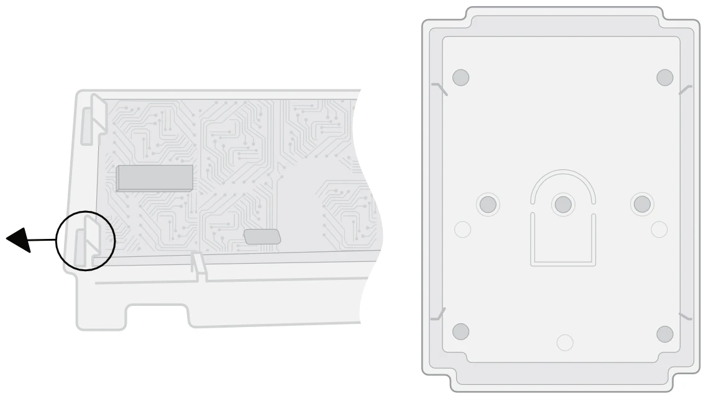

### Подсоединение беспроводной кнопки тревоги PB-LORA 

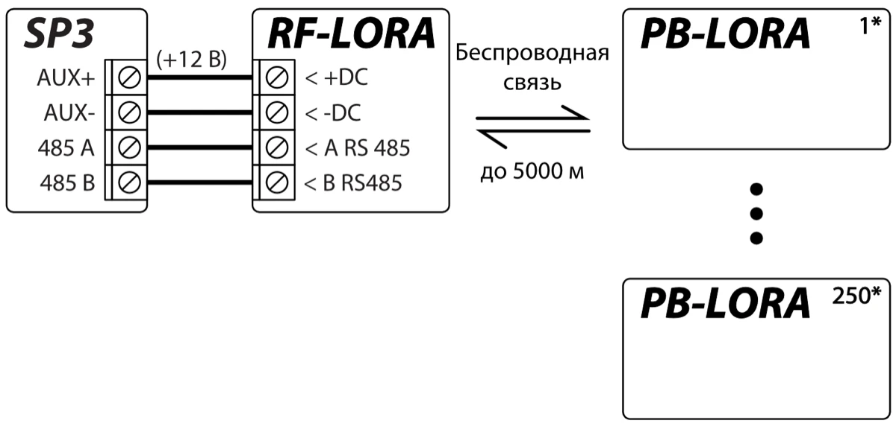

!!! note
    Трансивер RF-LORA должен быть подключен к охранной панели
    "FLEXi" SP3. К охранной панели можно подключить до 8
    беспроводных кнопок тревоги PB-LORA (версия прошивки охранной
    панели 1.17 или выше. Например: SP3_xxxx_0117.fw) или до 250 кнопок
    PB-LORA (если охранная панель имеет 2 версию прошивки 1.16 или
    выше. Например: SP3_xxx2_0116.fw).
## Охранная панель „FLEXI“ SP3

В охранной панели "*FLEXi*" *SP3* должна быть установлена версия прошивки 1.17 или выше (например, SP3_xxxx_0117.fw).

1.  К охранной панели "FLEXi" SP3 должен быть подсоединен трансивер RF-LORA.

2.  Включите напряжение питания охранной панели "FLEXi" SP3.

3.  В беспроводной кнопке тревоги PB-LORA должна быть установлена батарейка.

4.  Запустите программу ***TrikdisConfig**.*

5.  Подключите "FLEXi" SP3 к компьютеру с помощью кабеля USB Mini-B или подсоединитесь удаленно.

6.  Нажмите кнопку **Считать [F4]**, чтобы скачать установленные параметры "FLEXi" SP3. Если необходимо введите код администратора или инсталлятора.

7.  В списке "**Модули**" выберите "**PB-LORA кнопка тревоги**".

8.  В поле "**Серийный №**" впишите серийный номер модуля PB-LORA.

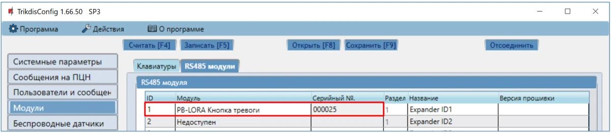

9.  В закладке "**Зоны**" сделайте настройки кнопке тревоги.

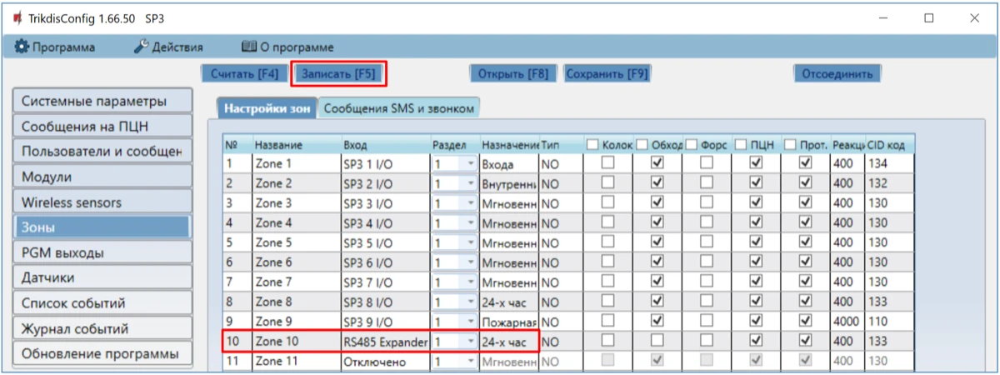

10. Окончив конфигурацию, нажмите кнопку **Записать [F5].**

11. Подождите, пока произойдет обновление.

12. Нажмите кнопку "**Отсоединить**" и отсоедините USB кабель.

13. Подождите 1 минуту. На модуле PB-LORA нажмите на кнопку "**Alarm**".

14. Подсоедините USB Mini-B кабель к охранной панели „FLEXi” SP3.

15. Нажмите кнопку **Считать [F4]**.

16. В списке "**Модули**" в строке "**PB-LORA кнопка тревоги**" будет указана версия прошивки.

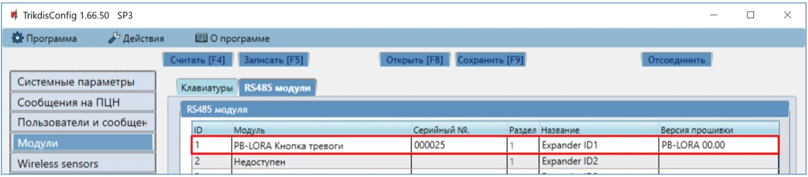

17. Нажмите кнопку "**Отсоединить**" и отсоедините USB кабель.

!!! note
    Удаление PB-LORA беспроводных кнопок тревоги из памяти
    „FLEXi" SP3:
    
    1.  Запустите программу ***TrikdisConfig**.*
    
    2.  Подключите "FLEXi" SP3 через кабель USB Mini-B к компьютеру
        или подключитесь к "FLEXi" SP3 удаленно. Нажмите кнопку
        **Считать [F4]**.
    
    3.  В окне „**Модули"** в поле „**Модуль"**, где был зарегистрированная
        кнопка тревоги ***PB-LORA*,** укажите „**Недоступен"**. Нажмите
        кнопку **Записать [F5].** Беспроводная кнопка тревоги удалена из
        памяти „FLEXi" SP3.
## Регистрация 250 беспроводных тревожных кнопок PB-LORA к охранной панели "FLEXi" SP3 

В охранной панели "*FLEXi*" *SP3* должна быть установлена 2-я версия прошивки 1.16 или выше (например, SP3_xxx2_0116.fw).

1.  К охранной панели "FLEXi" SP3 должен быть подсоединен трансивер RF-LORA.
2.  Включите напряжение питания охранной панели "FLEXi" SP3.

3.  В беспроводной кнопке тревоги PB-LORA должна быть установлена батарейка.

4.  Запустите программу TrikdisConfig.

5.  Подсоединитесь к охранной панели "FLEXi" SP3 удаленно.

!!! note
    Удаленная настройка охранной панели „FLEXi" SP3 будет работать,
    если:
    
    1.  Настроен канал связи WiFi/LAN или установлена активированная
        SIM-карта и введен или отключен PIN-код.
    
    2.  На SIM-карте включен мобильный интернет.
    
    3.  Включен Protegus cервис.
    
    4.  Включено напряжение питания (индикатор „**PWR**" мигает зеленым).
    
    5.  Зарегистрирован в сети (индикатор „**NET**" светит зеленым и мигает
        желтым).
6.  В поле **„Уникальный №"** введите IMEI номер охранной панели „FLEXi“ SP3, который указан на упаковке или на изделии.

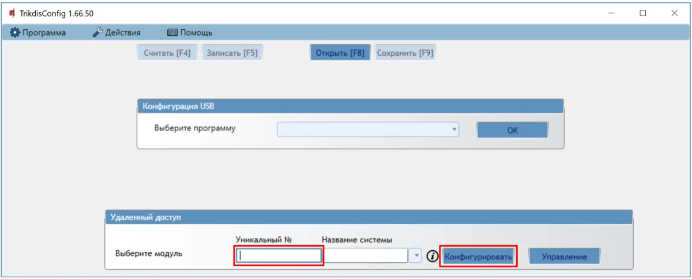

7.  Нажмите кнопку **„Конфигурировать“**.

8.  Откроется программное окно „FLEXi“ SP3. Нажмите кнопку **Считать [F4],** чтобы были считаны настройки охранной панели***.*** Если всплывет окно запроса ввода **„Кода администратора“** или **„Установщика“**, введите 6-значный код администратора или установщика.

9.  В списке **„Модули“** выберите **„RF-LORA трансивер“**"**.**

10. В поле **„Серийный №“** укажите серийный номер модуля RF-LORA.

11. Нажмите кнопку **Записать [F5]**.

12. Подождите, пока произойдет обновление.

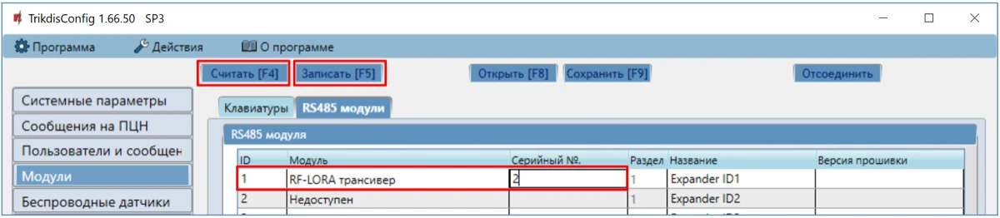

13. Подождите 1 минуту.

14. Нажмите кнопку **Считать [F4]**.

15. В окне **„Модули“** в поле **„Версия прошивки“** будет указана версия программного обеспечения модуля RF-LORA.

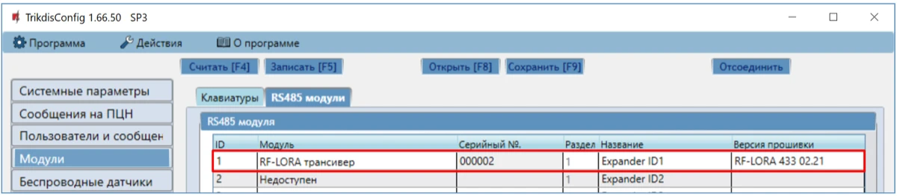

16. Перейдите к окну **„Беспроводные датчики“**.

17. Нажмите кнопку **„Привязка датчиков“**.

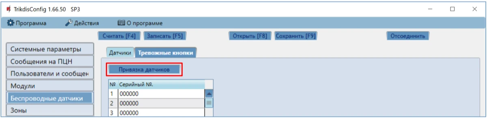

Регистрация беспроводных кнопок тревоги может производиться для всех сразу.

При регистрации кнопок тревоги *PB-LORA* модуль *RF-LORA* должен находиться на расстоянии не менее 1 м от кнопок тревоги.

18. На модуле RF-LORA начнет красным/зеленым мигать индикатор **„DATA/TROUBLE“**.

19. RF-LORA находится в режиме регистрации беспроводных устройств. TrikdisConfig откроет окно привязки датчиков

20. На плате PB-LORA нажмите на кнопку „**TAMP**“.

21. Индикатор **„DATA/TROUBLE“** на модуле RF-LORA загорится зеленым цветом на несколько секунд. После этого светодиод **„DATA/TROUBLE“** на модуле RF-LORA снова начнет мигать красным/зеленым цветом.

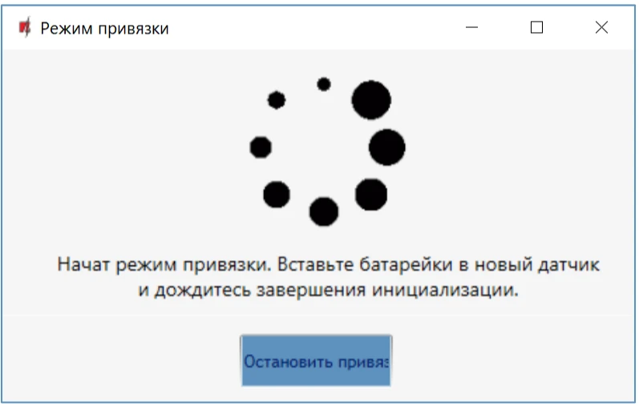

22. Через несколько секунд беспроводная кнопка тревоги PB-LORA добавится в список датчиков.

23. Номер „**UID**“ должен соответствовать серийному номеру PB-LORA, который указан на наклейке на корпусе.

24. Если вам необходимо привязать следующую тревожную кнопку, вам нужно кратковременно нажать кнопку „**TAMP**“ на плате.

25. Нажмите **„Остановить привязку“**, чтобы завершить регистрацию беспроводных кнопок тревоги.

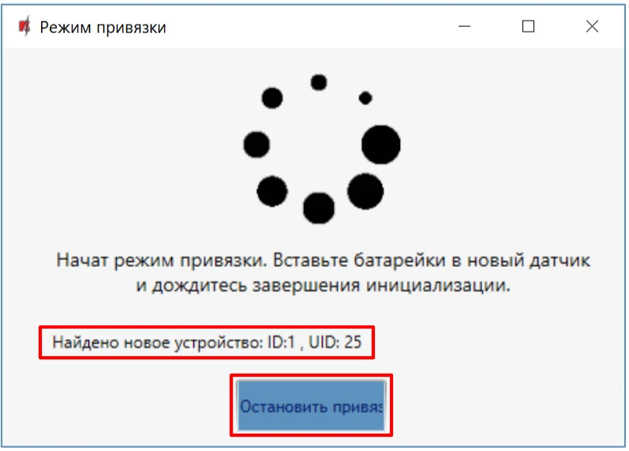

26. Нажмите ***„*Да*“ в открывшемся окне. Зарегистрированные беспроводные кнопки тревоги PB-LORA будут сохранены в памяти охранной панели „FLEXi“ SP3.***

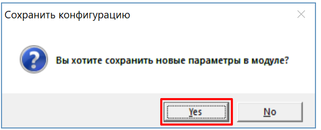

Подождите несколько минут. Нажмите кнопку **Считать [F4]**.

В TrikdisConfig программном окне **„Беспроводные датчики“** будет содержаться список зарегистрированных беспроводных кнопок тревоги PB-LORA. В поле **„Серийный №“** будут написаны 6-значные серийные номера кнопок тревоги, которые должны совпадать с серийными номерами PB-LORA, написанными на задней стороне корпуса.

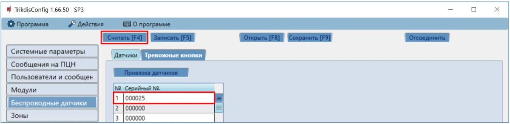

!!! note
    Удаление PB-LORA беспроводных кнопок тревоги из памяти
    „FLEXi" SP3:
    
    1.  Запустите программу ***TrikdisConfig**.*
    
    2.  Подключите "FLEXi" SP3 через кабель USB Mini-B к компьютеру
        или подключитесь к "FLEXi" SP3 удаленно. Нажмите кнопку
        **Считать [F4]**.
    
    3.  В окне „**Беспроводные датчики"** введите „**0**" в поле „**Серийный
        №"** и нажмите кнопку **Записать [F5].** Беспроводная кнопка
        тревоги удалена из памяти „FLEXi" SP3.
