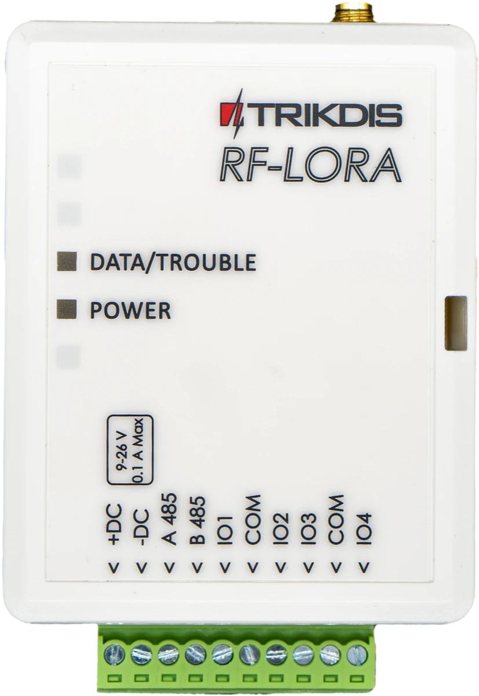
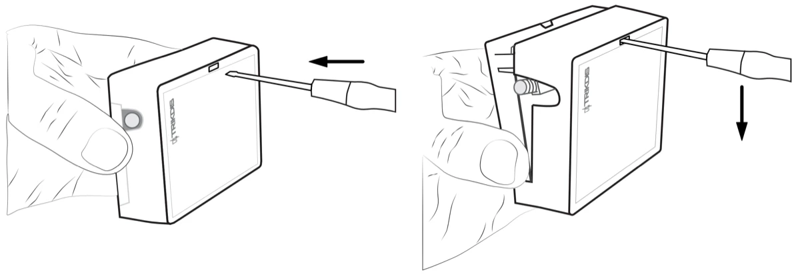
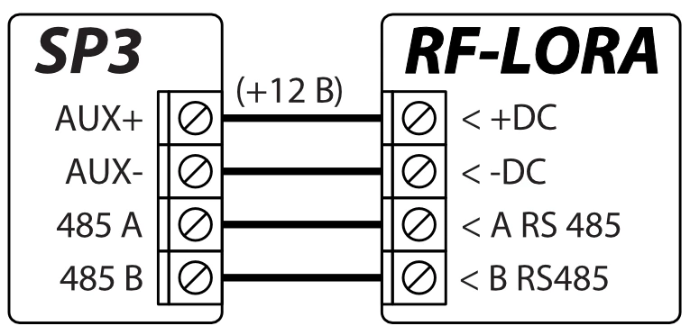
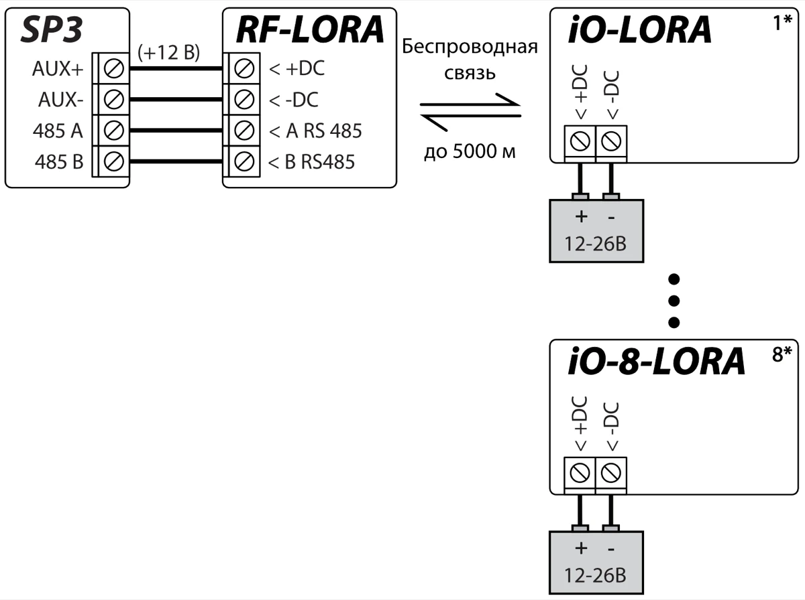
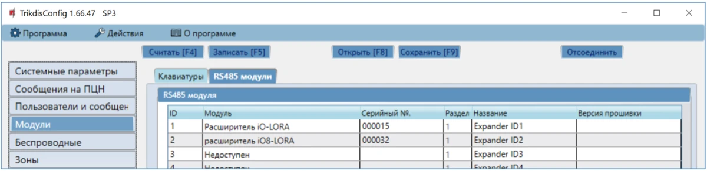
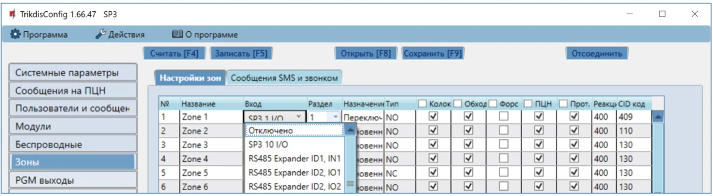
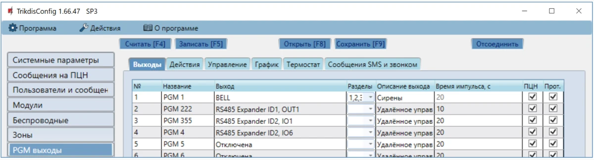

# RF-LoRa Беспроводной расширитель

  

## Требование безопасности 

Только квалифицированный персонал может устанавливать и обслуживать модуль охранной сигнализации.

Внимательно прочитайте это руководство перед установкой, чтобы избежать ошибок, которые могут привести к неисправности изделия или даже к его повреждению.

Отключите напряжение питания перед подключением модуля.

Изменения, модификации или ремонт контроллера, произведенные не производителем, аннулируют гарантию производителя.

Соблюдайте нормы местного законодательства и не утилизируйте изделие или его компоненты вместе с другими бытовыми отходами.

## Описание 

Трансивер RF-LORA c беспроводными расширителями iO-LORA и iO-8-LORA увеличивает количество входов и выходов охранной панели "FLEXi" SP3, используя двустороннюю RF связь.

Совместим с охранной панелью [SP3](../../control-panels/sp3/index.md), контроллерами доступа [GATOR Cellular](../../gate-controllers/gator/index.md) и [GATOR WiFi](../../gate-controllers/gator-wifi/index.md).

К охранной панели "FLEXi" SP3 с помощью трансивера RF-LORA можно подключить до 8 модулей LORA (iO-LORA, iO-8-LORA, PB-LORA).

**Функциональность**

Связь:

- Дальность беспроводной связи в прямой видимости до 5000 м.

- К охранной панели "*FLEXi*" *SP3* можно подсоединить один трансивер *RF-LORA*.

- Изделие поставляется со стандартной антенной, подходящей для большинства случаев. <u>В случаях, когда необходимо обеспечить качественную связь на максимально возможном расстоянии, следует использовать антенну (AX-ANT-KIT – 433 MГц, AX-ANT01S_SF – 868 MГц) с более высоким усилением радиосигнала</u>.

Подключение:

- К охранной панели "*FLEXi*"* SP3* трансивер *RF-LORA* подключается через шину RS485.
### Технические характеристики 

| Параметр | Описание |
|----|----|
| Частота передачи | Модификация 8F: 867-869 MГц /​ Модификация 4F: 433,3-434,7 МГц |
| Тип модуляции | LORA |
| Напряжение питания | 9-26 В постоянного тока |
| Потребляемый ток | до 50 мA (в режиме ожидания) /​ до 150 мA (кратковременный в режиме отправления сообщений) |
| Шифрование сообщений | Есть |
| Дальность действия на открытой местности | До 5000 м |
| Условия эксплуатации | Температура от –10 °C до +50 °C, относительная влажность до 80 %, при +20 °C |
| Размеры | 65 x 82 x 25 мм |
| Вес | 80 g |

### Элементы расширителя

1. SMA разъем для RF антенны.
2. Световые индикаторы.
3. Отверстие для снятия крышки.
4. Клеммы для подсоединения проводов.
5. Разъем USB Mini-B предназначен для обновления программного обеспечения.
6. DIP-переключатель „SW“.
7. Кнопка „DJ1“ для включения/отключения режима привязки модулей LORA.

!!! note "Настройки DIP-выключателя „SW“"
    1. Радиочастота ("OFF" - RF1; "ON" - RF2). Предназначен для смены радиоканала, если текущий канал сильно загружен.
    2. Тип модуляции (“OFF” – быстрая; “ON” – медленная). Положение “ON” позволяет увеличить дальность связи примерно в 2 раза (в зависимости от условий окружающей среды). Но если качественное соединение обеспечивается с помощью положения “OFF”, то рекомендуется его и использовать.

    **ПРИМЕЧАНИЕ:** В RF-LORA и других LORA модулях положения выключателей "SW" должны совпадать! В противном случае радиосвязь работать не будет!

### Назначение внешних клемм 

| Клемма | Описание |
|----|----|
| +DC | Клемма подключения питания (9-26 В, положительная клемма постоянного напряжения) |
| -DC | Клемма подключения питания (9-26 В, отрицательная клемма постоянного напряжения) |
| A 485 | Клемма А интерфейса *RS485* |
| B 485 | Клемма В интерфейса *RS485* |
| IO1-IO4 | Не используется |
| COM | Не используется |

### Световая индикация функционирования 

| Индикатор | Состояние | Описание |
|-----------|-----------|----------|
| DATA/TROUBLE | Мигает/светится красным | Нарушена связь с модулем |
| DATA/TROUBLE | Мигает зеленый/красный | Режим привязки модулей LORA |
| DATA/TROUBLE | Зеленый загорается на 3 секунды | Предварительно привязанный модуль LORA (в режиме обучения) |
| POWER | Выключен | Нет напряжения питания |
| POWER | Мигает зеленый | Нормальный уровень напряжения питания |
| POWER | Мигает желтый | Низкий уровень напряжения питания (≤11.5 В) |
| POWER | Желтый | Нет связи с охранной панелью "FLEXi" SP3 по RS485 |

## Схемы соединений 

### Крепление 

1.  Снимите верхнюю крышку.

2.  Удалите плату.

3.  Прикрепите корпус шурупами.

4.  Обратно установите плату.

5.  Закройте верхнюю крышку.

### Подключение трансивера RF-LORA к охранной панели "FLEXi" SP3 

### Схема подключения расширителей LORA 

## Конфигурация с TrikdisConfig

1.  К охранной панели "FLEXi" SP3 должен быть подсоединен трансивер RF-LORA.

2.  Включите напряжение питания охранной панели "FLEXi" SP3.

3.  Включите напряжение питания беспроводным расширителям iO-LORA и/или iO-8-LORA.

4.  Запустите программу ***TrikdisConfig**.*

5.  Подключите "FLEXi" SP3 к компьютеру с помощью кабеля USB Mini-B или подсоединитесь удаленно.

6.  Нажмите кнопку **Считать [F4]**, чтобы скачать установленные параметры "FLEXi" SP3. Если необходимо введите код администратора или инсталлятора.

7.  В списке "**Модули**" выберите "**Расширитель iO-LORA**" ("**Расширитель iO-8-LORA**").

8.  В поле "**Серийный №**" впишите серийный номер модуля.

9.  В закладке "**Зоны**" сделайте настройки входам расширителя**.**

10. В закладке "**PGM выходы**" сделайте настройки PGM выходам расширителя**.**

11. Окончив конфигурацию, нажмите кнопку **Записать [F5].**

12. Подождите, пока произойдет обновление.

13. Нажмите кнопку "**Отсоединить**" и отключите USB кабель.

14. Активируйте входы и включите выходы для проверки устройства.
