# RF-S8 Беспроводной трансивер

  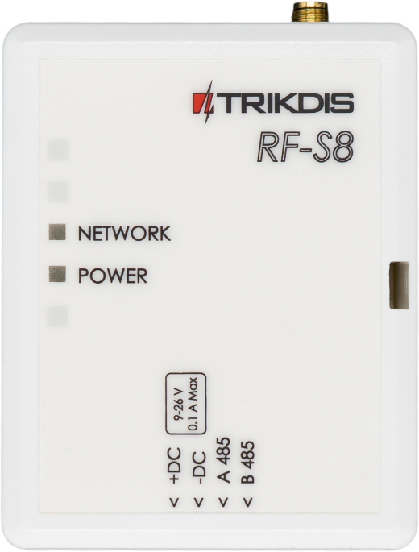

## Описание 

При подключении трансивера RF-S8, охранная панель „FLEXi“ SP3 может работать с „**S8**“ беспроводными датчиками, сиренами и пультами дистанционного управления.

Совместим с охранной панелью [SP3](../../control-panels/sp3/index.md).

**Функциональность**

Связь:

- Дальность беспроводной связи в прямой видимости до 500 м.

- К охранной панели "*FLEXi*" *SP3* можно подсоединить один трансивер *RF-S8*.

- Изделие поставляется со стандартной антенной, подходящей для большинства случаев.

Подключение:

- К охранной панели "*FLEXi*"* SP3* трансивер *RF-S8* подключается через шину RS485.

### Технические параметры 

| **Параметр** | **Описание** |
|----|----|
| Напряжение питания [DC] | 9-26 В постоянного тока |
| Потребляемый ток | до 50 мA (в режиме ожидания), /​ до 100 мA (кратковременный в режиме отправления сообщений) |
| Частота передачи | 868 MГц |
| Мощность радиосигнала | 25 мВт |
| Дальность действия на открытой местности | До 500 м |
| Условия эксплуатации | Температура от -10°C до +50°C, относительная влажность – до 80%, при +20°C, без конденсации |
| Размеры | 92x62x25 мм |
| Вес | 0,08 кг |

### Элементы трансивера 

1.  SMA разъем для RF антенны.

2.  Световые индикаторы.

3.  Отверстие для снятия крышки.

4.  Клеммы для подсоединения проводов.

5.  Разъем USB Mini-B предназначен для обновления программного обеспечения.

6.  Кнопка для включения/отключения режима привязки беспроводных датчиков.

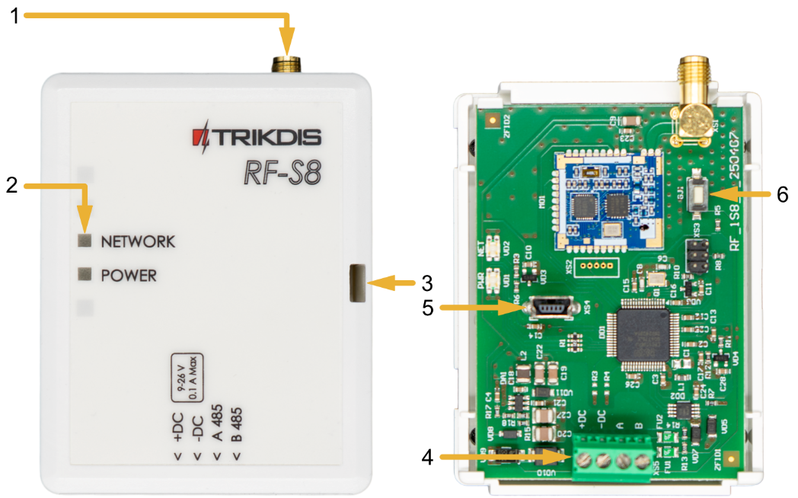

### Назначение внешних клемм 

| **Клемма** | **Описание** |
|----|----|
| +DC | Клемма подключения питания (9-26 В, положительная клемма постоянного напряжения) |
| -DC | Клемма подключения питания (9-26 В, отрицательная клемма постоянного напряжения) |
| A 485 | Клемма А интерфейса *RS485* |
| B 485 | Клемма В интерфейса *RS485* |

### Световая индикация 

| Индикатор | Статус | Описание |
|-----------|--------|----------|
| NETWORK / (Сеть) | Мигает зеленый/красный | Режим привязки датчиков |
| NETWORK / (Сеть) | Загорается зеленый на 5 сек. | Предварительно привязанный датчик (в режиме обучения) |
| POWER / (Электропитание) | Выключен | Нет напряжения питания |
| POWER / (Электропитание) | Мигает зеленый | Нормальный уровень напряжения питания |
| POWER / (Электропитание) | Мигает желтый | Низкий уровень напряжения питания (≤11.5 В) |
| POWER / (Электропитание) | Желтый | Нет связи с охранной панелью "FLEXi" SP3 по RS485 |

## Замена программного обеспечения охранной панели 

На охранную панель „FLEXi“ SP3 необходимо установить прошивку 4 ревизии **SP3_xxx4\_0122.fw** (версия прошивки 1.22 или выше), чтобы охранная панель могла бы работать с „**S8**“ беспроводными датчиками, сиренами. К охранной панели должен быть подключен беспроводной приемопередатчик RF-S8.

Для замены прошивки выполните следующие шаги:

1.  Согласно схеме, подключите модуль RF-S8 к „FLEXi” SP3.

2.  Включите питание охранной панели „FLEXi“ SP3.

3.  Запустите программу ***TrikdisConfig**.*

4.  Подключите „FLEXi” SP3 к компьютеру с помощью кабеля USB Mini-B.

5.  В программе TrikdisConfig откройте окно **„Обновление программы“**.

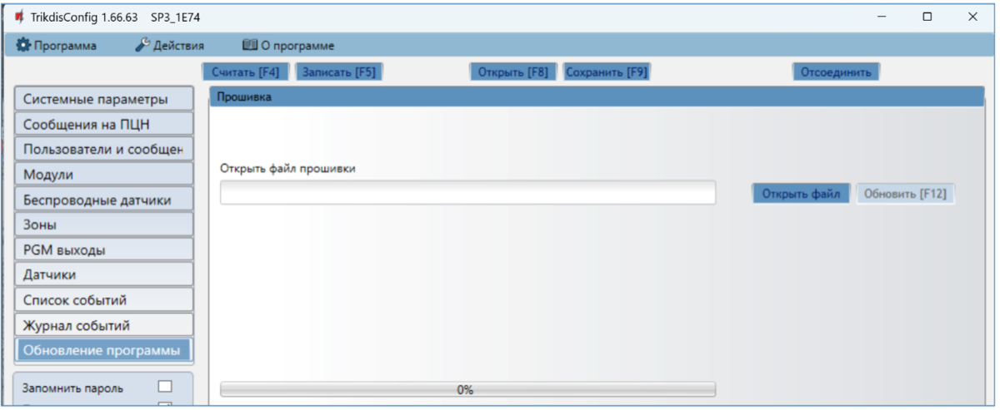

6.  Нажмите кнопку **„Открыть файл“** и выберите для установки файл прошивки **SP3_xxx4\_0122.fw**.

7.  Нажмите кнопку **Обновить [F12]**.

8.  Подождите, пока произойдет обновление прошивки.

9.  Отсоедините кабель USB.

10. Подождите 1 минуту.

11. Подключите USB Mini-B кабель к охранной панели.

12. В строке состояния TrikdisConfig название панели должно иметь цифру 4.

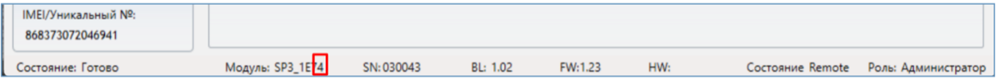

13. В списке модулей должен появиться **„RF-S8 трансивер“**, так же будет указан серийный номер и версия микропрограммы. Если вы видите версию прошивки трансивера RF-S8, вы можете пропустить шаги 14-22.

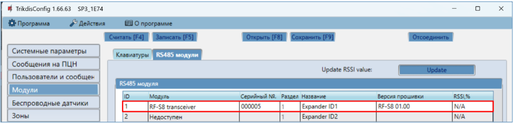

14. Если в списке не указан „**RF-S8 трансивер**“, то необходимо в списке выбрать **„RF-S8 трансивер“**.

15. В поле „**Серийный №**“ укажите серийный номер модуля RF-S8. Серийный номер можно найти на изделии и на этикетке упаковки.

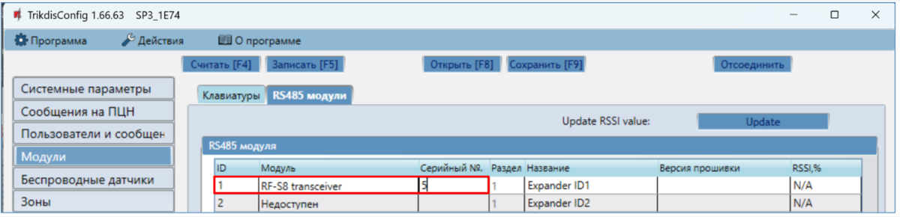

16. Нажмите кнопку **Записать [F5]**.

17. Отсоедините кабель USB Mini-B.

18. Подождите 1 минуту, чтобы „FLEXi“ SP3 идентифицировала модуль RF-S8.

19. Подсоедините кабель USB Mini-B к „FLEXi“ SP3.

20. Нажмите кнопку **Считать [F4]**.

21. В окне **„Модули“** в поле **„Версия прошивки“** будет указана версия программного обеспечения модуля RF-S8.

22. „FLEXi“ SP3 зарегистрировала модуль RF-S8.

23. Отсоедините кабель USB Mini-B.

24. Нажмите кнопку **„Отсоединить“**.

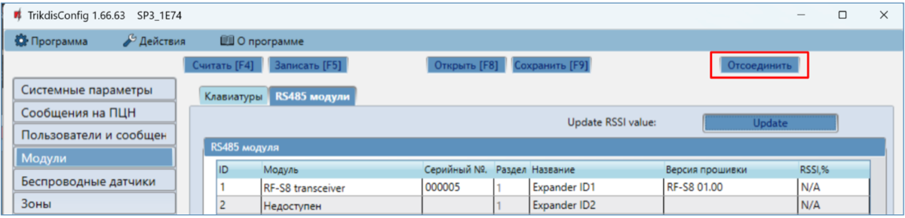

25. Подождите 1 минуту.

## Регистрация беспроводных датчиков 

### Удаленная регистрация беспроводных датчиков 

Выполним удаленное подключение с TrikdisConfig к охранной панели „FLEXi“ SP3.

!!! note
    Удаленная настройка охранной панели „FLEXi" SP3 будет работать,
    если:
    
    1.  Установлена активированная SIM карта и введен или отключен PIN код.
    
    2.  На SIM-карте включен мобильный интернет.
    
    3.  Включен Protegus cервис.
    
    4.  Включено напряжение питания (индикатор „**PWR**" мигает зеленым).
    
    5.  Зарегистрирован в сети (индикатор „**NET**" светит зеленым и мигает
        желтым).
!!! note
    **Беспроводные датчики можно зарегистрировать к охранной панели, так
    можно и удалить их регистрацию от охранной панели. <u>При отвязке
    беспроводных датчиков от охранной панели, охранная панель не должна
    находиться в режиме регистрации беспроводных датчиков</u>.
    Перед регистрацией беспроводных датчиков их необходимо отвязать от
    охранной панели. Нажмите и удерживайте кнопку обучения в течение 5
    секунд. Когда индикатор три раза мигнет зелёным, отпустите кнопку.
    Беспроводный датчик отвязан от охранной панели. Эту процедуру
    рекомендуется провести для всех беспроводный датчиков перед их
    регистрацией. ВАЖНО: ЕСЛИ БЕСПРОВОДНОЙ ДАТЧИК СЛУЧАЙНО ОТВЯЗАН, ОН НЕ
    БУДЕТ РАБОТАТЬ С ОХРАННОЙ ПАНЕЛЬЮ.**
В поле **„Уникальный №"** введите IMEI номер охранной панели „FLEXi“ SP3, который указан на упаковке или на изделии.

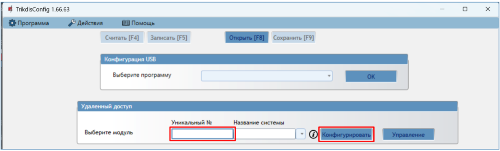

Нажмите кнопку **„Конфигурировать“**.

Откроется программное окно „FLEXi“ SP3. Нажмите кнопку **Считать [F4],** чтобы были считаны настройки охранной панели***.*** Если всплывет окно запроса ввода **„Кода администратора“** или **„Установщика“**, введите 6-значный код администратора или установщика.

Перейдите к окну **„Беспроводные датчики“**.

Нажмите кнопку **„Привязка датчиков“**.

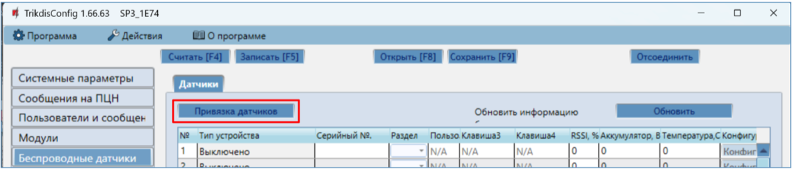

Регистрация беспроводных датчиков может производиться для всех сразу. Вставьте батарейки в беспроводные датчики (PIR, магнитный контакт, датчик протечки воды, пожарный дымовой извещатель, сирену).

При регистрации устройств модуль *RF-S8* должен находиться на расстоянии не менее 1 м от датчиков.

1.  На модуле RF-S8 начнет мигать индикатор **„NETWORK“** зеленым/красным.

2.  RF-S8 находится в режиме регистрации беспроводных устройств. TrikdisConfig откроет окно привязки датчиков.

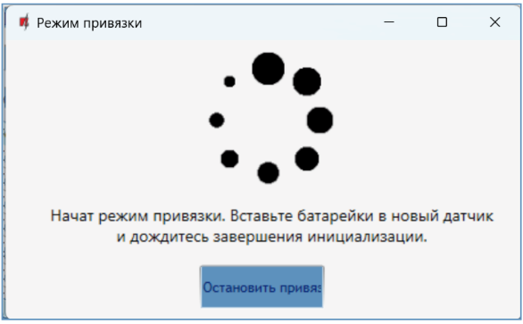

3.  Нажмите и удерживайте кнопку обучения в течение 5 секунд. Когда индикатор четыре раза мигнет зелёным, отпустите кнопку.

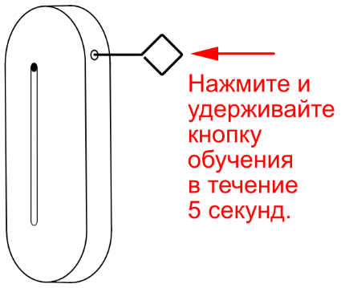

4.  На модуле RF-S8 индикатор **„NETWORK“** на короткое время загорится зеленым (это означает, что датчик зарегистрирован). Через несколько секунд индикатор **„NETWORK“** снова начнет мигать зеленым/красным.

5.  TrikdisConfig откроет новое окно, в котором необходимо беспроводному датчику назначить „**Номер зоны“** и „**Определение зоны“**.

6.  Нажмите кнопку **„Сохранить“**.

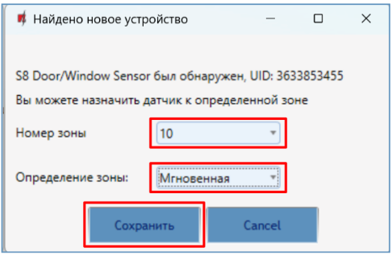

7.  Беспроводный датчик включен в список беспроводных устройств.

8.  Если необходимо привязать следующий датчик, то нажмите в датчике кнопку обучения. И выполните настройки, которые описаны выше.

9.  Нажмите **„Остановить привязку“**, чтобы завершить регистрацию беспроводных устройств.

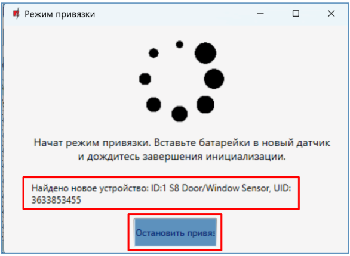

10. В открывшемся окне нажмите ***„*Да*“. Зарегистрированные беспроводные датчики будут сохранены в памяти охранной панели „FLEXi“ SP3***. Нажмите "**Нет**", если вы хотите дополнительно настроить параметры.

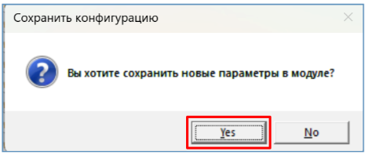

Подождите несколько минут. Нажмите кнопку **Считать [F4]**.

TrikdisConfig окно **„Беспроводные датчики“** будет содержать список зарегистрированных беспроводных устройств. В поле **„Серийный №“** будут записаны серийные номера датчиков.

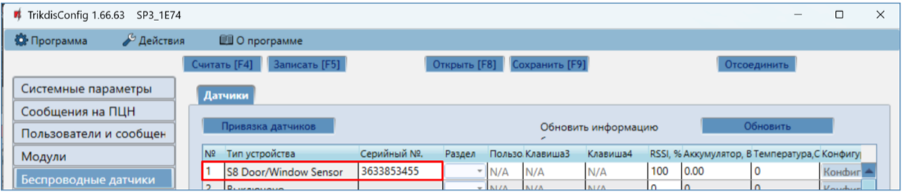

Проверьте правильность назначения датчиков **„Зонам“** и **„Разделам“** охранной cигнализации (окно **„Зоны“**).

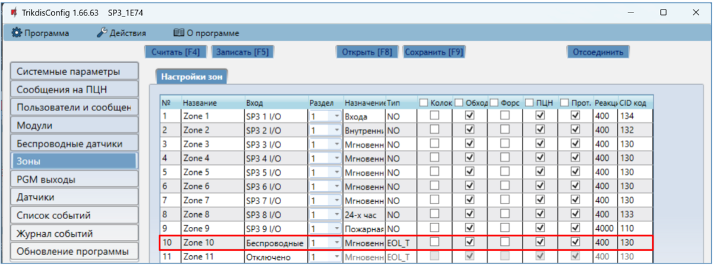

Если задать „**Тип“** зоны EOL-T, то будет включен режим контроля саботажа датчика.

После внесения изменений, нажмите **Записать [F5]**.

!!! note
    Удаление беспроводных датчиков из памяти „FLEXi" SP3:
    
    1.  Подсоедините кабель USB Mini-B к „FLEXi" SP3.
    
    2.  Запустите программу TrikdisConfig и нажмите кнопку
        **Считать [F4]**.
    
    3.  В окне „**Беспроводные датчики"** в поле „**Тип устройства"**, где
        записаны зарегистрированные датчики**,** укажите „**Выключено"**.
        Нажмите кнопку **Записать [F5].** Беспроводный датчик удален из
        памяти „FLEXi" SP3.
### Регистрация беспроводных датчиков без удаленного доступа 

Регистрация беспроводных датчиков может производиться для всех сразу. Вставьте батарейки в беспроводные датчики (PIR, магнитный контакт, датчик протечки воды, пожарный дымовой извещатель, сирену). При регистрации устройств модуль *RF-S8* должен находиться на расстоянии не менее 1 м от датчиков.

1.  Убедитесь, что трансивер RF-S8 зарегистрирован охранной панелью „FLEXi“ SP3.

2.  Включите питание охранной панели „FLEXi“ SP3.

3.  Снимите крышку с трансивера RF-S8.

4.  Нажмите и удерживайте нажатой кнопку „**LEARN“** на модуле RF-S8 пока начнет мигать индикатор **„NETWORK“** зеленым/красным.

5.  Отпустите кнопку „**LEARN“**.

6.  Мигающий индикатор **„NETWORK“** указывает, что RF-S8 находится в режиме регистрации беспроводных устройств.
7.  Нажмите и удерживайте кнопку обучения в течение 5 секунд. Когда индикатор четыре раза мигнет зелёным, отпустите кнопку.

8.  На модуле RF-S8 индикатор **„NETWORK“** на короткое время загорится зеленым (это означает, что датчик зарегистрирован).

9.  Через несколько секунд индикатор **„NETWORK“** снова начнет мигать зеленым/красным.

10. Если необходимо привязать следующий датчик, то нажмите в датчике кнопку обучения.

11. Чтобы завершить регистрацию беспроводных датчиков, необходимо нажать и подержать кнопку **„LEARN“** пока индикатор “**NETWORK**” перестанет мигать зеленым/красным. Отпустите кнопку **„LEARN“**. Трансивер RF-S8 вышел из режима регистрации.

12. Подсоедините кабель USB Mini-B к „FLEXi“ SP3.

13. Запустите программу TrikdisConfig. Нажмите кнопку **Считать [F4]**.

14. TrikdisConfig окно **„Беспроводные датчики“** будет содержать список зарегистрированных беспроводных устройств. В поле **„Серийный №“** будут записаны серийные номера датчиков.

15. Проверьте правильность назначения датчиков **„Зонам“** и **„Разделам“** охранной cигнализации (окно **„Зоны“**).

16. После внесения изменений, нажмите **Записать [F5]**.

17. Беспроводные датчики зарегистрированы.
