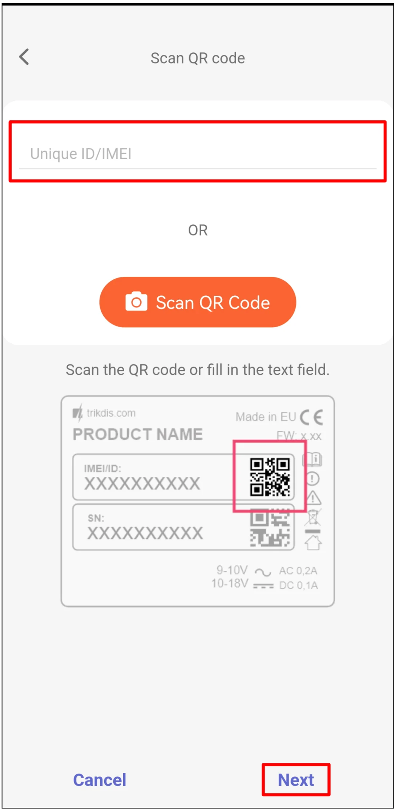
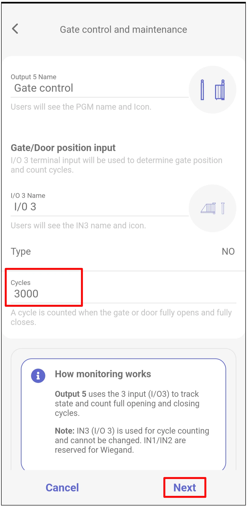
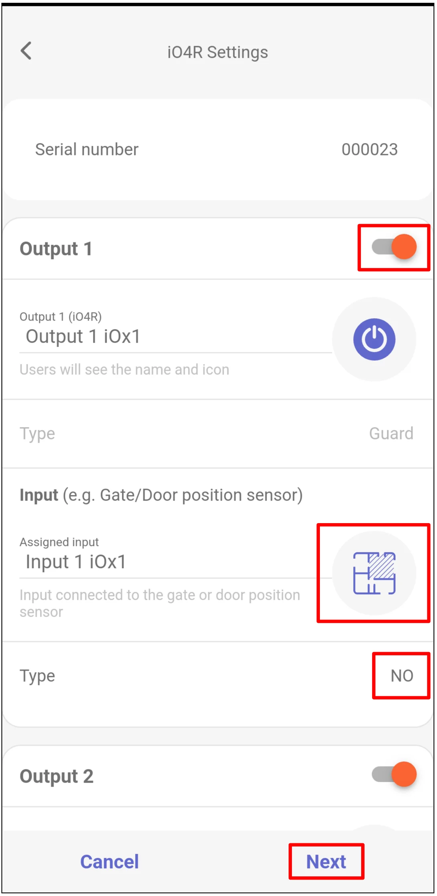
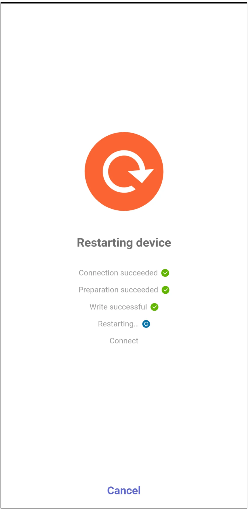
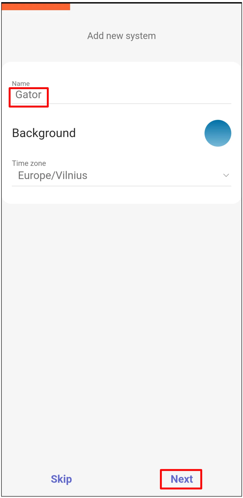
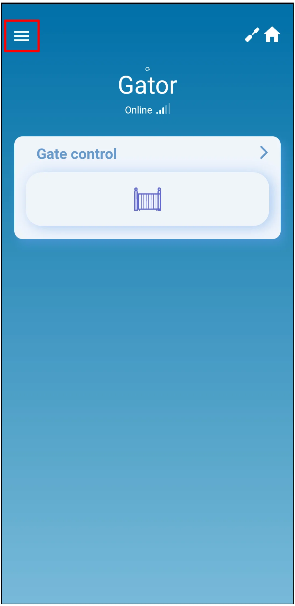
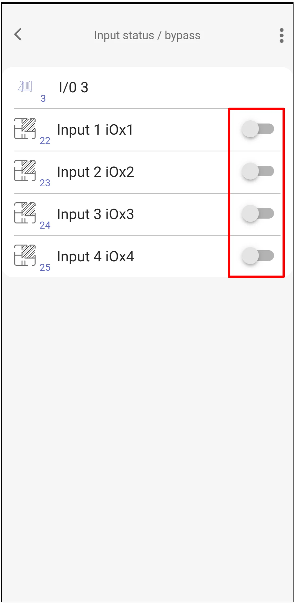
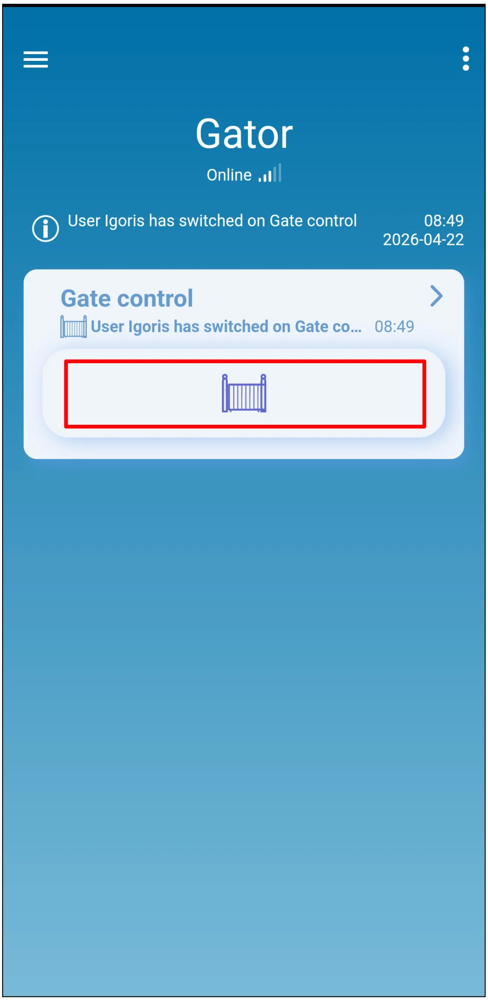

# Быстрая настройка GATOR LTE и GATOR WiFi с iO4R

  

Краткие шаги подключения и программирования в Protegus2 для подключения расширителя iO4R к контроллеру ворот GATOR LTE или GATOR WiFi. Для остальных параметров установки и настройки используйте полные руководства [GATOR](../gator/index.md) и [GATOR WiFi](../gator-wifi/index.md).

iO4R используется для расширенного мониторинга ворот. Он добавляет контролируемые входы Guard для датчиков безопасности ворот и позволяет уполномоченному специалисту временно выполнить обход, когда неисправность датчика нужно изолировать до проведения обслуживания. Protegus2 также считает полные циклы открытия и закрытия ворот и уведомляет, когда требуется обслуживание. Это помогает заменить внеплановые выезды плановыми сервисными визитами и регулярными договорами обслуживания.

!!! caution "Осторожно"
    Установку и обслуживание должен выполнять только квалифицированный персонал. Перед подключением проводов отключите сетевое и низковольтное питание. Соблюдайте инструкции по безопасности производителя автоматики ворот и местные электротехнические нормы.

## Предварительные условия

- Контроллер ворот GATOR LTE или GATOR WiFi готов к настройке. При подключении проводов питание должно быть отключено.
- Серийный номер расширителя iO4R.
- Учетная запись компании или установщика Protegus2 и IMEI / Unique ID контроллера.
- Датчик состояния ворот подключен к входу положения ворот контроллера.
- Датчики безопасности ворот подключены через расширитель iO4R, если их нужно контролировать или временно обходить в Protegus2.

## Подключение проводов

Подключите расширитель iO4R к шине RS485 контроллера и к клеммам питания, как показано ниже.

!!! note "Примечание"
    На схеме показаны обозначения клемм GATOR LTE. Для GATOR WiFi используйте соответствующие клеммы `+DC`, `-DC`, `A RS485` и `B RS485` из руководства GATOR WiFi.

Используйте `3 I/O` как вход положения ворот для подсчета циклов. Цикл засчитывается только после полного открытия и полного закрытия ворот.

!!! important "Важно"
    В настройке мониторинга Protegus2 `I/O 3` зарезервирован для положения ворот и подсчета циклов. Не переназначайте его. Входы `IN1` и `IN2` зарезервированы для Wiegand.

## Добавление контроллера и iO4R в Protegus2

Войдите в Protegus2 с учетной записью компании или установщика, затем добавьте контроллер.

  

    <strong>Шаг 1.</strong> Нажмите <strong>Add new system</strong>.
    
  

  

    <strong>Шаг 2.</strong> Введите <strong>IMEI</strong> контроллера, затем нажмите <strong>Next</strong>.
    
  

  

    <strong>Шаг 3.</strong> Выберите <strong>Advanced Gator Monitoring</strong>, затем нажмите <strong>Next</strong>.
    
  

  

    <strong>Шаг 4.</strong> Установите количество <strong>Cycles</strong>, после которого требуется обслуживание, затем нажмите <strong>Next</strong>.
    
  

  

    <strong>Шаг 5.</strong> Включите каждый выход iO4R, который подключен к контролируемому датчику безопасности или цепи состояния.
    
  

  

    <strong>Шаг 6.</strong> Введите <strong>Serial number</strong> iO4R, затем нажмите <strong>OK</strong>.
    
  

  

    <strong>Шаг 7.</strong> Для каждого включенного выхода задайте название и иконку, оставьте <strong>Type</strong> выхода как <strong>Guard</strong>, назначьте соответствующий вход iO4R и установите <strong>Type</strong> входа согласно подключению. В показанном примере тип входа: <strong>NO</strong>. Нажмите <strong>Next</strong>.
    
  

  

    <strong>Шаг 8.</strong> Подождите, пока Protegus2 записывает данные.
    
  

  

    <strong>Шаг 9.</strong> Нажмите <strong>Next</strong>.
    
  

  

    <strong>Шаг 10.</strong> Введите <strong>Name</strong> системы, затем нажмите <strong>Next</strong>.
    
  

  

    <strong>Шаг 11.</strong> Нажмите <strong>Skip</strong>, если не хотите добавлять пользователей сейчас.
    
  

  

    <strong>Шаг 12.</strong> Подождите около 1 минуты до завершения.
    
  

## Передача системы пользователю

После завершения настройки передайте систему в учетную запись Protegus2 пользователя.

  

    <strong>Шаг 13.</strong> Нажмите <strong>Menu</strong>.
    
  

  

    <strong>Шаг 14.</strong> Нажмите <strong>Settings</strong>.
    
  

  

    <strong>Шаг 15.</strong> Нажмите <strong>Transfer system</strong>.
    
  

  

    <strong>Шаг 16.</strong> Введите адрес электронной почты пользователя, затем нажмите <strong>Transfer</strong>.
    
  

## Проверка мониторинга и управления воротами

После передачи пользователь должен войти в Protegus2 со своей учетной записью.

!!! warning "Предупреждение"
    Обход датчика безопасности ворот может отключить защитную функцию. Используйте обход только как временное и уполномоченное сервисное действие, а перед вводом установки в эксплуатацию восстановите нормальную работу датчика.

  

    <strong>Шаг 17.</strong> Нажмите <strong>Gate control</strong>, чтобы увидеть счетчик циклов ворот.
    
  

  

    <strong>Шаг 18.</strong> Проверьте <strong>Total cycles</strong> и <strong>Cycles to maintenance</strong>. Если уполномоченному установщику нужно проверить состояние датчиков безопасности, нажмите <strong>Input status</strong>.
    
  

  

    <strong>Шаг 19.</strong> Используйте <strong>Input status / bypass</strong> только когда датчик безопасности проверен и временный обход действительно необходим.
    
  

  

    <strong>Шаг 20.</strong> Нажмите иконку управления воротами, чтобы открыть ворота.
    
  

## Проверка системы

1. Полностью откройте и закройте ворота, затем убедитесь, что счетчик циклов изменился ожидаемым образом.
2. Активируйте каждый контролируемый вход iO4R и убедитесь, что состояние входа изменяется в Protegus2.
3. Проверьте иконку управления воротами и убедитесь, что автоматика ворот реагирует правильно.
