# Kонтроллер GATOR WiFi предназначен для удаленного управления автоматическими дверьми (или другим электрическим оборудованием)

  

##  Описание

Kонтроллер GATOR WiFi предназначен для удаленного управления автоматическими дверьми (или другим электрическим оборудованием).

Управлять контроллером можно при помощи приложения Protegus2.

В контроллер можно записать 1000 пользователей (необходимо указать *e-mail* пользователя). В контроллере GATOR WiFi можно задать расписание управления пользователю, установить счетчик (сколько раз пользователь может управлять системой). Контроллер может отправлять сообщения об активации и восстановлении входов и выходов на приемник ПЦН (пульт централизованного наблюдения) и в приложение Protegus2.

**Функциональность**

Удаленное управление

- Мобильным / Web приложением *Protegus2*.

Сообщение пользователям

- Отправляет сообщения о событиях в приложение *Protegus2*.

Сообщения охранной фирме

- Контроллер отправляет сообщения Contact ID кодами на программные или аппаратурные приемники, которые работают с любой программой мониторинга.

- Одновременно отправляет сообщения на приемник фирмы охраны и в приложение *Protegus2*.

- При обрыве связи с основным приемником, сообщения автоматически передаются на запасной приемник.

Входы и выходы

- 4 универсальных входа/выхода. Режим работы устанавливается как вход (NO; NC; EOL) или выход.

- 1 выход (OUT) - реле.

- С помощью расширителя iO-LORA можно добавить один дополнительный вход и один выход (релейный контакт). Всего можно добавить 8 расширителей iO-LORA (до 8 дополнительных входов и 8 дополнительных выходов).

#### Настройка и установка

- Быстрая и простая настройка.

- Добавление и удаление пользователей с приложением Protegus2 (при входе в приложение на правах администратора), c программой TrikdisConfig.

- Настройка контроллера с программой TrikdisConfig удаленно или подсоединив контроллер к компьютеру кабелем USB Mini-B.

- Удаленное обновление программного обеспечения контроллера.

### Технические характеристики 

| Параметр | Описание |
|:---|----|
| Напряжение питания | 9-32 В постоянного тока |
| Потребляемый ток | 150 мA |
| Универсальный вход/​выход | 4, устанавливается как вход IN, тип которого: NC, NO, EOL=10 кΩ, или как выход (открытый коллектор, 50мА) |
| Выход | 1, релейный, 1 A 30 В постоянного тока, 0,5 A 125 В переменного тока |
| Связь с ПЦН | TCP/​IP или UDP/​IP по Wi-Fi |
| Протокол передачи данных | TRK_TCP или TRK_UDP |
| Ключ шифрования | 6-значный ключ шифрования |
| Частота Wi-Fi | 2,4 ГГц |
| Wi-Fi протокол | 802.11 b/​g/​n |
| Тип шифрования | WPA, WPA2, WPA mixed |
| Тип конфигурации сети | DHCP или ручная конфигурация сети (применяя мобильный телефон или ноутбук) |
| Память неотправленных сообщений | До 60 сообщений |
| Память сообщений | До 5000 сообщений |
| Пользователи, которые могут управлять контроллером | 1000 |
| Поддерживаемые модули | iO-LORA – модуль расширения (при использовании iO-LORA к GATOR WiFi должен быть подключен трансивер RF-LORA) |
| Условия эксплуатации | Температура от –20 °C до +50 °C, относительная влажность до 80 %, при +20 °C |
| Размеры | 88 x 62 x 26 мм |
| Вес | 80 г |

### Элементы контроллера 

1.  Световые индикаторы.

2.  Отверстие для снятия верхней крышки.

3.  USB Mini-B разъем для программирования контроллера.

4.  Клеммы для подсоединения проводов.

5.  Кнопка для входа в режим конфигурации Wi-Fi.

### Назначение внешних клемм 

| Клемма | Описание |
|----|:---|
| +DC | Клемма питания (положительная клемма, 9-32 В постоянного тока) |
| -DC | Клемма питания (отрицательная клемма, 9-32 В постоянного тока) |
| 1 I/​O | Универсальная клемма вход/​выход (заводская настройка – вход NO) |
| 2 I/​O | Универсальная клемма вход/​выход (заводская настройка – вход NO) |
| 3 I/​O | Универсальная клемма вход/​выход (заводская настройка – выход, открытый коллектор) |
| 4 I/​O | Универсальная клемма вход/​выход (заводская настройка – выход, открытый коллектор) |
| +AUX | Положительная клемма питания для подключения внешних устройств |
| NC | Контакт реле, NC |
| C | Контакт реле, C |
| NO | Контакт реле, NO |
| A RS485 | А контакт шины *RS485* |
| B RS485 | В контакт шины *RS485* |

### Световая индикация функционирования 

| Индикатор | Состояние | Описание |
|-----------|-----------|----------|
| NETWORK / (Сеть) | Светит зеленый | Подключен к Wi-Fi сети |
| NETWORK / (Сеть) | Мигает зеленый | Подключается к Wi-Fi сети |
| NETWORK / (Сеть) | Мигает желтый | Уровень Wi-Fi сигнала от 0 до 5 |
| NETWORK / (Сеть) | Быстро мигает зеленый желтый | Режим конфигурации Wi-Fi |
| DATA / (Данные) | Светит зеленый | Отправляется сообщение |
| DATA / (Данные) | Светит желтый | Есть неотправленные сообщения в памяти контроллера |
| STATUS / (Статус) | Мигает зеленый | Работает без проблем |
| STATUS / (Статус) | 1 вспышка красным | Не удается подключиться к Wi-Fi сети |
| STATUS / (Статус) | 2 вспышки красным | Низкий уровень сигнала сети Wi-Fi |
| STATUS / (Статус) | 3 вспышки красным | Не удается подключиться к приемнику по основному каналу |
| STATUS / (Статус) | 4 вспышки красным | Нет подключения к Protegus2 серверу |
| STATUS / (Статус) | 5 вспышек красным | Нет подключения к приемнику по обоим каналам |
| STATUS / (Статус) | 6 вспышек красным | Не установлены внутренние часы |
| STATUS / (Статус) | 7 вспышек красным | Недостаточный уровень питающего напряжения |

Если световые индикаторы не светятся проверьте напряжение питания и соединения.

!!! note "Примечание"
    Перед установкой убедитесь, что имеете все необходимые материалы:
    
    1.  Кабель USB Mini-B, который нужен для конфигурации.
    
    2.  4-жильный кабель для подключения контроллера.
    
    3.  Плоская отвертка 2,5 мм.
    
    Недостающие компоненты закажите отдельно у вашего местного
    дистрибьютера.
### Комплектация упаковки контроллера *GATOR WiFi* 

|  \- | Kонтроллер GATOR WiFi       | 1 шт. |
|----:|-----------------------------------|-------|
|  \- | Резистор 10 кΩ                    | 3 шт. |
|  \- | Двухсторонняя липкая лента (5 см) | 1 шт. |
|  \- | Шуруп                             | 2 шт. |

## Схемы соединений контроллера *GATOR WiFi* 

### Крепление 

1.  Снимите верхнюю крышку. Отсоедините клеммную колодку.

2.  Удалите плату.

3.  Прикрепите корпус шурупами.

4.  Обратно установите плату и клеммную колодку.

5.  Закройте верхнюю крышку.

### Подключение питания 

Подключите контроллер GATOR WiFi по ниже приведенной схеме.

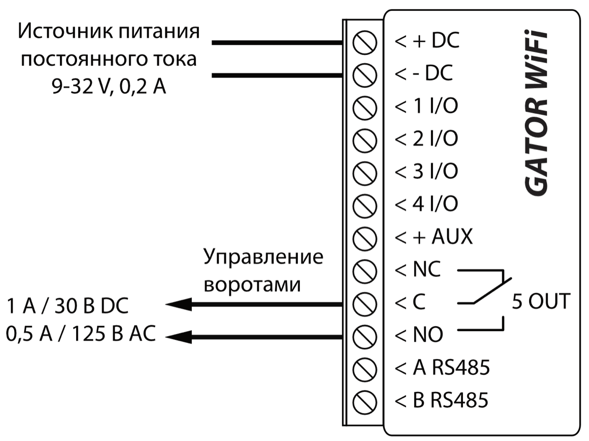

### Схема подключения RFID считывателя (Wiegand 26/34) 

Конфигурация контроллера с RFID считывателем описана в п.5.3 „Окно „IN/OUT““. С RFID считывателем можно управлять только выходом 5OUT.

Схема подключения RFID считывателя к контроллеру GATOR WiFi.

В программе TrikdisConfig необходимо отметить поле „**Режим считывателя Wiegand“**. При нажатии на кнопку „**Выход**“ выход 5OUT контроллера сработает на установленную продолжительность импульса.

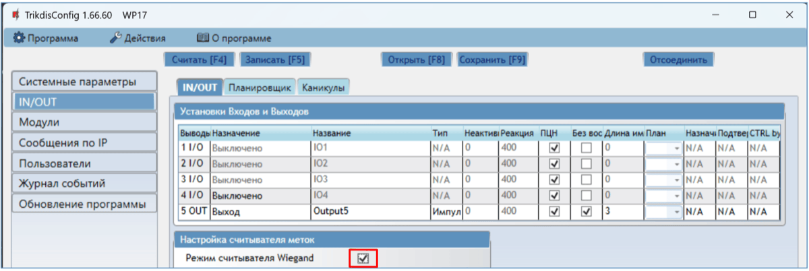

### Схема подключения расширителей iO-LORA 

Версия прошивки контроллера GATOR WiFi от 1.21.

Подключите трансивер RF-LORA к GATOR WiFi. После этого вы можете использовать расширитель iO-LORA с подключенным к нему считывателем RFID (Wiegand 26/34). RFID считыватель управляет PGM выходом расширителя iO- LORA, к которому он подключен. GATOR WiFi и восемь подключенных к нему модулей iO-LORA могут управлять девятью различными дверями.

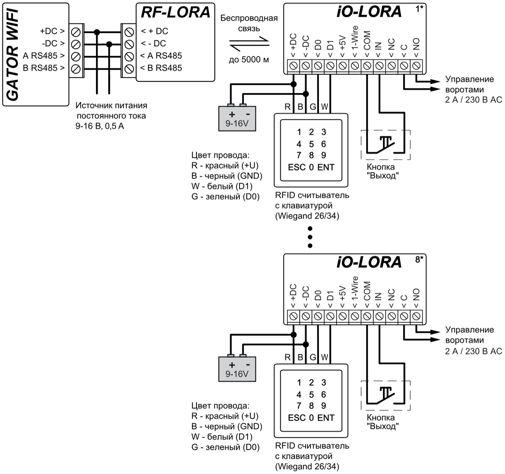

Запустите TrikdisConfig. Подключите GATOR WiFi через кабель USB Mini-B к компьютеру или удаленно. Нажмите кнопку **Cчитать [F4]** и в программе TrikdisConfig отобразятся текущие настройки контроллера. При появлении запроса введите код администратора или установщика во всплывающем окне. Выберите „**iO-LORA controller**“ из списка „**Модули**“. В поле „**Серийный №**“ введите серийный номер изделия.

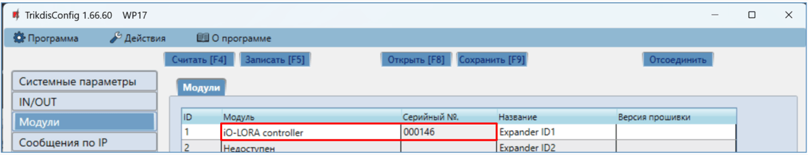

В списке "**IN/OUT**" входу „**6IN**“ необходимо указать „**EXIT button**“ (кнопка „Выход“). При нажатии кнопки „**Выход**“ выход iO-LORA „**7OUT**“ активируется на установленную длительность импульса.

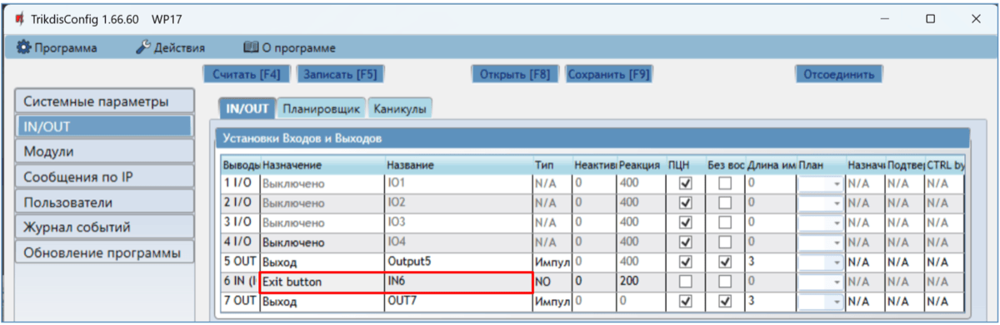

В списке „**Пользователи**“ укажите номер RFID карты, имя пользователя, включите разрешение управлять PGM выходом, укажите PGM выход (которым будет управлять пользователь), код. Выполнив настройки, нажмите **Записать [F5]**. Дождитесь окончания процесса обновления настроек контроллера. Нажмите „**Отсоединить**“ и отключите кабель USB.

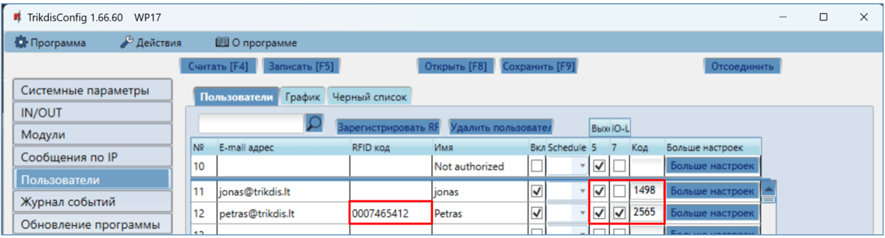

Активируйте выход PGM RFID карточкой/кодом. Нажмите кнопку „**Выход**“ (должен сработать PGM выход на установленную длительность импульса).

### Схема подключения входов контроллера 

Контроллер GATOR WiFi имеет четыре универсальных **I/O** клеммы (которые могут установлены как вход или выход), к которым можно подсоединить детекторы сигнализации. Тип входа можно установить: NC, NO, EOL. Ниже приведены схемы подключения входов (NC, NO, EOL):

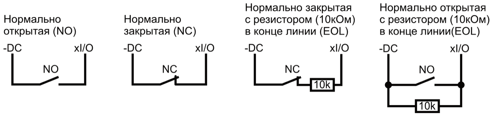

### Схема подключения реле 

С помощью контактов реле можно удаленно включить/выключить подключенное электрическое оборудование. Универсальной клемме I/O (вход/выход) должен быть установлен режим работы OUT (выход).

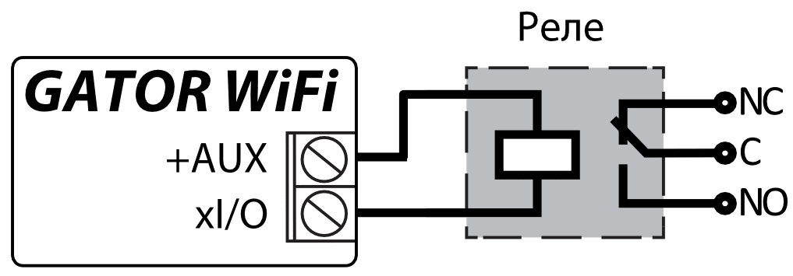

### Схема подключения LED 

Универсальной клемме I/O (вход/выход) должен быть установлен режим работы OUT (выход).

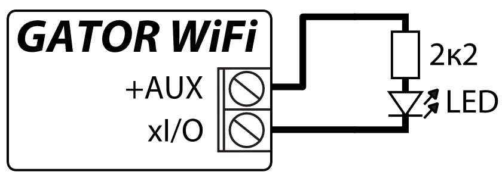

## Управление с приложением *Protegus2* 

С приложением Protegus2 пользователи смогут управлять контроллером дистанционно, а также пользователи получат информацию о состоянии системы и все уведомления о событиях.

1.  Загрузите и запустите приложение Protegus2 или используйте Web версию Protegus2 [www.protegus.app](https://www.protegus.app)<u>.</u>

    

      
      
      
    

2.  Войдите под своим именем пользователя и паролем или зарегистрируйтесь и создайте новую учетную запись.

!!! note "Примечание"
    В момент регистрации контроллера к приложению Protegus2 должен
    быть:
    
    1.  Включено питание (мигает зеленый „**STATUS**" индикатор);
    
    2.  Контроллер должен быть подключен к сети („**NETWORK**" - светит
        зеленый и мигает желтый).
Нажмите “**Add new system**”.

Введите „Unique ID/IMEI“ номер контроллера, который указан на этикетке контроллера или упаковке. Нажмите „**Next**“.

Нажмите „**Start WiFi configuration WP17**“.

С помощью плоской отвертки cнимите крышку GATOR WiFi. Нажмите и удерживайте кнопку „**PAIR**“ в течение 3 секунд. Индикатор „**NETWORK**” начнет быстро мигать зеленым и желтым. Отпустите кнопку. Контроллер GATOR WiFi перешел в режим регистрации в сети Wi-Fi.

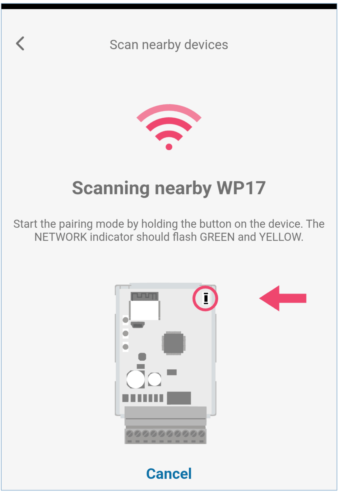

Подождите, пока контроллер GATOR WiFi (WP17) будет найден. Нажмите „**ОК**“.

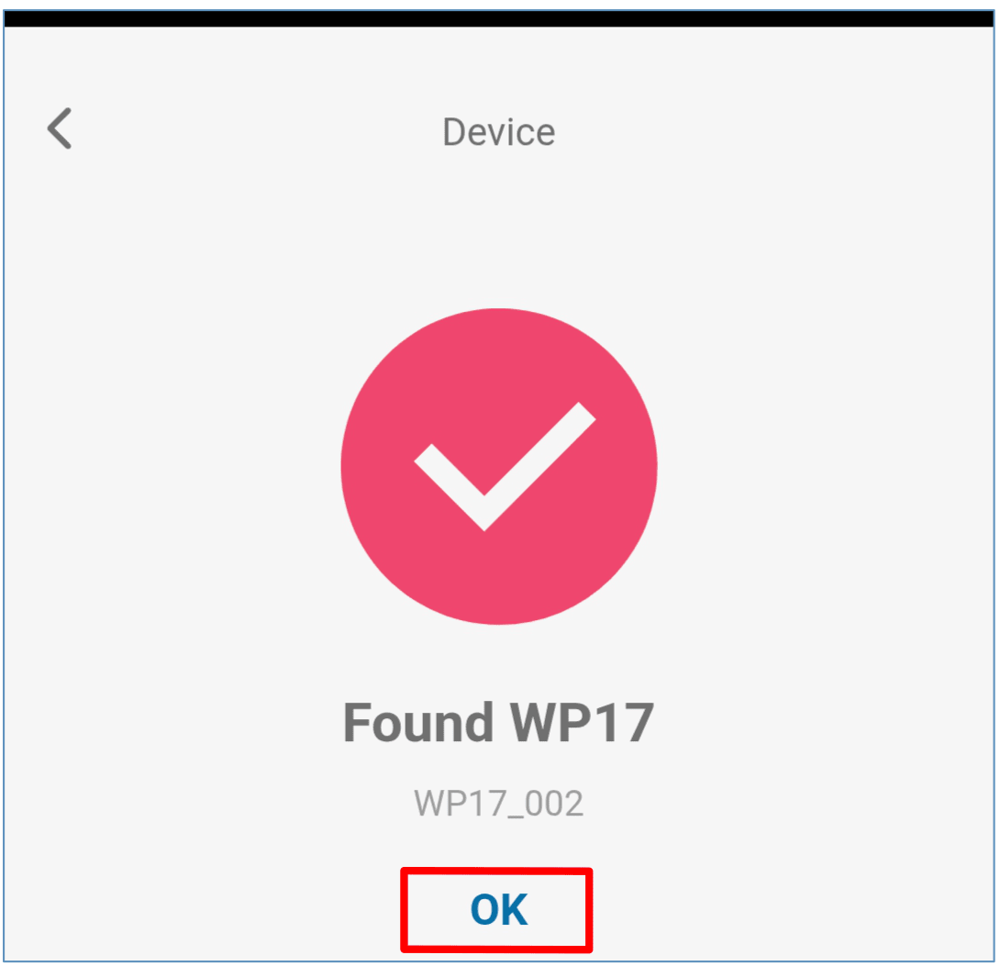

Выберите сеть WiFi, к которой будет подключен контроллер GATOR WiFi.

Введите пароль сети WiFi. Нажмите „**ОК**“.

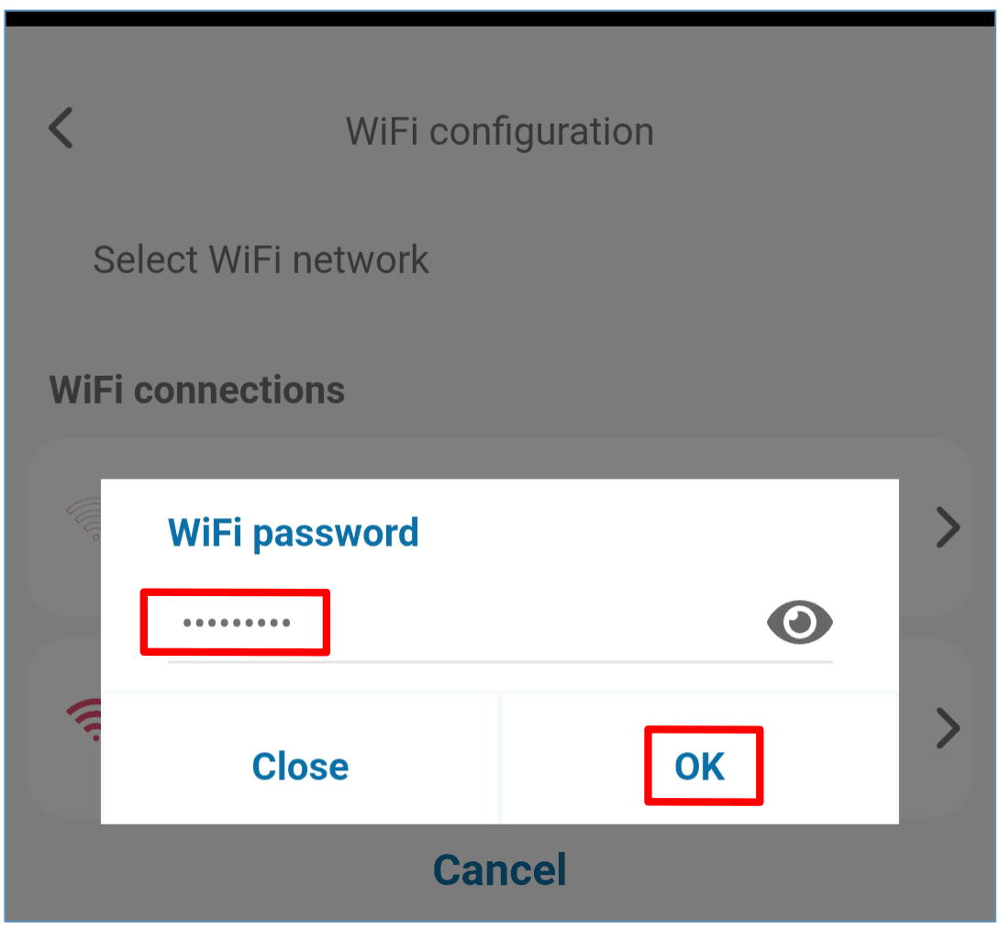

Нажмите „**Подключиться**“.

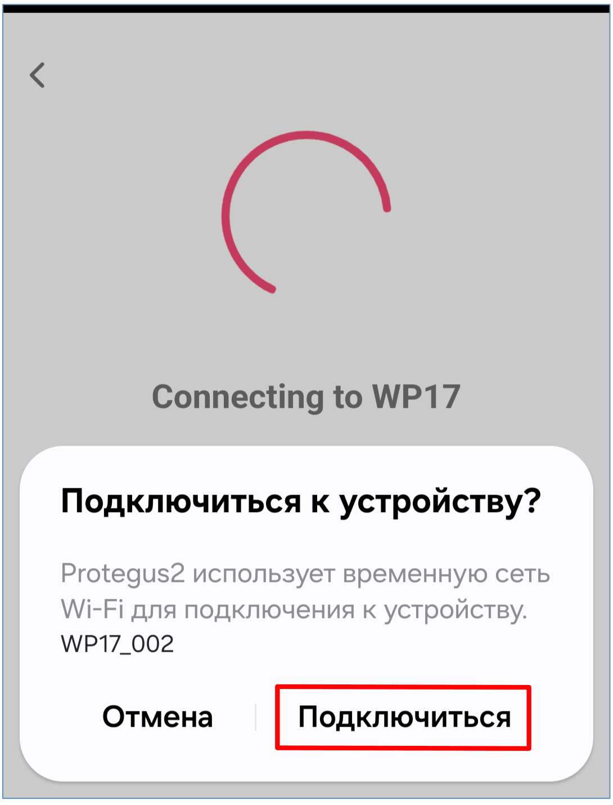

Дождитесь подключения контроллера.

Введите наименование системы. Нажмите „**Next**“.

Нажмите „**Skip**“.

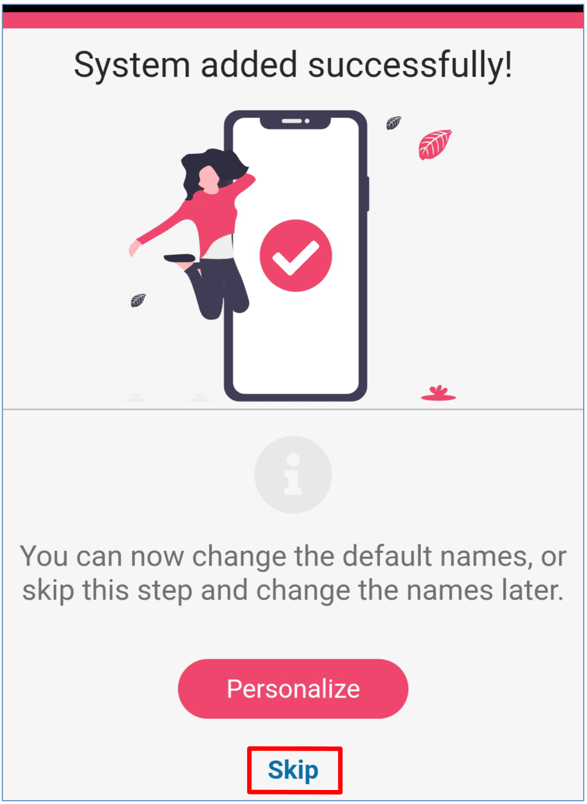

Подождите 1 минуту. Контроллер GATOR WiFi через несколько минут выйдет из режима сопряжения самостоятельно (или нажмите и удерживайте кнопку „**PAIR**“ в течение 3 секунд, пока индикатор „**NETWORK**“ перестанет быстро мигать зеленым и желтым).

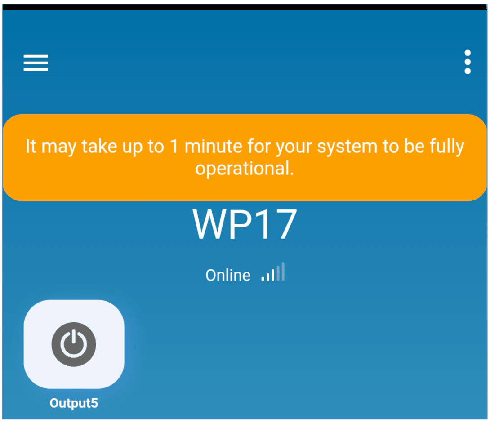

Активируйте PGM выход, нажав на икону „**Output5**“.

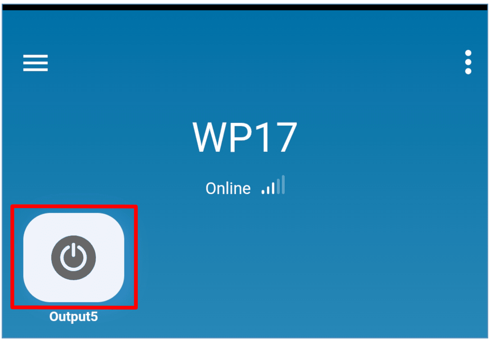

## Установка Виджета в телефоне 

Виджет управления воротами можно загрузить на экран телефона. Телефон должен иметь операционную систему Android. Контроллер должен быть зарегистрирован в приложении Protegus2. Войдите в приложение Protegus2 на своем телефоне. Закройте окно приложения.

Приложите палец к экрану и удерживайте его. Появится панель параметров.

1.  Нажмите „**Widgets**“.

В панели параметров найдите Protegus2.

2. Нажмите на „Protegus2“.

3. Нажмите на „**Switch Protegus2**“.

4. Выберите „**WP17 Output5**“ выход контроллера**.**

2.  Нажмите на „**ADD WIDGET**“.

3. На экране телефона появится икона.

4. Перейдите к нормальному экрану. Нажмите на икону.

На экране появится окружность, в которой будет отображена активация PGM выхода.

5. Контроллер подсоединен к автоматике ворот по схеме с индикацией состояния ворот. Икона показывает состояние открытых/закрытых ворот.

## Настройка рабочих параметров с TrikdisConfig 

С TrikdisConfig вы можете изменить настройки контроллера GATOR WiFi.

1.  Загрузите программу TrikdisConfig с сайта [www.trikdis.com/ru/](http://www.trikdis.com/ru/) (программу найдете в окне поиска написав - TrikdisConfig) и установите ее.

2.  Плоской отверткой снимите крышку контроллера, как показано ниже на рисунке:

1.  Кабелем USB Mini-B подключите контроллер GATOR WiFi к компьютеру.

2.  Запустите программу TrikdisConfig. Программа автоматически распознает подключенный контроллер и откроет окно его конфигурации.

3.  Нажмите на кнопку **Считать [F4]**, чтобы отобразить текущие рабочие параметры контроллера GATOR WiFi. При необходимости введите код администратора или установщика во всплывающем окне.

!!! note "Примечание"
    Нажмите кнопку **Считать [F4]**, программа считает и отобразит
    настройки, сохраненные на устройстве. / Нажав кнопку
    **Записать [F5]**, программа сохранит сделанные настройки в
    контроллер. / Нажав кнопку **Сохранить [F9]**, сделанные настройки
    будут сохранены в файле конфигурации. Затем вы можете загрузить
    сохраненные настройки на другие устройства. Это позволяет быстро
    настроить несколько контроллеров с одинаковыми настройками. / Если
    нажать кнопку **Открыть [F8]** и выбрать файл конфигурации в
    программе, откроются и отобразятся сохраненные настройки. / Чтобы
    восстановить заводские настройки, нажмите кнопку „**Восстановить"** в
    левом нижнем углу окна программы.
### Строка состояния программы TrikdisConfig 

После подключения контроллера GATOR WiFi к программе TrikdisConfig, в строке состояния программы появится информация о подключенном контроллере:

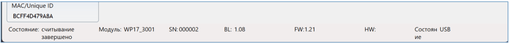

| Наименование  | Описание                                             |
|---------------|------------------------------------------------------|
| MAC/​Unique ID | MAC номер устройства                                 |
| Состояние     | Рабочее состояние                                    |
| Модуль        | Тип изделия (должно быть указано – WP17_xxxx)  |
| SN            | Серийный номер изделия                               |
| BL            | Версия менеджера загрузки                            |
| FW            | Версия программного обеспечения изделия              |
| HW            | Аппаратурная версия изделия                          |
| Состояние     | Тип подключения к программе (через USB или удаленно) |

Нажмите кнопку **Считать [F4]**. Программа считает и отобразит настройки контроллера GATOR WiFi. С программой TrikdisConfig сделайте необходимые настройки контроллера.

### Окно „Системные параметры“ 

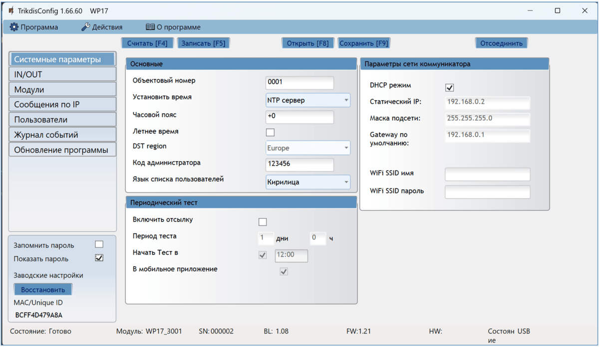

**Группа „Основные“**

- **Объектовый номер** – введите номер объекта (4-значный шестнадцатеричный номер, 0-9, A-F. **Не использовать** **FFFE, FFFF объектовые номера**).

- **Установить время** – выберите источник, по которому будет установлено время.

- **Часовой пояс** – указывается, когда выбран NTP-сервер синхронизации времени.

- **Летнее время** – отметив поле, включаете автоматический перевод времени в весенние/осенние месяцы.

- **DST region** – выберите регион, к которому принадлежит ваша страна.

- **Код администратора** – позволяет пользователю менять все рабочие параметры контроллера.

- **Язык списка пользователей** – выберите язык (список пользователей может быть написан символами выбранного языка).

**Группа „Периодический тест“**

- **Включить отсылку** – отметив поле, включаете отправку периодических тестовых сообщений.

- **Период теста** – устанавливается период времени для отправки тестовых сообщений.

- **Начать тест в** – укажите время отправки тестового сообщения.

- **В мобильное приложение** – отметив поле, тестовые сообщения будут отправляться в приложение Protegus2.

**Группа „Параметры сети коммуникатора“**

- **DHCP режим** – режим регистрации контроллера GATOR WiFi в сети (ручной или автоматический). Отметьте поле галочкой (автоматический режим регистрации) и контроллер автоматически считает сетевые настройки (шлюз, маску подсети) и ему будет присвоен IP адрес.

- **Статический IP** – статический IP адрес (при ручной регистрации).

- **Маска подсети** – адрес маски подсети (при ручной регистрации).

- **Gateway по умолчанию** – адрес шлюза сети (при ручной регистрации).

- **Wifi SSID имя** – введите имя Wi-Fi сети, к которой подключится контроллер GATOR WiFi.
- **Wifi SSID пароль** – введите пароль Wi-Fi сети.

### Окно „IN/OUT“ 

**Закладка „IN/OUT“**

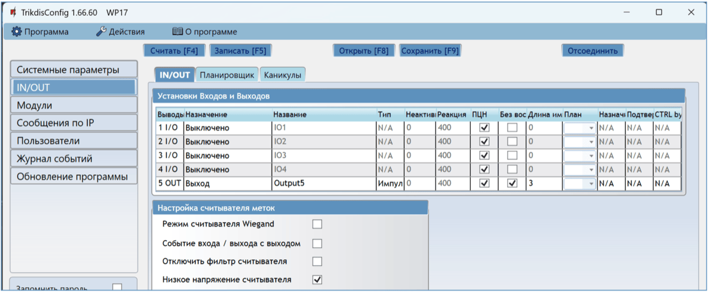

Окно настроек Входов/Выходов.

**Группа „Установки Входов и Выходов“**

- **Выводы** – указаны номера клемм входов и выходов.

- **Назначение** – указаны типы клемм (вход, выход, выключено).

- **Название** - введите название входа IN или выхода OUT.

- **Тип** – указать тип входа (NC, NO, EOL=10кΩ) или выхода (импульс, уровень).

- **Неактивный** – вход будет нечувствителен определенное время после первой его активации. Чтобы выключить эту функцию введите 0.

- **Реакция** - укажите время реакции входа (Input), мс.

- **ПЦН** – отметив поле, сообщения будут отправляться в ПЦН (пульт централизованного наблюдения) и в приложение Protegus2.

- **Без восстановления**. – отключить отправку сообщения о восстановлении состояния входа или выхода.
- **Длина импульса** – длительность времени импульса, когда выходу установлен тип „**Импульс“**.

- **План** – назначение номера временного графика, по которому будет управляться выход.

- **Назначенный вход** – укажите номер входа, чтобы по активации входа было бы видно реальное положение дверей.

- **Подтвердить** – укажите номер входа, при сработавшем входе будет разрешено управление выходом (OUT).

- **CTRL by IN** - выбранный вход активирует выход.

  **Группа „Настройка считывателя меток“**
- **Режим считывателя Wiegand** - отметьте поле галочкой, если к контроллеру GATOR WiFi будет подключен RFID считыватель (Wiegand 26/34).

- **Событие входа/выхода с выходом** – отметьте поле и сообщения о событиях входа / выхода будут отправляться, когда выход управляется удаленно.

- **Отключить фильтр считывателя** – отметьте поле и будет отключен внутренний фильтр устройства для считывателя, который отправляет короткие импульсы.

- **Низкое напряжение считывателя –** отметьте поле и будет включен режим считывателя низкого напряжения.

**Закладка „Планировщик“**

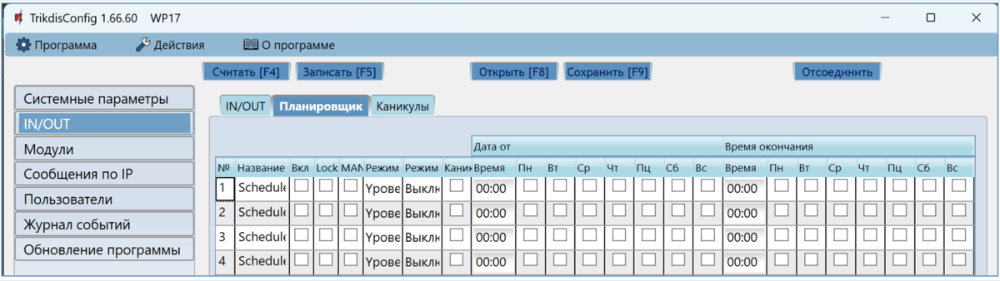

Выход OUT может быть активирован по заданному расписанию. Необходимо указать время и дни недели, включить расписание и выходу назначить расписание.

- **Название** – введите наименование временного графика.

- **Вкл.** – отметьте поле и включите временной график, когда выход будет управляться контроллером.

- **Lock -** отметьте поле, чтобы запретить управление выходом другими способами при его срабатывании по заданному графику.

- **MANUAL -** отметьте поле, что не позволит планировщику включать выход при запуске. График начнет работать только тогда, когда выход будет активирован пользователем.

- **Режим выхода** – укажите режим работы PGM выхода: **Импульс** – выход будет активирован в начале и конце расписания на установленную продолжительность импульса; **Уровень** – выход будет активирован на указанный период времени.

- **Режим каникул** – укажите режим, как должен работать временной график при наступлении каникул (Выключено / Игнорировать во время каникул / Дополнительно, когда каникулы / Только во время каникул).

- **Каникулы** – отметьте поле, чтобы использовать график каникул, когда наступают каникулы.

- **Дата от** - укажите время и дни недели, когда будет активирован выход контроллера.

- **Время окончания** - укажите время и дни недели, до которых будет активирован выход контроллера.

**Закладка „Каникулы“**

Введите календарные праздники, во время которых можно будет установить дополнительную активацию выхода (OUT), предусмотренную в таблице „**Планировщик**“.

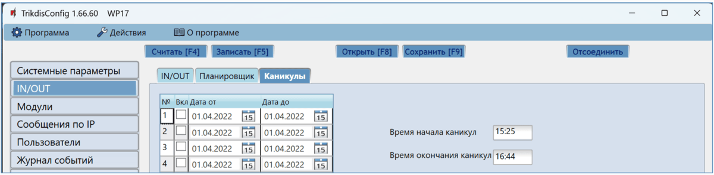

- **Вкл.** – отметьте поле, чтобы включить определенный интервал каникул.

- **Дата от –** укажите дату начала каникул.

- **Дата до** – укажите дату окончания каникул.

- **Время начала каникул** – укажите время начала каникул.

- **Время окончания каникул** – укажите время окончания каникул.

### Окно „Модули“ 

**Закладка „Модули“**

К контроллеру GATOR WiFi можно подключить модули iO-LORA.

Подключив трансивер RF-LORA, к контроллеру GATOR WiFi можно подключить до 8 беспроводных расширителей iO- LORA. Считыватели RFID, подключенные к беспроводным модулям расширения iO - LORA, могут контролировать до 8 дополнительных дверей (версия прошивки контроллера ворот GATOR WiFi должна быть 1.21 или выше). Один расширитель iO-LORA с одним считывателем RFID контролирует только одну дверь.

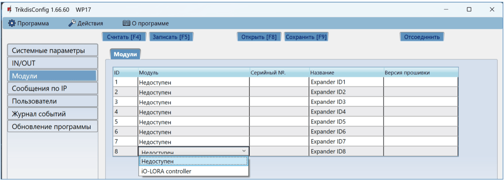

- **Модуль** – выберите модуль, который подключен к контроллеру.

- **Cерийный № -** укажите серийный номер подключенного модуля.

### Окно „Сообщения по IP“ 

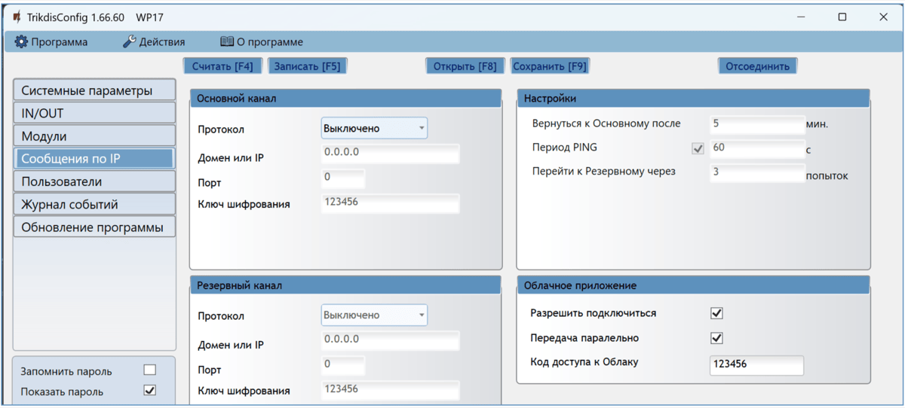

**Группа „Основной канал“**

Сообщения с контроллера GATOR WiFi могут быть отправлены в ПЦН. Для этого необходимо настроить каналы связи с приемником ПЦН.

- **Протокол** – выберите способ передачи сообщений (TCP/IP или UDP/IP) на ПЦН (пульт централизованного наблюдения).

- **Домен или IP** – введите домен или IP адрес приемника ПЦН.

- **Порт** – – введите номер порта приемника ПЦН в сети.

- **Ключ шифрования** - 6-значный ключ шифрования, который должен совпасть с ключом шифрования приемника ПЦН.

**Группа „Резервный канал“**

Настройки аналогичны „**Основному каналу“** связи.

**Группа „Настройки“**

- **Вернуться к Основному после** – интервал времени, после которого контроллер попытается восстановить связь с основным каналом связи.

- **Период PING** – активировать передачу PING сигнала и указать его периодичность.

- **Перейти к резервному через**– указать количество неудачный попыток подсоединиться к „**Основному каналу“** связи, после чего контроллер автоматически переключится на „**Резервный канал“** связи.

**Группа „Облачное приложение“**

- **Разрешить подключиться** – отметьте поле галочкой и контроллер GATOR WiFi сможет обмениваться данными с приложением Protegus2 и появится возможность удаленной конфигурации контроллера с программой TrikdisConfig.

- **Передача параллельно** – отметив поле галочкой, сообщения будут отправляться параллельно в ПЦН и пользователям в приложение Protegus2. В противном случае, сообщения в приложение Protegus2 будут отправлены только после передачи данных в ПЦН.

- **Код доступа к Облаку** - 6-значный код доступа к Protegus2 (заводской код - 123456).

### Окно „Пользователи“ 

**Закладка „Пользователи“**

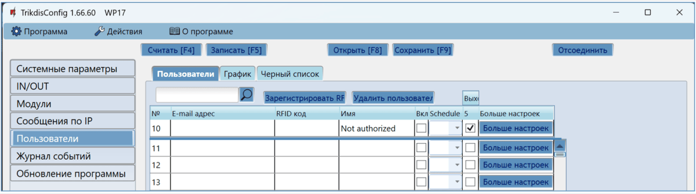

- **Е-mail адрес** – укажите адрес электронной почты пользователя.

- **RFID код** – укажите ID номер RFID карты (брелока), если к контроллеру подключен RFID считыватель и пользователь будет иметь RFID карту (брелок).

- **Имя** - введите имя пользователя.

- **Вкл** – отметьте поле, чтобы пользователь был активирован.

- **График** – выберите номер графика, по которому пользователю будет разрешено управлять контроллером.

- **Выходы** – отметьте поле, чтобы пользователь мог управлять выходом (OUT).

- **Код** - если к контроллеру подключен RFID считыватель с клавиатурой Wiegand 26/34, то пользователю может быть предоставлен четырехзначный код управления.

- **Больше настроек** – нажав на поле, откроется дополнительное окно настроек пользователя.

  **Настройки пользователя (номера от 11 до 1010)**
- Включено – отметьте поле, чтобы пользователю было разрешено управлять выходами (OUT).

- Имя – введите имя пользователя.

- Е-mail адрес – введите адрес электронной почты пользователя.

- RFID код – когда RFID-считыватель с клавиатурой (Wiegand 26/34) подключен к контроллеру, пользователю может быть присвоен ID номер RFID-карты (брелока).

- Код клавиатуры – когда RFID-считыватель с клавиатурой (Wiegand 26/34) подключен к контроллеру, пользователю может быть присвоен код пользователя.

- Назначить график – пользователю может быть назначен номер временного графика (номер временного графика и его настройка устанавливается во вкладке „График“), когда пользователь может управлять выходами OUT.

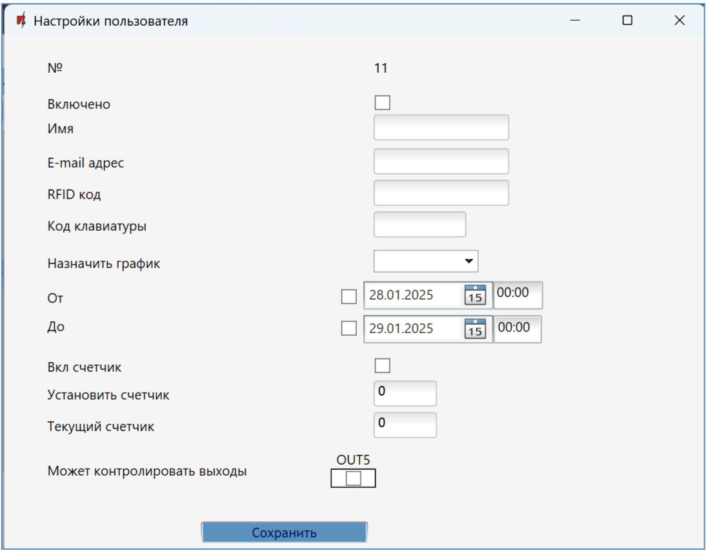

- **От** – укажите дату и время, с которого пользователь может управлять выходами контроллера.

- **До** – укажите дату и время, до которого пользователь может управлять выходами контроллера.

- **Вкл счетчик** – отметьте поле, чтобы включить счетчик.

- **Установить счетчик** – укажите сколько раз пользователь может управлять выходом контроллера, в течении установленного промежутка времени.

- **Текущий счетчик** – текущее число количеств управлений выходом контроллера.

- **Может контролировать выходы** - отметьте номер выхода, которым будет управлять пользователь.

- **Can control iO-LORA outputs** - отметьте номер выхода, которым будет управлять пользователь.

#### Регистрация RFID карточек (брелоков) 

Подключите RFID считыватель к контроллеру (см. п.2.3 „Схема подключения RFID считывателя (Wiegand 26/34)“). Включите питание контроллеру. Подсоедините USB Mini-B кабель к контроллеру. В программе TrikdisConfig в окне „IN/OUT**“** отметьте поле „**Режим считывателя Wiegand“.**

В окне „Пользователи“ нажмите на кнопку „**Зарегистрировать RFID“**.

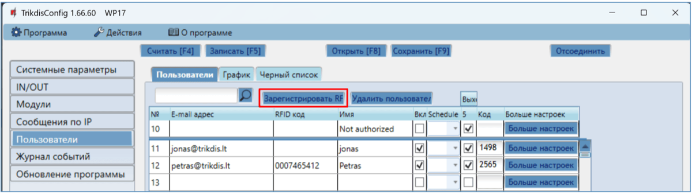

Откроется окно регистрации RFID карточек (брелоков).

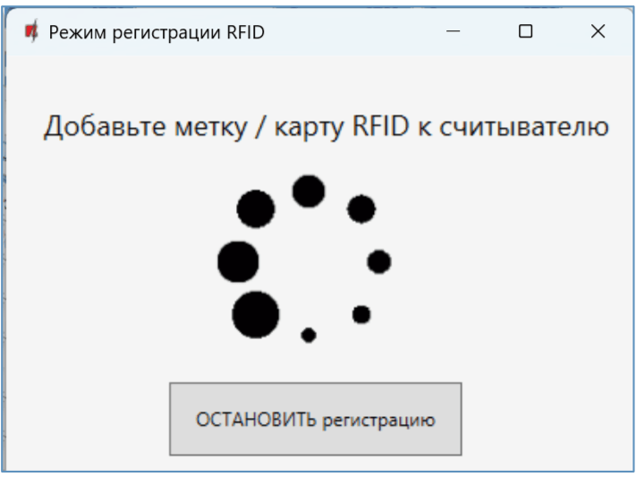

Приложите RFID карточку к считывателю. Когда считыватель считает RFID карточку (брелок), то откроется новое окно программы, в котором необходимо „**Ввести имя пользователя“** и отметить поле „**Пользователь может контролировать PGM выход 5“**. Нажмите кнопку „**Добавить“**. При необходимости добавить еще RFID карточек (брелоков) повторите выше описанные шаги.

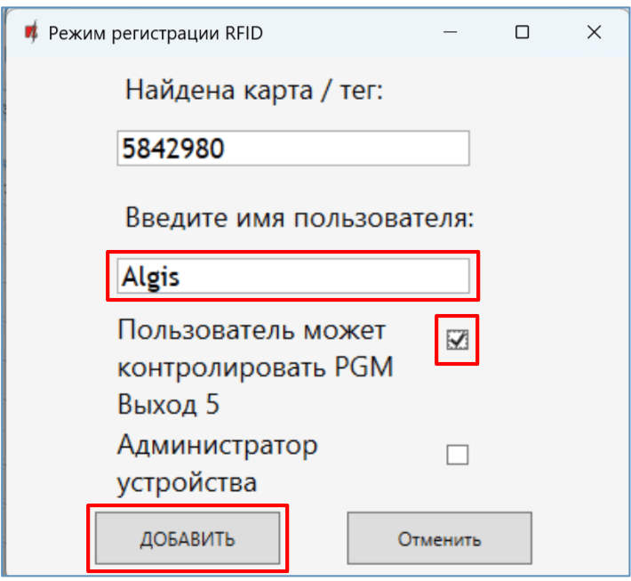

Когда регистрация RFID карточек (брелоков) будет окончена нажмите на кнопку „**Остановить регистрацию“**. / Нажмите на кнопку **Записать [F5]**, чтобы список RFID карточек был записан в контроллер.

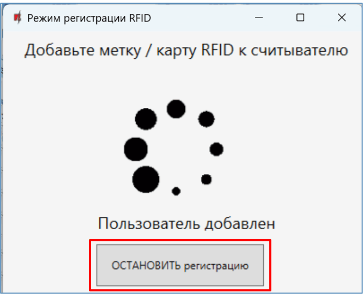

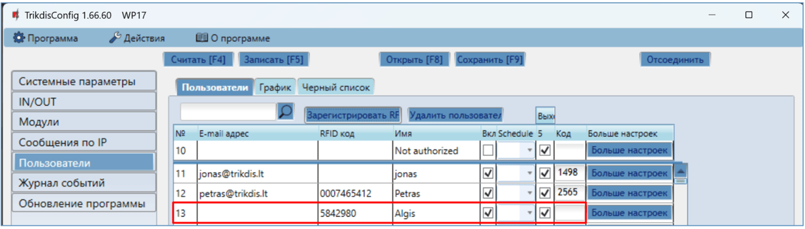

Регистрацию RFID карточки (брелока) можно выполнить в программе TrikdisConfig, вводя ID номер RFID карточки в поле „**RFID код“**. Введите имя пользователя. Отметьте поле „**Вкл.“** и „**Выход 5“**. Нажмите на кнопку **Записать [F5]**, чтобы список RFID карточек был записан в контроллер.

**Закладка „График“**

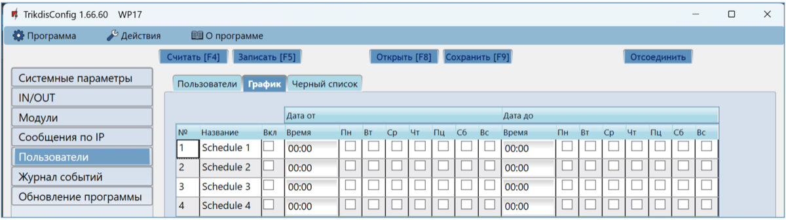

Пользователю можно составить график, указав часы и дни недели, когда он сможет управлять выходом контроллера. График должен быть назначен пользователю.

- **Название** – введите название графика.

- **Вкл** – отметьте поле, чтобы включить временной график управления выходами контроллера.

- **Дата от** – укажите время и день недели, с которого пользователю будет разрешено управлять выходами контроллера.

- **Дата до** – укажите время и день недели, до которого пользователю будет разрешено управлять выходами контроллера.

**Закладка „Черный список“**

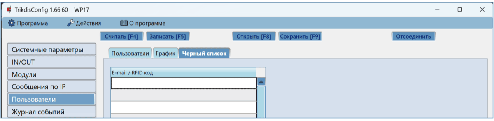

В „**Черный список“** вносятся адреса электронной почты пользователей, ID номера RFID карточек, которым будет запрещено управлять контроллером.

Удобно вносить пользователей в „**Черный список“** прямо из „**Журнала событий“**. В „**Журнале событий“** нужно щелкнуть правой кнопкой мышки по „**Имени“** или ID номеру RFID карточки и выбрать „**Добавить в черный список“.**

### Окно „Журнал событий“ 

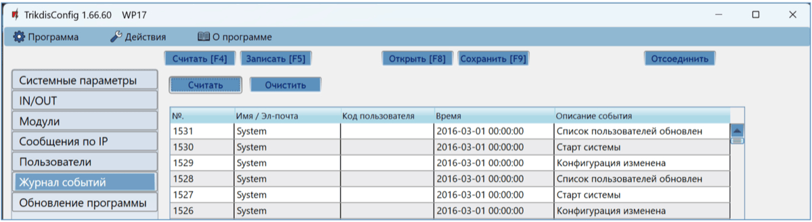

Нажмите кнопку „**Считать“**. „**Журнал событий“** будет считан из памяти контроллера. „**Журнал событий“** предоставляет информацию о выполненных действиях контроллером и его внутренних событиях.

### Восстановление заводских настроек 

Подключите GATOR WiFi к компьютеру с помощью кабеля USB Mini-B. Для восстановления заводских настроек контроллера GATOR WiFi необходимо в программном окне TrikdisConfig нажать кнопку „**Восстановить“.**

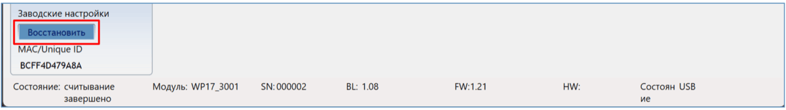

## Удаленная настройка рабочих параметров 

!!! note "Примечание"
    Удаленная настройка возможна тогда, когда у контроллера:
    
    1.  Включен Protegus2 сервис (см. п. 5.5 „Сообщения по IP").
    
    2.  Контроллер подключился к Wi-Fi сети („**NETWORK**" индикатор -
        светит зеленый и мигает желтый).
1.  Загрузите программу TrikdisConfig с сайта [www.trikdis.com/ru/](http://www.trikdis.com/ru/) и установите ее.

2.  Убедитесь, что контроллер подключен к интернету и включен Protegus2 сервис.

3.  Запустите программу TrikdisConfig. В разделе „**Удаленный доступ“** введите МАС номер контроллера в поле „**Уникальный №**“. МАС номер указан на наклейке, которая приклеена на корпусе контроллера и на упаковке.

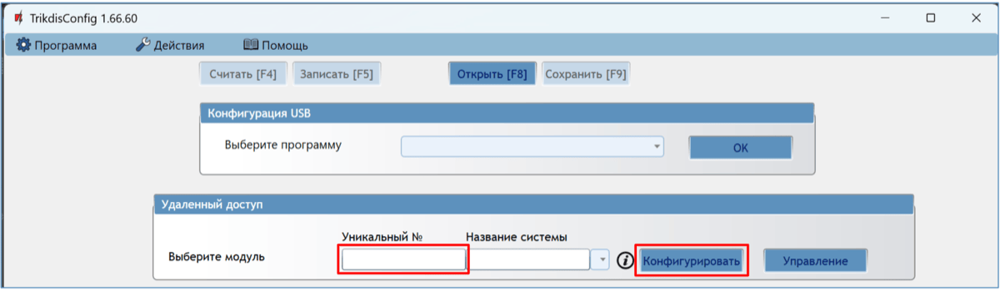

4. В поле „**Название системы**“ введите наименование системы. Нажмите кнопку „**Конфигурировать“**.

2.  Откроется окно конфигурации контроллера. Нажмите кнопку **Считать [F4]**. Программа считает настройки контроллера. Если откроется окно запроса ввода кода администратора, введите шестизначное значение кода администратора. Чтобы программа запомнила код, установите флажок в поле „**Запомнить пароль“** и нажмите кнопку **Записать [F5]**.

3.  Сделайте необходимые настройки контроллеру. Окончив конфигурацию, нажмите кнопку **Записать [F5]**. Чтобы отключиться от контроллера, нажмите кнопку „**Отсоединить“** и выключите программу TrikdisConfig.

## Тестирование контроллера GATOR WiFi 

После завершения установки и настройки контроллера, выполните проверку системы:

1.  Убедитесь, что включено питание;

2.  Проверьте соединение с сетью Wi-Fi („**NETWORK**“ индикатор - светит зеленый и мигает желтый);

3.  Чтобы проверить входы контроллера GATOR WiFi, активируйте их и убедитесь, что сообщения отправляются получателям;

4.  Чтобы проверить выходы контроллера GATOR WiFi, активируйте их удаленно и убедитесь, что сообщения отправляются получателям и что выходы активируются.

## Обновление прошивки контроллера 

!!! note "Примечание"
    Контроллер подключен к программе TrikdisConfig. Программа
    предложит обновить прошивку контроллера, если есть новая версия
    прошивки. Для обновления прошивки компьютер должен быть подключен к
    интернету. / Если на вашем компьютере установлена антивирусная
    программа, то она может заблокировать функцию автоматического обновления
    программного обеспечения. В этом случае вам придется перенастроить
    антивирусную программу.
Прошивку контроллера GATOR WiFi можно обновить или изменить вручную. После обновления прошивки все настройки контроллера сохраняются. Прошивка может быть изменена на более новую или более старую версию. Чтобы изменить прошивку выполните следующие действия:

1.  Запустите программу TrikdisConfig;

2.  Подключите контроллер к компьютеру через USB mini-B кабель или удаленно. Если есть новая прошивка контроллера, программа предложит обновить прошивку контроллера на более новую;

3.  Выберите в меню **„Обновление программы“;**

4.  Щелкните по кнопке „**Открыть файл“** и выберите необходимый файл прошивки;

    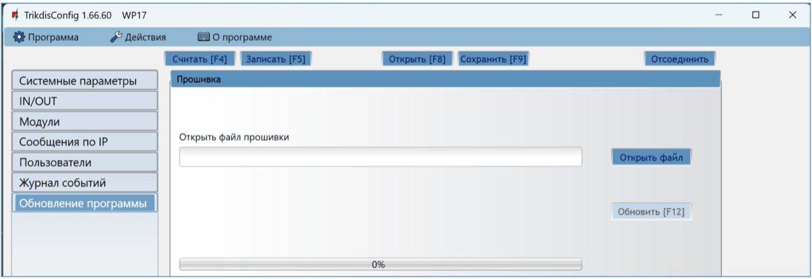

5.  Нажмите кнопку **Oбновить [F12]**;

6.  Дождитесь окончания процесса обновления прошивки контроллера.

## Содержание

## Требование безопасности 

Только квалифицированный персонал может устанавливать и обслуживать контроллер.

Внимательно прочитайте это руководство перед установкой, чтобы избежать ошибок, которые могут привести к неисправности изделия или даже к его повреждению.

Отключите напряжение питания перед подключением контроллера.

Изменения, модификации или ремонт контроллера, произведенные не производителем, аннулируют гарантию производителя.

Соблюдайте нормы местного законодательства и не утилизируйте изделие или его компоненты вместе с другими бытовыми отходами.
