# Контроллер управления воротами GATOR

  

##  Описание 

GATOR GSM контроллер управления воротами может удаленно управлять автоматикой ворот или другим подключенным оборудованием.

Управлять контроллером можно при помощи приложения Protegus2, телефонным звонком или SMS сообщениями. В контроллер можно записать 7 телефонных номеров администраторов и 1000 телефонных номеров пользователей. В контроллере можно составить график управления, установить счетчик пользователю (сколько раз пользователь сможет активировать OUT выход контроллера). GSM контроллер может отправлять SMS сообщения об активации и восстановлении входов и выходов (пользователь может редактировать текст SMS сообщений). GATOR может отправлять сообщения на приемник ПЦН (пульт централизованного наблюдения). Подключив WiFi модуль (W485) или „Ethernet“ модуль E485 к контроллеру GATOR, можно отправлять сообщения и управлять контроллером через WiFi сеть или проводную компьютерную сеть без использования мобильного интернета SIM-карты. Подключив трансивер RF-LORA, к контроллеру GATOR можно подключить беспроводный расширитель iO8-LORA (1 шт.) и беспроводные расширители iO-LORA (до 8 шт). RFID-считыватели, подключенные к беспроводным модулям расширения iO-LORA, могут контролировать до 8 PGM выходов (версия программы контроллера GATOR от 2.13). Один расширитель iO-LORA с RFID-считывателем контролирует только один PGM выход.

Функциональность

Удаленное управление

- Мобильным / Web приложением *Protegus2*.

- SMS сообщениями.

- Телефонным звонком.

Сообщения пользователям

- Отправляет сообщения о событиях в приложение *Protegus2* и SMS сообщениями.

Сообщения охранной фирме

- Контроллер отправляет сообщения Contact ID кодами на программные или аппаратурные приемники, которые работают с любой программой мониторинга.

- Одновременно отправляет сообщения на приемник фирмы охраны и в приложение *Protegus2*.

- При обрыве связи с основным приемником, сообщения автоматически передаются на запасной приемник.

**Входы и выходы**

- 2 входа (IN). Тип входа: NO; NC; EOL.

- 2 универсальных входа/выхода. Режим работы устанавливается как вход или выход.

- 1 выход (OUT) - реле.

- С расширителем iO-LORA можно дополнительно добавить один вход и один выход (реле). Всего можно добавить 8 расширителей iO-LORA (добавить до 8 дополнительных входов и 8 выходов).

- Дополнительные входы и выходы можно добавить с помощью расширителя iO8 или iO8-LORA. К контроллеру GATOR можно добавить один модуль расширения iO8 или iO8-LORA.

**Настройка и установка**

- Быстрая и простая настройка.

- Добавление и удаление пользователей с приложением Protegus2 (при входе в приложение на правах администратора), SMS сообщением, c программой TrikdisConfig.

- Настройка контроллера с программой TrikdisConfig удаленно или подсоединив контроллер к компьютеру кабелем USB Mini-B.

- Удаленное обновление программного обеспечения контроллера.

- Два уровня доступа к настройкам контроллера: администратора и установщика.

### Технические характеристики 

| Параметр | Описание |
|----------|----------|
| Частота 2G модема | 850 /​ 900 /​ 1800 /​ 1900 MГц |
| Частота LTE модема: EU (Европа) LA (Латинская Америка) | LTE-FDD: B1/​B3/​B5/​B7/​B8/​B20/​B28 LTE-FDD: B2/​B3/​B4/​B5/​B7/​B8/​B28/​B66 |
| Напряжение питания | 9-32 В постоянного тока 12-24 В переменного тока |
| Потребляемый ток | 100 мA |
| Вход | 2, тип входа: NC, NO, EOL=10 кΩ |
| Универсальный вход/​выход | 2, устанавливается как вход IN, тип которого: NC, NO, EOL=10 кΩ, или как выход (открытый коллектор, 50мА) |
| Выход | 1, релейный, 1 A 30 В постоянного тока, 0,5 A 125 В переменного тока |
| Память неотправленных сообщений | До 60 сообщений |
| Память сообщений | До 5000 сообщений |
| Администратор, который получает сообщения и может управлять контроллером | 7 номеров |
| Пользователи, которые могут управлять контроллером | 1000 номеров |
| Условия эксплуатации | Температура от –20 °C до +50 °C, относительная влажность до 80 %, при +20 °C |
| Размеры | 92 x 62 x 26 мм |
| Вес | 80 гр |

### Элементы контроллера 

1.  Световые индикаторы.

2.  Щель для снятия верхней крышки.

3.  USB Mini-B разъем для программирования контроллера.

4.  Клеммы для подсоединения проводов.

5.  Держатель nano-SIM карты.

6.  SMA разъем GSM антенны.

### Назначение внешних клемм 

| **Клемма** | **Описание** |
|----|:---|
| AC/​+DC | Клемма питания (положительная клемма 9-32 В постоянного тока;​ 12-24 В переменного тока) |
| AC/​-DC | Клемма питания (отрицательная клемма 9-32 V постоянного тока;​ 12-24 В переменного напряжения) |
| 1 IN | 1-ый вход, тип: NO, NC, EOL (заводская настройка NO) |
| 2 IN | 2 –ой вход, тип: NO, NC, EOL (заводская настройка - выключен) |
| COM | Общая клемма |
| 3 I/​O | Универсальная клемма вход/​выход (заводская настройка – выключен) |
| 4 I/​O | Универсальная клемма вход/​выход (заводская настройка – выключен) |
| NC | Контакт реле, NC |
| C | Контакт реле, C |
| NO | Контакт реле, NO |
| A RS485 | А контакт шины *RS485* |
| B RS485 | В контакт шины *RS485* |

### Световая индикация функционирования 

| Индикатор | Состояние | Описание |
|-----------|-----------|----------|
| NETWORK / (Сеть) | Светит зеленый | Подключен к GSM сети |
| NETWORK / (Сеть) | Мигает желтый | Уровень GSM сигнала от 0 до 5. Достаточно 3. |
| DATA / (Данные) | Светит зеленый | Отправляется сообщение |
| DATA / (Данные) | Светит желтый | Есть неотправленные сообщения в памяти контроллера |
| POWER / (Питание) | Мигает зеленый | Достаточный уровень питающего напряжения |
| POWER / (Питание) | Мигает желтый | Низкий уровень питающего напряжения |
| POWER / (Питание) | Мигает зеленый и желтый | Включен режим конфигурации |
| TROUBLE (Неисправность) | Не светит и не мигает | Работает без проблем |
| TROUBLE (Неисправность) | 1 вспышка | Нет SIM карты |
| TROUBLE (Неисправность) | 2 вспышки | Неправильный PIN код SIM карты |
| TROUBLE (Неисправность) | 3 вспышки | Не удается подключить к сети GSM |
| TROUBLE (Неисправность) | 4 вспышки | Не удается подключиться к приложению Protegus2 или IP приемнику по основному каналу |
| TROUBLE (Неисправность) | 5 вспышек | Не удается подсоединиться к IP приемнику по запасному каналу |
| TROUBLE (Неисправность) | 6 вспышек | Не установлены внутренние часы |
| TROUBLE (Неисправность) | 7 вспышек | Недостаточный уровень питающего напряжения |

Если световые индикаторы не светят проверьте напряжение питания и соединения.

!!! note
    Перед установкой убедитесь, что имеете все необходимые материалы:
    
    1.  Кабель USB Mini-B, который нужен для конфигурации.
    
    2.  4-жильный кабель для подключения контроллера.
    
    3.  Плоская отвертка 2,5 мм.
    
    4.  Выносная GSM антенна, если слабый сигнал мобильной связи.
    
    5.  Активированная nano-SIM карта (запрос PIN кода может быть отключен).
    
    6.  Инструкция автоматики ворот, к которой будет подключен GSM
        контроллер.
    
    Недостающие компоненты закажите отдельно у вашего местного
    дистрибьютера.
### Комплектация упаковки GSM контроллера *GATOR*

|  \- | GSM контроллер GATOR       | 1 шт. |
|----:|----------------------------------|-------|
|  \- | GSM антенна                      | 1 шт. |
|  \- | Резистор 10 кΩ                   | 3 шт. |
|  \- | Двусторонняя липкая лента (5 cм) | 1 шт. |
|  \- | Шуруп                            | 2 шт. |

## Схемы соединений GSM контроллера *GATOR* 

### Крепление 

1.  Снимите верхнюю крышку. Отсоедините клеммную колодку.

2.  Удалите плату.

3.  Прикрепите корпус шурупами.

4.  Обратно установите плату и клеммную колодку.

5.  Подсоедините GSM антенну.

6.  Установите nano-SIM карту.

7.  Закройте верхнюю крышку.

### Подключение питания 

Подключите контроллер GATOR по ниже приведенной схеме.

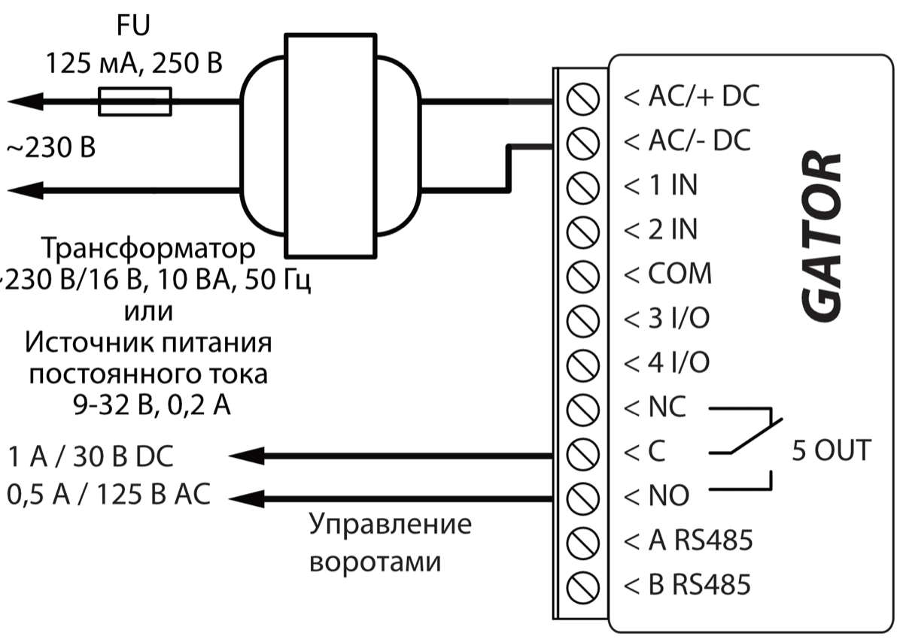

### Схема подключения входов контроллера 

Контроллер GATOR имеет четыре входа (два из которых универсальных, которые могут установлены как вход или выход), к которым можно подсоединить детекторы сигнализации. Тип входа можно установить: NC, NO, EOL. Ниже приведены схемы подключения входов (NC, NO, EOL):

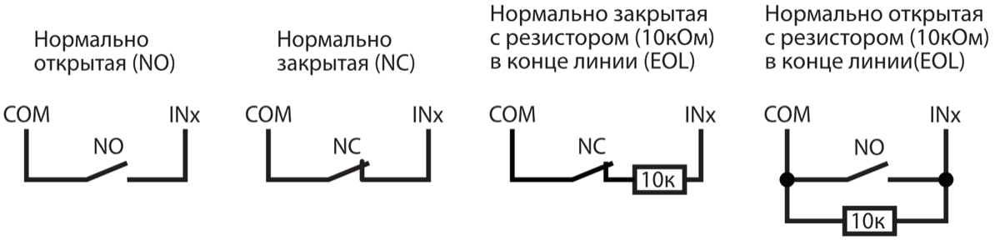

### Схема подключения реле 

Схема подключения реле, когда контроллер *GATOR* запитан от источника постоянного тока. С помощью контактов реле можно удаленно включить/выключить подключенное электрическое оборудование. Универсальной клемме I/O (вход/выход) должен быть установлен режим работы OUT (выход).

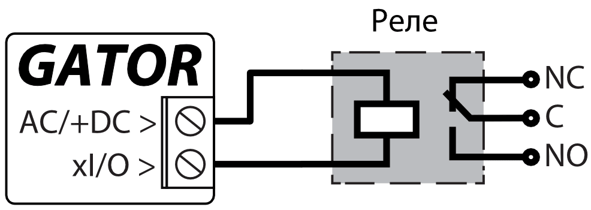

### Схема подключения контроллера GATOR к автоматике ворот 

Все подключения осуществляются при отключенном напряжении питания. / В руководстве автоматики ворот детально описано назначение клемм и их напряжение. / Клеммы IN, COM предназначены для управления воротами. / Автоматика ворот имеет выход OUT, который показывает положение ворот (открыты/ закрыты). Выход OUT положения ворот может иметь контакты встроенного реле или иметь напряжение (при открытом положение ворот). В схеме указано подключение реле К1 к выходу OUT. На клеммах OUT, N появляется напряжение (~230 B) когда ворота открыты. Когда ворота открыты срабатывает реле К1 и активируется вход 1IN контроллера *GATOR.* По состоянию

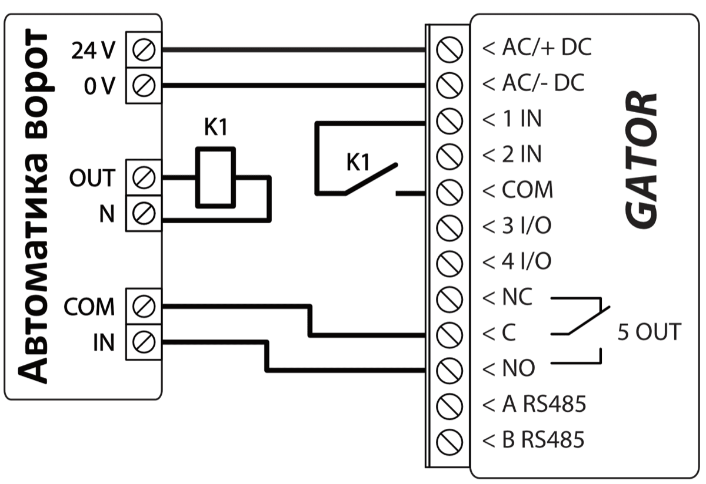

входа 1IN имеем точную информацию о положении ворот (закрыты или открыты ворота).

Конфигурацию контроллера GATOR с индикацией положения ворот смотреть п.5.9 „Настройки для индикации положения ворот“.

### Схема подключения RFID считывателя (Wiegand 26/34) 

Конфигурация контроллера с RFID считывателем описана в п.5.3 „Окно „IN/OUT““.

Схема подключения RFID считывателя к контроллеру GATOR.

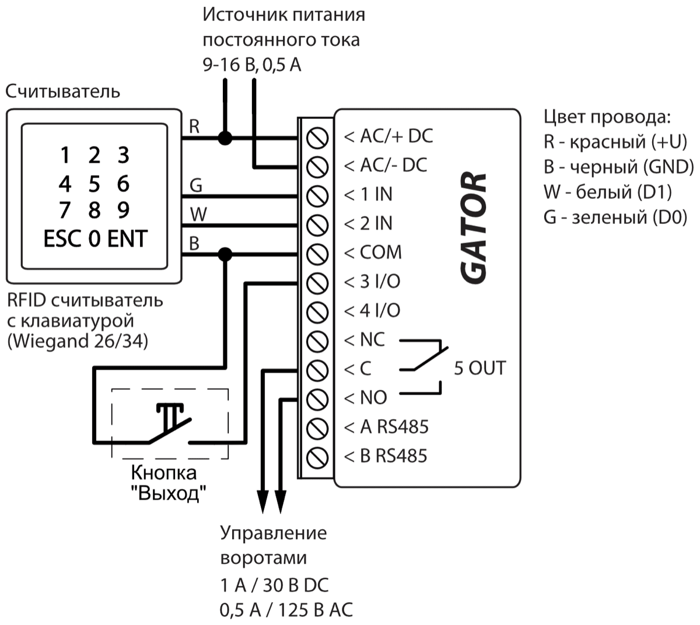

В программе TrikdisConfig необходимо отметить, что будет использоваться один RFID считыватель и кнопка „Выход“. При нажатии на кнопку „Выход“ выход 5OUT контроллера сработает на установленную продолжительность импульса. Когда кнопка „**Выход**“ не подсоединена к контроллеру, то не надо отмечать поле „**IO3 как кнопка выхода**“**.**

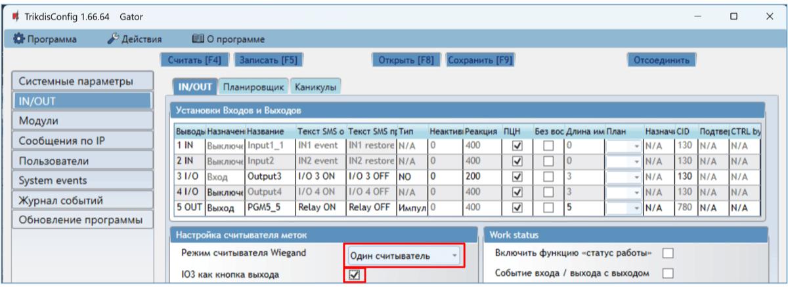

Схема подключения двух RFID считывателей к контроллеру GATOR.

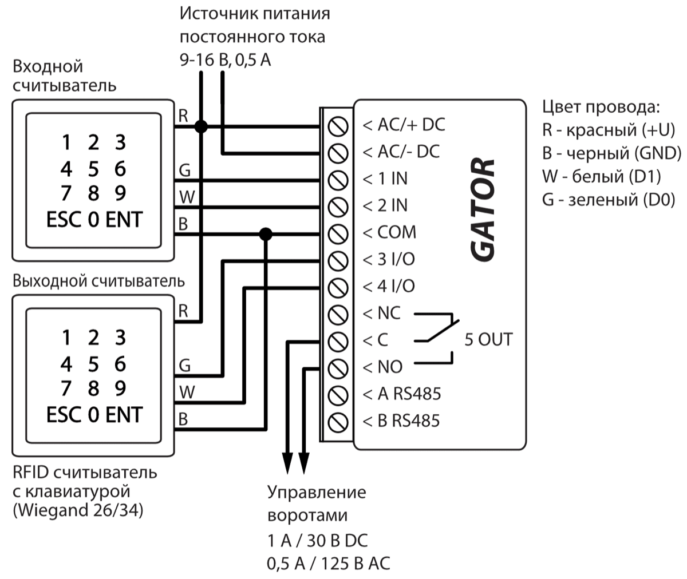

При подключении к контроллеру двух RFID считывателей, в программе TrikdisConfig необходимо отметить, что будут использоваться два RFID считывателя.

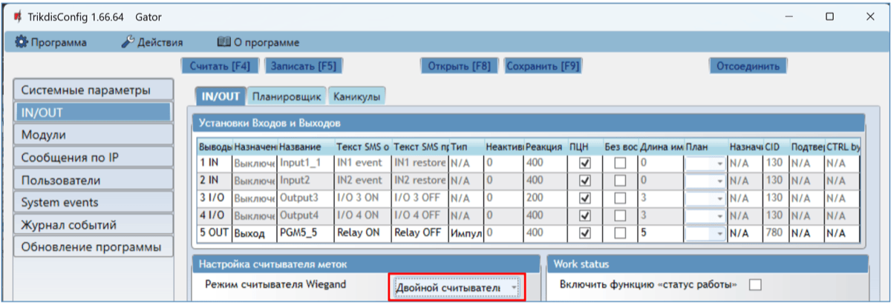

### Схема подключения WiFi модуля W485 

Версия прошивки контроллера от 1.06. / Модуль *W485* предназначен для передачи сообщений и управления через WiFi компьютерную сеть. Используя *W485* вместе с контроллером, сообщения на ПЦН и в приложение *Protegus2* передаются через WiFi компьютерную сеть и мобильный интернет не используется. При нарушении связи в WiFi сети данные передаются через сеть мобильного интернета. При восстановлении WiFi связи контроллер начинает вновь отправлять сообщения через *W485*. / Конфигурация контроллера с WiFi модулем *W485* описана в п. 5.4 „Окно „Модули““. / SIM карта не обязательна, когда модуль *W485* используется вместе с контроллером.

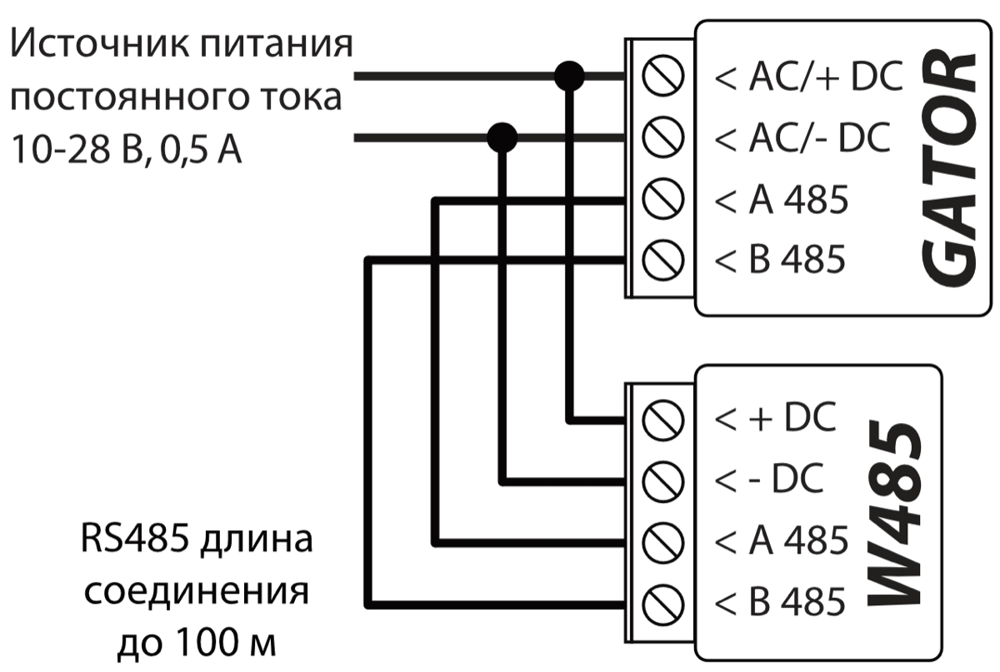

### Схема подключения “Ethernet” модуля E485 

Версия прошивки контроллера от 1.06. / Модуль *Е485* предназначен для передачи сообщений и управления через проводную компьютерную сеть. Используя *Е485* вместе с контроллером*,* сообщения на ПЦН и в приложение *Protegus2* передаются через проводную компьютерную сеть и мобильный интернет не используется. При нарушении связи в компьютерной сети данные передаются через сеть мобильного интернета. При восстановлении связи в компьютерной сети контроллер начинает вновь отправлять сообщения через *Е485*. / Конфигурация контроллера с „Ethernet“ модулем *Е485* описана в п. 5.4 „Окно „Модули““. / SIM карта не обязательна, когда модуль *E485* используется вместе с контроллером.

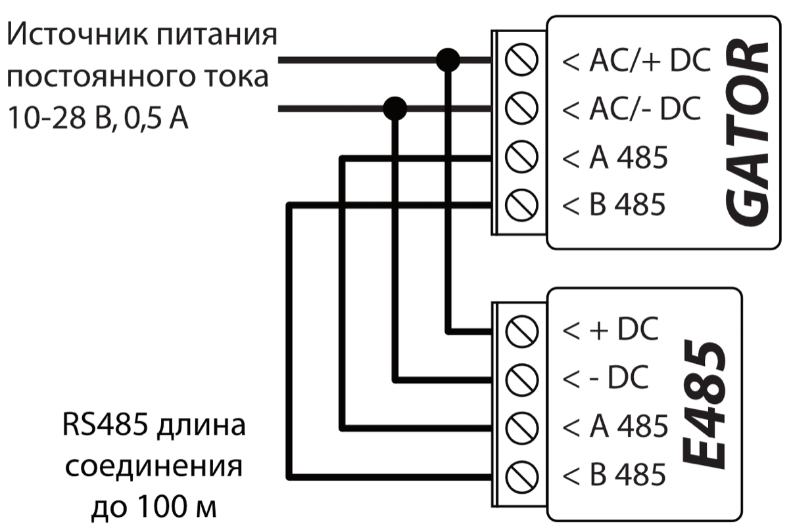

### Схема подключения расширителя iO-LORA с RFID-считывателем 

Версия прошивки контроллера GATOR от 2.13.

Подсоедините трансивер RF-LORA к контроллеру GATOR. После чего сможете использовать расширитель iO-LORA, к которому подсоединен считыватель RFID (Wiegand 26/34). RFID считыватель управляет PGM выходом расширителя iO- LORA, к которому он подключен.

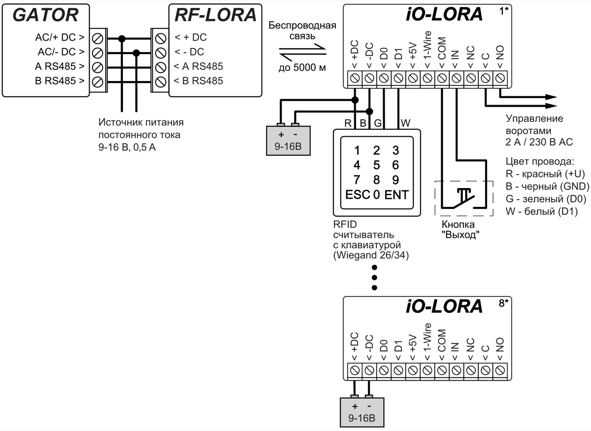

Запустите TrikdisConfig. Подключите GATOR через кабель USB Mini-B к компьютеру или удаленно. Нажмите кнопку **Cчитать [F4]** и в программе TrikdisConfig отобразятся текущие настройки контроллера. При появлении запроса введите код администратора или установщика во всплывающем окне. Выберите „**iO-LORA controller**“ из списка „**Модули**“. В поле „**Серийный №**“ введите серийный номер изделия.

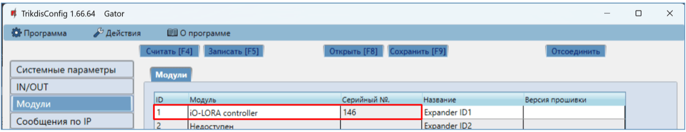

В списке "**IN/OUT**" входу „**6IN**“ необходимо указать „**EXIT button**“ (кнопка „Выход“). При нажатии кнопки „**Выход**“ выход iO-LORA „**7OUT**“ активируется на установленную длительность импульса.

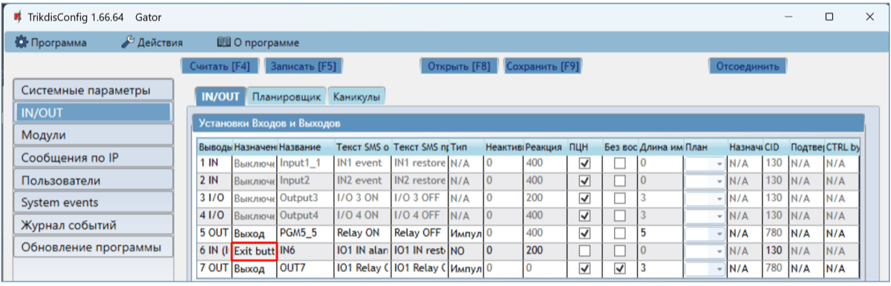

В списке „**Пользователи**“ укажите номер RFID карты, имя пользователя, включите разрешение управлять PGM выходом, укажите PGM выход (которым будет управлять пользователь), код. Выполнив настройки, нажмите **Записать [F5]**. Дождитесь окончания процесса обновления настроек контроллера. Нажмите „**Отсоединить**“ и отключите кабель USB.

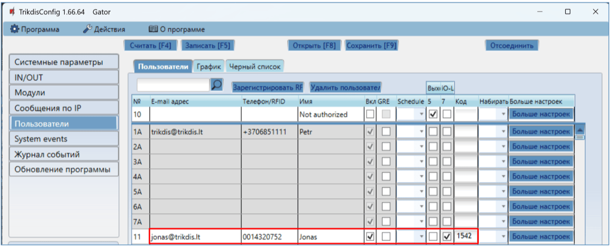

Активируйте выход PGM RFID карточкой/кодом. Нажмите кнопку „**Выход**“ (должен сработать PGM выход на установленную длительность импульса).

### Схема подключения расширителя iO8, iO8-LORA 

К контроллеру *GATOR* можно подключить расширитель *iO8* или *iO8-LORA* для увеличения числа входов (IN) и выходов (OUT). К контроллеру можно подключить один модуль расширения *iO8* или *iO8-LORA*. / Схема подключения расширителя *iO8*.

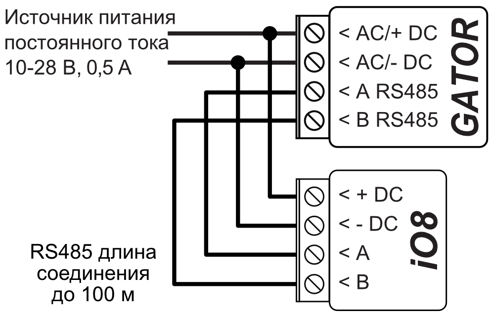

Схема подключения расширителя iO8-LORA.

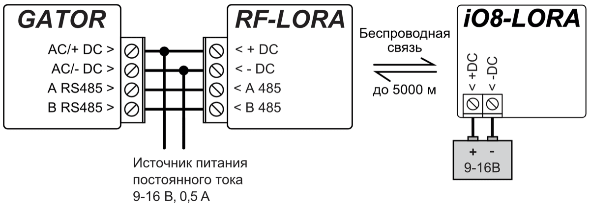

## Быстрая настройка контроллера 

!!! note
    Заводские настройки контроллера позволяют быстро его ввести в
    эксплуатацию. Позвоните на номер SIM карты, которая установлена в
    контроллере. Выход 5OUT сработает на 3 секунды. Первый позвонивший
    становится администратором контроллера. Если такой алгоритм работы
    контроллера устраивает, то можете его устанавливать без дополнительных
    настроек.
1.  В контроллере должна быть установлена nano-SIM карта. Перед установкой SIM-карты в контроллер отключите запрос PIN-кода.

2.  Подключите источник питания к контроллеру (см. п.2.2 „Подключение питания“).

3.  Включите напряжение питания контроллеру. Должна засветить следующая световая индикация:

- мигает зеленый „**POWER**“ индикатор;

- светит зеленый и мигает желтый „**NETWORK**“ индикатор.

Заводские настройки позволяют управлять всем, кто позвонит на SIM карту контроллера. Отправив SMS команду (пример команды: SETU  123456  +370xxxxxxxx#Petr#petr@mail.ru) с добавлением первого пользователя контроллером, контроллером смогут управлять только те номера, которые внесены в список пользователей. контроллера будет игнорировать звонки с других телефонных номеров.

!!! note
    Чтобы изменить заводские настройки или активировать другие функции
    контроллера, см. п. 5 „Настройка рабочих параметров с TrikdisConfig".
## Удаленное управление 

### Управление телефонным звонком 

!!! note
    Первый позвонивший (или отправивший SMS сообщение) на номер SIM карты
    контроллера, становится администратором системы. Администратор сможет
    управлять и настраивать контроллер SMS командами.
Позвоните на номер SIM карты, которая установлена в контроллер. GATOR автоматически отклонит звонок и на 3 секунды сработает выход „**5OUT**“. Заводские настройки позволяют управлять выходом (5OUT) любому, кто позвонит на номер SIM карты контроллера.

### Управление с клавиатуры телефона 

Пользователю назначено несколько выходов (OUT) контроллера. Управление выходами контроллера GATOR:

1.  Позвоните на номер SIM карты контроллера. Контроллер поднимет трубку.

2.  Введите команду управления с клавиатуры телефона (пример команды см. в таблице „DTMF команды управления“).

#### DTMF команды управления (не работают с изделиями GV17_2E70, GV17_2S70)

| DTMF команда | Функция | Описание |
|--------------|---------|----------|
| OUTPUT*STATE# | Управление выходом | Команда управления выходом (вкл/выкл; вкл/выкл на длительность импульса). OUTPUT – номер контролируемого выхода. STATE – команда управления. 0 – выключить выход; 1 – включить выход; 2 –выключить выход на длительность импульса; 3 – включить выход на длительность импульса; (длительность импульса устанавливается с программой TrikdisConfig в таблице „Установки Входов и Выходов“); # - знак завершения команды. Пример: (включить 5 выход): 5*1# Пример: (включить 4 выход на продолжительность импульса): 4*3# |
| # | Знак окончания команды | Если допустили ошибку во время набора, нажмите #, чтобы начать вводить команду управления снова. |

### Управление с приложением *Protegus2* 

С приложением Protegus2 пользователи смогут управлять контроллером дистанционно, а также пользователи получат информацию о состоянии системы и все уведомления о событиях.

1.  Загрузите и запустите приложение Protegus2 или используйте Web версию Protegus2 [www.protegus.app](https://www.protegus.app).

    

      
      
      
    

2.  Войдите под своим именем пользователя и паролем или зарегистрируйтесь и создайте новую учетную запись.

!!! note
    В момент регистрации контроллера к приложению Protegus2 должен
    быть:
    
    1.  Включен Protegus сервис, который описан в п.5.5 „Окно
        Сообщения по IP".
    
    2.  Включено питание (мигает зеленый „POWER" индикатор).
    
    3.  Контроллер должен быть подключен к сети оператора мобильной связи
        (светит зеленый и мигает желтый „NETWORK" индикатор).
3. Нажмите „**Добавить объект**“.

4. Введите „Unique ID/IMEI“ номер контроллера, который указан на этикетке контроллера или упаковке. Нажмите „**Next**“.

5. Введите наименование системы. Нажмите „**Next**“.

6. Нажмите „**Skip**“.

7. Подождите 1 минуту.

8. Активируйте PGM выход, нажав на икону „**Output5**“.

### Установка Виджета в телефоне 

Установка Виджета управления воротами в телефоне. Контроллер должен быть зарегистрирован в приложении Protegus2. Подключитесь к приложению Protegus2 в вашем телефоне. Закройте окно приложения***.***

Приложите палец к экрану телефона и подержите. Появится панель параметров.

1.  Нажмите на „**Widgets**”.

В панели параметров найдите Protegus2.

2. Нажмите на „Protegus2“.

3. Нажмите на „**Switch** **Protegus2**“.

4. Выберите „**Gator Output5**“ выход контроллера**.**

2.  Нажмите на „**ADD WIDGET**“.

3. На экране телефона появится икона.

4. Перейдите к нормальному экрану. Нажмите на икону.

На экране появится окружность, в которой будет отображена активация PGM выхода.

5. Контроллер подсоединен к автоматике ворот по схеме с индикацией состояния ворот. Икона показывает состояние открытых/закрытых ворот.

### Добавление пользователей в телефоне 

| Запустите приложение Protegus2 в телефоне. Войдите под своим именем пользователя и паролем. Нажмите „Настройки“. |  |
|------------------------------------------------------------------------------------------------------------------|--|
| Нажмите „System configuration“ (конфигурация системы). |  |
| Нажмите „Users“ (пользователи). |  |
| Нажмите „Add new user“ (добавить нового пользователя). |  |
| Введите адрес электронной почты пользователя. Введите имя пользователя. Введите номер телефона пользователя. Отметьте PGM выход, которым будет управлять пользователь. Нажмите „Add user“. |  |
| В списке пользователей появится новый пользователь. Нажмите „Назад“, чтобы вернуть в основное окно. |  |

### Управление SMS сообщениями 

Управляйте выходом OUT5 SMS сообщениями:

> #### OUTPUT5 xxxxxx ON
>
> ***OUTPUT5 xxxxxx* OFF**
>
> ***OUTPUT5 xxxxxx* PULSE=002**

| xxxxxx | 6-значный пароль администратора. (заводской пароль – 123456). |
|--------|---------------------------------------------------------------|
| ON | Включить выход. |
| OFF | Выключить выход. |
| PULSE=ttt | Включить выход на продолжительность импульса, „ttt“ – продолжительность импульса в сек.. |

SMS сообщениями можете управлять и остальными выходами, которые необходимо включить в TrikdisConfig.

SMS команды управления

| Команда | Данные | Описание |
|---------|--------|----------|
| OUTPUTx | ON | Включить выход. „x“ – номер выхода. Пример: OUTPUT5 123456 ON |
| OUTPUTx | OFF | Выключить выход. „x“ – номер выхода. Пример: OUTPUT5 123456 OFF |
| OUTPUTx | PULSE=ttt | Включить выход на продолжительность импульса. „ttt“ – продолжительность импульса в сек., от 001 до 999. Пример: OUTPUT5 123456 PULSE=002 |

### Конфигурация SMS сообщениями 

1.  **Измените пароль администратора**

Из соображений безопасности измените SMS пароль администратора. Отправьте SMS сообщение:

#### PSW 123456 xxxxxx

| 123456 | Заводской пароль администратора. |
|--------|----------------------------------|
| xxxxxx | Новый 6-значный пароль администратора. |

1.  **Добавьте пользователей**

Можете разрешить управлять системой определенным людям. С телефона администратора отправьте SMS сообщение, указав номер телефона и имя пользователя:

#### SETU xxxxxx +PHONENo#NAME#EMAIL

| xxxxxx | 6-значный пароль администратора. |
|--------|----------------------------------|
| PHONENo | Номер телефона пользователя. |
| NAME | Имя пользователя. |
| EMAIL | Aдрес электронной почты. |

Записав номер первого пользователя в контроллер, контроллером смогут управлять номера, которые внесены в список пользователей. Контроллер будет игнорировать звонки с других телефонных номеров.

1.  Добавьте права администратора дополнительному лицу

Можете добавить нового администратора к системе. Новый администратор сможет получать сообщения и добавлять новых пользователей к системе. Отправьте SMS сообщение:

#### SETA xxxxxx Nox=+PHONENo#NAME#EMAIL

| xxxxxx | 6-значный пароль администратора. |
|--------|----------------------------------|
| Nox | x – номер администратора в списке. (Записав 1, передадите права администратора другому лицу.) |
| PHONENo | Номер телефона. |
| NAME | Имя пользователя. |
| EMAIL | Aдрес электронной почты. |

SMS команды конфигурации

| Команда | Данные | Описание |
|---------|--------|----------|
| INFO |  | Запрос информации о контроллере. В ответе будет указан: тип контроллера, IMEI номер, уровень GSM сигнала, уровень напряжения питания, версия программного обеспечения, серийный номер, дата и время. Пример: INFO 123456 |
| ASKI |  | Запрос информации о состоянии входов. Пример: ASKI 123456 |
| ASKO |  | Запрос информации о состоянии выходов. Пример: ASKO 123456 |
| SETA | NoX=phoneNo#name#email | Добавить нового администратора в список (номер администратора от 1А до 7А). Номер телефона, имя и e-mail администратора записывается в указанную строку. Номер телефона отделяется от имени знаком решетки (#). Номер телефона должен начинаться с „+“ и международного кода. Пример: SETA 123456 No3=+37061234567#Petr#petr@mail.ru |
| SETA | NoX=DEL | Удаление номера телефона и имени администратора из указанной строки списка. Пример: SETA 123456 No2=DEL |
| SETU | phoneNo#name#email | Добавить нового пользователя в список (номер пользователя от 11 до 1010). Номер телефона, имя и e-mail пользователя записывается в список пользователей. Номер телефона отделяется от имени знаком решетки (#). Номер телефона должен начинаться с „+“ и международного кода. Пример: SETU 123456 +37061234567# Petr#petr@mail.ru |
| DELU | phoneNo | Удаление пользователя по номеру телефона. Пример: DELU 123456 +37061234567 |
| DELU | name | Удаление пользователя по его имени. Пример: DELU 123456 Petr |
| DELU | email | Удаление пользователя по его e-mail. Пример: DELU 123456 petr@mail.ru |
| SETB | Email/phoneNo | Занести пользователя в черный список (e-mail; номер телефона.). Пример: SETB 123456 Petr0303@mail.ru Пример: SETB 123456 +37060123456 |
| DELB | ALL | Очистить весь черный список. Пример: DELB 123456 ALL |
| DELB | Email/phoneNo | Удалить запись из черного списка (в e-mail важны прописные и строчные буквы). Пример: DELB 123456 Petr0303@mail.ru Пример: DELB 123456 +37060123456 |
| RESET |  | Перезапуск контроллера. Пример: RESET 123456 |
| PSW | Новый пароль | Смена пароля. Пример: PSW 123456 654123 |
| TXTA | Object name | Запись наименования объекта. Пример: TXTA 123456 Дом |
| TXTE | N1= / …… / N5= | Записать текст SMS сообщения при активации входа или выхода. N1...N5 номер клеммы входа/выхода. Пример: TXTE 123456 N1=Ворота открыты |
| TXTR | N1= / …… / N5= | Записать текст SMS сообщения при восстановлении состояния входа или выхода. N1...N5 номер клеммы входа/выхода. Пример: TXTR 123456 N5=Реле отключено |
| SETD | IDx=yy | Установить время бездействия для входа „x“. „yy“ –время бездействия в минутах, от 0 до 2880 минут. После активации входа контроллер отправит сообщение и не будет реагировать на дальнейшие срабатывания входа в течении установленного времени бездействия. Если время бездействия установить равное 0, то бездействие будет отключено. Пример: SETD 123456 ID1=30 |
| RESD | IDx | Обновление времени бездействия „x“ входа, если уже был начат отсчет времени. Пример: RESD 123456 ID1 |
| TIME | YYYY/MM/DD, / HH:mm:ss | Установка даты и времени. Пример: TIME 123456 2025/05/09,10:03:00 |
| RDR | PhoneNO#SMStext | Перенаправляется SMS текст на указанный номер телефона. Пример: RDR 123456 +37061234567#Пополнить счет |
| HELLO | ON | Включите функцию информирования SMS сообщением нового пользователя о его добавлении к контроллеру GATOR через приложение Protegus2 или SMS сообщение. Пример: HELLO 123456 ON |
| HELLO | OFF | Отключите функцию информирования SMS сообщением нового пользователя о его добавлении к контролеру GATOR через приложение Protegus2 или SMS сообщение. Пример: HELLO 123456 OFF |
| NATH | ON | Включите режим работы „Not authorized“, не изменяя остальные параметры. Пример: NATH 123456 ON Если контроллер управляет несколькими PGM выходами, SMS будет следующим (активирует „Not authorized“ и указанные PGM выходы, а остальные отключает): Пример: NATH 123456 ON=5,7,22 |
| NATH | OFF | Выключите режим работы „Not authorized“. Пример: NATH 123456 OFF |
| UUSD | *UUSD code# | Отправьте UUSD код оператору мобильной связи. C предоставленным оператором UUSD кодом можно проверить и пополнить счет SIM карты, а также выполнить другие действия. Пример: UUSD 123456 *245# |
| CONNECT | Protegus=ON | Разрешить подключиться к Protegus сервису. Пример: CONNECT 123456 PROTEGUS=ON |
| CONNECT | Protegus=OFF | Отключить Protegus сервис. Пример: CONNECT 123456 PROTEGUS=OFF |
| CONNECT | APN=Internet | APN имя. Пример: CONNECT 123456 APN=INTERNET |
| CONNECT | USER=user | Пользователь APN. Пример: CONNECT 123456 USER=User |
| CONNECT | PSW=password | Пароль APN. Пример: CONNECT 123456 PSW=password |
| CONNECT | Code=password | Изменить пароль подключения к Protegus сервису. Пример: CONNECT 123456 Code=612354 |

## Настройка рабочих параметров с *TrikdisConfig* 

С TrikdisConfig вы можете изменить настройки контроллера (если заводских настроек недостаточно).

1.  Загрузите программу TrikdisConfig с сайта [www.trikdis.com/ru/](http://www.trikdis.com/ru/) (программу найдете в окне поиска написав - TrikdisConfig) и установите ее.

2.  Плоской отверткой снимите крышку контроллера, как показано ниже на рисунке:

1.  Кабелем USB Mini-B подключите контроллер к компьютеру.

2.  Запустите программу TrikdisConfig. Программа автоматически распознает подключенный контроллер и откроет окно его конфигурации.

3.  Нажмите на кнопку **Считать [F4]**, чтобы отобразить текущие рабочие параметры контроллера. При необходимости введите код администратора или установщика во всплывающем окне.

!!! note
    Нажмите кнопку **Считать [F4]**, программа считает и отобразит
    настройки, сохраненные на устройстве. / Нажав кнопку
    **Записать [F5]**, программа сохранит сделанные настройки в
    контроллер. / Нажав кнопку **Сохранить [F9]**, сделанные настройки
    будут сохранены в файле конфигурации. Затем вы можете загрузить
    сохраненные настройки на другие устройства. Это позволяет быстро
    настроить несколько контроллеров с одинаковыми настройками. / Если
    нажать кнопку **Открыть [F8]** и выбрать файл конфигурации в
    программе, откроются и отобразятся сохраненные настройки. / Чтобы
    восстановить заводские настройки, нажмите кнопку „**Восстановить**" в
    левом нижнем углу окна программы.
### Строка состояния программы TrikdisConfig 

После подключения контроллера к программе TrikdisConfig, в строке состояния программы появится информация о подключенном контроллере:

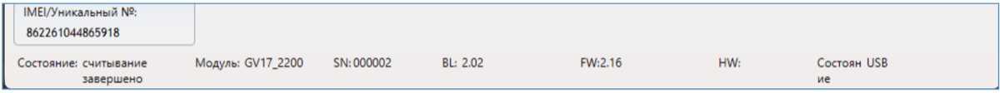

| Наименование | Описание |
|--------------|----------|
| IMEI/​Уникальный № | IMEI номер устройства |
| Состояние | Рабочее состояние |
| Модуль | Тип изделия (должно быть указано - GV17_хххх) |
| SN | Серийный номер изделия |
| BL | Версия менеджера загрузки |
| FW | Версия программного обеспечения изделия |
| HW | Аппаратурная версия изделия |
| Состояние | Тип подключения к программе (через USB или удаленно) |
| Права | Уровень доступа (отображается после подтверждения кода доступа программой) |

Нажмите кнопку **Считать [F4]**. Программа считает и отобразит настройки контроллера GATOR. С программой TrikdisConfig сделайте необходимые настройки контроллера.

### Окно „Системные параметры“ 

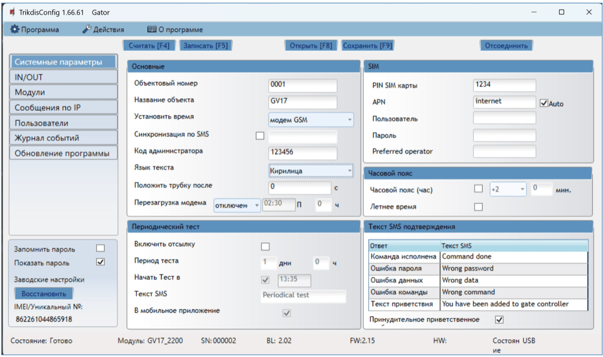

**Группа „Основные“**

- **Объектовый номер** – введите номер объекта (4-значный шестнадцатеричный номер, 0-9, A-F. **Не использовать** **FFFE, FFFF объектовые номера**).

- **Название объекта** – каждое сообщение будет отправлено с названием объекта.

- **Установить время** – выберите источник, по которому будет установка времени.

- **Cинхронизация по SMS** – отметьте поле галочкой и введите номер телефона SIM карты, установленной в контроллер. Номер телефона должен быть с международным кодом.

- **Код администратора** – позволяет пользователю менять все рабочие параметры контроллера.

- **Язык текста** – SMS сообщения отправляются с использованием символов выбранного языка.

- **Положить трубку после** – контроллер отклонит вызов, по истечении указанного промежутка времени.

- **Перезагрузка модема** – можно настроить перезапуск модема в указанное время.

**Группа „Периодический тест“**

- **Включить отсылку** – отметив поле, включаете отправку периодических тестовых сообщений**.**

- **Период теста** – устанавливается период времени для отправки тестовых сообщений**.**

- **Начать Тест в** – укажите время отправки тестового сообщения.

- **Текст SMS** – запишите текст SMS сообщения.

- **В мобильное приложение** – отметив поле, тестовые сообщения будут отправляться в приложение Protegus2.

**Группа „SIM“**

- **PIN SIM карты** – введите PIN код SIM карты.

- **APN** – введите имя APN. **Auto** - если поле отмечено, SIM-карта будет автоматически искать APN на основе внутреннего списка. Внутренний список содержит APN нескольких глобальных операторов мобильной связи и APN нескольких странах для внутренних операторов мобильной связи. Если оператор мобильной сети не найден, будет использовано значение APN, введенное в поле.

- **Пользователь** – введите имя пользователя, если требуется.

- **Пароль** – введите пароль, если требуется.

- **Preferred operator** - если в поле введен код, контроллер будет подключаться только к выбранному оператору мобильной связи. Код оператора мобильной связи состоит из кодов MCC + MNC. Данная настройка актуальна для глобальных SIM-карт.

**Группа „Часовой пояс“**

В контроллере можно установить текущее время вашей страны. Для этого вы должны указать часовой пояс своей страны и указать применяется ли в вашей стране летнее время.

- **Часовой пояс (час)** – отметьте поле и введите часовой пояс вашей страны.

- **Летнее время** – отметьте поле, если в вашей стране действует летнее время.

**Группа „Текст SMS подтверждения“**

Текст SMS сообщений, которые получит пользователь после отправки SMS команд.

- **Принудительное приветственное сообщение** – отметьте поле, чтобы новому пользователю, который был добавлен SMS сообщением или приложением Protegus2 к контроллеру, было отправлено SMS сообщение. (Эту функцию можно отключить с помощью SMS (HELLO 123456 OFF)).

### Окно „IN/OUT“ 

**Закладка „IN/OUT“**

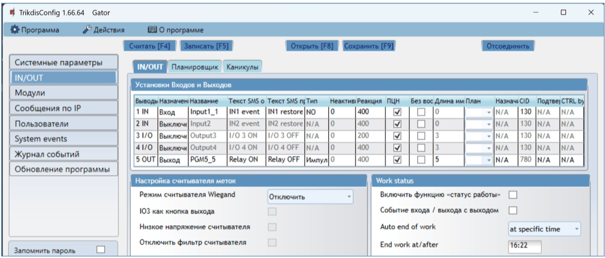

**Группа „Установки Входов и Выходов“**

- **Выводы** – указаны номера клемм входов и выходов.

- **Назначение** – указаны типы клемм (вход, выход, выключено).

- **Название** - введите название входа IN или выхода OUT.

- **Текст SMS о событии** – записать текст SMS о событии при активации входа или выхода.

- **Текст SMS при восстановлении** – записать текст SMS при восстановлении состояния входа или выхода.

- **Тип** – указать тип входа (NC, NO, EOL=10 кΩ).

- **Неактивный** – вход будет нечувствителен определенное время после первой его активации. Чтобы выключить эту функцию введите 0.

- **Реакция** – укажите время реакции входа, мс.

- **ПЦН** – отметив поле, сообщения будут отправляться в ПЦН (пульт централизованного наблюдения) и в приложение Protegus2.

- **Без восстановления** – отключить отправку сообщения о восстановлении состояния входа или выхода.
- **Длина импульса** – длительность времени импульса, когда выходу установлен тип „**Импульс**“.

- **План** – назначение номера временного графика, по которому будет управляться выход.
- **Назначить** – назначьте вход (IN) выходу. По активации входа можно определить реальное положение выхода.

- **CID** – Сontact ID код.

- **Подтвердить** – укажите номер входа, при сработавшем входе будет разрешено управление выходом (OUT).

- **CTRL by IN** - выбранный вход активирует выход.

  **Группа „Настройка считывателя меток“**

- **Режим считывателя Wiegand –** выберите (Отключить, Один считыватель, Два считывателя) сколько считывателей Wiegand подключено к контроллеру.

- **IO3 как кнопка выхода –** отметьте поле, если кнопка „Выход“ подключена к входу IO3 контроллера, и активация входа IO3 вызовет срабатывание выхода (5OUT) на продолжительность установленного импульса.

- **Низкое напряжение считывателя –** отметьте поле и будет включен режим считывателя низкого напряжения.

- **Отключить фильтр считывателя** – отметьте поле и будет отключен внутренний фильтр устройства для считывателя, который отправляет короткие импульсы.

  **Группа „Work status“**

- **Включить функцию „статус работы“ –** отметив поле, включите индикацию **статуса работы** в приложении Protegus2.

- **Событие входа / выхода с выходом** **–** отметив поле, отправите сообщение о входе (или выходе) в помещение при управлении выходом (OUT) приложением Protegus2.

- **Auto end of work** - можно указать, когда будет завершен учет времени.

- **End work at/after** – укажите окончание учета рабочего времени. В зависимости от предыдущей настройки вводится либо определенное время суток, либо временной интервал.

**Закладка „Планировщик“**

Выходы (OUT) могут управляться автоматически по заданному расписанию.

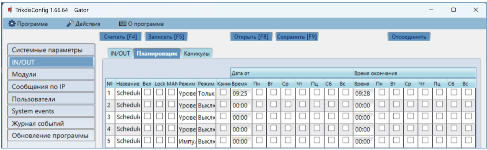

- **Название** – введите наименование временного графика.

- **Вкл.** – отметьте поле и включите временной график, когда выход будет управляться контроллером.

- **Lock -** отметьте поле, чтобы запретить управление выходом другими способами при его срабатывании по заданному графику.

- **MANUAL -** отметьте поле, что не позволит планировщику включать выход при запуске. График начнет работать только тогда, когда выход будет активирован пользователем.

- **Режим выхода** – укажите режим работы PGM выхода: **Импульс** – выход будет активирован в начале и конце расписания на установленную продолжительность импульса; **Уровень** – выход будет активирован на указанный период времени.

- **Режим каникул** – укажите режим, как должен работать временной график при наступлении каникул (Выключено / Игнорировать во время каникул / Дополнительно, когда каникулы / Только во время каникул).

- **Каникулы** – отметьте поле, чтобы использовать график каникул, когда наступают каникулы.

- **Дата от** - укажите время и дни недели, когда будет активирован выход контроллера.

- **Время окончания** - укажите время и дни недели, до которых будет активирован выход контроллера.

  Если в таблице „**Планировщик**“ установлен режим работы выхода „**Уровень**“ и указано только „**Время окончания**“**,** то выход будет выключен в указанное время, если он был включен. Расписание управления выходом должно быть назначено выходу (OUT).

**Закладка „Каникулы“**

Введите календарные праздники, во время которых можно будет установить дополнительную активацию выхода (OUT), предусмотренную в таблице „**Планировщик**“.

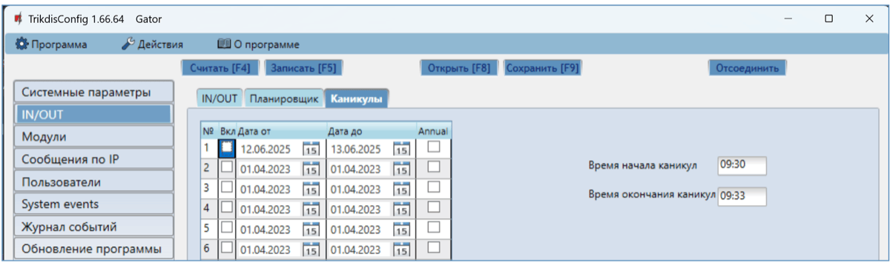

- **Вкл.** – отметьте поле, чтобы включить определенный интервал каникул.

- **Дата от –** укажите дату начала каникул.

- **Дата до** – укажите дату окончания каникул.

- **Ежегодно (Annual)** - установите флажок, чтобы включить повторяющиеся каждый год даты праздников. Контроллер будет проверять только даты праздников (месяц и день).

- **Время начала каникул** – укажите время начала каникул.

- **Время окончания каникул** – укажите время окончания каникул.

### Окно „Модули“

**Закладка „Модули“**

К контроллеру GATOR можно подключить следующие модули: iO-LORA, W485, E485**, *iO8, iO8-LORA***.

Подключив трансивер RF-LORA, к контроллеру GATOR можно подключить беспроводный расширитель iO8-LORA (1 шт.) и беспроводные расширители iO-LORA (до 8 шт.). RFID-считыватели, подключенные к беспроводным модулям расширения iO-LORA, могут контролировать еще до 8 PGM выходов (версия программного обеспечения контроллера GATOR от 2.13). Один расширитель iO-LORA с RFID-считывателем контролирует только один PGM выход.

К контроллеру GATOR можно подсоединить только один расширитель iO8 или iO8-LORA.

Если на месте установки контроллера есть беспроводный интернет (WiFi) или проводной интернет, то к контроллеру можно подключить WiFi модуль W485 или „Ethernet“ модуль Е485 для передачи данных в приложение Protegus2 и на ПЦН (пульт централизованного наблюдения). При использовании модулей (W485, E485) c контроллером: 1) не используется мобильный интернет, а также можно отключить GPRS передачу данных контроллеру; 2) можно использовать контроллер без SIM карты, тогда управление осуществляется только через приложение Protegus2.

- **Модуль** – выберите модуль, который подключен к контроллеру.

- **Cерийный № -** укажите серийный номер подключенного модуля.

**Закладка „Параметры“**

**Окно настроек WiFi модуля W485**

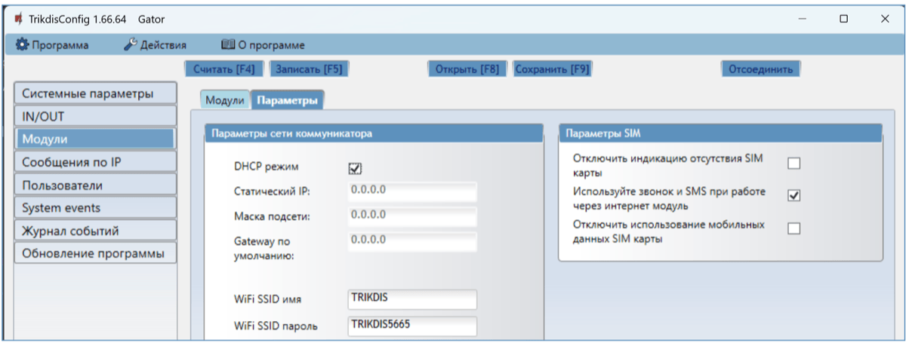

**Группа „Параметры сети коммуникатора“**

- **DHCP** **режим** – режим регистрации WiFi модуля в сети (ручной или автоматический). Отметьте поле галочкой (автоматический режим регистрации) и WiFi модуль автоматически считает сетевые настройки (шлюз, маску подсети) и ему будет присвоен IP адрес.

- **Статический IP** – статический IP адрес (при ручной регистрации).

- **Маска подсети** – адрес маски подсети (при ручной регистрации).

- **Gateway по умолчанию** – адрес шлюза сети (при ручной регистрации).

- **WiFi SSID имя** – введите имя WiFi сети, к которой подключится модуль W485.

- **WiFi SSID пароль** – введите пароль WiFi сети.

**Группа „Параметры SIM“**

- **Отключить индикацию отсутствия SIM карты** – отметив поле галочкой, будет отключена индикация отсутствия SIM карты в контроллере.

- **Используйте звонок и SMS при работе через интернет модуль** – отметив поле галочкой, будет включено управление контроллером SMS сообщениями и звонком. Если поле не отмечено и есть WiFi сеть, то звонок и SMS сообщения не используются. Если поле не отмечено и отсутствует WiFi cеть, то контроллером можно управлять звонком и SMS сообщениями. Контроллер будет отправлять SMS cообщения пользователю.

- **Отключить использование мобильных данных SIM-карты** – отметив поле галочкой, будет запрещено использование мобильного интернета с SIM карты. Данные будут отправляться только через модуль W485. Если WiFi сеть отключится, то данные будут сохраняться в памяти контроллера. После восстановления WiFi сети, контроллер отправит сохраненные данные через модуль W485.

**Окно настроек „Ethernet“ модуля E485**

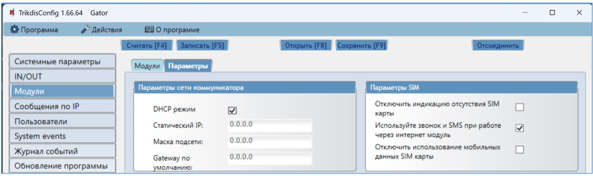

**Группа „Параметры сети коммуникатора“**

- **DHCP режим** – режим регистрации „Ethernet“ модуля в сети (ручной или автоматический). Отметьте поле галочкой (автоматический режим регистрации) и „Ethernet“ модуль автоматически считает сетевые настройки (шлюз, маска подсети) и ему будет присвоен IP адрес.

- **Статический IP** – статический IP адрес (при ручной регистрации).

- **Маска подсети** – адрес маски подсети (при ручной регистрации).

  - **Gateway по умолчанию** – адрес шлюза сети (при ручной регистрации).

**Группа „Параметры SIM“**

- **Отключить индикацию отсутствия SIM карты** – отметив поле галочкой, будет отключена индикация отсутствия SIM карты в контроллере.

- **Используйте звонок и SMS при работе через интернет модуль** – отметив поле галочкой, будет включено управление контроллером SMS сообщениями и звонком. Если поле не отмечено и есть интернет, то звонок и SMS сообщения не используются. Если поле не отмечено и отсутствует интернет, то контроллером можно управлять звонком и SMS сообщениями. Контроллер будет отправлять SMS cообщения пользователю.

- **Отключить использование мобильных данных SIM-карты** – отметив поле галочкой, будет запрещено использование мобильного интернета с SIM карты. Данные будут отправляться только через модуль Е485. Если интернет отключится, то данные будут сохраняться в памяти контроллера. После восстановления интернета, контроллер отправит сохраненные данные через модуль Е485.

### Окно „Сообщения по IP“ 

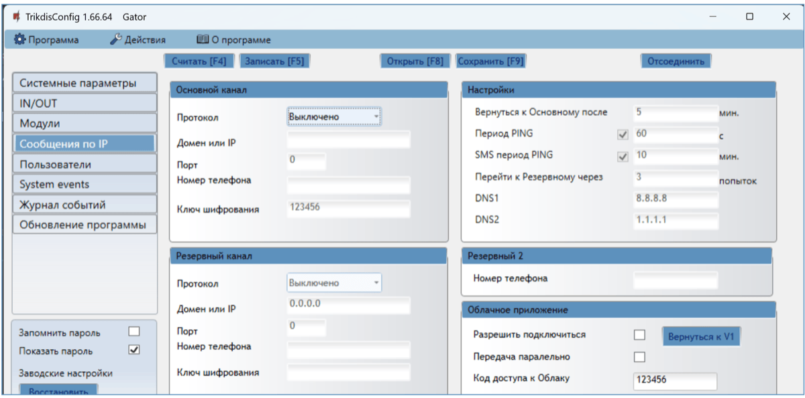

Контроллер может отправлять сообщения на приемник ПЦН охранной фирмы.

**Группа „Основной канал“**

- **Протокол** – выберите способ передачи сообщений (IP, SMS) на ПЦН (пульт централизованного наблюдения).

- **Домен или IP** – введите домен или IP адрес приемника ПЦН.

- **Порт** – введите номер порта приемника ПЦН в сети.

- **Номер телефона** – если выбран **Протокол** SMS, введите номер телефона (пример: 370хххххххх) SMS приемника ПЦН.

- **Ключ шифрования** – 6-значный ключ шифрования, который должен совпасть с ключом шифрования приемника ПЦН.

**Группа „Резервный канал“**

Настройки аналогичны **Основному каналу** связи.

**Группа „Настройки“**

- **Вернуться к Основному после** – интервал времени, после которого контроллер попытается восстановить связь с основным каналом связи.

- **Период PING** – активировать передачу PING сигнала и указать его периодичность.

- **SMS период PING** – активировать передачу SMS PING сигнала и указать его периодичность.

- **Перейти к резервному через** – указать количество неудачный попыток подсоединиться к **Основному каналу** связи, после чего контроллер автоматически переключится на **Резервный канал** связи.

- **DNS1 ir DNS2** – IP адреса DNS серверов.

**Группа „Резервный 2“**

- **Номер телефона** – номер телефона (пример: 370хххххххх) SMS приемника ПЦН, который способен принимать SMS сообщения. Второй резервный канал передает SMS сообщения лишь тогда, когда сообщения не могут быть переданы по основному и резервному каналам связи. Он особенно важен, при нарушении IP связи в сети оператора мобильной связи. Этот канал работает только в том случае, если в основном канале и резервном каналах установлен режим GPRS. SMS-сообщения будут отправлены в SMS-приемник ПЦН: 1) сразу после первого включения контроллера; 2) после прерывания соединения TCP/IP или UDP/IP в основном и резервном каналах связи.

**Группа „Облачное приложение“**

- **Разрешить подключиться** – отметив поле галочкой, включите облачный сервис. Контроллер сможет обмениваться данными с приложением Protegus2 и появится возможность удаленной конфигурации контроллера с программой TrikdisConfig.

- **Передача параллельно** – отметив поле галочкой, сообщения будут отправляться параллельно в ПЦН, в приложение Protegus2 и пользователям. В противном случае, сообщения в приложение Protegus2 и пользователям будут отправлены только после передачи данных в ПЦН.

- **Код доступа к Облаку** - 6-значный код доступа к Protegus2 (заводской код - 123456).

### Окно „Пользователи“ 

**Закладка „Пользователи“**

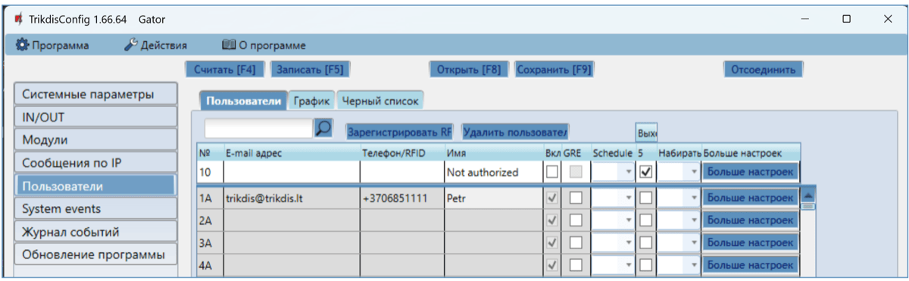

- **№** - номер пользователя по порядку. Номера с буквой „A“ (от 1А до 7А) являются номерами администраторов, которые смогут настраивать, управлять контроллером и получать сообщения. Остальные номера (от 11 до 1010) являются номерами пользователей, которые смогут только управлять контроллером.

- **E-mail адрес** – укажите адрес электронной почты пользователя.

- **Телефон/RFID** – укажите номер телефона или ID номер RFID карты (брелока) пользователя (пример номера телефона: +370хххххххх).

- **Имя** – введите имя пользователя.

- **Вкл**. – отметьте поле, чтобы пользователь был активирован.

- **GRE** – отметьте поле, чтобы пользователю контроллером GATOR было отправлено приветственное SMS сообщение.

- **График** – выберите номер графика, по которому пользователю будет разрешено управлять контроллером.

- **Выход** – отметьте поле, чтобы пользователь мог управлять выходом (OUT).

- **Код** - если к контроллеру подключен RFID считыватель с клавиатурой Wiegand 26/34, то пользователю можете ввести код управления.

- **Набирать** – отметьте выходы, которые будут автоматически активированы при звонке (если пользователю присвоены несколько выходов OUT), после чего звонок будет отклонен.

- **Больше настроек** – нажав на поле, откроется дополнительное окно настроек пользователя.

!!! note
    Снимите флажок с „**Вкл.**" пользователю №10 с именем **„Not
    authorised**"**.** Так будет запрещено управление выходом контроллера
    лицам, невнесенным в список пользователей.
Настройки администратора (номера от 1А до 7А)

- № - порядковый номер администратора.

- Включено – отметьте поле, чтобы администратору было разрешено управлять выходами.

- Имя – введите имя администратора.

- E-mail адрес – введите адрес электронной почты администратора.

- Телефон или RFID код – введите номер телефона администратора или ID номер RFID карты администратора.

- Код клавиатуры – если к контроллеру подключен RFID считыватель с клавиатурой Wiegand 26/34, то пользователю можете ввести код управления.

- Подтверждение на SMS сообщение – отметьте поле, и администратор будет получать ответы SMS сообщениями, когда контроллер будет управляться и конфигурироваться SMS сообщениями.

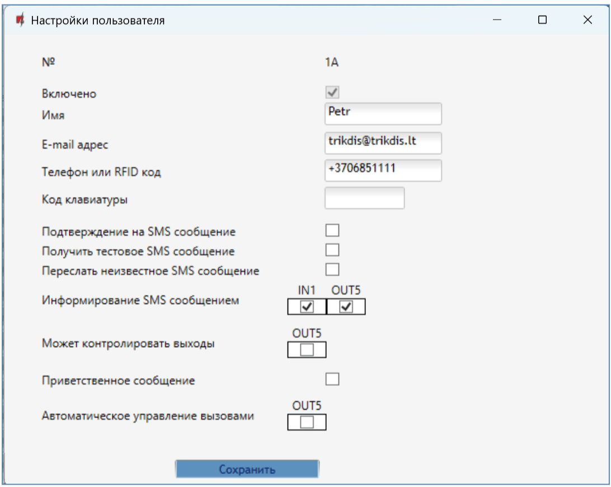

- **Получить тестовое SMS сообщение** – отметьте поле, и администратор будет получать тестовые SMS сообщения.

- **Переслать неизвестное SMS сообщение** – отметьте поле и включите переадресацию SMS сообщений с неизвестных номеров телефонов.

- **Информирование SMS сообщением** – отметьте входы (INx) и выходы (OUTx), о срабатывании которых будет извещен администратор SMS сообщениями.

- **Может контролировать выходы** - отметьте номер выхода, которым будет управлять администратор.

- **Приветственное сообщение –** отметьте поле, чтобы пользователю контроллером GATOR было отправлено приветственное SMS сообщение.

- **Автоматическое управление выходом при звонке -** отметьте выходы, которые будут автоматически активированы при звонке (если пользователю присвоены несколько выходов OUT), после чего звонок будет отклонен.

  **Настройки пользователя (номера от 11 до 1010)**
- № - номер пользователя.

- Включено – отметьте поле, чтобы пользователю было разрешено управлять выходами.

- Имя – введите имя пользователя.

- E-mail адрес – введите адрес электронной почты пользователя.

- Телефон или RFID код – введите номер телефона пользователя или ID номер RFID карты пользователя.

- Код клавиатуры – введите код пользователя RFID считывателя с клавиатурой.

- Назначить график – пользователю назначается номер временного графика (указываются требуемые номера графиков и его настройки устанавливаются во вкладке „График“), когда пользователь может управлять выходами OUT.

- От – укажите дату и время, с которого пользователь может управлять выходами контроллера.

- **До** – укажите дату и время, до которого пользователь может управлять выходами контроллера.

- **Вкл. счетчик** – отметьте поле, чтобы включить счетчик.

- **Установить счетчик** – укажите сколько раз пользователь может управлять выходом контроллера, в течении установленного промежутка времени.

- **Текущий счетчик** - текущее число количеств управлений выходом контроллера.

- **Может контролировать выходы** - отметьте номер выхода, которым будет управлять пользователь.

- **Приветственное сообщение –** отметьте поле, чтобы пользователю контроллером GATOR было отправлено приветственное SMS сообщение.

- **Автоматическое управление выходом при звонке -** отметьте выходы, которые будут автоматически активированы при звонке (если пользователю присвоены несколько выходов OUT), после чего звонок будет отклонен.

#### Регистрация RFID карточек (брелоков) 

1.  Подключите RFID считыватель к контроллеру (см. п.2.6 „Схема подключения RFID считывателя (Wiegand 26/34)“). Подсоедините USB Mini-B кабель к контроллеру. В программе TrikdisConfig укажите сколько считывателей подсоединено к контроллеру.

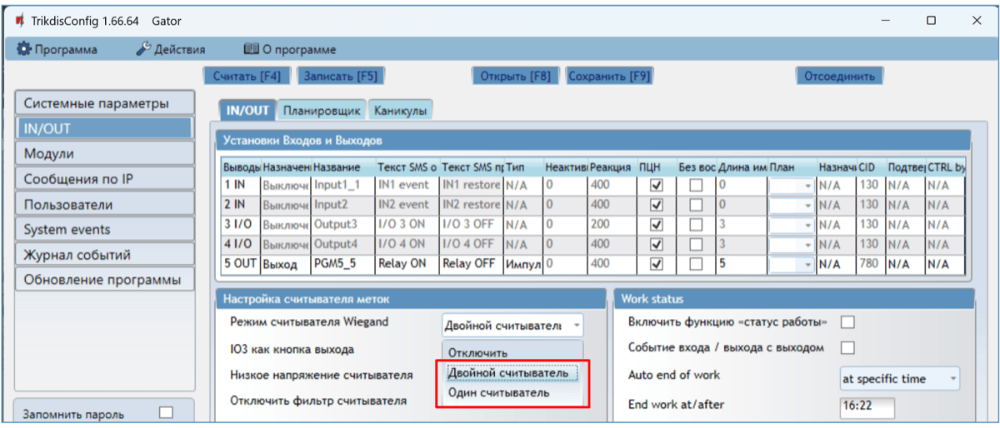

В окне „Пользователи“ нажмите на кнопку **Зарегистрировать RFID**.

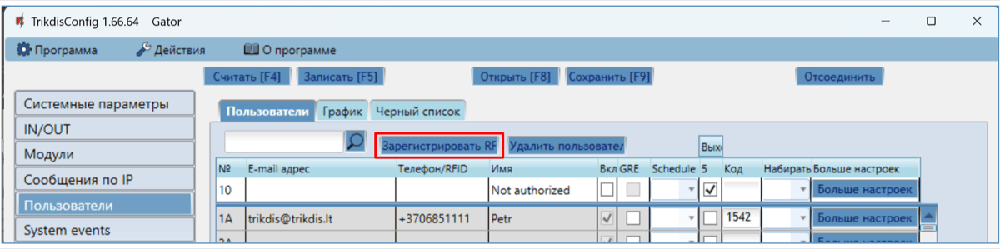

Откроется окно регистрации RFID карточек (брелоков).

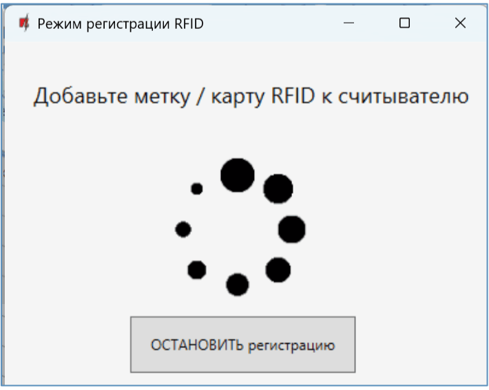

Приложите RFID карточку к считывателю. Когда считыватель считает RFID карточку (брелок), то откроется новое окно программы, в котором необходимо „**Ввести имя пользователя**“ и отметить поле „**Пользователь может контролировать PGM выход 5**“. Нажмите кнопку „**Добавить**“. При необходимости добавить еще RFID карточек (брелоков) повторите шаги, описанные выше. Когда регистрация RFID карточек (брелоков) будет окончена нажмите на кнопку „**Остановить регистрацию**“. / Нажмите на кнопку **Записать [F5]**, чтобы список RFID карточек был записан в контроллер.

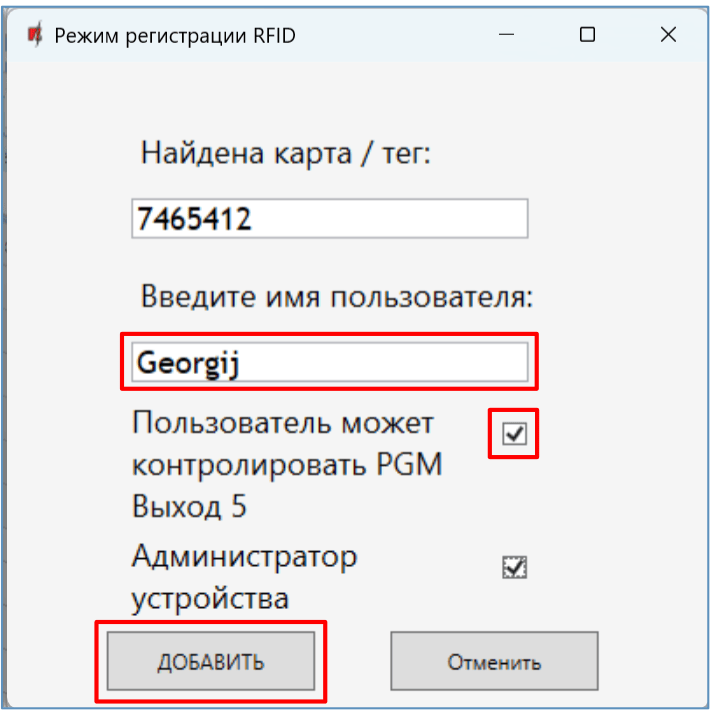

Регистрацию RFID карточки (брелока) можно выполнить в программе *TrikdisConfig*, вводя ID номер RFID карточки в поле „Телефон/RFID“. Введите имя пользователя. Отметьте поле „Вкл.“ и „Выход 5“. Нажмите на кнопку Записать [F5], чтобы список RFID карточек был записан в контроллер.

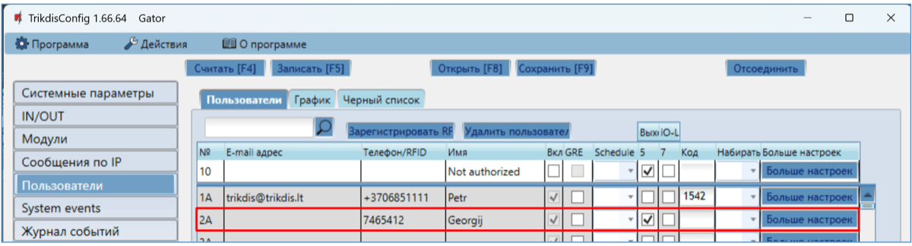

2. Регистрация RFID карточек (брелоков) в приложении Protegus2.

В приложении *Protegus2* выберите Settings / Users / Add new user (Добавить нового пользователя). Введите адрес электронной почты (E-mail address), имя пользователя (Name), ID номер RFID карточки (брелока) (Phone number or RFID code), 4-значный код пользователя (если применяется RFID считыватель с клавиатурой) (Code). Отметьте контролируемый выход. Нажмите „Save“.

**Закладка „График“**

Выходы (OUT) могут управляться пользователем в соответствии с установленным графиком (расписанием). Расписание должно быть назначено пользователю.

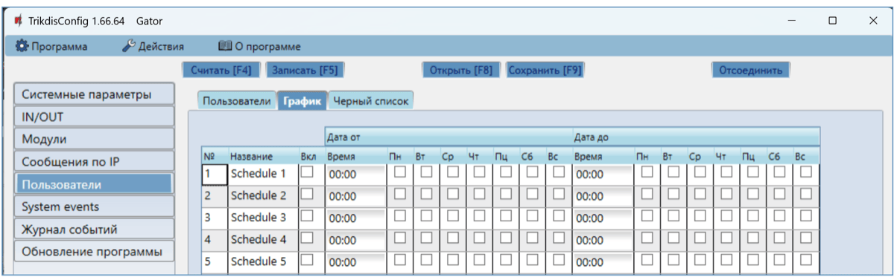

- **Название** – введите название графика.

- **Вкл.** – отметьте поле, чтобы включить временной график управления выходами контроллера.

- **Дата от** - укажите время и день недели, с которого пользователю будет разрешено управлять выходами контроллера.

- **Дата до** – укажите время и день недели, до которого пользователю будет разрешено управлять выходами контроллера.

**Закладка „Черный список“**

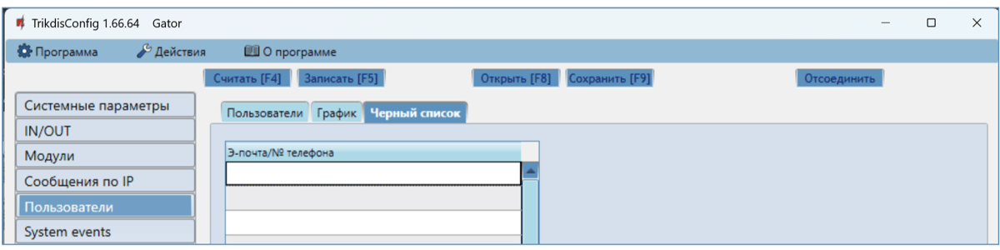

В „**Черный список**“ вносятся адреса электронной почты пользователей, телефонные номера пользователей, ID номера RFID карточек, которым будет запрещено управлять контроллером.

Удобно вносить пользователей в „**Черный список**“ прямо из „**Журнала событий**“. В „**Журнале событий**“ нужно щелкнуть правой кнопкой мышки по номеру телефона, адресу электронной почты или ID номеру RFID карточки и выбрать „**Добавить в черный список**“**.**

### Окно „System events“ 

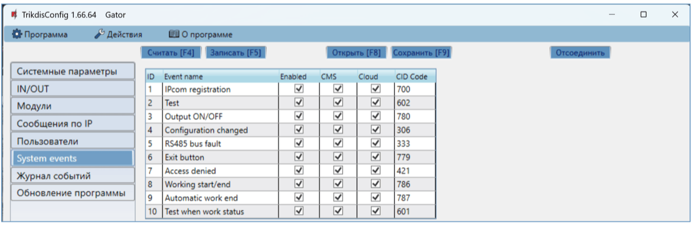

Настройка отправки событий контроллера на ПЦН и в приложение Protegus2.

- **ID (№)** – порядковый номер события.

- **Event name (Название события)** – наименование события.

- **Enabled (Включить)** – отметьте поле и будет разрешено отправлять сообщение о событии.

- **CMS (ПЦН)** – отметьте поле и сообщения будут отправляться на ПЦН (пульт централизованного наблюдения).

- **Cloud (Прот**.**)** – отметьте поле и будет разрешено отправлять сообщения в приложение Protegus2.

- **CID code (CID код)** –код события в формате Contact ID.

### Окно „Журнал событий“

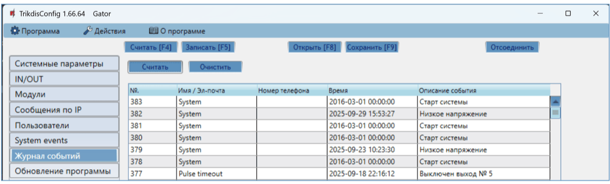

Нажмите кнопку „**Считать**“. „**Журнал событий**“ будет считан из памяти контроллера. „**Журнал событий**“ предоставляет информацию о выполненных действиях контроллером и его внутренних событиях.

### Восстановление заводских настроек 

Для восстановления заводских настроек контроллера необходимо в программном окне TrikdisConfig нажать кнопку „**Восстановить**“**.**

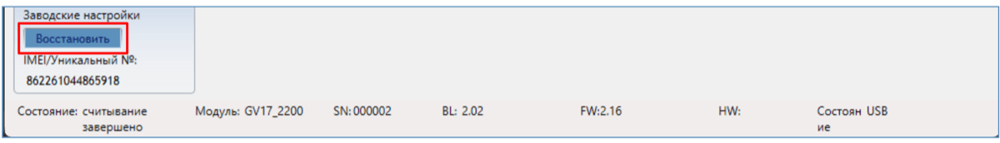

### Настройки для индикации положения ворот 

Приложение Protegus2 и Виджет могут отображать реальное положение ворот (ворота открыты или закрыты). Для этого вход контроллера IN1 должен быть подключен в блоке автоматики ворот к выходу состояния положения ворот, см. п. 2.5 „ Схема подключения контроллера GATOR к автоматике ворот “.

В программе TrikdisConfig в окне „IN/OUT“ необходимо назначить подключенный вход IN1 к выходу OUT, который будет управлять воротами.

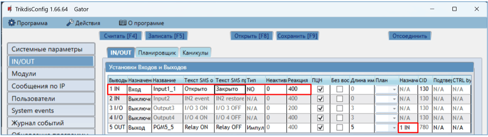

Чтобы получать SMS сообщения об открытии/закрытии ворот, введите тексты SMS сообщений об активации и восстановлении состояния входа IN1.

В окне „**Пользователи**“ нажмите на кнопку „**Больше настроек**“.

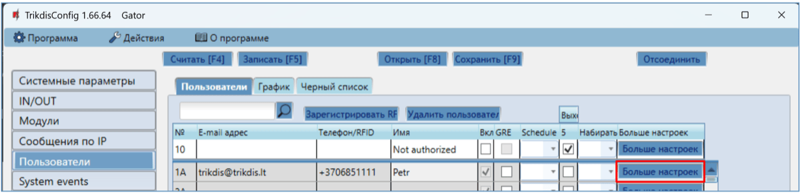

В окне „Настройки пользователя“ отметьте поле IN1, чтобы пользователь получал SMS сообщения о положении ворот. Нажмите „Сохранить“.

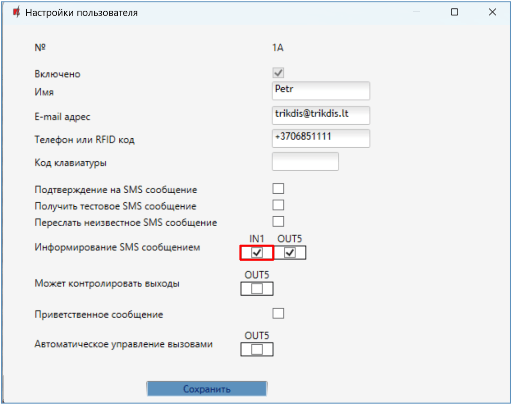

## Удаленная настройка рабочих параметров 

!!! note
    Удаленная настройка возможна тогда, когда у контроллера:
    
    1.  Включен Protegus сервис (см. п. 5.5 „Сообщения по IP").
    
    2.  Включено питание (мигает зеленый „**POWER**" индикатор).
    
    3.  SIM карта контроллера зарегистрировалась в сети (светит зеленый и
        мигает желтый „**NETWORK**" индикатор).
1.  Загрузите программу TrikdisConfig с сайта [www.trikdis.com/ru/](http://www.trikdis.com/ru/) и установите ее.

2.  Убедитесь, что контроллер подключен к интернету и включен Protegus сервис.

3.  Запустите программу TrikdisConfig. В разделе „**Удаленный доступ**“ введите IMEI номер контроллера в поле „Уникальный №“. IMEI номер указан на наклейке, которая приклеена на корпусе контроллера и на упаковке.

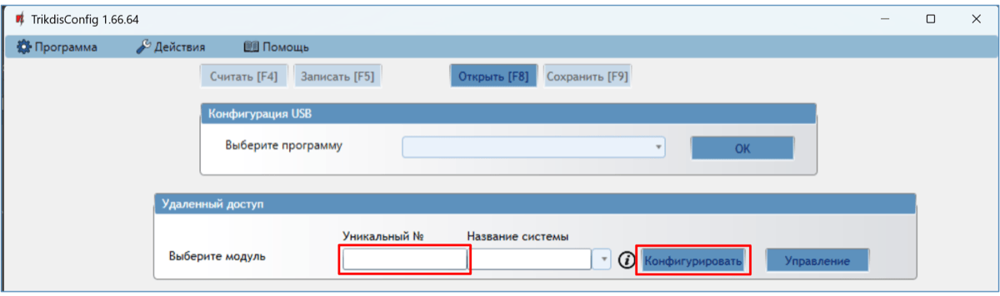

4. В поле „**Название системы**“ введите наименование системы. Нажмите кнопку „**Конфигурировать**“.

2.  Откроется окно конфигурации контроллера. Нажмите кнопку **Считать [F4]**. Программа считает настройки контроллера. Если откроется окно запроса ввода кода администратора, введите шестизначное значение кода администратора. Чтобы программа запомнила код, установите флажок в поле „**Запомнить пароль**“ и нажмите кнопку **Записать [F5]**.

3.  Сделайте необходимые настройки контроллеру. Окончив конфигурацию, нажмите кнопку **Записать [F5]**. Чтобы отключиться от контроллера, нажмите кнопку „**Отсоединить**“ и выключите программу TrikdisConfig.

## Тестирование контроллера GSM 

После завершения установки и настройки контроллера, выполните проверку системы:

1.  Убедитесь, что включено питание.

2.  Проверьте подключение к мобильной сети („**NETWORK**“ индикатор: светит зеленый и мигает желтый).

3.  Чтобы проверить входы контроллера, активируйте их и убедитесь, что сообщения отправляются получателям.

4.  Чтобы проверить выходы контроллера, активируйте их удаленно и убедитесь, что сообщения отправляются получателям и что выходы активируются.

## Обновление прошивки контроллера 

!!! note
    Контроллер подключен к программе TrikdisConfig. Программа
    предложит обновить прошивку контроллера, если есть новая версия
    прошивки. Для обновления прошивки компьютер должен быть подключен к
    интернету. / Если на вашем компьютере установлена антивирусная
    программа, то она может заблокировать функцию автоматического обновления
    программного обеспечения. В этом случае вам придется перенастроить
    антивирусную программу.
Прошивку контроллера можно обновить или изменить вручную. После обновления прошивки все настройки контроллера сохраняются. Прошивка может быть изменена на более новую или более старую версию. Чтобы изменить прошивку выполните следующие действия:

1.  Запустите программу TrikdisConfig.

2.  Подключите контроллер к компьютеру через USB mini-B кабель или удаленно. Если есть новая прошивка контроллера, программа предложит обновить прошивку контроллера на более новую.

3.  Выберите в меню „**Обновление программы**“.

4.  Щелкните по кнопке „**Открыть файл**“ и выберите необходимый файл прошивки.

    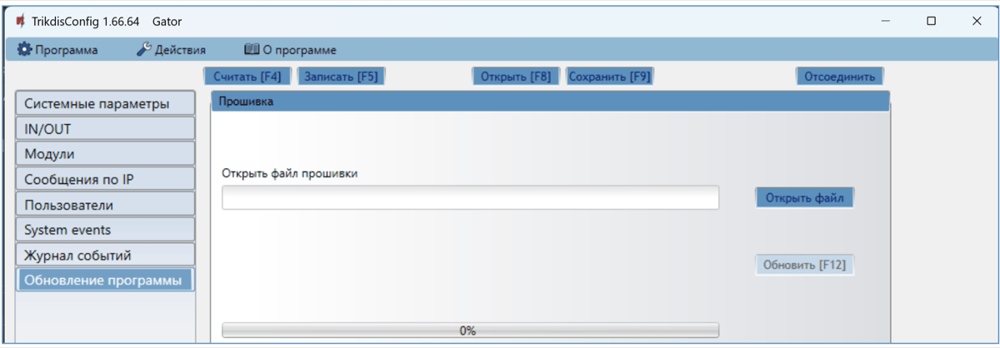

5.  Нажмите кнопку **Oбновить [F12].**

6.  Дождитесь окончания процесса обновления прошивки контроллера.

## Требование безопасности 

Только квалифицированный персонал может устанавливать и обслуживать GSM контроллер управления воротами.

Внимательно прочитайте это руководство перед установкой, чтобы избежать ошибок, которые могут привести к неисправности изделия или даже к его повреждению.

Отключите напряжение питания перед подключением контроллера.

Изменения, модификации или ремонт контроллера, произведенные не производителем, аннулируют гарантию производителя.

Соблюдайте нормы местного законодательства и не утилизируйте изделие или его компоненты вместе с другими бытовыми отходами.
