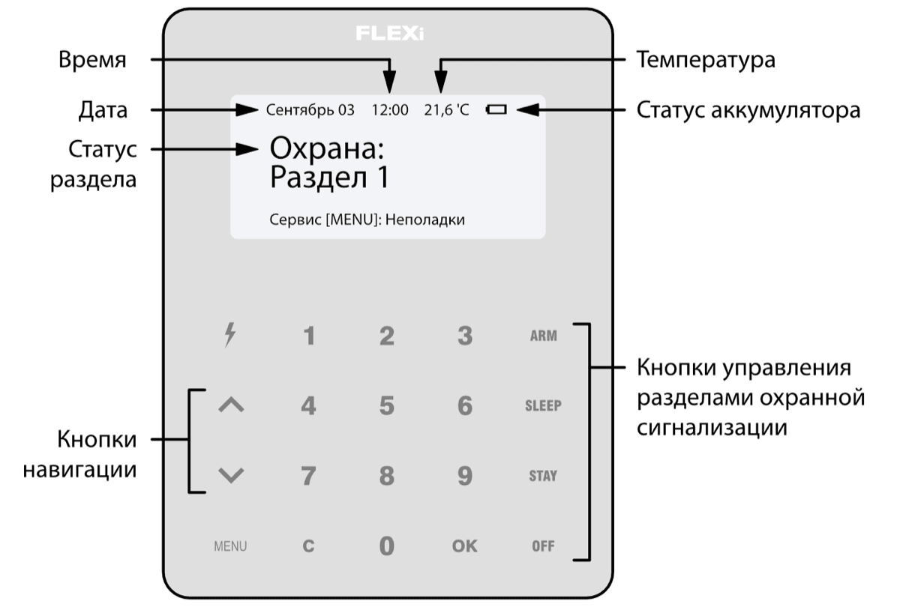

# FLEXi / Клавиатура SK-LCD TouchPad – Краткая инструкция по применению

## Обзор клавиатуры

> [!NOTE]
> Клавиатура SK-LCD TouchPad обеспечивает отображение 64 зон и 8 разделов охранной сигнализации. Кроме того, клавиатуру SK-LCD TouchPad можно назначить для управления одной или несколькими желаемыми разделами охранной сигнализации (версия прошивки клавиатуры от FW:1.41, версия прошивки охранной панели от FW:SP3_xxx4_0119). На клавиатуре будет отображаться статус раздела и статусы зон раздела.

## Постановка/Снятие с охраны

### Постановка на охрану (ARM)

Убедитесь, что все зоны не активированы.

1. Нажмите **ARM**.

2. Введите **[Код пользователя]**.

3. Если в системе только один раздел, пропустите шаги 4 и 5.

4. Нажмите кнопки с номерами разделов, которыми вы хотите управлять.

5. Подтвердите свой выбор, нажав кнопку **OK**.

6. Выйдите из помещения вовремя **Exit delay** задержки на выход.

Во время обратного отсчета задержки на выход **(Exit delay)** на экране клавиатуры будет отображаться время выхода. После постановки на охрану на экране клавиатуры будет отображена надпись: **Охрана: Раздел**.

### Снятие с охраны (Disarm)

1. Нажмите **OFF**.

2. Введите **[Код пользователя]**.

3. Если в системе только один раздел, пропустите шаги 4 и 5.

4. Нажмите кнопки с номерами разделов, которыми вы хотите управлять.

5. Подтвердите свой выбор, нажав кнопку **OK**.

После снятия с охраны на экране клавиатуры будет отображена надпись: **Не охраняется: Раздел**.

> [!NOTE]
> Для изменения статуса раздела охранной сигнализации на противоположный, просто введите код пользователя и выберите желаемый раздел. Для удаления введенных символов или команд, нажмите **C**.

### Включение режима SLEEP

(Охраняется периметр помещения. Внутри разрешено движение. Если открыть входную дверь, тревога сработает немедленно):

1. Нажмите **SLEEP** на клавиатуре.

2. Введите **[Код пользователя]**.

3. Если в системе только один раздел, пропустите шаги 4 и 5.

4. Нажмите кнопки с номерами разделов, которыми вы хотите управлять.

5. Подтвердите свой выбор, нажав кнопку **OK**.

6. После постановки на охрану на экране клавиатуры будет отображена надпись: **Sleep: Раздел**.

### Включение режима STAY

(Охраняется периметр помещения. Внутри разрешено движение. Открытие входной двери включает задержку, в течение которой нужно снять систему с охраны):

1. Нажмите **STAY** на клавиатуре.

2. Введите **[Код пользователя]**.

3. Если в системе только один раздел, пропустите шаги 4 и 5.

4. Нажмите кнопки с номерами разделов, которыми вы хотите управлять.

5. Подтвердите свой выбор, нажав кнопку **OK**.

6. После постановки на охрану на экране клавиатуры будет отображена надпись: **Stay: Раздел**.

## Кнопки помощи

**<u>Отправление экстренное сообщения охранному предприятию о возникшей опасности</u>**

- **Паника** – нажмите и удерживайте кнопку **1** в течение 3 сек.

- **Медицина** – нажмите и удерживайте кнопку **4** в течение 3 сек.

- **Пожарная** – нажмите и удерживайте кнопку **7** в течение 3 сек.

## Регулировка яркости экрана и громкости индикации

### Для регулировки яркости подсветки клавиатуры и громкости индикации необходимо

1. Нажмите **MENU** на клавиатуре.

2. Нажмите **5**.

3. Для регулирования громкости нажмите **2** и кнопками   установите необходимый уровень громкости. Подтвердите свой выбор, нажав кнопку **OK**.

4. Для регулирования яркости экрана клавиатуры нажмите **4** и кнопками   установите необходимый уровень яркости. Подтвердите свой выбор, нажав кнопку **OK**.

5. Для регулирования яркости клавиатуры нажмите **3** и кнопками   установите необходимый уровень яркости. Подтвердите свой выбор, нажав кнопку **OK**.

## Ввод или изменение кодов пользователей или мастер-кода

### Ввод или изменение кодов пользователей

1. Нажмите  на клавиатуре.

2. Введите 6-значный **[Код администратора]** (заводской код: 123456).

3. Введите требуемый двузначный порядковый номер пользователя.

4. Введите 4-значный **[Код пользователя]**.

5. Повторно введите 4-значный **[Код пользователя]**.

6. Введите номера разделов охранной сигнализации, которыми будет управлять пользователь.

7. Подтвердите свой выбор, нажав кнопку **OK**.

8. Нажмите кнопку **C**, чтобы выйти из режима ввода кодов пользователей.

## Перезапуск двухпроводных пожарных (дымовых) извещателей

**<u>Для перезапуска двухпроводных пожарных (дымовых) извещателей необходимо</u>**

- Нажмите и удерживайте кнопку  в течение 3 сек.

> [!NOTE]
> После активации пожарного извещателя, он автоматически не перезапускается. Пожарный извещатель перезапускается только вручную.

## Временное отключение мониторинга зоны (функция BYPASS)

### Включение функции BYPASS

1. Нажмите **MENU** на клавиатуре.

2. Нажмите **3**.

3. Введите **[Код пользователя]**.

4. Введите двухзначные номера зон, которые хотите отключить.

5. Подтвердите свой выбор, нажав кнопку **OK**.

6. Клавиатура выйдет из режима **Bypass**.

**<u>Отключение функции BYPASS</u>**

Повторите те же шаги, что и для включения функции **Bypass**.

## Удаление кодов пользователей

### Удаление кода пользователя

1. Нажмите  на клавиатуре.

2. Введите 6-значный **[Код администратора]** (заводской код: 123456).

3. Введите требуемый двузначный порядковый номер пользователя.

4. Нажмите кнопку **SLEEP**.

5. Нажмите кнопку **C**, чтобы выйти из режима удаления кодов.
