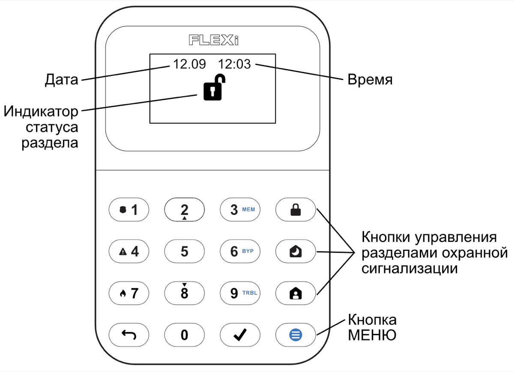
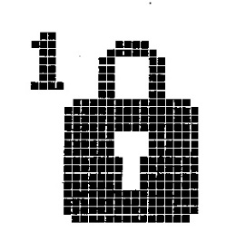
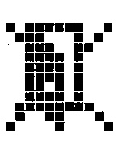
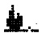
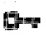
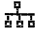
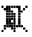

# FLEXi / Клавиатура SK-LCD button – Краткая инструкция по применению

## Обзор клавиатуры

> [!NOTE]
> Клавиатура „SK-LCD button“ обеспечивает отображение **64 зон и 8 разделов** охранной сигнализации. Кроме того, клавиатуру „SK- LCD button“ можно назначить для управления одной или несколькими желаемыми разделами охранной сигнализации (версия прошивки охранной панели от FW:SP3_xxx4_0121). На клавиатуре будет отображаться статус раздела и статусы зон раздела.

## Постановка/Снятие с охраны

### Постановка на охрану (ARM)

1. Убедитесь, что нет активных зон.

2. Нажмите  на клавиатуре.

3. Введите код пользователя.

4. Нажмите номера разделов, которыми вы хотите управлять.

5. Нажмите кнопку .

6. Выйдите из помещения во время „**Exit delay“** задержки на выход.

Когда система поставлена на охрану, загорится икона  .

### Снятие с охраны (Disarm)

1. Введите код пользователя.

2. Нажмите кнопки с номерами разделов, которыми вы хотите управлять.

3. Нажмите кнопку .

После снятия сигнализации с охраны, должна загореться икона .

### Включение режима SLEEP

(Охраняется периметр помещения. Внутри разрешено движение. Если открыть входную дверь, тревога сработает немедленно):

1. Нажмите кнопку .

2. Введите код пользователя.

3. Нажмите кнопку раздела для включения.

4. Нажмите кнопку .

5. Режим SLEEP включится сразу, без задержки выхода.

Индикатор  загорится, когда режим SLEEP включен.

### Включение режима STAY

(Охраняется периметр помещения. Внутри разрешено движение. Открытие входной двери включает задержку, в течение которой нужно снять систему с охраны):

1. Нажмите кнопку .

2. Введите код пользователя.

3. Нажмите кнопку раздела для включения.

4. Нажмите кнопку .

5. Режим STAY включится сразу, без задержки выхода.

Индикатор  загорится, когда режим STAY включен.

> [!NOTE]
> Для изменения статуса раздела охранной сигнализации на противоположный, просто введите код пользователя и выберите желаемый раздел. Для удаления введенных символов или команд, нажмите .

## Кнопки помощи

**<u>Отправление экстренного сообщения охранному предприятию о возникшей опасности</u>**
- **Паника** – нажмите и удерживайте кнопку **1** 3 сек..

- **Медицина** – нажмите и удерживайте кнопку **4** 3 сек..

- **Пожар** – нажмите и удерживайте кнопку **7** 3 сек..

## Регулировка яркости экрана и громкости индикации

### Регулировка яркости подсветки кнопок клавиатуры

1. Нажмите кнопку , затем **5** **3**.

2. Выберите желаемую яркость подсветки кнопок клавиатуры с помощью кнопок **2** и **8**.

3. Нажмите , чтобы сохранить новое значение.

**<u>Регулировка яркости ЖК-экрана:</u>**

4. Нажмите кнопку , затем **5** **2**.

5. С помощью кнопок **2** и **8** выберите желаемую яркость подсветки ЖК-экрана.

6. Нажмите , чтобы сохранить новое значение.

**<u>Регулировка громкости нажатия клавиш клавиатуры:</u>**

7. Нажмите кнопку , затем **5** **1**.

8. Выберите предпочтительный уровень звуковой индикации с помощью кнопок **2** и **8**.

9. Нажмите , чтобы сохранить новое значение.
> [!NOTE]
> Отключение подсветки клавиатуры в режиме ожидания. Нажмите  с последующим нажатием **5** **4**. Переключите состояние подсветки клавиатуры в режиме ожидания, нажав **1** (подсветка включена) или **2** (подсветка выключена). Нажмите , чтобы сохранить новое значение.

## Ввод или изменение кодов пользователей или мастер-кода

### Ввод или изменение кодов пользователей

1. Нажмите кнопку , затем **0**.

2. Введите **Мастер** код (заводской код: 1234).

3. Введите требуемый двузначный порядковый номер пользователя, например, **02**.
> [!NOTE]
> Порядковый номер **Мастер**-кода – **01**.

4. Дважды введите новый код пользователя.

5. Введите номера разделов охранной сигнализации, которыми будет управлять пользователь.

6. Нажмите кнопку . Нажмите кнопку  для выхода.

## Перезапуск пожарных (дымовых) извещателей

### Для перезапуска пожарных (дымовых) извещателей необходимо

- Нажмите и удерживайте кнопку ******** в течение 3 сек.
> [!NOTE]
> После активации пожарного извещателя, он автоматически не перезапускается. Пожарный извещатель перезапускается только вручную.

## Временное отключение мониторинга зоны (функция BYPASS)

### Включение функции BYPASS

1. Нажмите кнопку , затем **6**.

2. Введите код пользователя.

3. Введите двухзначные номера зон, которые хотите отключить.

4. Нажмите кнопку . На ЖК-экране появится икона [ ].

**<u>Отключение функции BYPASS:</u>**

Повторите те же шаги, что и для включения функции **Bypass**.

## Удаление кодов пользователей

### Удаление кода пользователя

1. Нажмите кнопку , затем **0**.

2. Введите **Мастер** код.

3. Введите требуемый двузначный порядковый номер пользователя, например, **02**.

4. Нажмите кнопку ********. Раздастся звуковой сигнал.

5. Нажмите кнопку .

## Графические обозначения

| Символ | Описание | Символ | Описание |
|---|---|---|---|
|  | Центральный блок не подключен |  | Неисправность пожарного шлейфа |
|  | Раздел 1 под охраной |  | Список сетевых неисправностей |
|  | Раздел 4 снят с охраны |  | Неисправность CMS 1 (2) |
|  | Раздел 2 STAY |  | Неисправность облака |
|  | Раздел 3 SLEEP |  | Неисправность SIM-карты |
|  | Кнопка MENU |  | Ошибка пароля SIM-карты |
|  | Кнопка ENTER |  | Неисправность сети SIM-карты |
|  | Раздел |  | Неисправность WiFi |
|  | Тревога |  | Неисправность интерфейса RS485 |
|  | Пожар |  | Неисправность SIM-карты 2 |
|  | Код пользователя |  | Неисправность LAN |
|  | Пользователь |  | Низкий заряд беспроводного устройства |
|  | Вход/Выход |  | Неисправность питания |
|  | Зона открыта |  | Неисправность сирены |
|  | Обход |  | Неисправность вскрытия |
|  | Память |  | Неисправность антимаскирования |
|  | Неисправность |  | Неисправность беспроводной связи |
|  | Список системных неисправностей |  | Неисправность модуля расширения |
|  | Неисправность питания AC |  | Настройки |
|  | Неисправность батареи |  | Громкость |
|  | Перегрузка AUX |  | Яркость LCD |
|  | Время не установлено |  | Яркость клавиатуры |
|  | Перегрузка сирены |  | Дежурная подсветка O-Вкл / I-Выкл |
|  | Сирена отсутствует |  | Информация |
