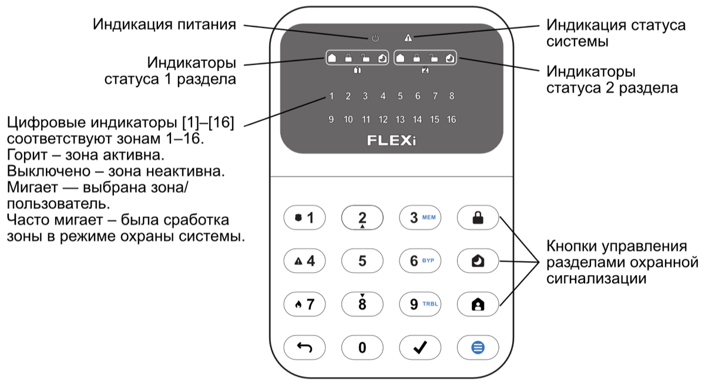

# **FLEXi** / **Клавиатура** **SK-LED button – Краткая инструкция по применению**

  

**FLEXi** / **Клавиатура** **SK-LED button – Краткая инструкция по применению**

### Обзор клавиатуры

### Постановка/Снятие с охраны

**<u>Постановка на охрану (ARM):</u>**

1.  Нажмите [] на клавиатуре.

После ввода кода индикатор  будет мигать в течение времени задержки на выход. Когда система поставлена на охрану, загорится индикатор .

**<u>Снятие с охраны (Disarm)</u>:**

1.  Нажмите кнопки с номерами разделов, которыми вы хотите управлять.

После снятия сигнализации с охраны, должен загореться индикатор .

**<u>Режим охраны SLEEP:</u>**

(Осуществляется охрана периметра помещений. Разрешается пребывать внутри помещений. Охранная сигнализация сработает мгновенно, как только откроете входную дверь):

2. Введите код пользователя.

Когда включен режим SLEEP загорается индикатор .

**<u>Режим охраны STAY</u>**:

(Осуществляется охрана периметра помещений. Внутри помещений разрешается пребывать. Если открыть входную дверь в помещение, начнется отсчет времени входа, во время которого необходимо отключить сигнализацию):

3. Введите код пользователя.

Когда включен режим STAY загорается индикатор .

Для изменения статуса раздела охранной сигнализации на противоположный, просто введите код пользователя и выберите желаемый раздел. Для удаления введенных символов или команд, нажмите [].

### Кнопки помощи

#### Перезапуск пожарных (дымовых) извещателей

<u>Отправление экстренного сообщения охранному предприятию о возникшей опасности:</u>

- **Паника** – нажмите и удерживайте кнопку **[1]** 3 сек..

- **Медицина** – нажмите и удерживайте кнопку **[4]** 3 сек..

- **Пожар** – нажмите и удерживайте кнопку **[7]** 3 сек..

<u>Для перезапуска пожарных (дымовых) извещателей необходимо:</u>

- Нажмите и удерживайте кнопку **[****]** в течение 3 сек.

**<u>Примечание:</u>** После активации пожарного извещателя, он автоматически не перезапускается. Пожарный извещатель перезапускается только вручную.

Регулировка яркости экрана и громкости индикации

Временное отключение мониторинга зоны (функция BYPASS)

<u>Регулировка яркости подсветки кнопок клавиатуры:</u>

1.  Выберите желаемую яркость подсветки кнопок клавиатуры с помощью кнопок [**2**] и [**8**].

<u>Регулировка яркости подсветки индикации зон:</u>

1.  С помощью кнопок [**2**] и [**8**] выберите желаемую яркость подсветки индикации зон.

<u>Регулировка громкости нажатия клавиш клавиатуры:</u>

1.  Выберите предпочтительный уровень звуковой индикации с помощью кнопок [**2**] и [**8**].

**<u>Примечание</u>**: Отключение подсветки клавиатуры в режиме ожидания. Нажмите [] с последующим нажатием [**5**] переключаем состояния подсветки индикаторов клавиатуры в режиме ожидания. Нажмите [ ], чтобы сохранить новое значение. Нажмите кнопку [ ] для выхода.

**<u>Включение функции BYPASS:</u>**

2. Введите код пользователя. Индикатор [] начнет мигать зеленым.

**<u>Отключение функции BYPASS:</u>**

Повторите те же шаги, что и для включения функции **Bypass**.

Ввод или изменение кодов пользователей или мастер-кода

#### Удаление кодов пользователей

<u>Ввод или изменение кодов пользователей:</u>

1.  Введите Мастер код (заводской код: 1234).

**<u>Примечание:</u>** Порядковый номер Мастер-кода – [01].

**<u>Удаление кода пользователя:</u>**

1.  Введите номера разделов охранной сигнализации, которыми будет управлять пользователь.
1.  Введите Мастер код.

Клавиатура „SK-LED button“ обеспечивает отображение 16 зон и 2 разделов охранной сигнализации. Кроме того, клавиатуру „SK- LED button“ можно назначить для управления одной или несколькими желаемыми разделами охранной сигнализации (версия прошивки клавиатуры от FW:1.0, версия прошивки охранной панели от FW:SP3_xxx4_0120). На клавиатуре будет отображаться статус раздела и статусы зон раздела.
