# RL14 IP/SMS Приёмник

  

Перед эксплуатацией IP/SMS приёмника RL14 необходимо ознакомится с настоящей инструкцией и в ходе работы с приёмником соблюдать указанные требования безопасности!

IP/SMS приёмник RL14 является технической частью охранной системы, работающей в непрерывном режиме. Чтобы предотвратить возможные травмы (переменный ток, тепловое излучение), а также обеспечить надёжную и долговременную эксплуатацию приёмника, требуется соблюдать указанные требования безопасности.

Рабочее положение многоканального приёмника - горизонтальное.

Светящийся синий светодиод приёмника “Power” обозначает, что питание включено и устройство работает от сети переменного тока.

!!! warning

    IP/SMS приёмник RL14 -- электрооборудование, поэтому устанавливать его
    могут квалифицированные специалисты, имеющие знания об установке
    электротехнического оборудования, знающие основы организации
    компьютерных сетей, руководствуясь настоящей инструкцией и общими
    правилами установки электрооборудования установки.

IP/SMS приёмник RL14 питается от однофазной сети переменного тока частотой 50 / 60 Гц, напряжением от 110 до 240 В или от резервного аккумулятора напряжением 12 В. Потребляемая от сети переменного тока мощность не превышает 60 Вт.

При перегорании сетевого предохранителя, в приборе частично остаётся напряжение. Необходимо отключить кабель питания или обесточить устройство другим способом.

При подключении наружного источника питания, необходимо соблюдать полярность.

!!! warning

    ПЕРЕД СНЯТИЕМ КРЫШЕК ПРИЁМНИКА, НЕОБХОДИМО ОТКЛЮЧИТЬ ПИТАНИЕ ОТ СЕТИ
    ПЕРЕМЕННОГО ТОКА !

Приёмник от сети переменного тока отключается выключателем на задней стенке приёмника и отсоединением кабеля питания.

!!! warning

    IP/SMS ПРИЁМНИК RL14 ДОЛЖЕН БЫТЬ ЗАЗЕМЛЁН !

##  Назначение приёмника

IP/SMS приёмник RL14 используется в пультах централизованного наблюдения и предназначен для приёма сообщений передающих модулей ТРИКДИС, передаваемых протоколами TCP/UDP и/или SMS сообщениями.

Принятые сообщения приёмник по сети LAN или СОМ портам RS232 направляет на программу наблюдения.

## Действие приёмника

В приёмнике установлен промышленный компьютер, работающий под управлением ОС Linux, с установленной на нём программой IPcom v4. Программа IPcom v4 предназначена для обработки потока данных поступающих с 1) сетевой платы приёмника, 2) интегрированного SMS приёмника и 3) входов RS232.

Сетевая плата приёмника принимает сообщения передающих модулей, передаваемые протоколами TCP/UDP. Интегрированный SMS приёмник принимает SMS сообщения, передаваемые кодами протокола Contact ID. Через входные СОМ порты RS232 принимает по протоколу Surgard MRL2-DG передаваемые кодами протокола Contact ID сообщения.

Возможности действия приёмника определяются лицензией, которая определяет свойства установленной в приёмнике программы IPcom v4. Параметры действия приёмника устанавливаются программой IPcomControl v4, которая устанавливается на компьютер под управлением ОС MS Windows и действующий в общей с приёмником сети.

Для приёма сообщений в приёмнике предусмотрены несколько программных каналов приёма, параметры и физические приёмные устройства которых устанавливаются при программировании. Принятый поток данных направляется на програмные каналы вывода, по которым сообщения направляются на программу наблюдения. Параметры и необходимые физические выходы каналов вывода сообщений также устанавливаются при программировании.

**Приём сообщений**

| Принимаются сообщения GPRS коммуникаторов G10, G10C, G10T, G10D, передаваемые протоколами TCP/IP или UDP/IP по каналам GPRS и (или) SMS. / **Примечание:** Для приёма сообщений по SMS каналу, в держателе SIM карточки встроенного SMS приёмника, должна быть установлена действующая SIM карточка оператора связи. |
|:---|
| Принимаются сообщения Ethernet коммуникаторов E10, E10C, E10T, передаваемые протоколами TCP/IP или UDP/IP по проводным интернет каналам. |
| Принимаются сообщения GPRS коммуникаторов G10F, FireCom, передаваемые протоколами TCP/IP или UDP/IP по каналам GPRS и (или) SMS. / **Примечание:** Для приёма сообщений по SMS каналу, в держателе SIM карточки встроенного SMS приёмника, должна быть установлена действующая SIM карточка оператора связи. |
| Принимаются сообщения GPRS коммуникаторов охранных панелей CG3 и SP131, передаваемые протоколами TCP/IP или UDP/IP по каналам GPRS и (или) SMS. / **Примечание:** Для приёма сообщений по SMS каналу, в держателе SIM карточки встроенного SMS приёмника, должна быть установлена действующая SIM карточка оператора связи. |
| Принимаются сообщения ретрансляторов RR-GSM и R-IP12, ретранслирующих сообщения радиосистем, работающих в диапазонах частот VHF или UHF, передаваемые протоколом UDP/IP по каналам GPRS и проводным каналам интернет связи. |
| Принимаются сообщения приёмников других производителей, подключенных к входам RS232. |

## Технические параметры приёмнка

|  |  |
|----|:---|
| Число IP коммуникаторов, с которыми контролируется наличие постоянной связи | без ограничений |
| Число программных каналов приёма сообщений „Input“ | в исходной лицензии разрешено создание двух каналов приёма |
| Протоколы связи /​ Протоколы передачи сообщений | TCP/​IP и UDP/​IP /​ TRK-3, TRK-6, TRK-7 |
| Физический вход сетевой платы | RJ-45 (FastEthernet 10/​100) |
| Диапазон рабочих частот модема встроенного SMS приёмника | GSM 850/​ 900/​ 1800/​ 1900 МГц |
| SIM карточка модема встроенного SMS приёмника | типового размера, с приёмником не поставляется |
| Назначение СОМ портов RS232 | любой порт может быть установлен как входной „Input“ или как выходой „Output“ |
| Число программных каналов вывода сообщений „Output“ | в исходной лицензии разрешено создание двух каналов вывода |
| Число СОМ портов RS232 | 3 |
| Протокол вывода сообщений | Surgard MLR2-DG, Monas3 |
| Тип разъёма | штыревой разъём DB9 (англ. male connection) |
| Установка параметров и наблюдение действия | программой IPcomControl v4, установленной на компьютере под управлением ОС MS Windows 32/​64 бит Win7, Win8, Win8.1, Win10 и действующем в общей с приёмником сети |
| Число рабочих мест | с исходной лицензией разрешено создание двух рабочих мест (два пользователя) |
| Основной источник питания | сеть переменного тока частотой 50 /​ 60 Гц напряжением от 110 до 240 В. /​ Потребляемый ток не превышает 0,55 А. |
| Внешний источник резервного питания | Аккумулятор напряжением 12 В и ёмкостью не менее 18 Ачас. /​ Потребляемый ток не превышает 0,5 А. /​ При питании приёмника от сети переменного тока, контролируется состояние аккумулятора и, при необходимости, он подзаряжается. /​ Ток зарядки до 900 mA. |
| Потребляемая мощность | не более 60 Вт |
| Диапазон рабочих температур | от 0 °C до +55 °C |
| Размеры | 19” 1U (450 x 50 x 320 мм) |
| Масса | 2,1 кг. |

## Комплектация приёмника

- IP/SMS приёмник RL14 1 vnt.

- GSM антена с магнитным основанием и кабелем длиной 2,5 м 1 vnt.

- Кабель питания длиной 1,5 м 1 vnt.

- COM кабель типа „Null Modem“ (гнездо/гнездо (f/f)) длиной 1,8 м 1 vnt.

- LAN кабель длиной 5 м 1 vnt.

- CD диск, с программой IPcomControl v4 и настоящей инструкцией 1 vnt.

## Элементы приёмника

## Вид спереди и световая индикация.

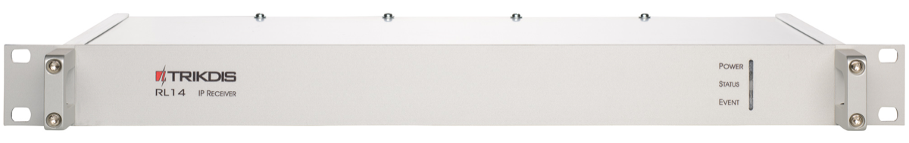

Вид приёмника спереди

Световая индикация

|  |  |
|----|:--:|
| Индикатор | Действие |
| Power | Светит синим цветом при наличии питания. |
| Status | Светит зелёным цветом при наличии физической и протокольной связи приёмника с программой наблюдения. /​ Светит красным цветом при отсутствии физической и протокольной связи приёмника с программой наблюдения. /​ Светит жёлтым цветом при потере физической и протокольной связи по части из описанных выводов. /​ Несветит, если вывод приёмника не активен или не описан. |
| Event | Во время передачи сообщения на программу наблюдения светит синим цветом. |

## Вид сзади и элементы задней панели.

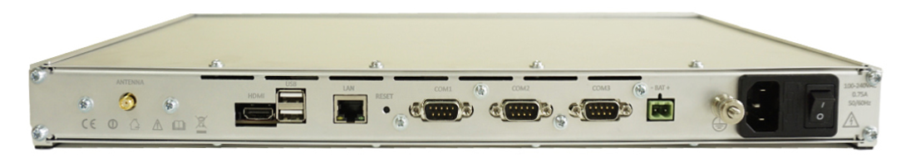

Вид приёмника сзади

|  |  |
|:--:|:--:|
| Элемент | Назначение |
| LAN | Разъём сетевой платы RJ45 |
| COM1 | 1-ый последовательный порт RS232, устанавливаемый как вход или выход (штыревой разъём DB9 (англ. male connection)) |
| COM2 | 2-ой последовательный порт RS232, устанавливаемый как вход или выход (штыревой разъём DB9 (англ. male connection)) |
| COM3 | 3-ий последовательный порт RS232, устанавливаемый как вход или выход (штыревой разъём DB9 (англ. male connection)) |
| Reset | Микровыключатель, при удержании, которого в нажатом положении в течение 5 сек., восстанавливает заводские установки сетевой платы (IP адреса) |
| Antenna | Ответный разъём типа SMA(англ. female) GSM антены встроенного SMS приёмника |
| HDMI | Разъём HDMI для подключения монитора |
| USB | USB разъём |
|  | Разъём для подключения заземления приёмника |
| \- BAT + | Разъём для подключения аккумулятора резервного питания напряжением 12 В и ёмностью не менее 18 Ачас. При питании приёмника от сети переменного тока, аккумулятор заряжается. Ток зарядки до 900 мА. |
| 100-240VAC | Разъём для подключения кабеля питания от сети переменного тока и выключатель питания **O/​I** |

Элементы задней панели

## Подготовка приёмника к работе

### Во время проведения подготовки питание приёмника должно быть отключено. Т.е. 1) кабель питания должен быть отключен от сети переменного тока и 2) отключена цепь резервного питания „BAT“. 

**Примечание:** После отключения питания, приёмник полностью выключится после нескольких минут!

### Если расчитываете принимать SMS сообщения от передающих модулей производства ТРИКДИС то необходимо установить в держатель SMS приёмника действующую SIM карточку. 

### Для установки SIM карточки, открутив болты крепления, снимите верхнюю крышку. В модем SMS приёмника установите SIM карточку (см. рис.). Установите обратно крышку и прикрутите болты крепления.

Вид приёмника со снятой верхней крышкой

### Укрепите приёмник в 19” шкафе серверов. 

### Прикрутите GSM антену.

### Подготовте компьютерную сеть (LAN), учитывая особенности представленной ниже схемы. 

> 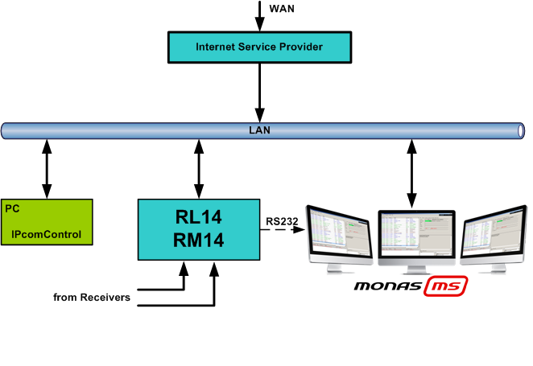

### Установите программу IPcomControl v4 (см. «Конфигурирование приёмника»).

### Измените сетевой адрес компьютера, с помощью которого будете устанавливать параметры действия приёмника RL14, на указанный производителем (см. «Конфигурирование приёмника» пункт A).

### Соедините LAN кабелем приёмник RL14 с компьютером, с которого будете устанавливать параметры действия. 

### Подключите кабель питания приёмника к сети переменного тока.

### Включите питание приёмника переводом выключателя O/I в положение „I“. Наличие питания покажет синий индикатор „Power“. После звукового сигнала, приёмник будет готов к установке параметров действия. 

### Установите параметры действия приёмника RL14 **в следующей последовательности**:

1)  Установите такие параметры сетевой платы приёмника, чтоб приёмник мог бы работать в LAN сети (см. разделы «Подключение к новому приёмнику» и «Конфигурирование приёмника» о карточке „Configure“);

2)  Укажите назначения и параметры физических портов приёмника (см. раздел «Конфигурирование приёмника» о карточке „COM settings“);

3)  Создайте и опишите каналы вывода, через которые поток сообщений будет направляться на программу наблюдения (см. «Конфигурирование приёмника» о карточке „Outputs“);

4)  Создайте и опишите программные каналы приёма, через которые будут приниматся потоки сообщений (см. раздел «Конфигурирование приёмника» о карточке „Receivers“);

5)  Укажите параметры действия и контроля связи (см. раздел «Конфигурирование приёмника» о карточке „General“ и, если SMS сообщения будут приниматься через SMS центр оператора, о карточке„SMPP settings“);

6)  Создайте и опишите пользователей, которые, во время эксплуатации, могут подключятся к приёмнику и выполнять дозволенные им функции (см. «Конфигурирование приёмника» о карточке „Users“).

### После установки параметров, отключите LAN кабель от приёмника и компьютера. Соедините LAN кабелем приёмник с указанной при конфигурации сетью. Восстановите изменённые параметры компьютера, с которого производили конфигурацию приёмника.

### Соедините приёмник RL14 с компьютером, на котором установлена программа наблюдения.

- Если сообщения на программу наблюдения передаются через порт RS232, выбранный СОМ порт соедините в комплекте имеющимся кабелем с СОМ портом компьютера, на котором установлена программа наблюдения.

- Если сообщения на программу наблюдения передаются по локальной сети (LAN), соедините разъём сетевой платы приёмника „LAN“ с локальной сетью, в которой действует и компьютер, котором установлена программа наблюдения.

## Конфигурирование приёмника

Параметры действия приёмника RL14 устанавливаются и изменяются программой IPcomControl v4, установленной на компьютере под управлением ОС MS Windows и действующего в общей с приёмником сети. Программу найдёте на CD диске или на [www.trikdis.lt](http://www.trikdis.lt) . Установите программу IPcomControl v4 на компьютер.

## Подключение к новому приёмнику и установка адресов сети LAN 

Исходные (англ. default) адреса сетевой платы прёмника следующие:

|                             |                 |
|-----------------------------|:---------------:|
|                             |       LAN       |
| IP адрес (англ. IP address) |  192.168.100.3  |
| Порт (англ. Port)           |      55000      |
| Маска (англ. Subnet mask)   |  255.255.255.0  |
| Ворота (англ. Gateway)      | 192.168.100.254 |

Как, при необходимости, восстановить исходные адреса указано в IX разделе (см. раздел «Восстановление заводских установок»).

1.  Измените адрес компьютера, с помощью которого будете устанавливать параметры, на указанный ниже.

2.  Соедините LAN кабелем приёмник с компьютером, с которого будете устанавливать параметры.

3.  Включите питание приёмника и подождите несколько минут, пока не послышится звуковой сигнал, указывающий на начало действия приёмника.

4.  Включите программу IPcomControl v4. В открывшемся окне запроса, укажите исходный IP адрес сетевой платы приёмника и нажмите кнопку OK.

> 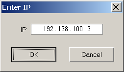

5.  В открывшемся окне запроса, укажите имя подключения пользователя (англ. User name) *administrator* и пароль (англ. Password) *admin*. Нажмите кнопку Login.

> 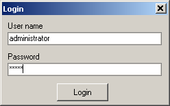

6.  Выберите окно Configure программы IPcomControl v4. Нажмите кнопку Get. В окошках *Primary* IP, Subnet и Gateway укажите такие параметры, чтоб приёмник стал бы частью действующей сети. Нажмите кнопку Set.

7.  Приёмник автоматически выключится и запустится заново. Программа IPcomControl v4 автоматически выключится. Приёмник готов к работе в указанной при программировании сети.

8.  Отключите от приёмника сетевой LAN кабель и на его место подключите кабель, соединяющий с локальной сетью, адрес которой указан в приёмнике.

9.  Восстановите адреса сетевой платы компьютера, с которого конфигурировали приёмник, чтоб ваш компьютер мог бы работать как до этого.

## Подключение к действующему в LAN сети приёмнику

Действущий в LAN сети приёмник конфигурируется программой IPcomControl v4, которая установлена на компьютере под управлением ОС MS Windows Win7/8/8.1/10 32/64 бит и действующем в общей сети. К приёмнику одновременно может быть подключено несколько компьютеров с установленными программами IPcomControl v4. Число разрешенных к подключению пользователей указано в лицензии, которую можно просмотреть нажатием кнопки **Help.**

1.  Включите программу IPcomControl v4. В открывшемся окне запроса укажите установленный в приёмнике RL14 IP адрес, напр., 195.15.184.138, и нажмите кнопку OK.

> 

2.  В открывшемся окне запроса, укажите имя подключения пользователя (англ. User name) напр., *administrator* и пароль (англ. Password) напр., *admin*. Нажмите кнопку Login.

> 

3.  В открывшемся окне программы IPcomControl v4 нажмите кнопку Read .

## Установки адреса удалённого сервера для проверки связи с сетью, звуковых сигналов и часов приёмника (карточка „Configure“).

##  Список сообщений указывающих действие (карточка „Events“). 

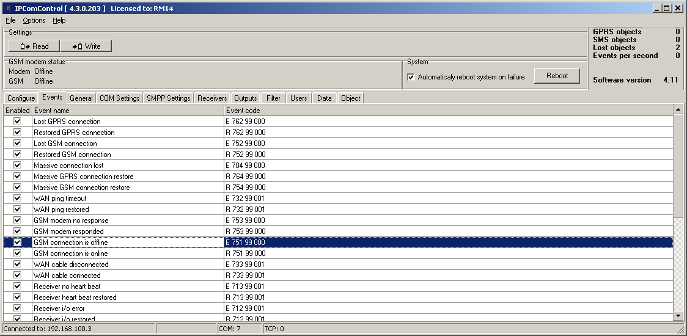

При возникновении событий указанных в этом окне, формируется и высылается на программу наблюдения соответствующее сообщение. Неактуальные сообщения можно выключить.

При конфигурировании приёмника можно изменить значения сообщения: код события, номер раздела и зоны. В некоторых сообщений автоматически указывается идентификатор канала. Исчерпывающий список и подробные условия формирования сообщений указаны в разделе X.

## Контроль связи приёмника с передающими устройствами объекта (карточка „General“). 

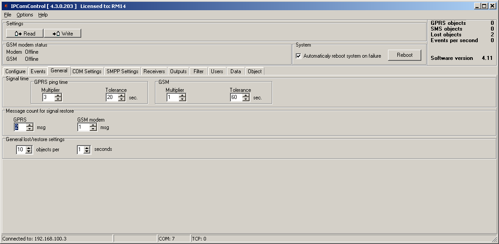

## Установка назначения COM портов приёмника (карточка „COM settings“).

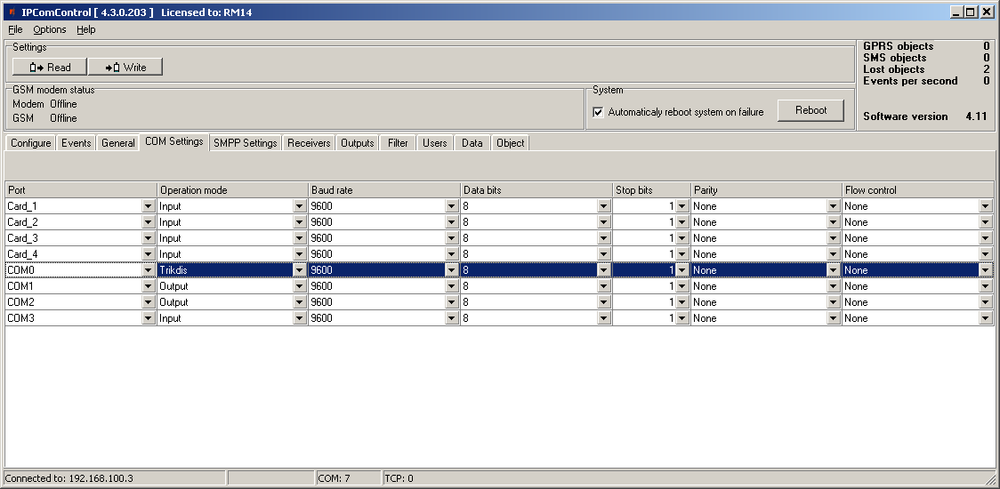

Названия портов:

COM0 – порт обмена данными с встроенным SMS приёмником. Режим действия должен быть „Trikdis“;

COM1...COM3 – названия СОМ портов RS232 приёмника;

USB0...USB4 – названия устанавливаемых в приёмник приёмных плат (только для приёмника RM14).

## Приём SMS сообщений по протоколу SMPP (карточка „SMPP settings“).

Приёмник RL14 может принимать SMS сообщения, посылаемые передающими модулями производства ТРИКДИС не только встроенным SMS приёмником, но и по сети. Услугу конвертирования SMS сообщений в протокол TCP/UDP (SMPP) предоставляет SMS центр оператора GSM сети.

SMPP – транспортный протокол SMS сообщений по TCP/IP связи.

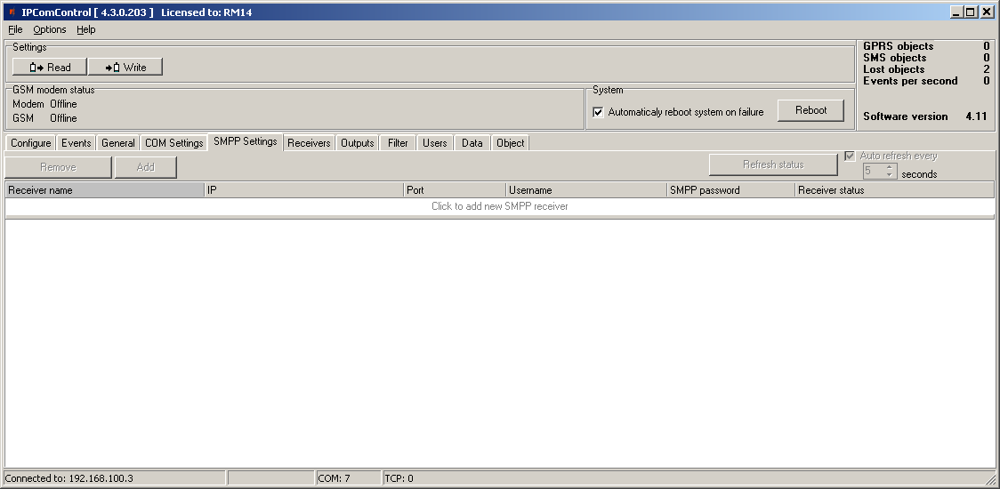

## Создание приёмников и установка их параметров (карточка „Receivers“). 

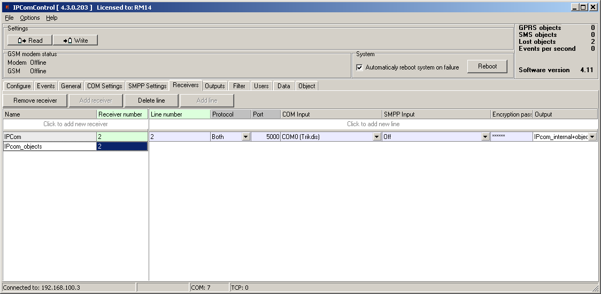

По отмеченному IPCom каналу высылаются внутренние сообщения приёмника, отмеченные в карточке „Events“, которые направляются на указанный канал вывода данных. Для приёма сообщений посылаемых по протоколам TCP/UDP, необходимо создать ещё один канал приёма. Принимаемый по нему поток данных направляется на указанный канал вывода данных.

Параметры направления потока данных:

- В окошке Line number присваивается номер линии;

- В окошке Protocol указывается транспортный протокол принимаемых сообщений;

- В окошке Port указывается программный порт приёма сообщений;

- В окошке COM input указывается физический порт приёма SMS сообщений;

- В окошке SMPP input указывается параметры сервера SMPP;

- В окошке Encryption password указывается шестизначный ключь дешифрования принимаемых сообщений;

- В окошке Output указывается канал вывода сообщений, параметры которого установлены в карточке „Outputs“.

## Вывод сообщений на программу наблюдения (карточка „Outputs“).

> 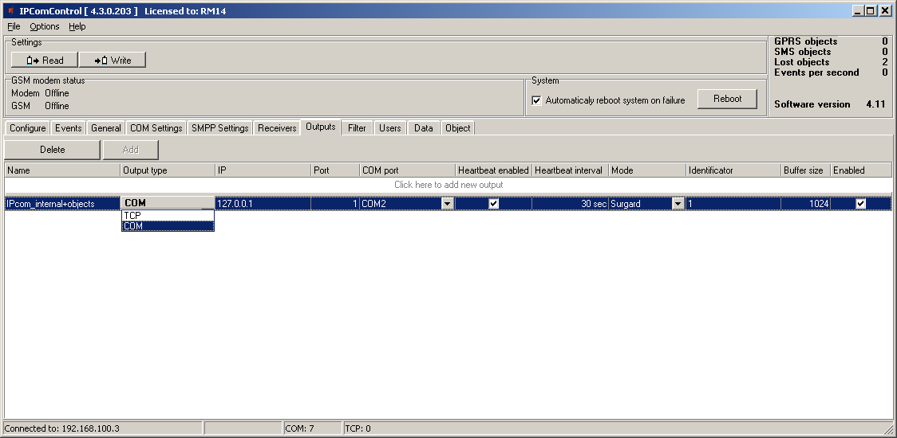

Параметры вывода сообщений на программу наблюдения:

- В окошке Name указывается название канала вывода сообщений;

- В окошке Output type указывается тип связи с программой наблюдения: TCP или COM;

- В окошке IP указывается IP адрес компьютера, на котором установлена программа наблюдения;

- В окошке Port arba COM port указывается номер порта вывода сообщений на программу наблюдения;

- В окошке Heartbeat enabled указывается включение опроса канала связи с программой наблюдения;

- В окошке Heartbeat interval указывается период передачи сигналов опроса;

- В окошке Mode указывается протокол передачи сообщений;

- В окошке Identificator показан порядковый номер опознания канала связи, чтоб, при возникновении неполадок по нему, можно было бы определить, по какому каналу потеряна связь;

- В окошке Buffer size указывается объём буффера сообщений;

- В окошке Enabled галочкой включается действие созданного канала вывода данных.

## Фильтрация сообщений (карточка „Filter“).

В карточке „Filter“ указывается IP адрес, на который дополнительно направляются все принятые сообщения.

> 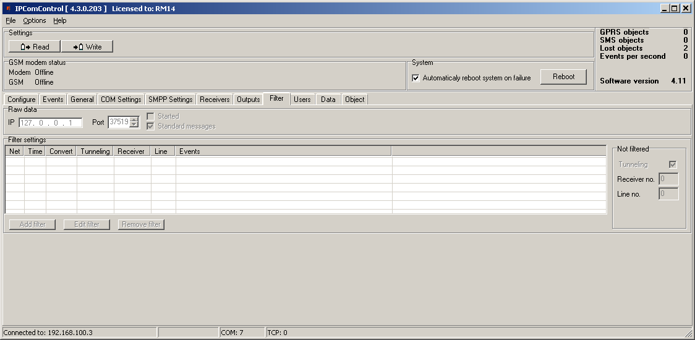

В поле *Raw data* указывается IP адрес [IP] и номер порта [Port], на который направляются все принятые сообщения. Если отмечено окошко [Started], приёмник направит на указанный IP адрес все сообщения без обработки, если отмечено [Standard messages], - сообщения будут направлены в формате протокола Contact ID.

В поле *Filter settings* устанавливаются параметры фильтрации сообщений. При нажатии кнопки *Add filter* открывается карточка *Filter settings*. В ней указываются правила передачи сообщений на программу наблюдения:

- В поле Network указывается порядковый номер сети. Обрабатываться будут только те сообщения, в которых номер приёмника совпадёт с номером сети;

- В поле Time указывается время нечувствительности такому же сообщению (время нечувствительности повторяющимся сообщениям);

- В поле Receiver no указывается номер приёмника, присвоенный сообщению после обработки;

- В поле Line no указывается номер линии, присвоенный сообщению после обработки;

- Отмечается окошко Convert если необходимо изменить структуру сообщения;

- Отмечается окошко Tunneling если нет необходимости менять структуру сообщения;

- В поле Events one per line указываются спецкоды, необходимые для определения качества установки радиопередатчиков в системе передачи извещений RAS-2M.

  Нажатием кнопки OK, подтверждаются указанные значения.

  Могут быть созданы и использоваться несколько различных фильтров.

Если в поле *Not filtered* отмечено окошко *Tunneling*, сообщения на программу наблюдения будут направлены с номерами приёмкика и линии, указанными в карточке *General*. Если окошко *Tunneling* остаётся не отмеченным, сообщения передаются с полученными номерами приёмника и линии.

## Права пользователей (карточка „Users“). 

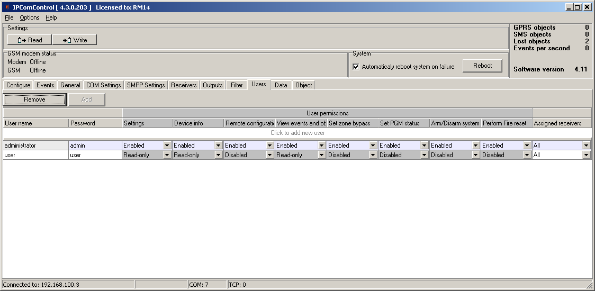

Права пользователя (англ. User permissions):

- В окошке User name указывается имя подключения пользователя приёмника;

- В окошке Password указывается пароль подключения пользователя приёмника;

- В окошке Settings указывается право конфигурировать программу IPcom приёмника;

- В окошке Device info указывается право видеть текущую информацию об объектах;

- В окошке Remote configuration указывается право удалённым способом конфигурировать передающие модули и обновлять их программу действия;

- В окошке View events and objects указывается право открывать карточки „Data“ и „Objects“ программы IPcomControl v4;

- В окошке Set zone bypass указывается право выслать команду „Zone bypass“ (временно отключить зону охраны) на установленную на объекте охранную панель производства «Трикдис»;

- В окошке Set PGM status указывается право удалённым способом изменить состояния PGM выходов передающих модулей производства «Трикдис»;

- В окошке Arm/Disarm system указывается право высылать команды управления сигнализацией (англ. Arm или Disarm), на объекте установленную контрольную панель производства ТРИКДИС;

- В окошке Perform Fire reset указывается Право выслать команду перезапуска пожарных датчиков на установленную на объекте охранную панель производства «Трикдис»;

- В окошке Assigned receivers указываются каналы, на которые распростаняются указанные выше права.

## Восстановление исходных параметров действия.

Для восстановления исходных параметров (англ. default) нажмите и держите нажатым кнопку RESET приёмника до появления звукового сигнала.

## Сообщения приёмника

Приёмник формирует собственные сообщения о действии оборудования и направляет их на программу наблюдения. Сообщения поступают с установленными при программировании номерами приёмника и линии и идентификационным номером объекта: 1) с поступающим ID номером установленного на объекте передающего модуля, если сообщение связано с объектом; 2) с номером 0000, если сообщение связано с общими событиями действия.

| Код события | Название события ID номер объекта | Значения сообщений о событиях приёмника Номер зоны | Условия формирования сообщения |
|-------------|--------------------------------------|-------------------------------------------------------|--------------------------------|
| E301 | AC Power loss / Пропажа переменного напряжения | 0000 / ID приёмника | 000 |
| R301 | AC Power restore / Восстановление переменного напряжения | 0000 / ID приёмника | 000 |
| R305 | System started / Система начала работать | 0000 / ID приёмника | 000 |
| E308 | System shutdown / Выключение системы | 0000 / ID приёмника | 000 |
| E311 | Battery missing / Пропажа напряжения аккумулятора | 0000 / ID приёмника | 000 |
| R311 | Battery connected / Аккумулятор подключен | 0000 / ID приёмника | 000 |
| R313 | System rebooted / Перезагрузка системы | 0000 / ID приёмника | ☑ |
| E330 | System peripheral trouble / Неполяадка периферии системы (подключился дубли-рующий объект) | ID передающего модуля | Число дублирущих-ся объектов |
| E350 | Connection trouble / Потеряна связь с передающим модулем | ID передающего модуля | 000 |
| R350 | Connection restore / Восстановлена связь с передающим модулем | ID передающего модуля | 000 |

| E350 | Output connection trouble / Сбой связи на выходе | 0000 / ID приёмника | ☑ | Если данные с приёмника на программу наблюдения передаются протоколом TCP и происходит отключение/потеря связи с принимающей программой. / Номер зоны указывает идентификатор порта. |
|:--:|----|:--:|:--:|:---|
| R350 | Output connection restore / Восстановление связи на выходе | 0000 / ID приёмника | ☑ | Если данные с приёмника на программу наблюдения передаются протоколом TCP и происходит отключение/потеря связи с принимающей программой (получено сообщение E350) и повторно происходит подключение. / Номер зоны указывает идентификатор порта. |
| E704 | Massive connection lost / Массовая потеря связи с передающими модулями | 0000 / ID приёмника | ☑ | Если за указанное время происходит потеря связи с указанным количеством передающих модулей по GPRS или GSM. / Номер зоны указывает идентификатор порта. |
| E712 | Receiver i/o error / Ошибка на i/o приёмника | 0000 / ID приёмника | ☑ | Если при считывании информации с порта происходит апаратная ошибка. / Номер зоны указывает идентификатор порта. |
| R712 | Receiver i/o restored / Восстановление на i/o приёмника | 0000 / ID приёмника | ☑ | Если была зафиксирована ошибка порта (сообщение E712) и опять получено любое сообщение. / Номер зоны указывает идентификатор порта. |
| E713 | Receiver no heart beat / Не получен ответ с порта | 0000 / ID приёмника | ☑ | Если в течение 1 мин. не получено любое сообщение/сигнал с подключенного приёмника или установленной приёмной платы. / Номер зоны указывает идентификатор порта. |
| R713 | Receiver heart beat restored / Действие порта восстановилось | 0000 / ID приёмника | ☑ | Если было зафиксировано пропажа приёмника (сообщение E713) и опять получено любое сообщение/сигнал. / Номер зоны указывает идентификатор порта. |
| E714 | Receiver card unnplugged / Извлечена приёмная плата | 0000 / ID приёмника | ☑ | Если извлекается приёмная плата. / Номер зоны указывает идентификатор порта. |
| R714 | Receiver card plugged in / Приёмная плата установлена | 0000 / Imtuvo ID | ☑ | Если устанавливается приёмная плата. / Номер зоны указывает идентификатор порта. |
| E732 | WAN ping timeout / Потеряна связь с сетью | 0000 / ID приёмника | ☒ | Если три раза подряд не удаётся получить ответ на посылаемый запрос на указанноый адрес в сети (напр. с удалённого сервера). / Номер зоны указывает идентификатор сети. |
| R732 | WAN ping restored / Восстановлена связь с сетью | 0000 / ID приёмника | ☒ | Если была зафиксирована потеря связи с сетью (сообщениеE732) и получен ответ с указанного адреса в сети (напр. с удалённого сервера). / Номер зоны указывает идентификатор сети. |
| E733 | WAN cable disconnected / Отключен LAN кабель | 0000 / ID приёмника | 000 | Если LAN кабель отключен. |
| R733 | WAN cable connected / LAN кабель подключен | 0000 / ID приёмника | 000 | Если LAN кабель подключен. |
| E751 | GSM connection is offline / Потеряна связь с GSM сетью | 0000 / ID приёмника | 000 | Если с момента запуска программы прошло более 1 мин. и/или приёмник GSM служебным сообщением предупреждает о потере связи с GSM сетью. |
| R751 | GSM connection is online / Восстановлена связь с GSM сетью | 0000 / ID приёмника | 000 | Если была зафиксирована потеря связи с GSM сетью (сообщение E751) и приёмник GSM служебным сообщением предупреждает о восстановлении связи с GSM сетью. |

| E752 | Lost GSM connection / Пропажа GSM связи |  |  | Сообщения НЕФОРМИРУЮТСЯ |
|:--:|----|:--:|:--:|:---|
| R752 | Restored GSM connection / Восстановление GSM связи |  |  | Сообщения НЕФОРМИРУЮТСЯ |
| E753 | Cellular modem no response / Не получен ответ от GSM модема | 0000 / ID приёмника | 000 | Если в течение 10 сек. не получено любое сообщение/сигнал с интегрированного SMS приёмника. |
| R753 | Cellular modem responded / Получен ответ от GSM модема | 0000 / ID приёмника | 000 | Если была зафиксирована потеря связи с встроенным SMS приёмником (сообщение E753) и вновь получено любое сообщение/сигнал. |
| R754 | Massive GSM connection restore / Массовое восстановление связи с передающими модулями по GSM | 0000 / ID приёмника | 000 | Если за указанное время происходит восстановление связи с указанным количеством передающих модулей по GSM. |
| R755 | GSM receiver mode / Передающий модуль начал работать в режиме GSM | ID передающего модуля | ☑ | a\) Если передающий модуль на объекте работает в режиме GPRS, но по каналу GSM получено любое SMS сообщение; / b) Если передающий модуль на объекте работает в режиме GSM и получено ПЕРВОЕ SMS сообщение. / c) Если была зафиксирована потеря связи с передающим модулем (сообщение E350) и с него получено указанное число сообщений/сигналов, по которому фиксируется восстановление GSM связи. / Номер зоны указывает идентификатор порта. |
| E762 | Lost GPRS connection / Потеряна GPRS связь | ID передающего модуля | ☑ | a\) Если передающий модуль на объекте работает в режиме GPRS, известен его тип и в течении указанного времени контроля не получено любое сообщение/сигнал. / *Примечание: Не было зафиксирована массовая потеря GPRS связи с передающими модулями (сообщение E704).* / b) Если на объекте выбрана передача SMS сообщений, включен приём сообщений серез GSM модем/SMPP, объект включен в список контролируемых устройств и с него получено SMS сообщение. / Номер зоны указывает идентификатор порта. |
| R762 | Restored GPRS connection / GPRS связь восстановлена | ID передающего модуля | ☑ | Если передающий модуль на объекте работает в режиме GPRS и с него получено установленное число сообщений/сигналов, по которому фиксируется восстановление GPRS связи. / *Примечание: Не было зафиксировано массовое восстановление связи по GPRS.* / Номер зоны указывает идентификатор порта. |
| R764 | Massive GPRS connection restore / Массовое восстановление связи с передающими модулями по GPRS | 0000 / ID приёмника | 000 | Если за определённое время происходит установленное число восстановлений связи по GPRS. |

##  Изменение лицензии

Параметры исходной лицензии могут быть изменены (дополнены) внедрением новой лицензии. Для этого последовательностью *Options → Activate product* откройте предназначенное для этого окно и укажите место хранения нового файла лицензии с расширением .lic.

Для внедрения новой лицензии нажмите кнопку Apply.

## Гарантийные обязательства

Для приёмника, установленного согласно указанным общим правилам установки электрооборудования и настоящей инструкцией, производителем определяется гарантийный срок 24 месяца. Началом гарантийного срока является момент заключения сделки купли-продажи, т.е. от даты предоставления счёта-фактуры.
