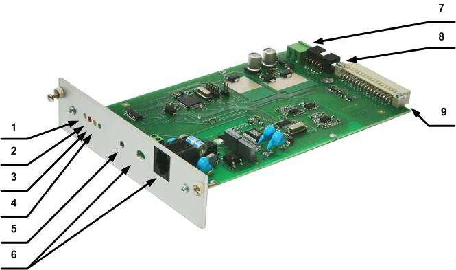
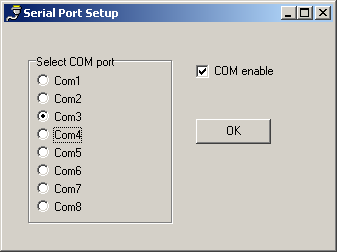
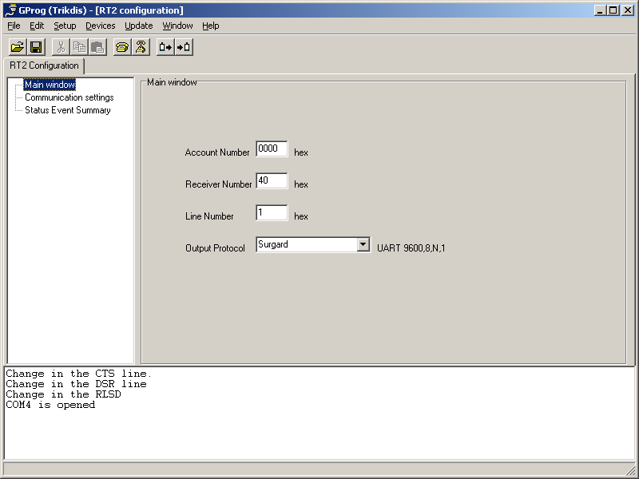
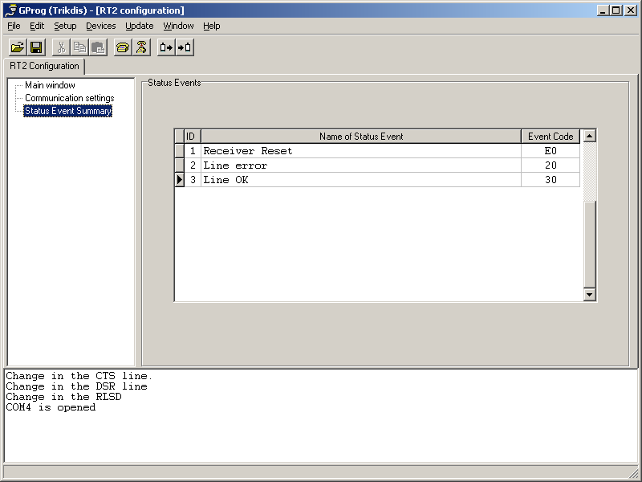

# ПРИЁМНЫЙ МОДУЛЬ RT2

  

Приёмный модуль RТ2 применяется как составная часть многоканального приёмника RM10 и приёмника RD10 для приёма тревожных сообщений охранной панели по телефонным линиям. Обмен данными производится согласно протоколам:

• Contact ID;

• Ademco Express 4+2;

• SIA FSK;

• pulse 3/1, 4/1, 4/2.

1 – жёлтый световой индикатор контроля телефонной линии;

2 – красный световой индикатор поднятия трубки;

3 – жёлтый световой индикатор приёма данных;

4 – зелёный световой индикатор питания и действия;

5 – кнопка RESET;

6 – разъём внешних соединений;

7 – разъём питания;

8 – разъём программирования;

9 – разъём подключения концентратора;

Действие и основные свойства

Приёмный модуль RT2 это приёмное устройство обеспечивающее приём сообщений телефонного коммуникатора охранной панели. Модуль принимает сигналы (обеспечивает связь и приём информации согласно установленным протоколам) и передаёт их в концентратор многоканального приёмника.

Обработку сигналов производит микроконтроллер. Он опознаёт принимаемые сигналы, формирует сообщения установленной формы и по последовательному порту передаёт их на концентратор многоканального приёмника.

Приёмный модуль RT2 не имеет никаких программных фильтров.

Технические параметры

1\. Приёмный модуль обеспечивает приём сообщений по телефонным линиям. Тип телефонной линии – тоновая или импульсная.

2\. Приёмный модуль RT2 работает с линиями, рабочее напряжение которых до 65 В и выдерживает переменное напряжение вызова до 250 В.

3\. Приёмный модуль RT2 принимает сообщения передаваемые по телефонным линиям согласно протоколам:

• Contact ID согласно стандарту SIA DC-05-1999.09:

• Ademco Express 4+2;

• SIA Format согласно стандарту SIA DC-03-1990.01 1-ого и частично

2-ого уровня;

• пульсовыми протоколами 3/1, 4/1, 4/2, действующих при скорости

10 … 40 бод и использующих сигналы частотой 1400 Гц или 2300

Гц (HSK и kissoff).

4\. Приёмный модуль RT2 устанавливается в многоканальный приёмник RM10 или приёмник RD10 и питается от его блока питания постоянным напряжением 12,6 В. Допустимые пределы отклонения от 11 до 15 В. Потребляемый ток не превышает

150 mA.

5\. Приёмный модуль RT2 действует при температуре окружающего воздуха от -10ºC до +55ºC и влажности до 90% при температуре +20ºC.

6\. Габаритные размеры модуля не превышают 190 x 130 x 30 мм.

Световая индикация

Приёмный модуль RT2 имеет четыре световые индикаторы.

• Зелёный TEST периодически мигает при наличии питания и работе микроконтроллера

• Красный HOOK светится при «поднятии трубки»

• Жёлтый DATA светится при приёме сообщений с охранной панели

• Жёлтый LINE светится при наличии исправной телефонной линии

Подготовка к работе

Приёмный модуль RT2 поставляется пользователю подготовленным к приёму сообщений телефонного коммуникатора охранной панели с установленными параметрами приёма:

• первым, по протоколу SIA Protocol;

• вторым, по протоколу Contact ID или Ademco Express;

• третьим, импульсными протоколами 3/1, 4/1, 4/2, использующими сигналы

HSK частотой 2300 Гц;

• четвёртым, импульсными протоколами 3/1, 4/1, 4/2, использующими сигналы HSK частотой 1400 Гц;

Приёмный модуль формирует служебные сообщения, список которых указан в приложении 1. Принятые сообщения отображаются индикатором многоканального приёмника и передаются на программу наблюдения.

Эксплуатационные параметры модуля RT2 указаны в таблице 1.

Таблица 1

<table>
<tbody>
<tr>
<td>
Эксплуатационные параметры приёмного модуля RT2
</td>
</tr>
<tr>
<td>
Название
</td>
<td>
Пределы
</td>
<td>
Установленное

значение
</td>
</tr>
<tr>
<td>
Число дозвонов до поднятия трубки
</td>
<td>
1 - 8
</td>
<td>
2
</td>
</tr>
<tr>
<td>
Контроль наличия телефонной линии

включено/выключено
</td>
<td>
enable / disable
</td>
<td>
enable
</td>
</tr>
<tr>
<td>
Интервал времени между поднятием

трубки и началом выдачи сигнала приветствия (HSK)
</td>
<td>
500 – 4000 мс
</td>
<td>
2000 мс
</td>
</tr>
<tr>
<td>
Длительность сигнала подтверждения
</td>
<td>
500 – 8000 мс
</td>
<td>
900 мс
</td>
</tr>
<tr>
<td>
Интервал времени между сигналами

приветствия
</td>
<td>
1 – 16 с
</td>
<td>
4 с
</td>
</tr>
<tr>
<td>
Допустимая длительность приёма

сообщения
</td>
<td>
2 – 16 с
</td>
<td>
2 с
</td>
</tr>
<tr>
<td>
Длительность сигнала SIA HSK
</td>
<td>
500 – 2000 мс
</td>
<td>
900 мс
</td>
</tr>
<tr>
<td>
Лимит времени для одного сеанса связи
</td>
<td>
15 – 255 с
</td>
<td>
60 с
</td>
</tr>
<tr>
<td>
Лимит времени для одного сеанса связи в

формате SIA
</td>
<td>
1 – 32 с
</td>
<td>
8 с
</td>
</tr>
<tr>
<td>
Порядок передачи сигналов приветствия
</td>
<td>
SIA FSK HSK
 
Dual tone HSK

(1400+2300 Hz)
 
3/1, 4/1, 4/2
 
3/1, 4/1, 4/2
</td>
<td>
SIA FSK HSK
 
Dual tone HSK

(1400+2300 Hz)
 
2300 Hz
 
1400 Hz
</td>
</tr>
</tbody>
</table>

Подготовка к работе:

1\. Распакуйте модуль;

2\. Уточните и, при необходимости, установите необходимые эксплуатационные параметры;

3\. Снимите декоративную пластину на задней панели многоканального приёмника и установите приёмный модуль;

4\. Нажмите кнопку RESET приёмного модуля;

5\. Подключите телефонную линию;

Индикация принятого сообщения

Вид служебного сообщения принятого и отображённого на LCD индикаторе многоканального приёмника RM10 или приёмника RD10 представлен ниже.

где:

40-5 MODULE RESET

40 – тип приёмного модуля (тип RT2 - 40);

5 – номер линии приёмника;

MODULE RESET – служебное сообщение;

Вид тревожного сообщения принятого и отображённого на LCD индикаторе многоканального приёмника RM10 или приёмника RD10 представлен ниже.

где:

04-1 12:38:15 7678 E130 01 001

04 – тип приёмного модуля (тип RT2 - 40);

1 – номер линии приёмника;

12:38:15 – время приёма сообщения;

7678 – номер абонента; E130 – код события;

01 – номер раздела;

001 – место события или номер кода пользователя;

> Установка эксплуатационных параметров
>
> Установка эксплуатационных параметров производится программатором SPROG-1 и программой GProg Соедините порт программирования модуля с программатором и включите программу установки параметров GProg.
>
> 
>
> Выберите команду Setup→Serial port и установите номер порта компьютера, к которому подключён программатор.
>
> 
>
> Выберите команду Devices→RI4010 и установите тип модуля RT2. Кнопкой
>
> [Read] считайте ранее установленные параметры.
>
> 
>
> При работе в составе многоканального приёмника должен быть установлен выходной формат Surgard.
>
> Другие параметры, при необходимости, можно изменить. Новые параметры запишите в память модуля нажатием кнопки [Write].
>
> 
>
> 
>
> Приложение 1

<table>
<colgroup>
<col style="width: 0%" />
<col style="width: 0%" />
<col style="width: 0%" />
</colgroup>
<tbody>
<tr>
<td colspan="3">
Служебные сообщения приёмного модуля RT2
</td>
</tr>
<tr>
<td>
Сообщение
</td>
<td style="text-align: center;">
Код
</td>
<td style="text-align: center;">
Описание
</td>
</tr>
<tr>
<td>
COM TROUBLE
</td>
<td style="text-align: center;">
05
</td>
<td>
Нарушенна связь с концентратором
</td>
</tr>
<tr>
<td>
COM RESTORE
</td>
<td style="text-align: center;">
06
</td>
<td>
Восстановленна связь с концентратором
</td>
</tr>
<tr>
<td>
TEL LINE ERROR
</td>
<td style="text-align: center;">
20
</td>
<td>
Отключена телефонная линия
</td>
</tr>
<tr>
<td>
TEL LINE OK
</td>
<td style="text-align: center;">
30
</td>
<td>
Телефонная линия исправна
</td>
</tr>
<tr>
<td>
MODULE DISCONNECT
</td>
<td style="text-align: center;">
C0
</td>
<td>
Модуль отключён
</td>
</tr>
<tr>
<td>
MODULE CONNECT
</td>
<td style="text-align: center;">
C1
</td>
<td>
Модуль подключён
</td>
</tr>
<tr>
<td>
RT2 RESET
</td>
<td style="text-align: center;">
D0
</td>
<td>
Нажата кнопка модуля RESET
</td>
</tr>
</tbody>
</table>
