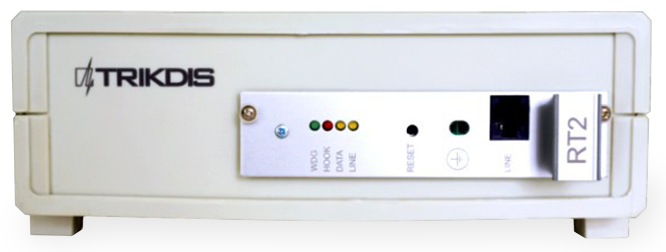
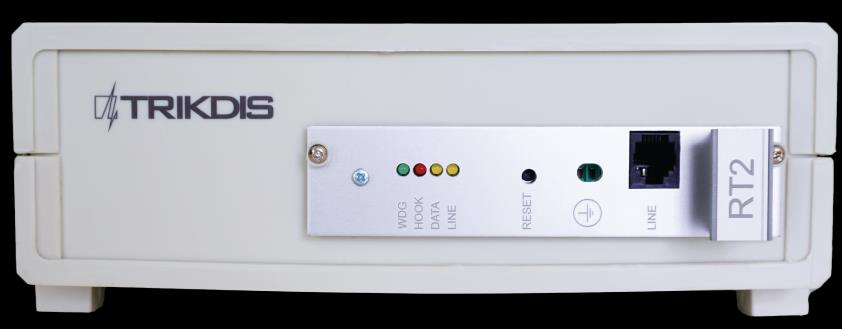
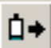

# RTH2 Телефонный Линейный Приёмник

  

## О телефонном линейном приемном устройстве

**Телефонное линейное приемное устройство RTH2** получает отчеты о событиях от телефонного коммуникатора панели управления системой безопасности. Полученные события обрабатываются и передаются в программное обеспечение мониторинга.

!!! note
    Мы настраиваем приёмник с предустановленными параметрами по запросу клиента.

## Технические параметры

| Название | Описание |
|----------|----------|
| Канал связи | телефонные линии — частотные или импульсные |
| Форматы получения | Contact ID, SIA, Ademco Express 4+2 и другие |
| Основной источник питания | 100 – 240 В (50 / 60 Гц) сети переменного тока |
| Порт вывода данных RS232 | 1 x DB9 |
| Рабочая температура | От 0°С до +55°C |
| Размеры | 225 x 235 x 115 мм |
| Вес | 1,21 кг, с кабелями |

### Технология получения отчетов

| Название | Описание |
|----------|----------|
| 1. Формат протокола SIA | Стандарт SIA DC-03-1990.01 |
| 2. Contact ID | Стандарт SIA DC-05-1999.09 |
| 3. Форматы Ademco Express 4+2 | Стандарт SIA DC-05-1999.09, формат 4+2 с контрольной суммой — 4-значный код счета, 2-значный код события, 1 цифра контрольной суммы |
| 4. Импульсные протоколы 3/1, 4/1, 4/2, использующие HSK сигналы 2300 Гц | Работающий со скоростью 10...40 бод и использующий HSK и кисоф сигналы 2300 Гц |
| 5. Импульсные протоколы 3/1, 4/1, 4/2, использующие HSK сигналы 1400 Гц | Работающий со скоростью 10...40 бод и использующий HSK и кисоф сигналы 1400 Гц |

## Комплект поставки приемного устройства

| Элемент | Количество |
|---------|------------|
| Приемное устройство | 1 шт. |
| 1,5 м кабеля питания | 1 шт. |
| 1,8 м 0-модемного кабеля RS232 | 1 шт. |

!!! note
    Кабели *SPROG-1 или UP2* для программирования приёмника в комплект не входят.

## Электропитание

На приемное устройство подается питание от источника переменного тока (ПТ). Для обеспечения бесперебойной работы приемник должен быть подключен к аккумуляторной батарее 12 В, 7 Ач, обеспечивающей резервное питание в течении 12 часов.

## Конфигурация приемного устройства

### Вид спереди

| No. | Элемент |
|-----|---------|
| 1 | Световая индикация (светодиоды WDG, HOOK, DATA, LINE) |
| 2 | Кнопка сброса устройства |
| 3 | Разъем заземления |
| 4 | Разъем — вход телефонной линии |

### Вид сзади

| No. | Элемент |
|-----|---------|
| 5 | Порт вывода данных RS232 |
| 6 | Разъем подключения резервной батареи (-12V+) |
| 7 | Разъем кабеля переменного тока (100-240VAC 50/60Hz) и кнопка включения/выключения |

### Световая индикация

| Светодиодный индикатор | Сигнал | Значение |
|------------------------|--------|----------|
| **"LINE"** желтый — Работа телефонной линии | Не горит | Телефонная линия не подключена или недоступна |
| **"HOOK"** красный — Телефонная трубка поднята | Горит | Телефонная трубка поднята |
| **"DATA"** желтый — Прием данных | Мигающий желтый | Во время приема данных от периферийного устройства |
| **"WDG"** зеленый — Питание | Кратковременные вспышки | Подача питания в режиме ожидания и работы |

## Установка системы

### Этапы установки оборудования

!!! note
    1) Кабели *SPROG-1 или UP2* для программирования приёмника в комплект не входят.
    2) Для настройки параметров необходимо установить программное обеспечение GProg2. Для загрузки установочного файла GProg2 перейдите на [www.trikdis.com](http://www.trikdis.com/)

1. Если на полученном устройстве отсутствуют заданные рабочие параметры, пожалуйста, установите их в соответствии с п. **Установка рабочих параметров** ниже.
2. Подключите приемное устройство к компьютеру через кабель RS232 для передачи событий мониторинговому программному обеспечению.
3. Настройте программное обеспечение мониторинга для отображения сообщений приемного устройства. Следуйте инструкциям в документации к программному обеспечению мониторинга.
4. Подключите кабель питания переменного тока.
5. Включите приемное устройство. Мигающий индикатор *"WDG"* означает, что приемное устройство работает правильно.
6. Нажмите кнопку сброса.
7. Проверьте, отображает ли Ваше программное обеспечение мониторинга сообщения от приемного устройства RTH2.

В случае отсутствия сообщений: проверьте цвет индикатора "Линия" — он должен быть желтым; в противном случае проверьте, все ли разъемы подключены правильно. Если проблема не устраняется, убедитесь, что параметры эксплуатации установлены правильно или обратитесь в службу технической поддержки.

!!! note
    Встроенный модуль приёма генерирует служебные сообщения, указанные в Приложении А.

## Установка рабочих параметров

### Рабочие параметры приемного устройства

| Название | Допустимый диапазон | Установленное значение |
|----------|---------------------|------------------------|
| Количество вызовов до момента снятия трубки модуля | 1 – 8 | 2 |
| Управление телефонной линией вкл/выкл | включено / отключено | включено |
| Время от подъема трубки до начала HSK сигнала | 500 мсек – 4000 мсек | 2000 |
| Продолжительность кисоф сигналов (и подтверждения) | 500 мсек – 8000 мсек | 900 |
| Интервал между HSK сигналами | 1 сек – 16 сек | 4 |
| Допустимая длительность приема сообщения | 2 сек – 16 сек | 2 |
| Продолжительность SIA HSK | 500 мсек – 2000 мсек | 900 |
| Общий лимит времени для одного сеанса связи | 15 сек – 255 сек | 60 сек |
| Выходной протокол | Surgard или Radionics D6600 | Surgard |
| Лимит времени для приема блоков SIA | 1 – 32 сек | 8 сек |
| Порядок HSK (приоритет протоколов приема) — SIA FSK HSK | SIA FSK HSK | SIA FSK HSK |
| Порядок HSK — Двухтональный HSK (1400+2300 Гц) | Двухтональный HSK (1400+2300 Гц) | Двухтональный HSK (1400+2300 Гц) |
| Порядок HSK — Импульсный 3/1, 4/1, 4/2 с 2300 Гц | 3/1, 4/1, 4/2 | 2300 Гц |
| Порядок HSK — Импульсный 3/1, 4/1, 4/2 с 1400 Гц | 3/1, 4/1, 4/2 | 1400 Гц |

### Установка рабочих параметров RTH2 с помощью GProg2

Параметры приемного устройства могут быть установлены с помощью программатора *SPROG-1* или *UP2* с использованием программного обеспечения GProg2. Также вам может понадобиться установить драйверы USB. GProg2 и драйверы USB доступны на нашем сайте [www.trikdis.lt](http://www.trikdis.lt/).

!!! note
    Программа GProg2 должна быть установлена на ПК с ОС MS *Windows* 2000/XP/Vista/Win 7.

#### Подключение к компьютеру

1. Откройте корпус RTH2 и выньте модуль (не забудьте отключить резервный аккумулятор).
2. Подключите модуль к источнику питания.
3. Подключите модуль к компьютеру с программатором *SPROG-1* или *UP2*.

#### Установка драйвера USB

На компьютере должны быть установлены драйверы USB. При первом подключении приемного устройства к компьютеру в ОС MS Windows откроется окно *Мастер нового оборудования* для установки драйвера USB.

1. Скачайте драйвер для USB *\*.inf* для Вашей ОС MS Windows с сайта www.trikdis.lt.
2. В окне мастера выберите функцию [*Да, только в этот раз*] и нажмите кнопку [*Далее*].
3. В открывшемся окне *Выбор параметров поиска и установки* нажмите кнопку [*Обзор*] и выберите место, где был сохранен файл *\*.inf*.
4. Следуйте инструкциям мастера для завершения установки драйвера USB.

#### Запуск GProg2

8. Запустите программу, щелкнув значок GProg2 , затем в окне настроек укажите последовательный порт (например, COM3).
9. В строке меню выберите команду [*Devices*] и выберите RT2.
10. Нажмите  значок на панели инструментов для подключения приемного устройства.
11. Чтобы прочесть рабочие параметры, сохраненные во внутренней памяти устройства, нажмите  кнопку. По окончании загрузки данных появится окно *Configuration is received*.
12. Появится окно *Configuration is received*.

#### Описание значков панели инструментов

| Значок | Функция |
|--------|---------|
|  **[Открыть]** | Открыть сохраненный файл с расширением ".tcfg" |
|  **[Сохранить]** | Сохранить файл с установленными параметрами с расширением ".tcfg" |
|  **[Соединение]** | Подключиться к последовательному порту |
|  **[Разъединение]** | Отключиться от последовательного порта |
|  **[Получение параметров]** | Считать параметры устройства |
|  **[Отправить параметры]** | Записать новые параметры в память устройства |
|  **[Генерировать отчет]** | Печать отчета об установленных параметрах |

#### Установка параметров

13. В *Главном окне* ветки установите протокол Surgard.
14. При необходимости можно изменить параметры в ветке *Параметры связи*; рекомендуемые значения приведены в п. **Рабочие параметры приемного устройства** выше.
15. Для сохранения параметров следуйте в [*File/Write device*] в строке меню или нажмите  значок.
16. Чтобы сохранить установленные параметры в компьютере, следуйте в [*File/Save as*]. Имя файла и место сохранения могут быть произвольные. Он может быть позже использован в качестве шаблона для настройки других модулей.

## Приложение А — Сервисные сообщения

Сервисные сообщения телефонного связного приемного устройства:

| Сообщение | Код | Описание |
|-----------|-----|----------|
| ПРОБЛЕМА СВЯЗИ | 05 | Сбой связи между устройством и концентратором |
| СВЯЗЬ ВОССТАНОВЛЕНА | 06 | Связь с концентратором восстановлена |
| ОШИБКА В ТЕЛ. ЛИНИИ | 20 | Неисправность или отключение телефонной линии |
| ТЕЛ. ЛИНИЯ В ПОРЯДКЕ | 30 | Телефонная линия восстановлена |
| МОДУЛЬ ОТСОЕДИНЕН | C0 | Устройство отсоединено |
| МОДУЛЬ ПОДКЛЮЧЕН | C1 | Устройство подключено |
| СБРОС ПРИЕМНИКА | D0 | Нажата кнопка сброса приемного устройства |
