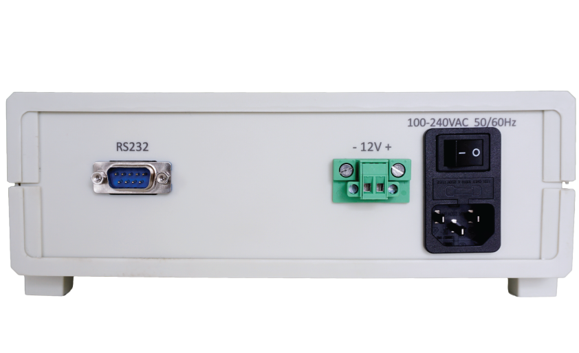
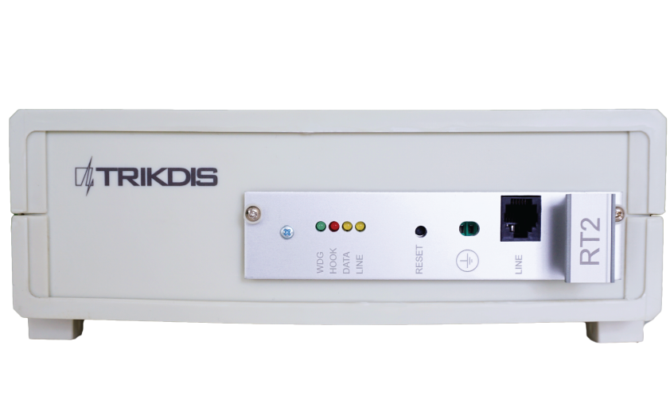
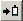

# RTH2 Телефонный Линейный Приёмник

  

## О телефонном линейном приемном устройстве 

**Телефонное линейное приемное устройство RTH2** получает отчеты о событиях от телефонного коммуникатора панели управления системой безопасности. Полученные события обрабатываются и передаются в программное обеспечение мониторинга.

## Технические параметры

|                           |                                                |
|---------------------------|------------------------------------------------|
| Название                  | Описание                                       |
| Канал связи               | телефонные линии - частотные или импульсные    |
| Форматы получения         | contact ID, SIA, Ademco Express 4+2 и другие   |
| Основной источник питания | 100 – 240 В (50 /​ 60 Гц) сети переменного тока |
| Порт вывода данных RS232  | 1 x DB9                                        |
| Рабочая температура       | От 0°С до +55°C                                |
| Размеры                   | 225 x 235 x 115 мм                             |
| Вес                       | 1,21 кг, с кабелями                            |

### Технология получения отчетов

| Название | Описание |
|:---|----|
| 1\. Формат протокола SIA | Стандарт SIA DC-03-1990.01 |
| 2\. Contact ID | Стандарт SIA DC-05-1999.09 |
| 3\. Форматы Ademco Express 4+2 | Стандарт SIA DC-05-1999.09, формат 4+2 с контрольной суммой – 4-значный код счета, 2-значный код события, 1 цифра контрольной суммы |
| 4\. Импульсные протоколы 3/​1, 4/​1, 4/​2, использующие HSK сигналы 2300 Гц | Работающий со скоростью 10... 40 бод и использующий HSK и кисоф сигналы 2300 Гц |
| 5\. Импульсные протоколы 3/​1, 4/​1, 4/​2,использующие HSK сигналы 1400 Гц | Работающий со скоростью 10... 40 бод и использующий HSK и кисоф сигналы 1400 Гц |

## Комплект поставки приемного устройства

|                               |       |
|:------------------------------|-------|
| Приемное устройство           | 1 шт. |
| 1,5 м кабеля питания          | 1 шт. |
| 1,8 м 0-модемного кабеля R232 | 1 шт. |

## Электропитание

На приемное устройство подается питание от источника переменного тока (ПТ). Для обеспечения бесперебойной работы приемник должен быть подключен к аккумуляторной батарее 12 В, 7 Ач, обеспечивающей резервное питание в течении 12 часов.

## Конфигурация приемного устройства

| 1. | Световая индикация | 6. | Разъем подключения резервной батареи |
|----|--------------------|----|--------------------------------------|
| 2. | Кнопка сброса устройства | 7. | Разъем кабеля переменного тока и кнопка включения/выключения |
| 3. | Разъем заземления |  |  |

### Световая индикация

| Светодиодный индикатор | Сигнал | Значение |
|------------------------|--------|----------|
| “ЛИНИЯ” желтый / Работа телефонной линии | отсутствует | Телефонная линия не подключена или недоступна |
| “КРЮК” Красный Телефонная трубка поднята | Горит | Телефонная трубка поднята |
| “Данные” желтый / Прием данных | Мигающий желтый | Во время приема данных от периферийного устройства |
| “WDG” зеленый / Питание | Кратковременные вспышки | Подача питания в режиме ожидания и работы |
|  |  |  |

##  Установка системы

### Этапы установки оборудования

1.  Если на полученном устройстве отсутствуют заданные рабочие параметры, пожалуйста, установите их в соответствии с п. **7 Установка рабочих параметров.**

2.  Подключите приемное устройство к компьютеру через кабель RS232 для передачи событий мониторинговому программному обеспечению.

3.  Настройте программное обеспечение мониторинга для отображения сообщений приемного устройства. Следуйте инструкциям в документации к программному обеспечению мониторинга .

4.  Подключите кабель питания переменного тока.

5.  Включите приемное устройство. Мигающий индикатор “*WDG”* означает, что приемное устройство работает правильно.

6.  Нажмите кнопку сброса.

7.  Проверьте, отображает ли Ваше программное обеспечение мониторинга сообщения от приемного устройства RTH2.

    1.  **В случае отсутствия сообщений:** проверьте цвет индикатора “Линия” - он должен быть желтым; в противном случае проверьте, все ли разъемы подключены правильно. Если проблема не устраняется, пожалуйста, убедитесь, что параметры эксплуатации установлены правильно или обратитесь в службу технической поддержки. Для получения информации о проверке и изменении параметров, обратитесь к п. **7.2 Установка рабочих параметров**

<table>
<tbody>
<tr>
<td><h2 id="установка-рабочих-параметров">Установка рабочих параметров</h2>
<h3 id="рабочие-параметры-приемного-устройства">Рабочие параметры приемного устройства</h3></td>
</tr>
<tr>
<td>Название</td>
<td>Допустимый диапазон</td>
<td>Установленное значение</td>
</tr>
<tr>
<td>Количество вызовов до момента снятия трубки модуля</td>
<td>1 - 8</td>
<td>2</td>
</tr>
<tr>
<td>Управление телефонной линией вкл/выкл</td>
<td>включено/ отключено</td>
<td>включено</td>
</tr>
<tr>
<td>Время от подъема трубки до начала HSK сигнала</td>
<td>500 мсек – 4000 мсек</td>
<td>2000</td>
</tr>
<tr>
<td>Продолжительность кисоф сигналов (и подтверждения)</td>
<td>500 мсек – 8000 мсек</td>
<td>900</td>
</tr>
<tr>
<td>Интервал между HSK сигналами</td>
<td>1 сек – 16 сек</td>
<td>4</td>
</tr>
<tr>
<td>Допустимая длительность приема сообщения</td>
<td>2 сек – 16 сек</td>
<td>2</td>
</tr>
<tr>
<td>Продолжительность SIA HSK</td>
<td>500 мсек – 2000 мсек</td>
<td>900</td>
</tr>
<tr>
<td>Общий лимит времени для одного сеанса связи</td>
<td>15 сек – 255 сек</td>
<td>60 сек</td>
</tr>
<tr>
<td>Выходной протокол</td>
<td>Surgard или Radionics D6600</td>
<td>Surgard</td>
</tr>
<tr>
<td>Лимит времени для приема блоков SIA</td>
<td>1 – 32 сек</td>
<td>8 сек</td>
</tr>
<tr>
<td>Порядок HSK (приоритет протоколов приема)</td>
<td>SIA FSK HSK Двухтональный HSK (1400+2300 Гц) 3/1, 4/1, 4/2 3/1, 4/1, 4/2</td>
<td>SIA FSK HSK Двухтональный HSK (1400+2300 Гц) 2300 Гц 1400 Гц</td>
</tr>
</tbody>
</table>

### Установка рабочих параметров RTH2 с помощью GProg2

Параметры приемного устройства можгут быть установлены с помощью программатора *SPROG-1* или *UP2* с использованием программного обеспечения GProg2 . Также вам может понадобиться установить драйвера USB. GProg2 и драйвера USB доступны на нашем сайте: www.trikdis.lt [<u>www.trikdis.lt</u>](http://www.trikdis.lt/).

#### Подключение к компьютеру

1.  Откройте корпус RTH2 и выньте модуль (не забудьте отключить резервный аккумулятор).

2.  Подключите модуль к источнику питания.

3.  Подключите модуль к компьютеру с программатором *SPROG*-1 или *UP2*.

#### Установка драйвера USB

На компьютере должны быть установлены драйверы USB . При первом подключении приемного устройства к компьютеру в ОС MS Windows откроется окно *Мастер нового оборудования* для установки драйвера USB.

1.  Скачайте драйвер для USB \*.inf для Вашей ОС MS Windows с сайта www.trikdis.lt.

2.  В окне мастера выберите функцию [*Да, только в этот раз*] и нажмите кнопку [Далее].

3.  В открывшемся окне *Выбор параметров поиска и установки* нажмите кнопку [*Обзор*] и выберите место, где был сохранен файл *\*.inf.*

4.  Следуйте инструкциям мастера для завершения установки драйвера USB.

#### Запуск GProg2

1.  Запустите программу, щелкнув значок GProg2 , затем в окне настроек укажите последовательный порт (например, COM3).

2.  В строке меню выберите команду [устройства] ([*Devices*]) и выберите RT2.

3.  Нажмите значок на панели инструментов для подключения приемного устройства. 

4.  Чтобы прочесть рабочие параметры, сохраненные во внутренней памяти устройства, нажмите кнопку.

Menu bar

Toolbar

Settings

#### Описание значков панели

**[Открыть]** – значок для открытия сохраненного файла с расширением “.tcfg”

**[Сохранить]** – значок для сохранения файла с установленными параметрами с расширением “.tcfg”

**[Соединение]** – значок для подключения к последовательному порту

**[Разъединение]** – значок для отключения от последовательного порта

**[Получение параметров]** – значок для считывания параметров устройства

**[Отправить параметры]** – значок для записи новых параметров в память устройства

**[Генерировать отчет о параметрах]** – значок для печати отчета об установленных параметрах

#### Установка параметров

1.  В Главном окне ветки установите протокол Surgard.

2.  При необходимости, можно изменить параметры в ветке Параметры Связи; рекомендуемые значения приведены в п. **7.1 Рабочие параметры приемного устройства**.

3.  Для сохранения параметров следуйте в [Файл/Записать устройство]([*File/Write device*]) в строке меню или нажмите значок .

4.  Чтобы сохранить установленные параметры в компьютере следуйте в [*Файл/Сохранить как*] ([*File/Save us*]). Имя файла и место сохранения могут быть произвольные. Он может быть позже использован в качестве шаблона для настройки других модулей.

Главное окно

Параметры связи

<table>
<colgroup>
<col style="width: 0%" />
<col style="width: 0%" />
<col style="width: 0%" />
</colgroup>
<tbody>
<tr>
<td colspan="3"><h2 id="приложение-a"><strong>ПРИЛОЖЕНИЕ A</strong> </h2>

Сервисные сообщения телефонного связного приемного устройства

</td>
</tr>

<tr>
<td style="text-align: center;"><strong>Сообщение</strong></td>
<td style="text-align: center;"><strong>Код</strong></td>
<td style="text-align: center;"><strong>Описание</strong></td>
</tr>
<tr>
<td>ПРОБЛЕМА СВЯЗИ</td>
<td style="text-align: center;">05</td>
<td>сбой связи между устройством и концентратором</td>
</tr>
<tr>
<td>СВЯЗЬ ВОССТАНОВЛЕНА</td>
<td style="text-align: center;">06</td>
<td>Связь с концентратором восстановлена</td>
</tr>
<tr>
<td>ОШИБКА В ТЕЛ. ЛИНИИ</td>
<td style="text-align: center;">20</td>
<td>Неисправность или отключение телефонной линии</td>
</tr>
<tr>
<td>ТЕЛ. ЛИНИЯ В ПОРЯДКЕ</td>
<td style="text-align: center;">30</td>
<td>Телефонная линия восстановлена</td>
</tr>
<tr>
<td>МОДУЛЬ ОТСОЕДИНЕН</td>
<td style="text-align: center;">C0</td>
<td>Устройство отсоединено</td>
</tr>
<tr>
<td>МОДУЛЬ ПОДКЛЮЧЕН</td>
<td style="text-align: center;">C1</td>
<td>Устройство, подключено</td>
</tr>
<tr>
<td>СБРОС ПРИЕМНИКА</td>
<td style="text-align: center;">D0</td>
<td>Нажата кнопка сброса приемного устройства</td>
</tr>
</tbody>
</table>
