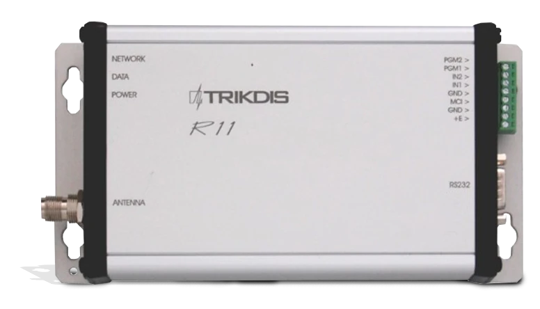
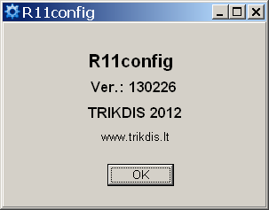
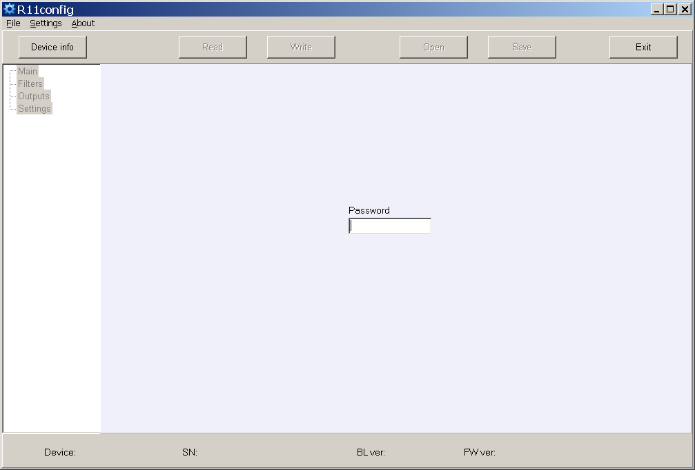

# Радиоприёмники R11 / R11U

<div style="text-align: center;">
  
</div>

Радиоприёмники R11, R11U применяются в качестве составной части системы радиоохраны RAS-3 и предназначены для приёма и декодирования закодированных сообщений, передаваемых по радиоканалу в диапазоне ОВЧ (R11) или УВЧ (R11U). Сигналы, передаваемые по системе кодирования RAS-3, принимаются и декодируются приёмниками.

## Принцип работы и основные характеристики

Приёмник R11 (R11U) является супергетеродином с двойным преобразованием частоты и цифровой идентификацией принятого сигнала. Принятый и идентифицированный сигнал обрабатывается и передаётся на выход.

Обработка принятых сигналов осуществляется микроконтроллером. Он идентифицирует переданный сигнал и тем самым формирует сообщение установленного вида и структуры. Сообщение фильтруется и передаётся по заданным атрибутам через последовательный порт в программное обеспечение мониторинга или в другие совместимые модули передачи. Приёмник содержит фильтры, обеспечивающие фильтрацию сообщений по:

- подсистемам системы кодирования;
- маршруту связи;
- последовательности абонентских номеров;
- времени повторения одинаковых сообщений.

Приёмник измеряет уровень принимаемого сигнала, фиксирует маршрут связи и отображает всё вышеуказанное в выходном сигнале.

Приёмник формирует и передаёт служебные сообщения на выходы. Служебные сообщения могут отображаться в программном обеспечении мониторинга или передаваться по каналу связи.

Приёмник оснащён последовательным портом RS232, через который информация, принятая через порт, может передаваться по радиоканалу.

## Технические характеристики

1. Радиоприёмник R11 работает в диапазоне ОВЧ от 146 до 174 МГц.
2. Радиоприёмник R11U работает в диапазоне УВЧ от 430 до 470 МГц.
3. Радиотехнические параметры приёмника соответствуют требованиям стандарта EN 300 113.
4. Чувствительность приёмников R11, R11U составляет не менее 1 мкВ при корректно принятом номере сообщения 80%. Прочие радиотехнические параметры указаны в таблице 1.
5. Приёмник измеряет мощность принятого сигнала и присваивает ей определённый уровень. Соответствие уровней и сигналов указано в таблице 2.
6. Принятые сообщения передаются через последовательный порт RS232 в программное обеспечение мониторинга или через шину MCI в совместимые устройства передачи. Выходные сообщения, указанные в Приложении А, отправляются в программу мониторинга. Ёмкость буфера неотправленных сообщений — до 300 последних сообщений. Параметры обмена данными задаются при настройке рабочих параметров приёмника.
7. Приёмник имеет два входа, предназначенных для самостоятельной отправки сообщений. Тип входов NC/NO/EOL=2,2 кОм.
8. Приёмники R11, R11U питаются постоянным напряжением 12,6 В. Допустимые пределы изменения напряжения — от 11 до 15 В. Потребляемый ток не должен превышать 150 мА.
9. Приёмники работают при температуре окружающей среды от -10°C до +55°C и относительной влажности воздуха до 90% при +20°C.
10. Габаритные размеры приёмного модуля не превышают 200 x 110 x 38 мм.
11. Масса приёмника — до 0,2 кг.

**Таблица 1.**

| Параметр | Значение |
|----------|----------|
| Модуляция | узкополосная частотная |
| Девиация не более | ±3 кГц |
| Входное сопротивление приёмника | 50 Ом |
| Разнос каналов связи | 12,5 кГц |
| Погрешность установки рабочей частоты не более | ±200 Гц |
| Избирательность по соседнему каналу не менее | 60 дБ |
| Избирательность по зеркальному каналу не менее | 70 дБ |
| Скорость передачи данных по радиоканалу | 2,4 кбит/с |

**Таблица 2.**

| Уровень | Входное напряжение, мкВ | Мощность сигнала, дБм | Уровень | Входное напряжение, мкВ | Мощность сигнала, дБм |
|---------|------------------------|-----------------------|---------|------------------------|-----------------------|
| 0 | 1 | -107 | 8 | 40 | -75 |
| 1 | 1,585 | -103 | 9 | 63 | -71 |
| 2 | 2,5 | -99 | A | 100 | -67 |
| 3 | 4 | -95 | B | 158 | -63 |
| 4 | 6,3 | -91 | C | 250 | -59 |
| 5 | 10 | -87 | D | 400 | -55 |
| 6 | 16,85 | -83 | E | 630 | -51 |
| 7 | 25 | -79 | F | 1000 | -47 |

> [!NOTE]
> Данные уровни отличаются от таблицы уровней в системе RAS-2M!

## Общий вид и схема подключения


| Элемент | Описание |
|---------|----------|
| Световые индикаторы работы | Светодиодные индикаторы состояния на передней панели |
| Антенный разъём | Разъём для подключения радиоантенны |
| Выходной порт RS232 | Последовательный выход данных |
| Шина MCI | Разъём шины MCI |


Порт USB и кнопка RESET расположены на задней панели. \* Назначение контактных клемм шины MCI указано в таблице 3.

**Таблица 3.**

| Клемма | Назначение |
|--------|-----------|
| PGM2 | Зарезервировано для дальнейшего использования |
| PGM1 | Зарезервировано для дальнейшего использования |
| IN2 | 2-й вход (отключение питания переменного тока) |
| IN1 | 1-й вход (защита корпуса) |
| GND | Общий проводник |
| MCI | Шина MCI |
| GND | Общий проводник для подключения источника питания |
| +E | Для подключения питающего напряжения +12,6 В |

## Световая индикация

Работа приёмника отображается световой индикацией. Режимы работы световых индикаторов указаны в таблице 4.


**Таблица 4.**

| Индикатор | Режим работы | Описание |
|-----------|-------------|----------|
| «Сеть» | Мигает зелёным | Приём сообщений по радиоканалу |
| «Сеть» | Светится жёлтым | Превышен фоновый уровень канала связи |
| «Данные» | Светится зелёным | Присутствуют неотправленные сообщения |
| «Данные» | Светится зелёным и красным одновременно | Выходной буфер переполнен |
| «Питание» | Мигает зелёным | Напряжение питания достаточно |
| «Питание» | Мигает жёлтым | Напряжение питания понижено (ниже 11,5 В) |
| «Питание» | Мигает зелёным и красным поочерёдно | Подключён только порт USB для программирования |

## Подготовка приёмника к работе

Последовательность подготовки:

1. Установите требуемые рабочие параметры устройства. Радиоприёмники с настройками, согласованными в соответствии с условиями договора поставки, предоставляются пользователям;
2. Установите приёмник в предназначенном месте;
3. Подключите антенну;
4. Подключите источник питания и периферийные устройства (программное обеспечение мониторинга или модули передачи);
5. Проверьте работоспособность приёмника.

## Настройка рабочих параметров

Настройка рабочих параметров выполняется с помощью программы настройки параметров R11config v130226 путём подключения компьютера к приёмнику через USB-кабель. Использование программы и изменение настроек доступны как при включённом внешнем источнике питания, так и при питании через порт USB.



Запустите программу R11config — откроется окно, в котором:

1. Введите пароль администратора 1234 с клавиатуры компьютера и нажмите [Enter]

    

    В нижней части окна отображаются: тип оборудования **Device**, серийный номер **SN**, версия загрузчика **BL ver.**, версия прошивки **FW ver.**

    Если пароль неизвестен, информация о типе приёмника и версиях программного обеспечения/прошивки будет отображена после нажатия [Device info].

     

    Параметры USB-порта отображаются в столбце **Settings**.

2. Считайте параметры приёмника, нажав [Read].

3. Установите (режим ретранслятора), (частоту) и (идентификатор передатчика) в разделе программы **Main**. При выборе Account ID сообщения будут распределяться по номеру объекта передатчика, при выборе Transmitter SN — по серийному номеру передатчика, при выборе Transmitter SN+ Account ID — по обоим номерам.

    

4. Установите требуемые параметры фильтра в разделе программы **Filters**.

    

    - **Time filter** — допустимое время повторения одного и того же сообщения;
    - **RF code** — отметьте флажок приёма сообщений системы кодирования RAS-3;
    - **Subsystem** — отметьте флажок требуемого приёма подсистемы;
    - **Account ID filter** — последовательности номеров объектов приёма;
    - **Repeater filter** — последовательности требуемых номеров ретрансляторов.

5. Установите параметры вывода в программное обеспечение мониторинга или модули передачи в разделе программы **Reports**.

    а) При передаче сообщений в программу мониторинга Monas MS:

    

    Задайте выходной протокол Out Protocol, номер приёмника Receiver Number и номер линии Line number, время контрольного сигнала HB time и скорость передачи данных Baud Rate для RS232.

    б) Задайте служебные сообщения, которые будут отправляться. Отметьте их флажком **Active**. Введите требуемый абонентский номер объекта приёмника и коды событий. Рекомендуемые коды событий указаны в Приложении Б.

    

    в) При передаче сообщений в модули передачи (режим ретранслятора):

    

    Задайте выходной протокол Out Protocol, номер приёмника Receiver Number и номер линии Line Number, отметьте флажок **Active** для включения шины MCI и задайте скорость передачи Baud Rate. Укажите собственный адрес Self Address, числовое значение которого должно быть меньше значения адресов подключаемых модулей передачи.

    г) Укажите последовательность модулей передачи, адреса, время ожидания ответа **Ack TO**, задержку отправки (при необходимости) **Tx TO** и игнорирование повторно переданных сообщений **No Dupl**.

    

    Задержка отправки Tx TO применяется для задержки передаваемого сигнала в радиосистеме. Числовое значение кратно 250 мс.

    Игнорирование повторно переданных сообщений No Dupl. следует включать, когда в системе работают несколько радиоретрансляторов и необходимо сократить количество сообщений, передаваемых по каналу (решение проблемы загруженности радиоканала).

6. Установите параметры работы входов и коды событий в разделе программы **Inputs/Outputs**.

    

    - **Input Type** — укажите тип входа;
    - **Delay** — укажите время срабатывания входа;
    - **Event Code** — код события и номер объекта отправки после срабатывания входа;
    - **Restore Code** — код события и номер объекта отправки после восстановления входа.

    

7. Новые частоты можно добавить или удалить существующие в разделе программы **Settings**.

    

    Настройки приёмника с указанием места их хранения в памяти компьютера могут быть сохранены нажатием кнопки [Save] и впоследствии использованы для настройки параметров других приёмников. Сохранённые настройки можно загрузить, нажав [Open] и указав место хранения данных.

    Нажмите [Exit] для выхода из программы настройки параметров.

## Приложение А — Выходной сигнал приёмника через последовательный порт RS232

**а) При установленном выходном протоколе Monas3:**

```
TD1001017_***010532_3D025218_E13002027_120514/153241
```

где:

- `TD` — символ начала
- `10` — тип/подтип сообщения (Contact ID)
- `01` — номер приёмника 01
- `01` — номер линии 01
- `7` — уровень сигнала 7
- `**` — номер ретранслятора (прямой приём)
- `*` — уровень в ретрансляторе (отсутствует)
- `010532` — номер передатчика 010532
- `3D` — номер сообщения (от объекта № 010532) 61 (3D hex)
- `025218` — подсистема 02 / Account ID 5218
- `E13002027` — данные Contact ID
- `12` — год 12, `05` — месяц 05, `14` — день 14
- `15` — час 15, `32` — минута 32, `41` — секунда 41

**б) При установленном выходном протоколе Surgard MLR2-DG:**

```
5011 181234E14401002
```

где:

- `5` — тип сообщения
- `01` — номер приёмника
- `1` — номер линии
- `18` — тип протокола
- `1234` — номер объекта
- `E` — классификатор CID
- `144` — код события CID
- `01` — номер подгруппы CID
- `002` — место события CID

## Приложение Б — Рекомендуемые коды событий служебных сообщений

**Формат кода события R11:**

```
1401FFFF12345601001234********0330199000
```

где `1234` = номер объекта (8191), `03` = событие/восстановление, `301` = код события, `99` = подгруппа, `000` = место.

| Событие | Код RAS-3D | ECID | Примечание |
|---------|------------|------|-----------|
| Включение питания | 0330199000 | R301 99 000 | не отправлять |
| Низкий заряд батареи | 0130299000 | E302 99 000 | отправлять |
| Восстановление заряда батареи | 0330299000 | R302 99 000 | отправлять |
| Высокий уровень радиошума | 0135599000 | E355 99 000 | отправлять |
| Восстановление уровня радиошума | 0335599000 | R355 99 000 | отправлять |
| Изменение конфигурации | 0362899000 | R628 99 000 | отправлять |
| Ошибка времени | 0170099000 | E700 99 000 | не отправлять |
| Установка времени | 0370099000 | R700 99 000 | не отправлять |
| Ошибка MCI | 0171299000 | E712 99 000 | не отправлять |
| Восстановление MCI | 0371299000 | R712 99 000 | не отправлять |
| Ошибка RS232 | 0171399000 | E713 99 000 | не отправлять |
| Восстановление RS232 | 0371399000 | R713 99 000 | не отправлять |
| Ошибка CRC | 0130799000 | E307 99 000 | не отправлять |
| PING передатчика | — | E770 99 00X (x = следующий период PING) | не отправлять |
