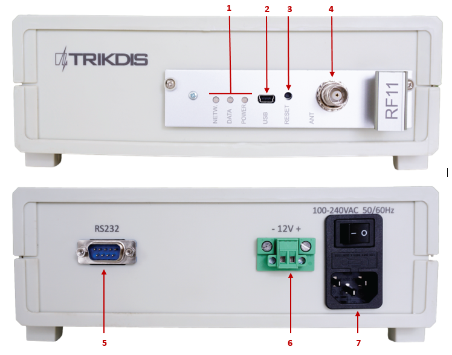
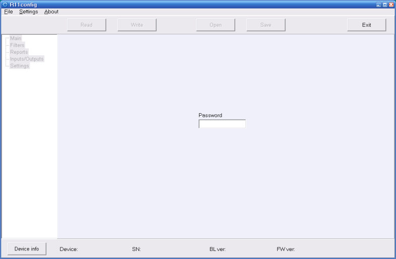
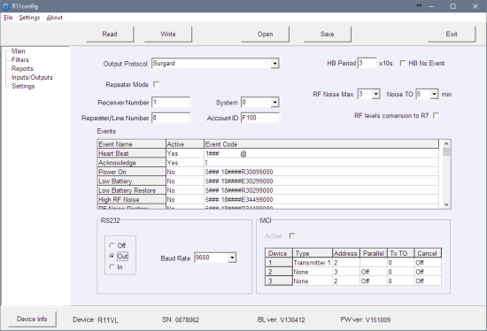

# RFH11 Радиоприёмник

  

## О радиоприемном устройстве

**Радиоприемное устройство RFH11** это приемное устройство, предназначенное для приема кодированных радио сообщений в диапазоне частот УКВ или УВЧ. Встроенный модуль работает с системами кодирования RAS3, RAS2M, LARS, LARS1, Milcol-D .

Приемное устройство имеет программируемые фильтры, позволяющие фильтровать сообщения в соответствии с:

- интервалом повторения сообщения;

- подсистемами системы кодирования;

- трактом коммуникации;

- последовательностью чисел счета.

| **Примечание:** По желанию клиента, мы настраиваем приемное устройство по заданным параметрам. |
|----|

## Основные технические параметры

|  |  |
|:--:|:--:|
| Название | Описание |
| Рабочий диапазон частот | 146 - 174 МГц (УКВ) или 430 - 470 МГц (УВЧ) |
| Разделение каналов | 12.5 кГц |
| Погрешность установки частоты | не более ± 200 Гц |
| Чувствительность | Не ниже 0,5 мкВ |
| Модуляция | FFSK/​FSK |
| Декодируемые форматы | RAS-3, RAS-2M, LARS, LARS-1, Milcold-D |
| Форматы вывода | Monas3 и Surgard |
| Сохранение сообщений | 300 последних полученных сообщений |
| Основной источник питания | 100 – 240 В (50 /​ 60 Гц) сети переменного тока |
| Порт вывода данных RS232 | 1 x DB9 |
| Рабочая температура | От 0°С до +55°C |
| Размеры | 225 x 235 x 115 мм |
| Вес | 1,21 кг, с кабелями |

## Комплект поставки приемного устройства 

|                                           |       |
|:------------------------------------------|:-----:|
| Приемное устройство                       | 1 шт. |
| 1,5 м кабеля питания для переменного тока | 1 шт. |
| 1,8 м 0-модемного кабеля R232             | 1 шт. |

| **Примечание:** *USB*-кабель для программирования приемного устройства в комплект не входит. |
|----|

## Электропитание

На приемное устройство подается питание от источника переменного тока (ПТ). Для обеспечения бесперебойной работы приемник должен быть подключен к аккумуляторной батарее 12 В, 7 Ач, обеспечивающей резервное питание в течении 12 часов.

## Конфигурация приемного устройства

|  1  | Световая индикация. |  5  | Порт вывода данных RS232.                 |
|:---:|:--------------------|:---:|:------------------------------------------|
|  2  | Порт USB.           |  6  | Разъем подключения резервной батареи.     |
|  3  | Кнопка сброса.      |  7  | Разъем питания и кнопка вкл/выкл питания. |
|  4  | Разъем антенны.     |     |                                           |

### Световая индикация

| Светодиодный индикатор | Сигнал | Значение |
|------------------------|--------|----------|
| “Питание” | Мигающий зеленый индикатор | Достаточное напряжение питания |
| “Питание” | Мигающий желтый индикатор | Низкое напряжение питания (ниже 11,5 В) |
| “Питание” | Поочередно мигает зеленый и красный индикатор | Питание подается только через USB (устройство активно) |
| “Сеть” | Мигающий зеленый индикатор | Получение сообщения |
| “Сеть” | Желтый индикатор | Превышенный уровень ВЧ шума |
| “Данные” | Зеленый индикатор | Есть неотправленные сообщения |
| “Данные” | Одновременно горят зеленый и красный индикаторы | Выходной буфер переполнен |

## Установка системы 

### Этапы установки оборудования

1.  Если на полученном устройстве отсутствуют заданные рабочие параметры, пожалуйста, установите их в соответствии с п. **6.2 Установка рабочих параметров с помощью R11config.**

| **Примечание:** Для установки параметров вам понадобится программное обеспечение R11config. Для получения этого программного обеспечения обратитесь к Вашему дилеру. |
|----|

2.  Подключите RFH11 к компьютеру через кабель RS232 для передачи событий мониторинговому программному обеспечению.

3.  Настройте программное обеспечение мониторинга для отображения сообщений приемного устройства. Следуйте инструкциям в документации к программному обеспечению мониторинга.

4.  Подключите радио антенну к порту антенны.

5.  Подключите приемное устройство к источнику питания с помощью кабеля питания.

6.  Включите приемное устройство. Мигающий зеленый индикатор означает, что приемное устройство подключено к источнику питания.

7.  Проверьте, отображает ли Ваше программное обеспечение мониторинга сообщения от приемного устройства RFH11 .

**В случае отсутствия сообщений:** проверьте цвет индикатора “Питания” и убедитесь, что все разъемы питания подключены правильно. Если проблема не устраняется, пожалуйста, убедитесь, что параметры эксплуатации установлены правильно или обратитесь в службу технической поддержки. Для получения информации о проверке и изменении параметров, обратитесь к п. **6.2 Установка рабочих параметров с помощью R11config.**

### Установка рабочих параметров с помощью R11config

1.  Подключите приемное устройство к компьютеру с помощью USB кабеля и запустите программу R11config (Вы должны получить эту программу от Вашего дистрибьютора).

    1.  В открывшемся окне введите пароль администратора: 1234 и нажмите [Enter].

**Примечание:** если пароль неизвестен, вы можете найти тип приемного устройства и версии программного обеспечения/прошивки, нажав кнопку [Device info] ([информация об устройстве]).

**Примечание:** **на компьютере должны быть установлены драйверы USB** . При первом подключении приемного устройства к компьютеру в ОС MS Windows откроется окно Мастер нового оборудования для установки драйвера USB. Скачайте драйвер для USB \*.*inf* для Вашей ОС MS Windows с сайта http://www.trikdis.com/en/. В окне мастера выберите функцию Да, только в этот раз и нажмите кнопку Далее. В открывшемся окне Выбор параметров поиска и установки нажмите кнопку Обзор и выберите место, где был сохранен файл \*.inf. Следуйте инструкциям мастера для завершения установки драйвера USB.

2.  Выберите папку программы [Параметры], затем — [com-порт], в раскрывающемся списке [com-порт], а затем выберите порт, к которому подключен модуль.

  <figure style="margin: 0;">
    
  </figure>

**Примечание:** Конкретный порт, к которому подключено устройство появится только после того, как устройство будет <u>правильно</u> подключено.

Параметры в ветке ***Главные** (**Main**)*:

3.  Чтобы прочитать параметры приемного устройства, нажмите кнопку [Читать] ([Read]).

4.  Установите [Частоту] ([Frequency]) и [номер передающего устройства] ([Transmitter ID]) в ветке программы Главные.

5.  В раскрывающемся списке [номер передающего устройства] Вы можете выбрать передающее устройство, которое будет определено с приемного устройства:

- Идентификатор учетной записи – запрограммированный номер идентификатора учетной записи определяет передающее устройство.

- СН передающего устройства –уникальный серийный номер определяет передающее устройство.

- СН передающего устройства + Идентификатор учетной записи - передающее устройство определяется обоими (СН передающего устройства и Идентификатором учетной записи) номерами.

**Примечание:** Параметр [номер передающего устройства] должен быть установлен одинаково для всех радиопередающих устройств.

  <figure style="margin: 0;">
    
  </figure>

Параметры в ветке ***Фильтры** (**Filters**)**:***

*-* [Фильтр времени]([Time filter]) – период времени, за которое одно и то же сообщение будет отклонено (рекомендуемое время-90 секунд).

\- [Фильтр кодирования ВЧ/подсистемы]([Coding/Subsystem Filter])– дважды кликните на таблице, выберите интересующие системы радио кодирования (RAS3, RAS2M, LARS, LARS1, Milcol-D) и отметьте подсистемы для получения сигнала.

\- [Фильтр идентификатора учетной записи] ([Account ID filter]) – введите диапазон номеров (от – до) идентификатора учетной записи передающего устройства для получения сигнала.

\- [Фильтр ретранслятора] ([Repeater filter]) – введите диапазон номеров (от – до) ретранслятора для получения сигнала.

Параметры в ветке Отчеты *(**Reports**)**:***

Настройка выходных параметров для программного обеспечения мониторинга или модулей передачи:

6.  Установите протокол выхода (Output protocol):

    1.  При использовании программного обеспечения мониторинга MonasMS установите [Протокол выхода] Monas3. В противном случае выберите Surgard или протокол Ademco.

    2.  Снимите флажок с [Режима ретранслятора] ([Repeater Mode]).

    3.  Установите следующие обязательные параметры: [номер приемного устройства] ([Receiver Number]), [номер линии] ([Line number]), [система] ([System]), [идентификатор учетной записи] ([Account ID]), [период HB] ([HB Period]) и [скорость передачи] ([Baud Rate]) для RS232.

7.  Укажите, какие сообщения будут отправлены:

    1.  Дважды щелкните на строке записи в таблице [события] ([Events]). Установите флажок напротив [Активный] ([Active]), если код события должен быть отправлен. Рекомендуемые коды событий указаны в приложении А.

  <figure style="margin: 0;">
    
  </figure>

Параметры в ветке Параметры (Settings):

8.  Новые частоты могут быть введены или существующие — удалены. Позже эти частоты будут доступны в ветке Главные.

  <figure style="margin: 0;">
    
  </figure>

9.  Все параметры можно сохранить, нажав кнопку [Сохранить] ([Save]). Они могут быть использованы позже в качестве шаблона для настройки других модулей. Чтобы открыть их, нажмите кнопку [открыть] ([Open]) и укажите их местонахождение. Для выхода из программы нажмите [выход] ([Exit]).

  <figure style="margin: 0;">
    
  </figure>

## ПРИЛОЖЕНИЕ А 

**Рекомендуемые коды событий из сообщений**

Код события

1401FFFF 12345601001234\*\*\*\*\*\*\*\*03 301 99 000 где:

| 1234 | номер объекта | 8191 |
|------|---------------|------|
| 03 | событие/восстановление |  |
| 301 | код события |  |
| 99 | подгруппа |  |
| 000 | расположение |  |
| Событие | RAS-3D изменения |  |
| Питание включено | 0330199000 |  |
| Низкий заряд батареи | 0130299000 |  |
| Восстановление низкого заряда батареи | 0330299000 |  |
| Высокий радиочастотный шум | 0135599000 |  |
| Восстановление радиочастотного шума | 0335599000 |  |
| Изменение конф. | 0362899000 |  |
| Недостаток времени | 0170099000 |  |
| Установка Времени | 0370099000 |  |
| Ошибка MCI | 0171299000 |  |
| Восстановление MCI | 0371299000 |  |
| Ошибка RS232 | 0171399000 |  |
| Восстановление RS232 | 0371399000 |  |
| Ошибка CRC | 0130799000 |  |
| PING передающего устройства |  |  |
