# SP3 Kit — Protegus Web App Configuration

This guide covers the initial setup of the SP3 alarm panel in the Protegus web app ([web.protegus.app](https://web.protegus.app)), including adding the system, naming it, and pairing wireless sensors.

**What you need before you start:**

- A Protegus account (register at [web.protegus.app](https://web.protegus.app))
- The SP3 panel powered on and connected to a cellular network (POWER and NETWORK LEDs on)
- The panel's IMEI number (printed on the panel label)
- The wireless sensors you want to pair, within range of the panel

---

## Log in to Protegus

1. Open [web.protegus.app](https://web.protegus.app) in your browser.
2. Enter your email address and click **Next**.
3. Enter your password and click **Log in**.

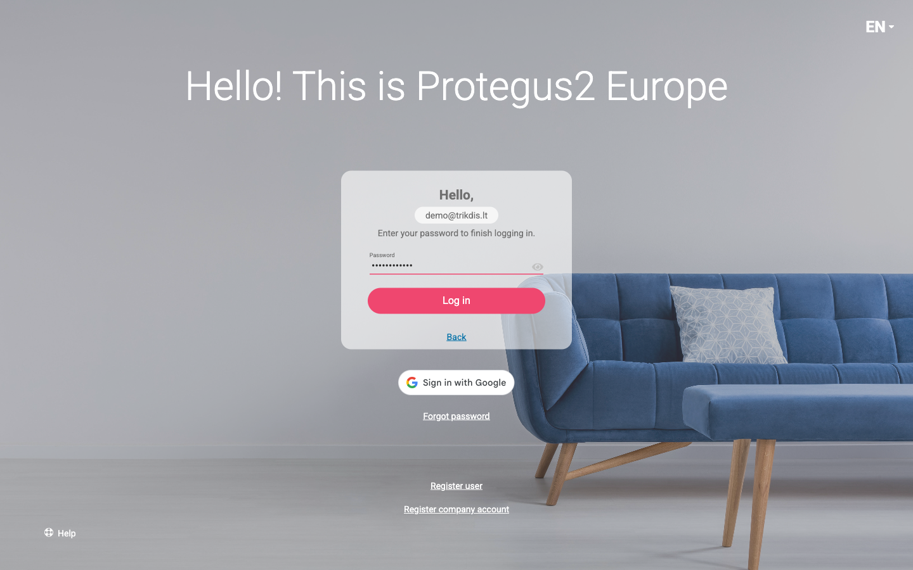

After login you are taken to the **Home** screen, which lists all your existing systems in the left panel.

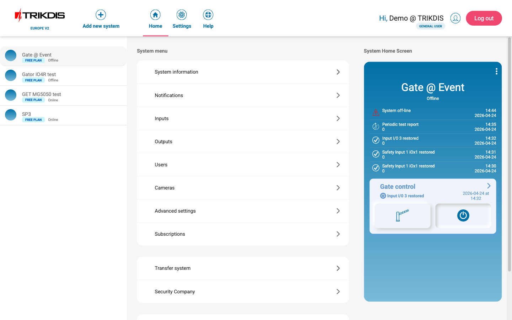

---

## Add a new system

1. Click **Add new system** in the top navigation bar.

    The **Unique ID/IMEI** wizard opens. The upper portion shows a live camera view for scanning a QR code printed on the panel. You can also enter the IMEI manually.

    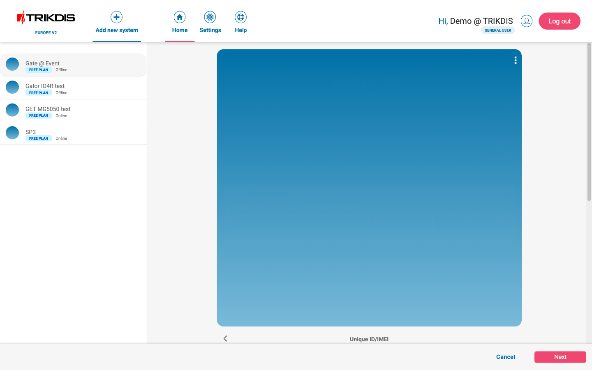

2. Type the panel's **IMEI** number into the **Unique ID/IMEI** field at the bottom of the wizard.

    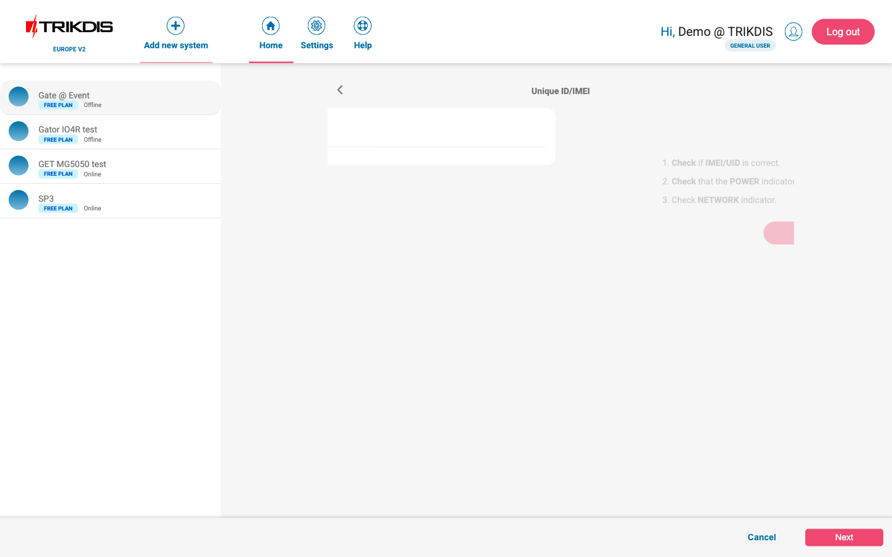

3. Click **Next**. The app verifies the IMEI with the server — a **Checking…** spinner appears.

    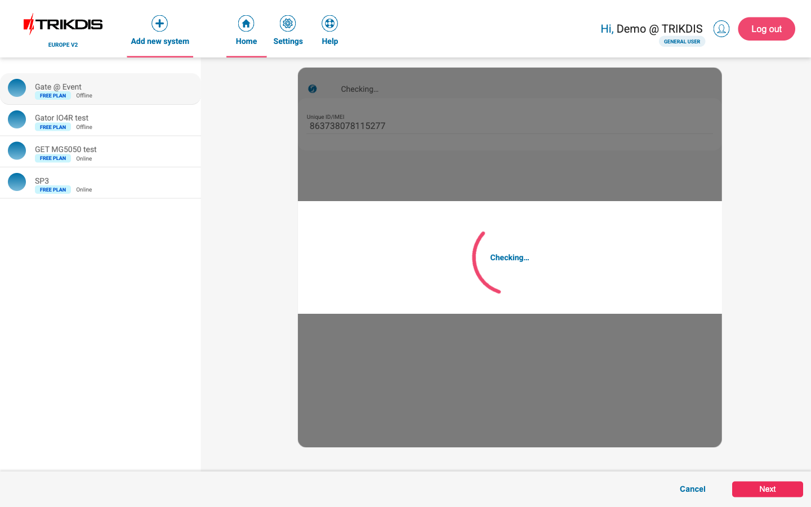

> [!NOTE]
> If the app shows a **Check device** screen instead of proceeding, the panel is not yet online. Follow the on-screen checklist:
>
> 1. Confirm the IMEI/UID you entered is correct.
> 2. Confirm the **POWER** LED on the panel is on.
> 3. Confirm the **NETWORK** LED on the panel is on.
>
> Then click **Back** and re-enter the IMEI once the panel is online.
>
> 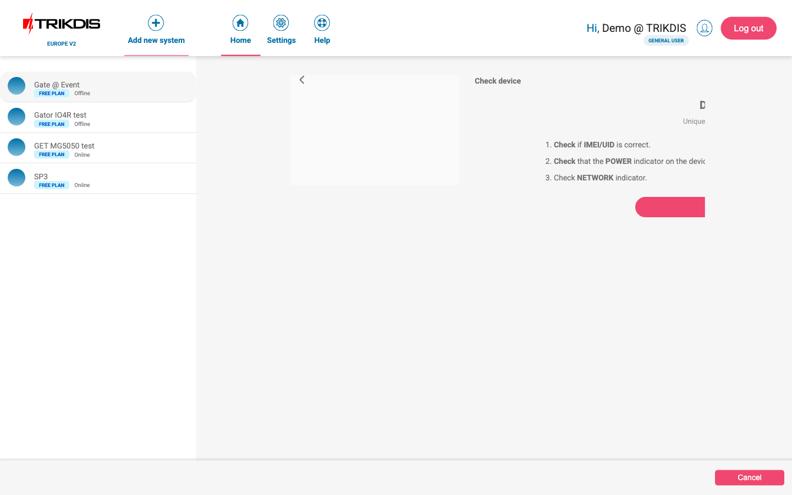

---

## Name the system

Once the IMEI is confirmed the app moves to the **Add new system** details page.

1. In the **Name** field, replace the default name (e.g. *System 5*) with a descriptive name for this installation — for example, *SP3 kit*.

    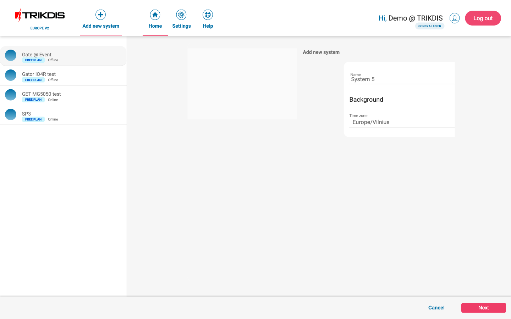

2. Set the **Time zone** to match the installation location.
3. Click **Next**. The app communicates with the panel to apply the name.

    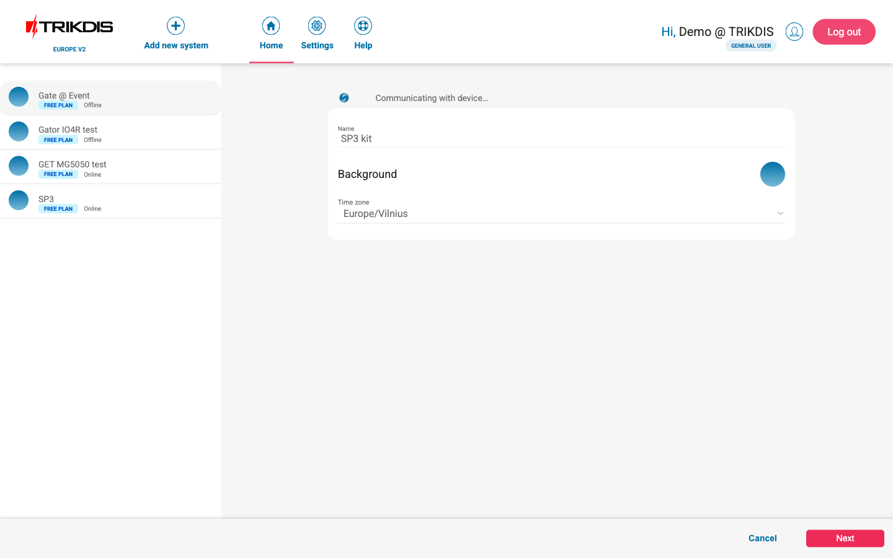

4. When the success screen appears, click **Skip** (or configure additional options if prompted).

    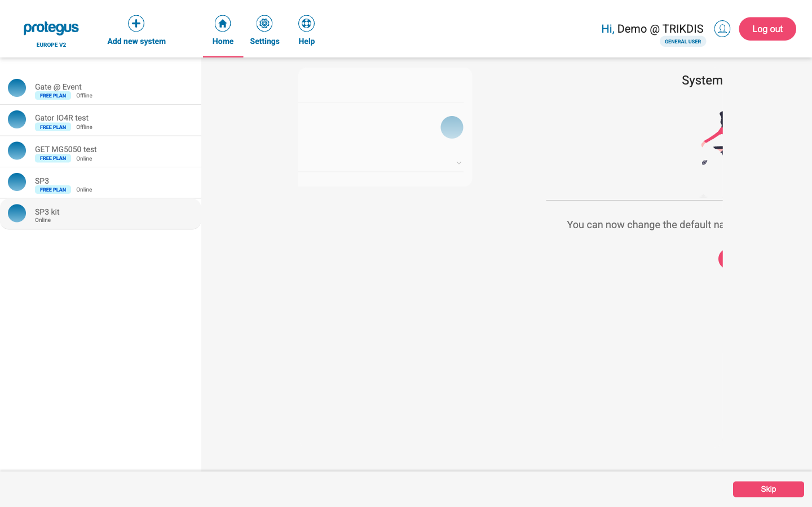

The new system now appears in the left panel and its **System menu** opens automatically.

---

## Explore the system menu

The system menu is the main configuration hub for the SP3. From here you can configure:

| Menu item | Purpose |
|-----------|---------|
| System information | Panel name, status, subscription |
| Notifications | Push, SMS, and call alert rules |
| Areas | Arm/disarm areas |
| Zones | Zone names and types |
| Outputs | Output (PGM) control |
| Devices | Paired wireless sensors |
| Temperature sensors | Wireless temperature probes |
| Users | App user access and PIN codes |
| Cameras | IP camera integration |
| Advanced settings | Panel-level configuration |

The right panel shows a live preview of the **System Home Screen** as it will appear in the Protegus mobile app.

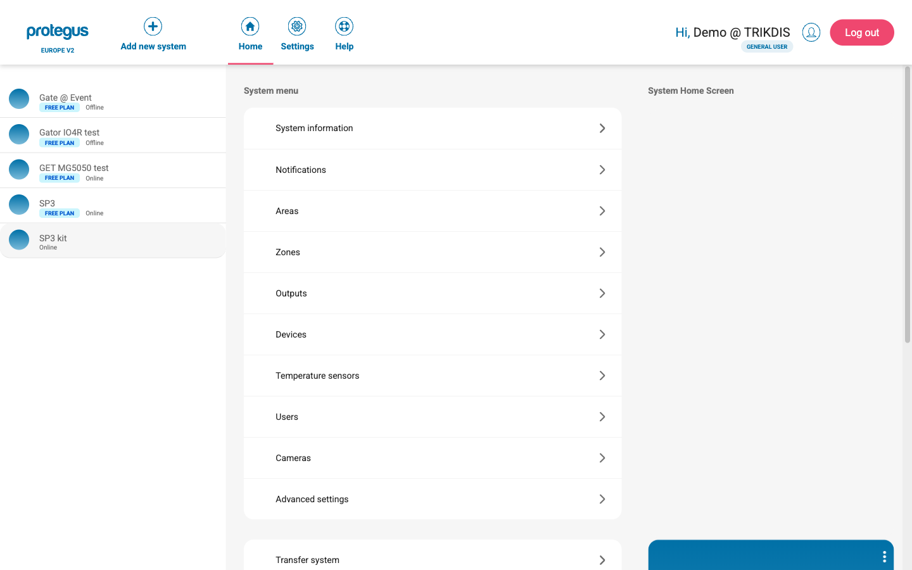

---

## Add wireless sensors

Pair the wireless sensors that came with the SP3 kit (Smart PIR, Smart Door/Window, Smart Curtain PIR, etc.).

1. In the system menu, click **Devices**.

    The **Devices** panel opens on the right.

    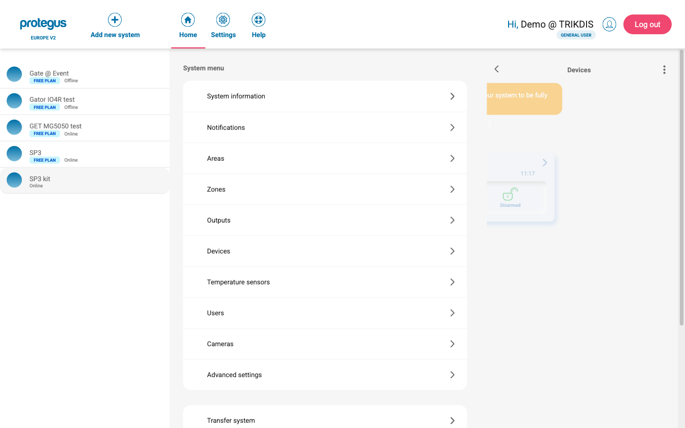

2. Click the **+** button (or the **Add** link in the Devices header) to open the pairing wizard.

    The app instructs the panel to enter pairing mode. A **Preparing…** spinner appears while the panel gets ready. A list of available sensor categories is displayed: Sensors, Magnets, Safety devices, Sirens.

    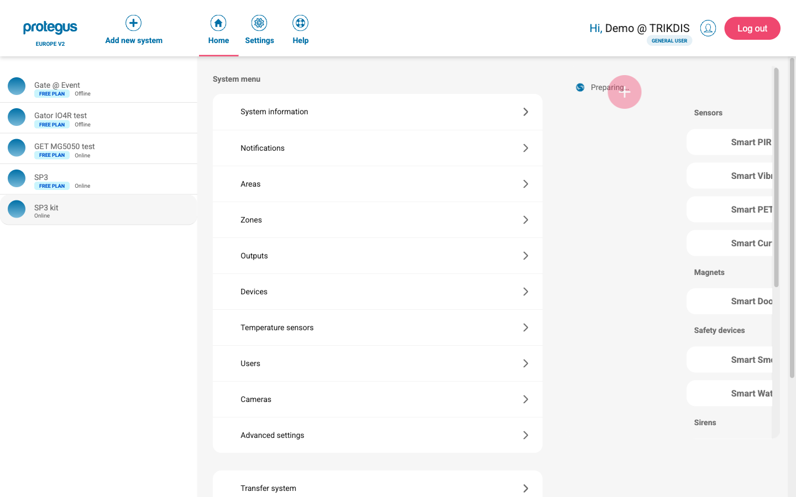

3. Trigger each sensor you want to pair — open a door/window magnet, walk in front of a PIR, or press the sensor's tamper button. The panel detects the transmission and the sensor appears in the list.

4. When all sensors are discovered, the **Add wireless sensor** screen lists them with their serial numbers. Click each sensor to confirm and assign it to a zone.

    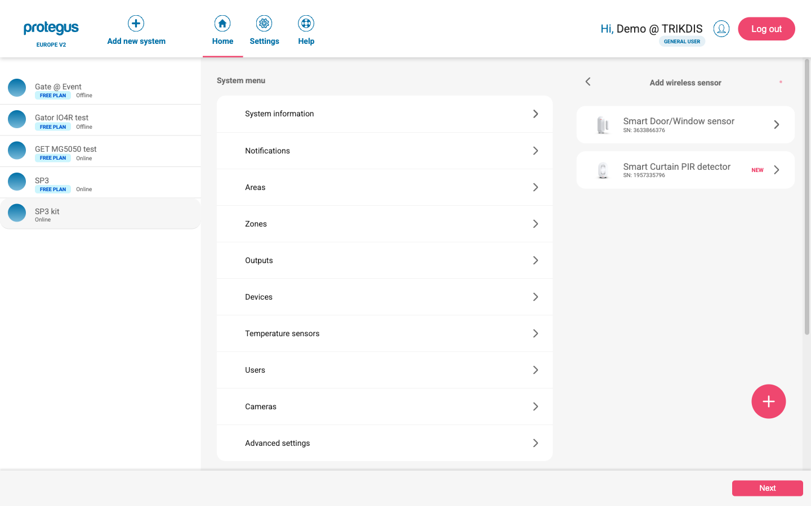

5. Click **Next** to finish pairing. The system home screen now shows the paired sensors.

    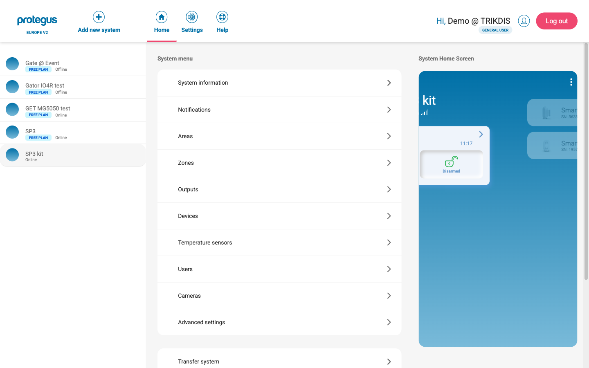

---

## View and configure zones (mobile view)

The following steps show zone management as it appears in the Protegus mobile app. The same options are available under **Zones** in the web app system menu.

> [!NOTE]
> **Mobile view** — these screenshots were captured on a 390×844 px phone display.

### Open zone list

1. Select the system from the home screen.

    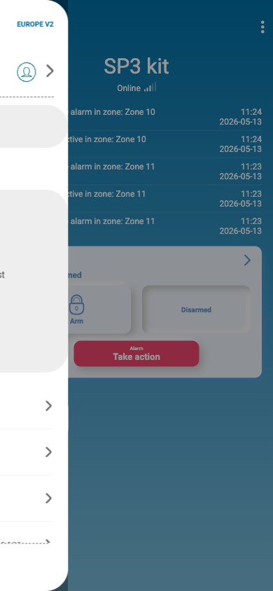

2. Tap the menu icon (⋮) or swipe to open **Configure SP3 kit**, then tap **Zones**.

    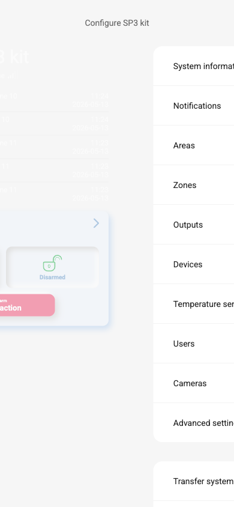

    The Zones screen lists all configured zones. Each zone shows its number and the area it belongs to (e.g. Area 1).

    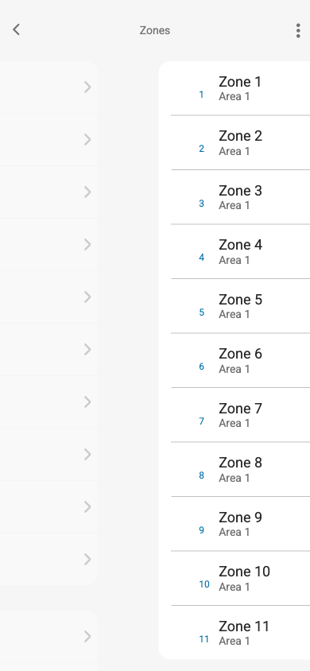

3. Tap a zone to open its settings. You can change the zone name, type, and the sensor assigned to it.

### View sensor details

From the zone settings, tap the sensor row to open **Sensor settings**. This page shows:

- The sensor name (e.g. *Smart Door/Window sensor*)
- The sensor serial number
- The current RSSI (signal strength)

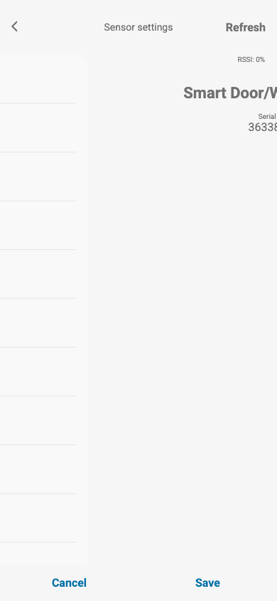

Click **Refresh** to update the RSSI reading. Click **Save** to apply any changes, or **Cancel** to discard.

---

## Add wireless sensors (mobile view)

1. In the system settings menu, tap **Devices**, then tap **Add** (the **+** button).

    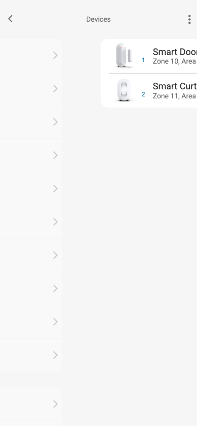

2. The panel enters pairing mode. Trigger each sensor to register it.

    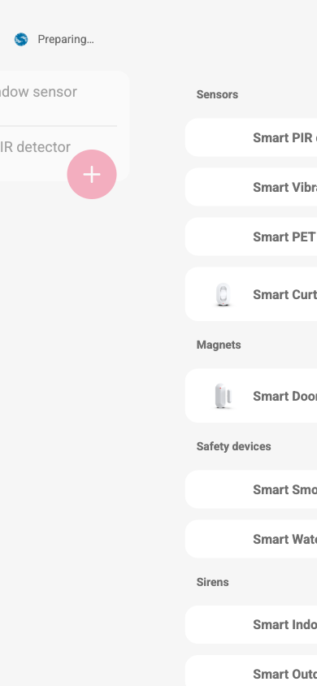

---

## Verify the system is operational

After pairing, verify the system is armed/disarmed correctly and that zones report their status.

1. From the system home screen, tap the area tile to open the **Area** view.

    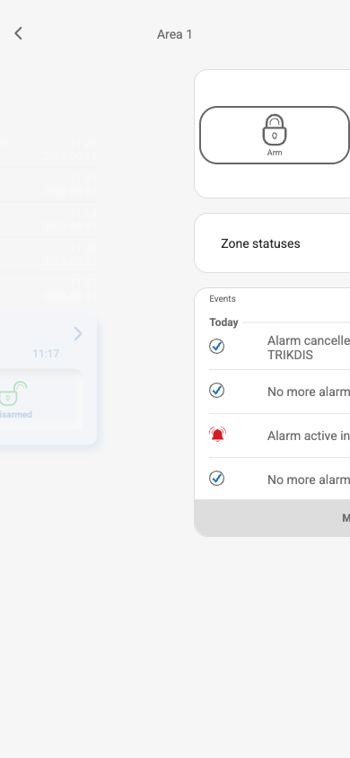

    This screen shows:
    - The **Arm** button to arm/disarm the area
    - **Zone statuses** — tap to see individual zone states
    - **Events** — a log of today's alarm events

2. Tap **Zone statuses** to open the **Zone status / bypass** screen, which shows the real-time open/closed state of all 12 zones.

    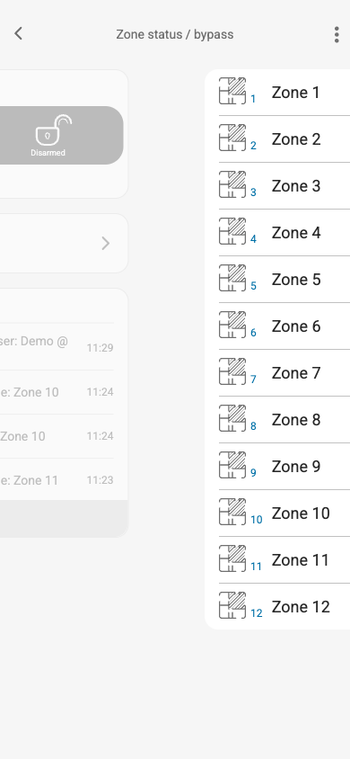

All zones with paired sensors should show their current state. Zones without sensors appear with a generic bypass icon.

---

## Next steps

- **Notifications** — configure who receives push, SMS, or call alerts when zones trigger.
- **Users** — add additional Protegus app users and assign them to this system.
- **Subscriptions** — review the plan assigned to the system (Settings → Subscriptions in the system menu).
- **Advanced settings** — adjust panel-level parameters such as entry/exit delays and siren behavior.
